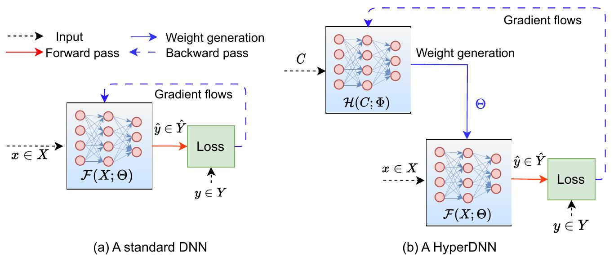

# Гиперсеть

Обычно нейросети используются, чтобы предсказывать значение, отвечающее какой-либо характеристике реального мира. Однако можно настроить нейросеть, называемую **гиперсетью** (hypernetwork, [[1]](https://link.springer.com/article/10.1007/s10462-024-10862-8)), таким образом, чтобы она предсказывала параметры (такие как веса связей) другой целевой нейросети!

Первый и второй подходы показаны на левой и правой стороне схемы [[1]](https://link.springer.com/article/10.1007/s10462-024-10862-8):

> Во время обучения настраиваются не веса целевой сети, генерирующей итоговые прогнозы, а <u>веса гиперсети</u>, потому что именно гиперсеть генерирует веса основной сети и ответственна за её ошибки.

Использование гиперсети даёт следующие преимущества:

- Если на вход гиперсети подавать объект для прогноза, то она может подстроить основную сеть таким образом, чтобы она лучше всего обработала именно текущий объект. 
  
  > Например, при распознавании лиц человек может быть сфотографирован в фас или в профиль. Соответственно, гиперсеть оценит положение головы и сгенерирует обработчик именно для нужного ракурса. 

- Целевая сеть, специфицируемая гиперсетью, может содержать разное число слоёв! Это даёт возможность обрабатывать простые объекты более короткой сетью, чем более сложные. Таким образом, гиперсеть позволяет более эффективно распоряжаться вычислительными ресурсами.

- Если решается несколько похожих по смыслу задач, например, детекция машин, грузовиков и мотоциклов, то вместо того, чтобы настраивать под каждый вид  транспортного средства свою сеть, можно настроить гиперсеть, которой дополнительно передаётся тип задачи (что именно хотим распознать). Получим более экономичную архитектуру (всего одна сеть), которая, скорее всего, окажется и более точной, поскольку будет настраиваться по данным не одной отдельно взятой задачи, а по всем сразу. Поскольку задачи семантически связаны, то они будут использовать похожие признаки, которые и сгенерирует гиперсеть. 
  
  > По сути, гиперсеть реализует принцип мягкой общности весов (soft weight sharing), связывая параметры различных моделей общей сетью-генератором.

- Если целевая сеть содержит много слоёв, то хранить все параметры для них может быть очень расточительным, особенно на слабых вычислителях, таких как мобильный телефон. Поэтому эффективнее хранить более компактную гиперсеть, которая будет генерировать веса для большой целевой сети только тогда, когда это необходимо, реализуя один из подходов сжатия весов (weights compression).

- Гиперсеть можно настроить таким образом, чтобы она выдавала рандомизированный выход, т.е. выход с элементами случайности. Этого можно добиться, если добавлять случайный шум к промежуточному слою гиперсети. Перезапуская гиперсеть несколько раз, будем получать различные целевые сети, решающие одну и ту же задачу. С помощью этого набора сетей мы сможем сгенерировать набор прогнозов, в результате чего сможем оценить не только значение окончательного прогноза (как среднее от всех прогнозов), но и неопределённость прогноза (через разброс индивидуальных прогнозов). Оценка неопределённости прогноза важна для понимания того, насколько прогнозу можно доверять.

## Литература

1. [Chauhan V. K. et al. A brief review of hypernetworks in deep learning //Artificial Intelligence Review. – 2024. – Т. 57. – №. 9. – С. 250.](https://link.springer.com/article/10.1007/s10462-024-10862-8)
