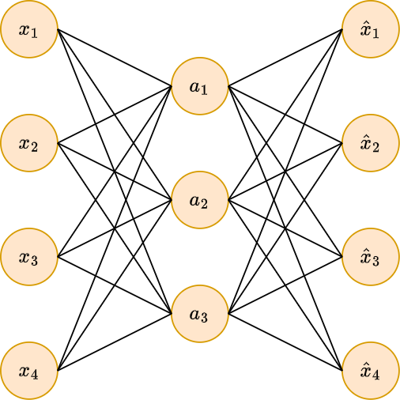
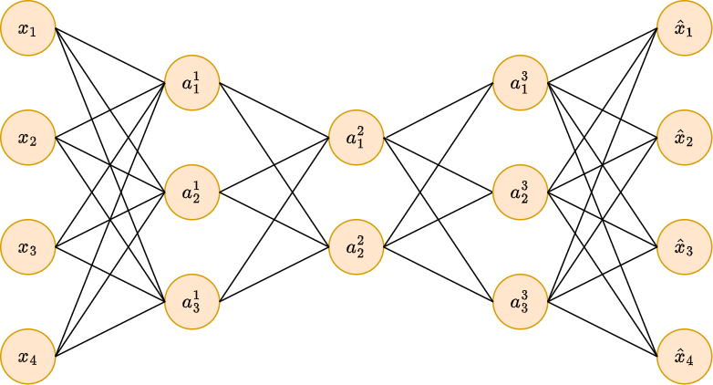
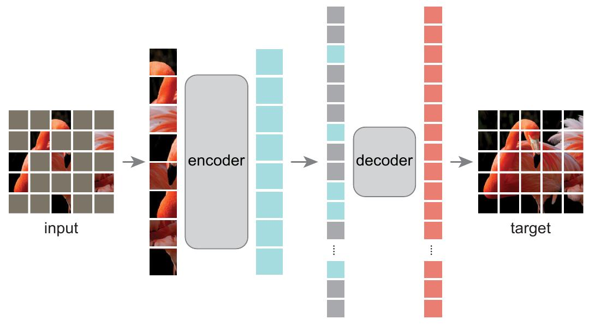
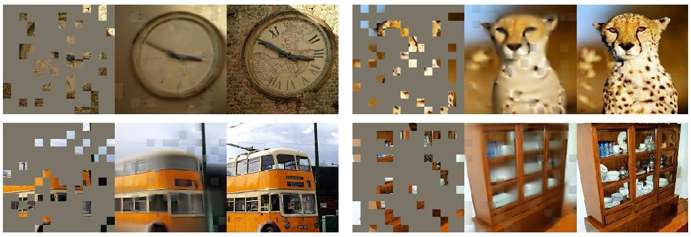

# Автокодировщик

## Идея

**Автокодировщик** ([autoencoder](https://en.wikipedia.org/wiki/Autoencoder))  - это нейросеть $\hat{\mathbf{x}}=f(\mathbf{x})$, которой по входу $\mathbf{x}$ требуется сгенерировать выход $\hat{\mathbf{x}}$ максимально похожий на вход. Для настройки автокодировщика обычно используется квадрат L2-потерь:

$$
\mathcal{L}(\hat{\mathbf{x}},\mathbf{x})=||\hat{\mathbf{x}}-\mathbf{x}||^2 \tag{1}
$$

:::tip Разметка не используется

Поскольку в качестве целевой переменной (отклика) выступает исходное признаковое описание объекта без меток, то это [задача обучения без учителя](../../Machine-learning/Base-concepts/Unsupervised-learning) (unsupervised learning).

:::

Структурно автокодировщик состоит из 

- **кодировщика** (encoder) $\mathbf{e} = e(\mathbf{x})$

- и **декодировщика** (decoder) $d(\mathbf{e})$:

$$
\hat{x}=f(x)=d(e(x))
$$

Кодировщик преобразует исходный объект в его внутреннее признаковое представление $\mathbf{e}$, называемое **эмбеддингом** (embedding), а декодировщик пытается по эмбеддингу объекта восстановить исходный объект.

Чтобы избежать тривиального решения задачи, когда автокодировщик настраивается повторять тождественное преобразование $\hat{\mathbf{x}}=\mathbf{x}$, на архитектуру / процесс настройки весов накладываются некоторые ограничения, делающие задачу восстановления исходного объекта нетривиальной.

Самый простой случай - потребовать, чтобы размерность эмбеддинга была существенно меньше, чем размерность исходного объекта.

## Применения автокодировщика

- **Предобучение** (pretraining). Если для конечной задачи обучения с учителем обучающая выборка $\{(\mathbf{x}_n,y_n)\}_{n=1}^N$мала, но есть много неразмеченных объектов $\{\mathbf{x}\}_{n=1}^M$, $M\gg N$, то можно на большой неразмеченной выборки настроить автокодировщик $f(\mathbf{x})=d(e(\mathbf{x}))$, а потом инициализировать первые слои сети, решающей целевую задачу слоями кодировщика $e(\mathbf{x})$, то есть применить [трансферное обучение](../Regularization/Transfer-learning). Таким образом, даже без использования меток мы получим перевод объекта из исходного пространства низкоуровневых признаков $\mathbf{x}$ в высокоуровневые $e(\mathbf{x})$, с которыми проще работать. По сути, кодировщик осуществляет нелинейное снижение размерности признаков (dimensionality reduction), с которыми работает уже прогнозирующая модель.
  
  > При достаточном объёме размеченной выборки можно первые перенесённые слои донастроить под конечную задачу с небольшим шагом обучения ([finetuning](../Regularization/Transfer-learning#донастройка-перенесённых-весов-finetuning)).

- **Сжатие данных**. Если размерность пространства эмбеддингов $e(\mathbf{x})$ существенно меньше размерности исходного пространства признаков $\mathbf{x}$, то объекты можно хранить не в исходном виде, а в сжатом - в виде эмбеддинга. Чтобы восстановить сжатый объект $e(\mathbf{x})$ до исходного, достаточно просто пропустить его через декодировщик $\hat{\mathbf{x}}=d(e(\mathbf{x}))$. Поскольку автокодировщик неидеально восстанавливает исходный объект, получим <u>сжатие данных с потерями</u> (lossy compression), аналогично тому, как изображения хранятся в JPEG-формате.

- **Визуализация данных** - частный случай снижения размерности, когда размерность эмбеддинга $e(\mathbf{x})$ равна двум или трём. В этом случае сложные многомерные данные можно визуализировать для человека.

- **Фильтрация шума** (denoising) достигается за счёт пропускания зашумлённого объекта (например, изображения с шумом) через автокодировщик. Удаление шума обеспечивается тем, что автокодировщик хорошо восстанавливает типичные паттерны реальных данных, которые часто встречаются, а шум случаен, поэтому его сложно воспроизвести. Фильтрующий автокодировщик, описанный далее, специально обучается удалять шум.

- **Детекция аномалий** (anomaly detection) - задача, в которой нужно выделить нетипичные объекты, выбивающиеся из общего распределения объектов. Она также может решаться с помощью автокодировщика.

  
Как с помощью автокодировщика детектировать аномальные объекты?

Автокодировщик настраивается хорошо восстанавливать <u>типичные</u> объекты выборки. Нетипичные объекты имеют нестандартное распределение и встречаются редко, поэтому восстанавливаться автокодировщиком будут плохо. Поэтому о степени аномальности объекта можно судить <u>по ошибке его восстановления</u>:

$$
\text{abnormality}(\mathbf{x})=||f(\mathbf{x})-\mathbf{x}||^2
$$

## Типы автокодировщиков

### Недоопределённый автокодировщик

**Недоопределённый автокодировщик** (undercomplete autoencoder) обладает свойством, что размерность пространства эмбеддингов меньше пространства исходных признаков:

$$
\text{dim}(e(\mathbf{x}))<\text{dim}(\mathbf{x})
$$

Ниже показан недоопределённый автокодировщик с одним скрытым слоем.

Единичные нейроны здесь и далее опущены для простоты визуализации, но они есть на всех слоях, кроме выходного, чтобы обеспечивать смещение в каждом рассчитываемом нейроне.

:::tip Автокодировщик и метод главных компонент

Самым популярным методом линейного снижения размерности (dimensionality reduction) является метод главных компонент (principal component analysis [[1]](https://ru.wikipedia.org/wiki/Метод_главных_компонент)), проецирующий объекты на $K$-мерное подпространство наилучшей аппроксимации, т.е. такое пространство, для которого сумма квадратов расстояний между объектами и их проекциями на это подпространство минимально.

Можно показать [[2]](https://infoscience.epfl.ch/record/82601/files/rr00-16.pdf), что недоопределённый автокодировщик с $K$ нейронами на скрытом слое эквивалентен методу главных компонент, то есть $e(x)$ выступает проекцией на то же самое подпространство наилучшей аппроксимации, если настройка весов осуществляется согласно (1), а на всех слоях используются тождественные активации. 

:::

Больший интерес представляет использование глубокого недоопределённого автокодировщика с нелинейными функциями активации - его кодировочная часть позволяет извлекать нелинейные внутренние признаки (non-linear dimensionality reduction)!

### Разреженный автокодировщик

**Разреженный автокодировщик** (sparse autoencoder [[3]](https://proceedings.neurips.cc/paper_files/paper/2007/hash/c60d060b946d6dd6145dcbad5c4ccf6f-Abstract.html)) добивается невырожденного решения (которым выступает тождественное преобразование $f(\mathbf{x})=\mathbf{x}$) за счёт модификации функции потерь (1), добавляя в неё L1-регуляризацию на эмбеддинг объекта $e(\mathbf{x})=[e_1,e_2,...e_K]$:

$$
\mathcal{L}_s(\hat{\mathbf{x}},\mathbf{x})=||f(\mathbf{x})-\mathbf{x}||^2+\lambda \sum_{k=1}^K |e_k|,
$$

где $\lambda>0$ - гиперпараметр, отвечающий за силу регуляризации. Как и при [регуляризации весов модели](../Regularization/Weights-regularization), использование L1-регуляризации при настройке автокодировщика будет приводить к **разреженным эмбеддингам**, т.е. эмбеддингам, у которых часть элементов будут в точности равны нулю.

### Фильтрующий автокодировщик

**Фильтрующий автокодировщик** (denoising autoencoder, [[4]](https://dl.acm.org/doi/abs/10.1145/1390156.1390294)) избавляется от вырождения автокодировщика в тождественное преобразование за счёт добавления шума к исходному объекту $\mathbf{x}$:

$$
\mathbf{x} \xrightarrow{\text{+шум}} \tilde{\mathbf{x}}
$$

При этом в функции потерь требуется восстановление <u>исходного незашумлённого объекта</u> $\mathbf{x}$ по зашумлённому $\tilde{\mathbf{x}}$:

$$
\mathcal{L}(\mathbf{x},\hat{\mathbf{x}})=||f(\tilde{\mathbf{x}})-\mathbf{x}||^2
$$

Шум можно добавлять, зануляя отдельные случайные элементы $\mathbf{x}$ либо добавляя к $\mathbf{x}$ Гауссов шум (распределённый по нормальному закону с небольшой дисперсией).

> Идеи рассмотренных видов автокодировщиков можно совмещать друг с другом!

### Маскированный автокодировщик

При применении описанного выше фильтрующего автокодировщика к изображениям признаками $\mathbf{x}$ выступают пиксели изображения, <u>интенсивность которых меняется плавно</u>, из-за чего фильтрующему автокодировщику становится очень просто восстановить зашумлённые пиксели по их соседям.  

Чтобы заставить автокодировщик решать более сложную задачу (и получать более интеллектуальные эмбеддинги), можно использовать **маскированный автокодировщик** (masked autoencoder, [[5]](https://openaccess.thecvf.com/content/CVPR2022/html/He_Masked_Autoencoders_Are_Scalable_Vision_Learners_CVPR_2022_paper)), в котором в качестве зашумляющего преобразования применяется исключение не отдельных пикселей, а <u>квадратных фрагментов</u> изображения (патчей, patches), как показано на иллюстрации [[5]](https://openaccess.thecvf.com/content/CVPR2022/html/He_Masked_Autoencoders_Are_Scalable_Vision_Learners_CVPR_2022_paper):

Автокодировщик на базе **трансформерной модели** (image transformer) позволяет добиться правдоподобного восстановления изображения, даже если 80% фрагментов пропущено [[5]](https://openaccess.thecvf.com/content/CVPR2022/html/He_Masked_Autoencoders_Are_Scalable_Vision_Learners_CVPR_2022_paper):

### Сжимающий автокодировщик

**Сжимающий автокодировщик** (contractive autoencoder, [[6]](https://icml.cc/2011/papers/455_icmlpaper.pdf)) аналогичен разреженному автокодировщику, но в качестве регуляризатора используется квадрат нормы Фробениуса от [матрицы Якоби](https://ru.wikipedia.org/wiki/%D0%9C%D0%B0%D1%82%D1%80%D0%B8%D1%86%D0%B0_%D0%AF%D0%BA%D0%BE%D0%B1%D0%B8) (т.е. сумма квадратов элементов матрицы) от эмбеддингов по входным признакам $x=[x^1,x^2,...x^D]$:

$$
\mathcal{L}_с(\hat{\mathbf{x}},\mathbf{x})=||f(\mathbf{x})-\mathbf{x}||^2+\lambda \sum_{d=1}^D\sum_{k=1}^K \left( \frac{\partial e_k(\mathbf{x})}{\partial x^d} \right )^2
$$

Таким образом автокодировщик выучивает эмбеддинг, который будет слабо меняться при изменении входа $\mathbf{x}$, что заставит вектора эмбеддингов приближаться к  низкоразмерному многообразию, описывающему разнообразие реальных многомерных данных.

### Вариационный автокодировщик

Другой популярный вид автокодировщиков - это **вариационный автокодировщик** (variational autoencoder, VAE [[7]](https://arxiv.org/abs/1312.6114)), который учится восстанавливать данные таким образом, чтобы распределение эмбеддингов объектов <u>было близко к выбранному априорному распределению</u> (как правило, нормальному), что позволяет обученный автокодировщик использовать не только для сжатия существующих объектов, но и **для генерации новых объектов**, восстанавливая их из эмбеддингов, сэмплируемых из выбранного распределения.

---

Детальнее об автокодировщиках можно прочитать в [[8]](https://www.bishopbook.com/) и [[9]](https://www.deeplearningbook.org/), а вариационный автокодировщик подробно описан в [[10]](https://education.yandex.ru/handbook/ml/article/variational-autoencoder-(vae)).

## Литература

1. [Wikipedia: Метод главных компонент.](https://ru.wikipedia.org/wiki/Метод_главных_компонент)
2. [Bourlard H. Auto-association by multilayer perceptrons and singular value decomposition. – 2000.](https://infoscience.epfl.ch/server/api/core/bitstreams/ba407aee-4ade-4725-8fcf-63f7ff836b2d/content)
3. [Ranzato M. A. et al. Sparse feature learning for deep belief networks //Advances in neural information processing systems. – 2007. – Т. 20.](https://proceedings.neurips.cc/paper_files/paper/2007/hash/c60d060b946d6dd6145dcbad5c4ccf6f-Abstract.html)
4. [Vincent P. et al. Extracting and composing robust features with denoising autoencoders //Proceedings of the 25th international conference on Machine learning. – 2008. – С. 1096-1103.](https://www.researchgate.net/publication/221346269_Extracting_and_composing_robust_features_with_denoising_autoencoders)
5. [He K. et al. Masked autoencoders are scalable vision learners //Proceedings of the IEEE/CVF conference on computer vision and pattern recognition. – 2022. – С. 16000-16009.](https://openaccess.thecvf.com/content/CVPR2022/papers/He_Masked_Autoencoders_Are_Scalable_Vision_Learners_CVPR_2022_paper.pdf)
6. [Rifai S. et al. Contractive auto-encoders: Explicit invariance during feature extraction //Proceedings of the 28th international conference on international conference on machine learning. – 2011. – С. 833-840.](https://icml.cc/2011/papers/455_icmlpaper.pdf)
7. [Pham D., Le T. Auto-Encoding Variational Bayes //arXiv preprint arXiv:1312.6114. – 2013.](https://arxiv.org/abs/1312.6114)
8. [Bishop C. M., Bishop H. Deep learning: Foundations and concepts. – Springer Nature, 2023.](https://www.bishopbook.com/)
9. [Goodfellow I. et al. Deep learning. – Cambridge : MIT press, 2016.](https://www.deeplearningbook.org/)
10. [Учебник ШАД: Variational Autoencoder (VAE).](https://education.yandex.ru/handbook/ml/article/variational-autoencoder-(vae))
