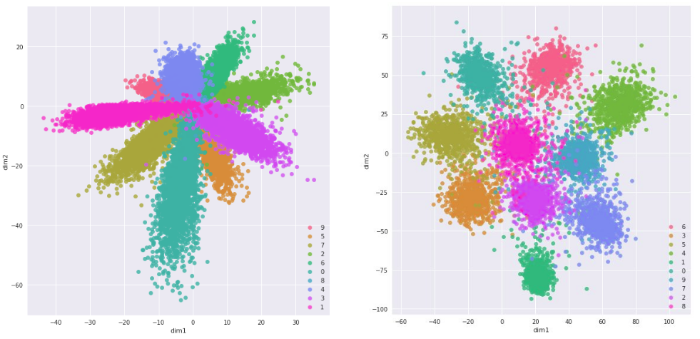

# Контрастное обучение

## Определение

**Контрастное обучение** (contrastive learning [[1]](https://proceedings.neurips.cc/paper/1993/hash/288cc0ff022877bd3df94bc9360b9c5d-Abstract.html))  настраивает отображение объекта $\mathbf{x}$ в признаковое представление или **эмбеддинг** (embedding) $f(\mathbf{x})\in \mathbb{R}^K$ таким образом, чтобы <u>похожие объекты были близки, а непохожие - далеки друг от друга в пространстве эмбеддингов</u>. При этом понятие похожести/непохожести определяется решаемой задачей.

Преобразование $f(\mathbf{x})$, отображающее объект в его эмбеддинг, называется **сиамской сетью** (siamese network [[1]](https://proceedings.neurips.cc/paper/1993/hash/288cc0ff022877bd3df94bc9360b9c5d-Abstract.html), [[2]](https://en.wikipedia.org/wiki/Siamese_neural_network)), поскольку при настройке точная копия этой сети будет применяться не к одному, а сразу к нескольким объектам.

При этом размерность пространства эмбеддингов $K$ обычно невелика и составляет несколько сотен признаков.

## Примеры использования

Ниже приводятся примеры задач, решаемых с помощью контрастного обучения, и то, какие объекты считаются похожими и непохожими в каждой задаче:

| N   | Задача                                                 | Похожие объекты                                                                                   | Непохожие объекты            |
| --- | ------------------------------------------------------ | ------------------------------------------------------------------------------------------------- | ---------------------------- |
| 1   | классификация                                          | принадлежат одному классу                                                                         | принадлежат разным классам   |
| 2   | проверка подписи человека по её отсканированной версии | подписи одного и того же человека                                                                 | подписи разных людей         |
| 3   | обнаружение перефразирования                           | перефразирования одной и той же фразы                                                             | перефразирования разных фраз |
| 4   | обнаружение одинаковых изображений                     | преобразования одного и того же изображения (поворот, обрезка, добавление шума, изменение цветов) | разные изображения           |

В задачах 1, 2, 3 используется разметка, поэтому это [задача обучения с учителем](../../Machine-learning/Base-concepts/Supervised-learning), известная как supervised contrasitve learning. Задача 4 - это [задача обучения без учителя](../../Machine-learning/Base-concepts/Unsupervised-learning), поскольку внешняя разметка в ней не используется. Эта задача известна как instance discrimination.

> Функция потерь контрастного обучения штрафует эмбеддинги похожих объектов за похожесть, а эмбеддинги непохожих объектов штрафует за непохожесть.

Ниже приведён пример эмбеддингов, построенных по задаче классификации рукописных цифр на датасете MNIST [[3]](https://www.kaggle.com/datasets/hojjatk/mnist-dataset) и извлечённых с промежуточных слоёв обычной классификационной сети (слева) и с финальных слоёв сиамской сети $f(x)$ (справа):

> Похожими объектами выступают сканы одной и той же цифры, а непохожими - сканы разных цифр. Отвечающие эмбеддингам цифры обозначены цветом.

Как видим, эмбеддинги сиамской сети сильнее раздвинуты для объектов разных классов по сравнению с эмбеддингами обычной классификационной сети, что следует из функции потерь контрастного обучения, которые сближают эмбеддинги похожих объектов (объектов одного класса) и раздвигают эмбеддинги непохожих (разных классов).

После того, как сиамская сеть настроена, можно решать конечную задачу метрическими методами в пространстве эмбеддингов, такими как [метод ближайших центроидов](../../Machine-learning/Metric-methods/Nearest-centroids) или [метод K ближайших соседей](../../Machine-learning/Metric-methods/KNN), поскольку эмбеддинги объектов разных классов будут далеко, а одного класса - близко.

Также можно использовать слои обученной сиамской сети для извлечения признаков для другой задачи ([transfer learning](../Regularization/Transfer-learning)).

## Обработка объектов разных типов

Также контрастное обучение для обработки объектов разных типов. В этом случае каждый тип преобразуется в эмбеддинг своей нейросетью:

| Задача                                       | Похожие объекты                                  | Непохожие объекты                                                           |
| -------------------------------------------- | ------------------------------------------------ | --------------------------------------------------------------------------- |
| ранжирование, информационный поиск           | поисковый запрос и соответствующие ему документы | поисковый запрос и нерелевантные документы                                  |
| построение текстового описания к изображению | изображение и соответствующее ему описание       | изображение и не соответствующие ему описания                               |
| рекомендательные системы                     | пользователь и товары, которые ему понравились   | пользователь и товары, которые ему не понравились или по которым нет данных |

Например, для рекомендательной системы будут настраиваться две нейросети $f(\cdot)$ и $g(\cdot)$:

$$
\begin{aligned}
f(\mathbf{u}): \text{пользователь} \to \text{эмбеддинг} \\
g(\mathbf{i}): \text{товар} \to \text{эмбеддинг}
\end{aligned}
$$

Различные преобразования $f(\cdot)$ и $g(\cdot)$ будут отображать объекты в <u>общее пространство эмбеддингов</u>, сохраняя свойство, что <u>эмбеддинги соответствующих друг другу объектов должны быть близки, а не соответствующих - далеки друг от друга</u>.

Далее пользователю можно рекомендовать те товары, эмбеддинги которых близки к эмбеддингу пользователя.

Аналогично можно реализовать информационный поиск, отображая в начале поисковой выдачи те документы, эмбеддинги которых максимально похожи на эмбеддинг поискового запроса.

## Настройка сиамской сети

Рассмотрим для простоты обозначений обработку объектов одного типа с помощью  сиамской сети, отображающей объект в его эмбеддинг:

$$
\mathbf{e}=f(\mathbf{x})
$$

Существуют три основные функции потерь для их настройки.

### Попарные потери

При обучении с использованием **попарных потерь** (pairwise contrastive loss [[4]](https://hal.science/hal-05094360v1/document)) сэмплируются пары объектов $\mathbf{x}_i,\mathbf{x}_j$, и происходит минимизация

$$
\mathcal{L}(\mathbf{x}_i,\mathbf{x}_j)=
\begin{cases}
\rho(f(\mathbf{x}_i),f(\mathbf{x}_j))^{2}, & \text{если } \mathbf{x}_i,\mathbf{x}_j \text{ похожи} \\
\max\left\{ 0,\alpha-\rho(f(\mathbf{x}_i),f(\mathbf{x}_j))\right\}^{2}, & \text{если } \mathbf{x}_i,\mathbf{x}_j \text{ не похожи} \\
\end{cases}
$$

В качестве $\rho(\mathbf{x}_i,\mathbf{x}_j)$ обычно берётся Евклидово расстояние.

Гиперпараметр $\alpha>0$ управляет минимальным расстоянием между непохожими объектами, при котором не будет штрафа. Его можно выбрать равным единице.

> Поскольку сэмплируются всевозможные <u>пары объектов</u>, то число уникальных сэмплов будет $O(N^2)$, где $N$ - число объектов в обучающей выборке.

### Тройные потери

При обучении, используя **тройные потери** (triplet loss [[5]](https://www.cv-foundation.org/openaccess/content_cvpr_2015/html/Schroff_FaceNet_A_Unified_2015_CVPR_paper.html)), сэмплируются тройки объектов:

- $\mathbf{x}$ - опорный объект (anchor);

- $\mathbf{x}^{+}$ - похожий на $\mathbf{x}$ (положительный, positive);

- $\mathbf{x}^{-}$ - не похожий на $\mathbf{x}$ (отрицательный, negative).

Сами тройные потери штрафуют ситуацию, когда эмбеддинги опорного и положительного объекта становятся слишком непохожими относительно различий эмбеддингов опорного и отрицательного объекта:

$$
\mathcal{L}(\mathbf{x},\mathbf{x}^{+},\mathbf{x}^{-})=\max\left\{ \rho(f(\mathbf{x}),f(\mathbf{x}^+))^{2}-\rho(f(\mathbf{x}),f(\mathbf{x}^-))^{2}+\alpha;0\right\} 
$$

> Поскольку сэмплируются <u>тройки объектов</u>, то число уникальных сэмплов будет иметь порядок $O(N^3)$.

### Вероятностные потери

При обучении, используя **вероятностные потери** (InfoNCE loss, NCE=noise constrastive estimation, [[6]](https://proceedings.mlr.press/v9/gutmann10a),[[7]](https://arxiv.org/abs/1807.03748)), сэмплируются 

- $\mathbf{x}$ - опорный объект (anchor);

- $\mathbf{x}^{+}$ - похожий на $x$ (положительный, positive);

- $\mathbf{x}_1,...\mathbf{x}_M$ - набор непохожих на $\mathbf{x}$ объектов (отрицательные, negatives).

Сами вероятностные потери имеют вид:

$$
\mathcal{L}(\mathbf{x},\mathbf{x}^+,\mathbf{x}^-_1,...\mathbf{x}^-_M)=-\ln\frac{e^{\text{sim}(f(\mathbf{x}),f(\mathbf{x}^+))}}{e^{\text{sim}(f(\mathbf{x}),f(\mathbf{x}^+))}+\sum_{m=1}^M e^{\text{sim}(f(\mathbf{x}),f(\mathbf{x}^-_m))}},
$$

где $\text{sim}(e,e')$ - косинусная мера близости:

$$
\text{sim}(e,e')=\frac{\mathbf{e}^T \mathbf{e}'}{||\mathbf{e}||\cdot||\mathbf{e}'||}
$$

> За счёт сэмплирования не одного, а целого набора из $M$ непохожих объектов число уникальных сэмплов будет иметь порядок больше $O(N^{M+2})$.

Указанные функции потерь можно применять и для объектов разных типов. В этом случае в формулах нужно подставлять эмбеддинги объектов, полученных из разных нейросетей, обрабатывающих соответствующие типы данных.

:::tip Важность числа уникальных сэмплов

При классической настройке обычной сети по обучающей выборке из $N$ объектов существует всего $N$ уникальных сэмплов, по которым считается функция потерь. При контрастном оценивании число уникальных сэмплов гораздо больше, что позволяет  настраивать сиамскую сеть точнее даже для небольших выборок!

Даже если есть всего один пример класса, то, сравнивая его с каждым из других объектов, уже получим $N-1$ уникальных сэмплов, поэтому контрастное обучение может эффективно использоваться в обучении всего по нескольким примерам класса  (few-shot learning [[8]](https://www.ibm.com/think/topics/few-shot-learning)).

:::

## Генерация обучающих примеров

Не ограничивая общности, рассмотрим задачу классификации, решаемую методом контрастного обучения. При генерации обучающих примеров можно сэмплировать равномерно 

– по объектам;

– по классам (типам непохожести между объектами).

В первом случае будут оптимизироваться [микроусреднённые меры качества](../../Machine-learning/Classifier-evaluation/Multiclass-generalization-of-binary-measures) (на объектах), а во втором - [макроусреднённые меры качества](../../Machine-learning/Classifier-evaluation/Multiclass-generalization-of-binary-measures) (на классах). Обычно требуется хорошо отделять каждый из классов, поэтому чаще используется второй подход.

:::tip Обучение расстояний (metric learning)

Приёмы контрастного обучения можно использовать и для обучения расстояний (metric learning [[9]](https://www.nowpublishers.com/article/Details/MAL-019)), когда функция расстояния в [метрических методах прогнозирования](../../Machine-learning/Metric-methods/Metric-methods) параметризуется, а параметры подбираются так, чтобы лучше решать конечную задачу. В случае задачи классификации можно подбирать такую меру близости (или расстояния) между объектами, чтобы объекты одного класса оказывались близки, а объекты разных классов - далеки друг от друга.

:::

---

Детальнее о контрастном обучении и его приложениях можно прочитать в [[10]](https://www.mdpi.com/2227-7080/9/1/2). С библиотеками и последними статьями по теме можно ознакомиться в [[11]](https://paperswithcode.com/task/contrastive-learning).

## Литература

1. [Bromley J. et al. Signature verification using a" siamese" time delay neural network //Advances in neural information processing systems. – 1993. – Т. 6.](https://proceedings.neurips.cc/paper/1993/hash/288cc0ff022877bd3df94bc9360b9c5d-Abstract.html)

2. [Wikipedia: Siamese neural network.](https://en.wikipedia.org/wiki/Siamese_neural_network)

3. [LeCun Y. The MNIST database of handwritten digits. – 1998.](https://www.kaggle.com/datasets/hojjatk/mnist-dataset)

4. [Hadsell R., Chopra S., LeCun Y. Dimensionality reduction by learning an invariant mapping //2006 IEEE computer society conference on computer vision and pattern recognition (CVPR'06). – IEEE, 2006. – Т. 2. – С. 1735-1742.](https://hal.science/hal-05094360v1/document)

5. [Schroff F., Kalenichenko D., Philbin J. Facenet: A unified embedding for face recognition and clustering //Proceedings of the IEEE conference on computer vision and pattern recognition. – 2015. – С. 815-823.](https://www.cv-foundation.org/openaccess/content_cvpr_2015/html/Schroff_FaceNet_A_Unified_2015_CVPR_paper.html)

6. [Gutmann M., Hyvärinen A. Noise-contrastive estimation: A new estimation principle for unnormalized statistical models //Proceedings of the thirteenth international conference on artificial intelligence and statistics. – JMLR Workshop and Conference Proceedings, 2010. – С. 297-304.](https://proceedings.mlr.press/v9/gutmann10a)

7. [Oord A., Li Y., Vinyals O. Representation learning with contrastive predictive coding //arXiv preprint arXiv:1807.03748. – 2018.](https://arxiv.org/abs/1807.03748)

8. [ibm.com: What is few-shot learning?](https://www.ibm.com/think/topics/few-shot-learning)

9. [Kulis B. et al. Metric learning: A survey //Foundations and Trends® in Machine Learning. – 2013. – Т. 5. – №. 4. – С. 287-364.](https://www.nowpublishers.com/article/Details/MAL-019)

10. [Jaiswal A. et al. A survey on contrastive self-supervised learning //Technologies. – 2020. – Т. 9. – №. 1. – С. 2.](https://www.mdpi.com/2227-7080/9/1/2)

11. [paperswithcode.com: Contrastive Learning.](https://paperswithcode.com/task/contrastive-learning)
