# Свёртка для последовательностей

## Операция свёртки

Пусть $\mathbf{x}=[x_1,x_2,...x_D]$ - обрабатываемая последовательность числовых значений. 

> Например, это может быть последовательность температур прибора, снимаемых каждые 10 секунд.

**Свёртка** (convolution) - это линейная операция, обладающая параметрами:

- $K=[K(-n),K(-n+1),...K(n-1),K(n)]\in\mathbb{R}^{2n+1}$ - ядро свёртки ( convolution kernel), обычно имеющая нечётный размеру (но может быть и чётным),

- смещение $b\in\mathbb{R}$.

Выходом операции свёртки будет последовательность $y$ с элементами, считаемыми по формуле

$$
y_j = \sum_{i=-n}^{n} K(i)x_{j+i}+b,\quad j=n+1,...D-n
$$

> Таким образом, свёртка генерирует последовательность, каждый элемент которой получается за счёт одного и того же линейного преобразования с $2n+2$ параметрами.

Рассмотрим пример вычисления свёртки для следующих данных:

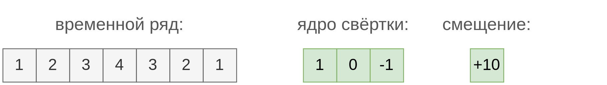

Тогда выходной ряд будет строиться следующим образом:

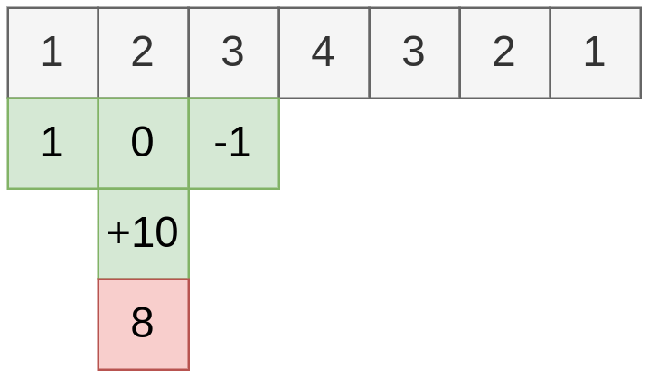

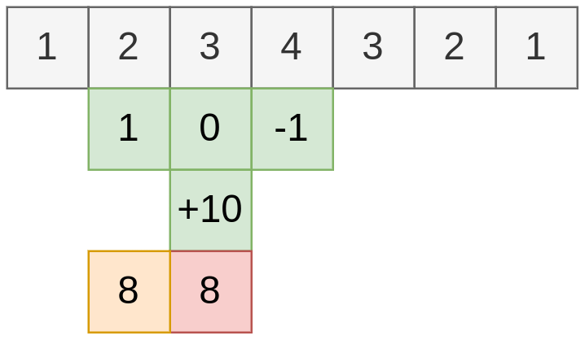

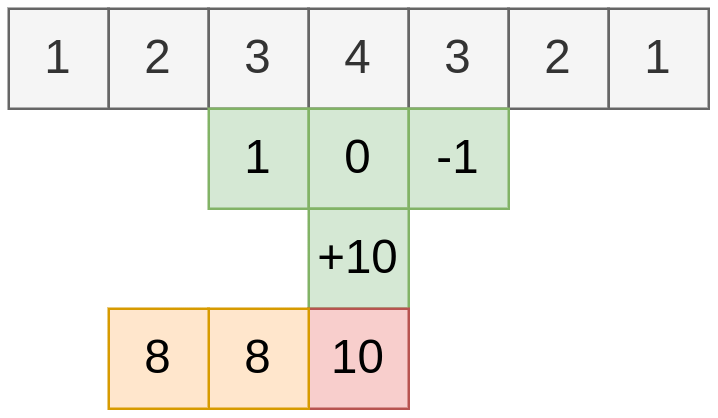

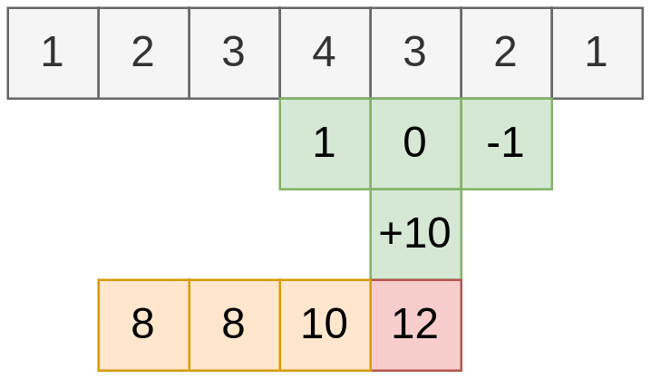

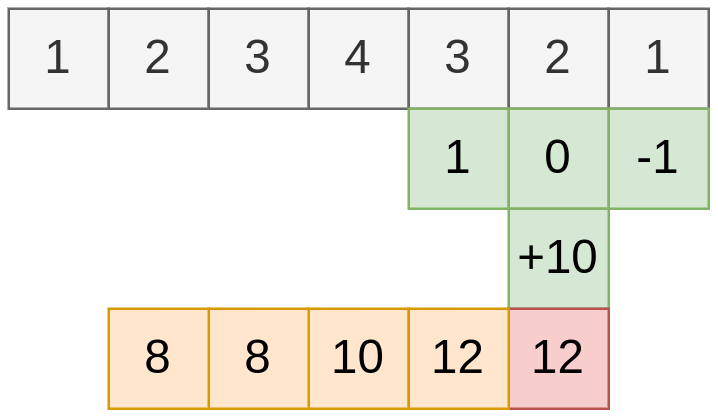

## Примеры свёрток

Рассмотрим частные виды свёрток. Во всех примерах смещение $b$ равно нулю.

- $K=[\frac{1}{5},\frac{1}{5},\frac{1}{5},\frac{1}{5},\frac{1}{5}]$ отвечает равномерному усреднению, сглаживает временной ряд.

- $K=[0.1,0.2,0.4,0.2,0.1]$ - неравномерное усреднение, сглаживающее временной ряд, когда у центральных элементов вклад больше.

- $K=[-1,0,+1]$ вычисляет разностную производную $\Delta x_j = x_{j+1}-x_{j-1}$, то есть скорость изменения наблюдаемой величины.

- $K=[+1,-2,+1]$ вычисляет разностную вторую производную $\Delta x_j = (x_{j+1}-x_j)-(x_j-x_{j-1})$, то есть скорость изменения скорости наблюдаемой величины.

:::tip Автоматическая настройка

В ранних работах параметры свёрток подбирались вручную. Но если есть обучающая выборка, то <u>эффективнее будет работать свёртка с автоматически настраиваемыми параметрами ядра и смещения</u> - так операция будет лучше соответствовать данным и решаемой задаче.

:::

## Свойства свёртки

Свёртка извлекает один и тот же <u>линейный признак</u>, причём <u>локально</u> в каждой позиции. Это обеспечивает свойство [эквивариантности к сдвигу](Structured-data) (translation equivariance). 

Сравнение свёртки с полносвязным слоем многослойного персептрона приведено ниже справа и слева соответственно (без смещений):

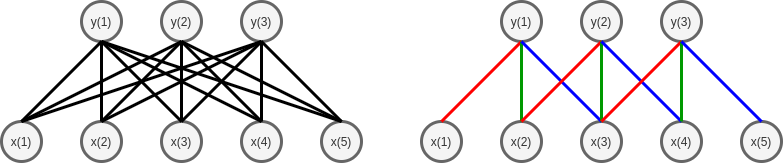

Как видим, свёртка предполагает <u>существенно меньшее количество связей</u> (sparse connections), что ускоряет вычисление и требует меньше параметров для обучения. 

Дополнительное уменьшение параметров обеспечивается <u>общностью весов</u> (parameter sharing). На рисунке справа одинаковые веса обозначены одним цветом.

**Свёртку можно применять к входным данным разной длины**, причем число оцениваемых параметров будет одним и тем же - $2n+2$.

На многопроцессорных вычислительных устройствах, таких как видеокарта, вычисления производятся не последовательно один за другим, а параллельно, поэтому свёртка, вычисляемая независимо для разных позиций, считается очень быстро.

Также стоит обратить внимание, что выходная последовательность <u>получается короче</u> на $2n$, чем входная, поскольку ядро свёртки упирается в начало и конец входной временной последовательности.

## Обработка динамического временного ряда

Обработка **динамического временного ряда** специфична тем, что наблюдения $x_1,x_2,...x_t$ поступают последовательно, а <u>будущие наблюдения ещё неизвестны</u>, когда нужно формировать выход $y_t$. Для такого рода данных свёртке разрешается использовать лишь последние располагаемые $n$ наблюдений:

$$
y_t=\sum_{i=0}^{n-1} K(i)x_{t-i}+b,
$$

а у самой свёртки остаются только $n+1$ параметров $K=[K(0),...K(n-1)]$ и $b$. Пример действия такой свёртки показан ниже:

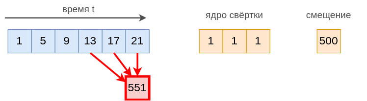

> Такая свёртка может использоваться для прогнозирования будущих значений временного ряда.

## Извлечение сложных нелинейных признаков

Наслаивая свёртки друг на друга, можно извлекать более сложные признаки с расширенной **областью видимости** (receptive field).

Ниже красным цветом показано, как результаты от более поздних свёрток зависят от более широкой окрестности значений входных данных:

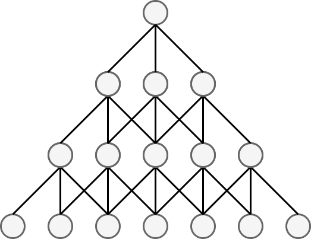

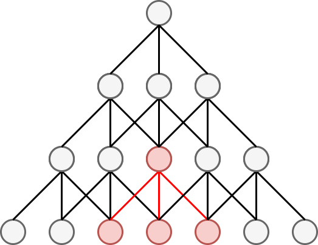

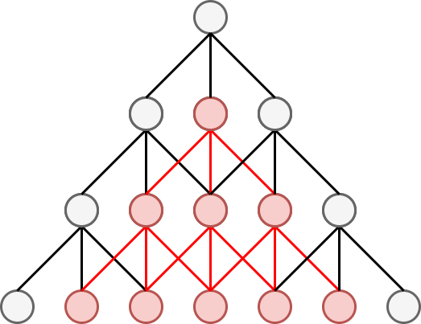

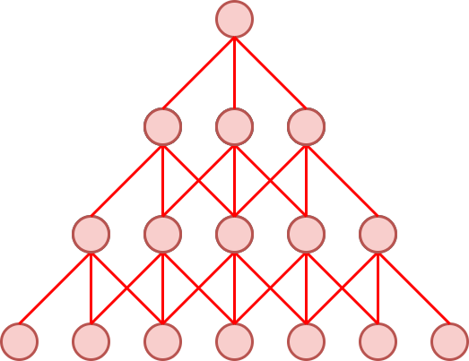

На каждом слое действует свёртка со своими индивидуальными параметрами.

:::warning Нелинейные признаки

Чтобы извлекаемые признаки получались <u>нелинейными</u>, после каждой свёртки применяют [нелинейную функцию активации](../MLP/Activation-functions) (иначе суперпозиция линейных функций снова даст линейную функцию!).

:::

> Суперпозиция свёрток с операциями нелинейности приводит к **иерархичности признаковых представлений** входной последовательности - более высокие слои будут извлекать более сложные признаки, зависящие от более широкой окрестности данных.

Чтобы извлечь более разнообразные признаки, на каждом слое применяют не одну, а сразу несколько свёрток (каждая - со своими параметрами):

$$
\begin{aligned}
y^1_j &= \sum_{i=-n}^{n} K^1(i)x_{j+i}+b^1 \\
y^2_j &= \sum_{i=-n}^{n} K^2(i)x_{j+i}+b^2 \\
\cdots \\
y^M_j &= \sum_{i=-n}^{n} K^M(i)x_{j+i}+b^M
\end{aligned}
$$

Тогда каждая свёртка следующего слоя будет определяться как локальная линейная комбинация результатов <u>всех свёрток</u> предыдущего слоя, и будет выполнять уже <u>двумерную операцию</u>:

$$
z_j=\sum_{s=1}^M \sum_{i=-n}^n  K(s,i)y^s_{j+i}+b
$$

Графически это проиллюстрировано ниже:

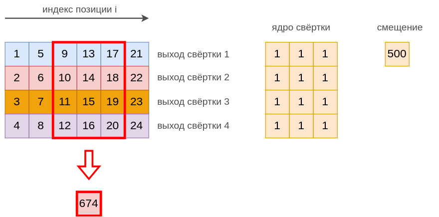
