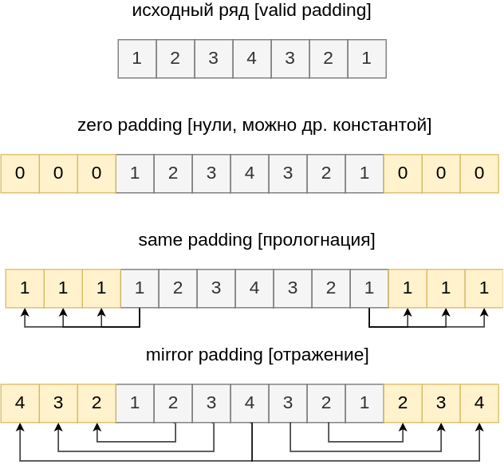
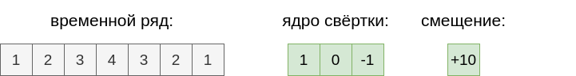
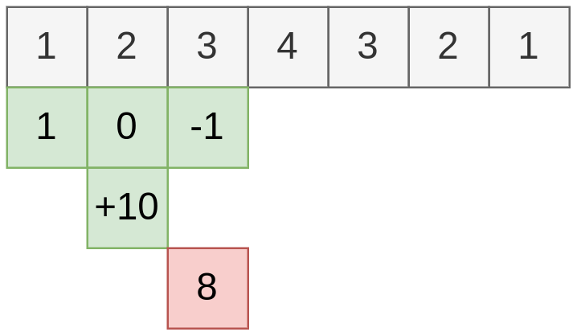
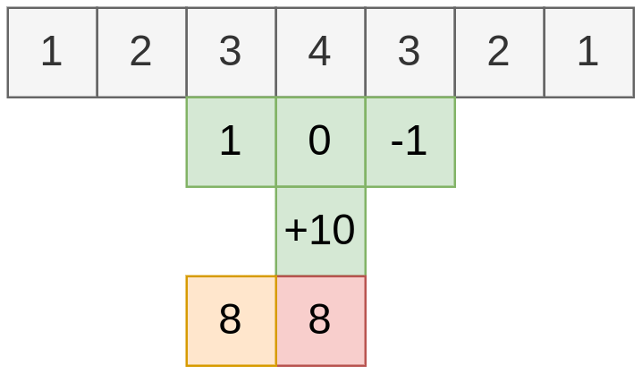
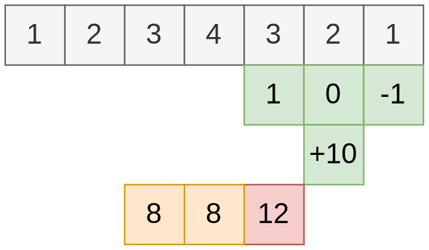
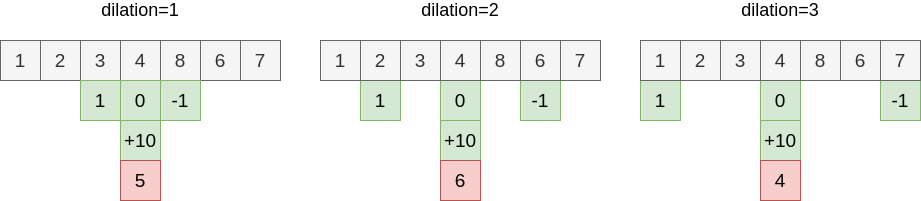

# Гиперпараметры свёртки для последовательностей

[Одномерная свёртка на последовательностях](Conv-1D) задаётся **параметрами** (настраиваемыми градиентной оптимизацией) и **гиперпараметрами** (задаваемыми пользователем).

Параметрами свёртки являются элементы вектора ядра свёртки $K\in\mathbb{R}^{2n+1}$ и смещение $b\in\mathbb{R}$.

Гиперпараметром свёртки является размер ядра $2n+1$. Обычно он нечётный, но может браться и чётным. Далее рассмотрим другие гиперпараметры свёртки.

## Паддинг

Свёртка приводит к уменьшению длины выходной последовательности, поскольку нельзя прижать ядро свёртки к самым краям. Если требуется выход такой же длины, как и вход (например, для реализации [ResNet блоков](../Training-simplification/ResBlock)), или больше, то используется **паддинг** (padding) - предварительное расширение входной последовательности перед применением свёртки. В зависимости от способа заполнения расширенных участков входной последовательности существуют разные виды паддинга - valid, zero, same и mirror. Логика их работы показана на рисунке:

## Шаг свёртки

Иногда необходимо **уменьшить число выходных элементов свёртки**. Обычно это делается, чтобы уменьшить число связей (и, соответственно, число параметров модели) на последующих слоях, чтобы сеть меньше [переобучалась](../../Machine-learning/Base-concepts/Generalization-ability). 

Для этого используется больший **шаг свёртки** (stride). Стандартная свёртка применяет ядро к определённой позиции, чтобы получить активацию. Следующая активация получается прикладыванием ядра свёртки к <u>соседней</u> позиции, что отвечает <u>единичному шагу</u>. Но для получения следующей активации ядро свёртки можно сдвигать не на одну позицию, а сразу на несколько. Величина сдвига и называется **шагом свёртки**. 

Например, если сдвигать ядро свёртки для получения каждой следующей активации на 2, то длина выходного ряда будет в 2 раза меньше, как показано на рисунках:

## Сдвиг свёртки

Если обрабатываемая последовательность слишком длинная, то свёртки теряют эффективность, поскольку действуют локально и своей областью видимости захватывают лишь малый её фрагмент. **Область видимости свёртки** (receptive field)  можно увеличить, если при перемножении элементов последовательности на элементы ядра свёртки идти по последовательности не со сдвигом 1, а с большим **сдвигом** (dilation), как показано на рисунке:

На рисунке показан процесс извлечения <u>лишь одного</u> элемента выходной последовательности. Вся выходная последовательность извлекается аналогично обычной свёртке, когда свертка применяется многократно ко всем валидным позициям  входной последовательности.

:::note Задача

Пусть 

- $W$ - длина входного ряда, 

- $2n+1$ - размер ядра,

- $P$ - расширение (padding) для увеличения размера выхода,

- $S$ - шаг свёртки (stride); $D$ - сдвиг свёртки (dilation). 

Какую размерность будет иметь выход свёртки при данных параметрах?

:::
