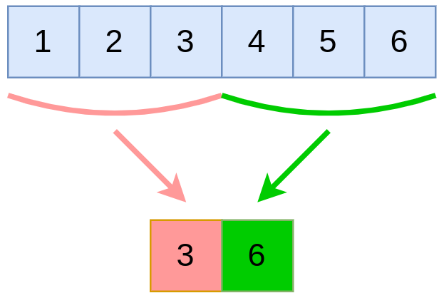
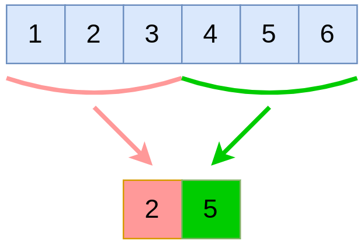
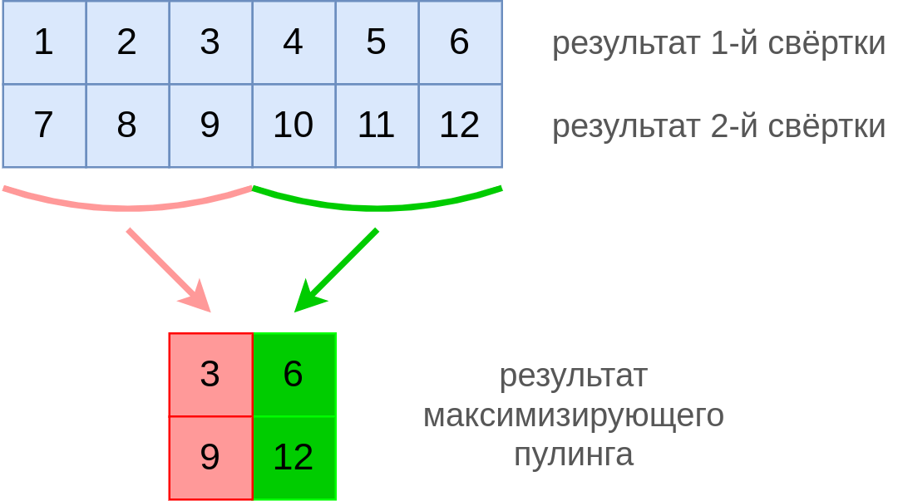
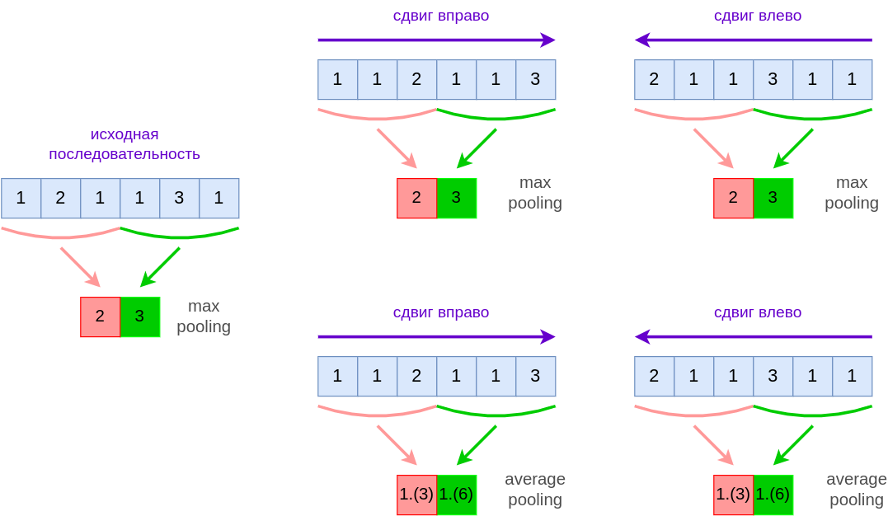
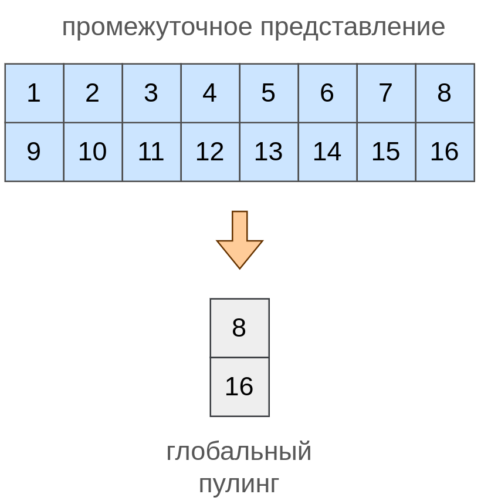
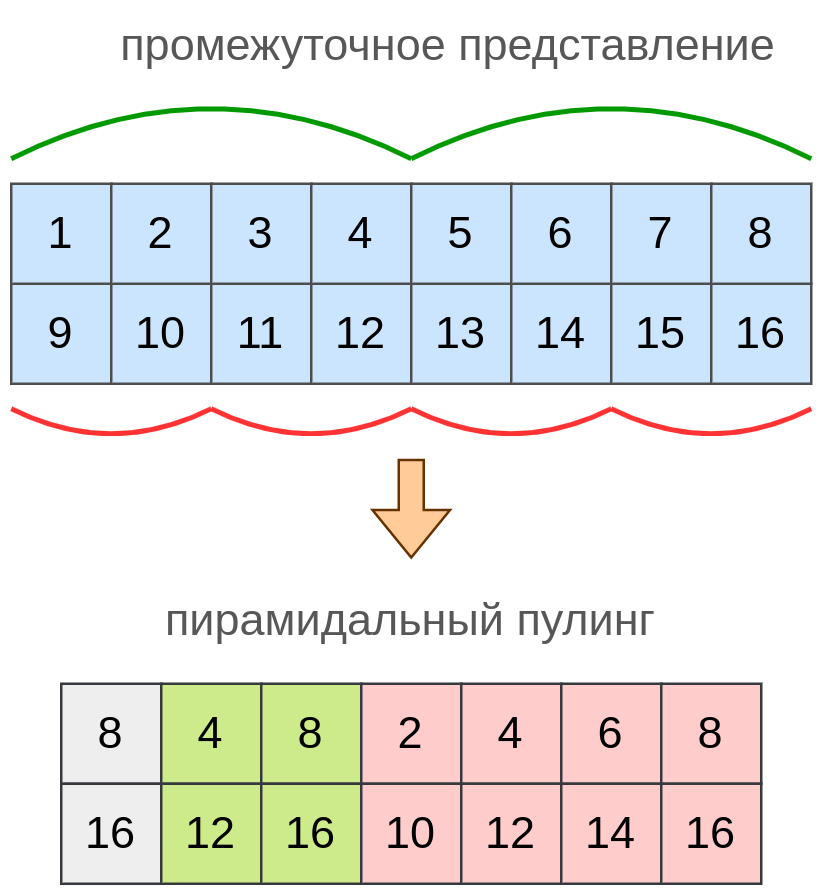

# Пулинг для последовательностей

## Операция пулинга

**Пулинг** (pooling) - <u>операция агрегации</u> соседних значений последовательности или активаций свёртки, которая применяется для уменьшения длины промежуточного представления последовательности. Самые популярные - это максимизирующий и усредняющий пулинг. 

**Максимизирующий пулинг** (max pooling) агрегирует по области, возвращая <u>максимальный элемент</u>, как показано ниже для области из трёх соседних элементов:

**Усредняющий пулинг** (average pooling) агрегирует по области, возвращая <u>среднее значение элементов области</u>, как показано ниже также для области из трёх соседних элементов:

Если пулинг применяется к нескольким **каналам** (результатам действия нескольких свёрток), то он действует <u>независимо для каждого канала</u>:

## Гиперпараметры

У пулинга отсутствуют настраиваемые параметры, но есть два гиперпараметра:

- размер области, по которой производится агрегация (называется также **размером ядра** или **kernel size**). В примерах выше размер ядра был равен 3.

- **шаг** смещения агрегируемой области для получения следующего выходного значения (stride). В примерах выше шаг был равен 3, и, как правило, его всегда выбирают равным размеру ядра.

## Интуиция и преимущества пулинга

Пусть свёртка, к результатам которой применяется пулинг, извлекает некоторый признак. 

**Максимизирующий пулинг** извлекает <u>наличие интересуемого признака где-либо в агрегируемой области</u>.

**Усредняющий пулинг** извлекает <u>среднюю представленность интересуемого признака в агрегируемой области</u>.

> Обрабатываемые последовательности обычно имеют высокую размерность, и пулинг используется для того, чтобы эту размерность снизить. Например, пулинг с размером ядра 4 и сдвигом 4 уменьшит размерность выхода в 4 раза.

> При обработке последовательностей существуют пулинги, которые возвращают не один, а сразу несколько значений агрегации. Например, top-1 и top-2 самых больших элемента в области.

Пулинг приближённо обеспечивает свойство инвариантности выходов нейросети к небольшим сдвигам. Например, если сдвинуть входную последовательность (с пролонгацией значений, то есть используя same padding) на примере ниже, то результат пулинга не изменится:

где 1.(3)=1.333..., а 1.(6)=1.666....

Пулинг обеспечивает лишь <u>приближённую инвариантность к сдвигу</u>. В случаях, когда резкие изменения происходят на границах агрегируемых областей, выходы пулинга могут существенно отличаться при сдвиге, однако это реализуется не так часто.

## Построение эмбеддингов последовательности

Свёртка и пулинг, изученные ранее, переводят входную последовательность в <u>выходную последовательность</u>. 

Часто возникает необходимость перевести последовательность произвольной длины в вектор фиксированного размера, называемый **эмбеддингом последовательности** (sequence embedding). Для этих целей используются глобальный и пирамидальный пулинг.

### Глобальный пулинг

**Глобальный пулинг** (global pooling [[1]](https://arxiv.org/abs/1312.4400)) применяет агрегирующую операцию (усреднение или взятие максимума) <u>ко всем значениям канала</u>. А применяется он, как и обычный пулинг, к каждому каналу независимо. Таким образом, если $K$ свёрток предыдущего слоя сгенерировали $K$ последовательностей, то, применяя к каждой из них глобальный пулинг, мы получим кодировку исходной последовательности произвольной длины $K$-мерным вектором! 

> Если производить агрегацию взятием максимума, то получим **глобальный максимизирующий пулинг** (global max pooling), а если усреднением, то **глобальный усредняющий пулинг** (global average pooling).

Это удобно для последующей обработки последовательности [многослойным персептроном](../MLP/Multilayer-perceptron), который ожидает на вход вектор признаков <u>фиксированного размера</u>.

Глобальный максимизирующий пулинг проиллюстрирован ниже (для двух каналов):

## Пирамидальный пулинг

Глобальный пулинг успешно справляется с переводом последовательности произвольной длины в $K$-мерный вектор. Однако при агрегации по всей длине последовательности <u>полностью теряется пространственная информация</u> о том, в каких именно участках достигались максимальные значения. Отчасти сохранить эту информацию позволяет **пирамидальный пулинг** (spatial pyramid pooling [[2]](https://arxiv.org/abs/1406.4729)), при котором последовательность вначале делится на $S_1,S_2,...S_p$ блоков, и агрегация производится как глобальная, так и в рамках каждого блока, в результате чего каждый канал кодируется $1+S_1+S_2+...+S_p$ максимальными значениями для каждого из $K$ каналов. В результате входная последовательность произвольной длины кодируется $K(1+S_1+S_2+...+S_p)$-мерным вектором.

Ниже приведена работа максимизирующего пирамидального пулинга для двух каналов при $S_1=2,S_2=4$. При таких настройках глобальный пулинг будет применяться сначала ко всей последовательности, затем к каждой из её половин, а потом к каждой из её четвертей, как показано на рисунке:

## Литература

1. [Lin M., Chen Q., Yan S. Network in network //arXiv preprint arXiv:1312.4400. – 2013.](https://arxiv.org/abs/1312.4400)
2. [He K. et al. Spatial pyramid pooling in deep convolutional networks for visual recognition //IEEE transactions on pattern analysis and machine intelligence. – 2015. – Т. 37. – №. 9. – С. 1904-1916.](https://arxiv.org/abs/1406.4729)
