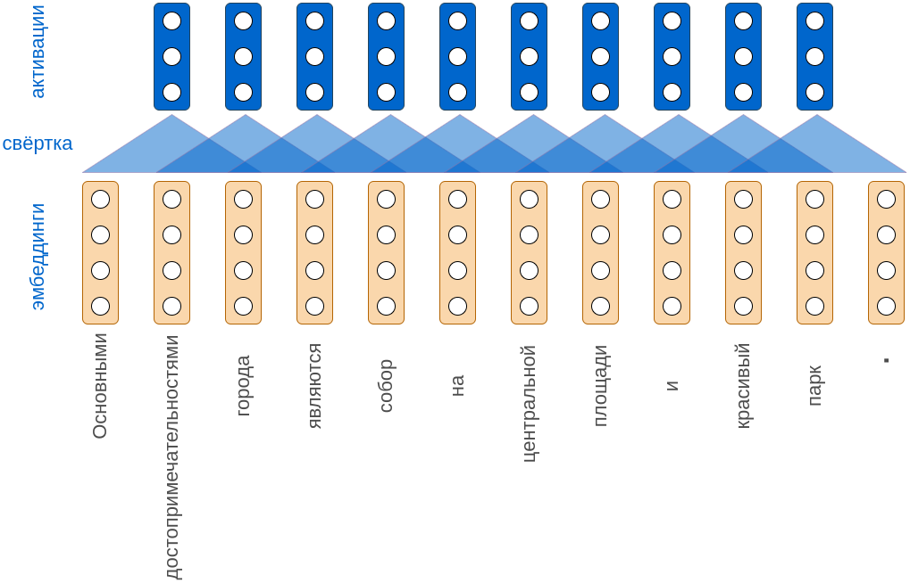
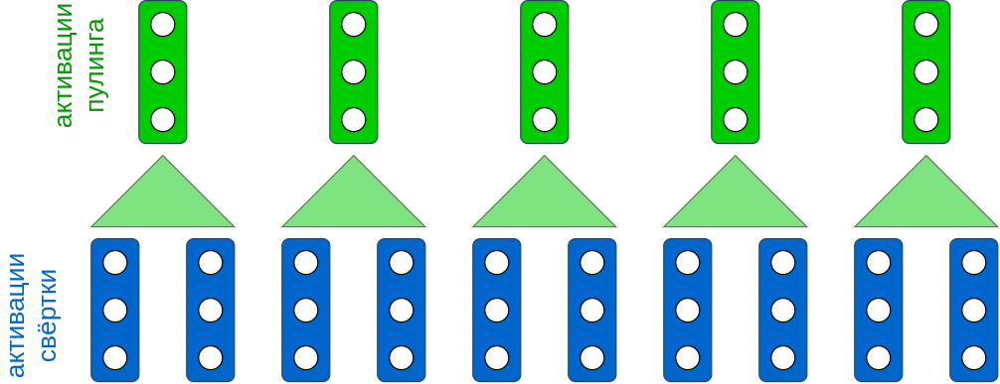
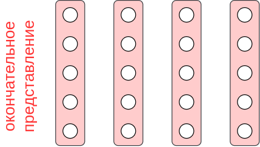
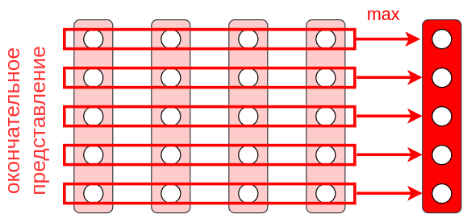

# Свёрточные сети для последовательностей

Рассмотрим использование свёрток на примере обработки текста как последовательности слов. Вначале каждое слово текста кодируется некоторым **эмбеддингом**, т.е. вектором вещественных чисел фиксированного размера. 

> Эмбеддинги слов можно настраивать вместе с остальными весами сети либо [обучать на отдельной задаче](../Embeddings), в качестве которой обычно выступает языковое моделирование. 

Рассмотрим предложение: "*Основными достопримечательностями города являются собор на центральной площади и красивый парк.*"

Если кодировать каждое слово четырёхмерным эмбеддингом и применять три свёртки с размером ядра 3, то получим следующую визуализацию процесса:

Обратим внимание, что символ точки кодируется отдельным эмбеддингом. Это позволяет обрабатывать тексты из нескольких предложений, а модели при этом понимать, когда заканчивается одно предложение и начинается новое. После каждой свёртки, как обычно, действует [функция нелинейности](../MLP/Activation-functions).

Чтобы сократить размер промежуточного представления, можно применить пулинг с ядром длины 2:

Применяя слои свёрток и пулингов несколько раз, получим окончательные эмбеддинги различных фрагментов предложения. Например, они могут быть 5-мерными:

Длина такого представления текста будет пропорциональна длине текста - чем он длиннее, тем длиннее будет представление. Но пусть нам нужно решить задачу $C$-классовой классификации, то есть выдать $C$ вероятностей принадлежности текста каждому из классов.

Чтобы отобразить последовательность переменной длины в вектор фиксированной размерности воспользуемся [глобальным пулингом](Pooling-1D#глобальный-пулинг) - агрегацией каждого признака по всем элементам входной последовательности. В примере у нас 5 признаков и 4 элемента последовательности. Применяя глобальный максимизирующий пулинг, получим представление всего текста в виде вектора длины 5:

Полученный пятимерный вектор представляет собой окончательный эмбеддинг для всего текста и не зависит от его длины. Для окончательной классификации текста к этому эмбеддингу достаточно применить [SoftMax-преобразование](../MLP/Outputs-loss-functions#softmax-преобразование) или многослойный персептрон с соответствующими выходами.

Вместо глобального пулинга можно использовать [пирамидальный](Pooling-1D#пирамидальный-пулинг), если важно частично сохранить информацию о расположении определённых признаков в тексте.

Полученная модель (предобработка свёртками и пулингами+SoftMax/многослойный персептрон) настраивается как целое по обучающей выборке и называется **свёрточной нейросетью для текстов** (text CNN). Детальнее с архитектурой рекомендуется ознакомиться в [[1]](https://lena-voita.github.io/nlp_course/models/convolutional.html).

> Указанная свёрточная нейросеть способна обрабатывать не только тексты, но и любые последовательности элементов. Например, это может быть последовательность нуклеотидов в цепочках ДНК (после конвертации в эмбеддинги) или временной ряд из цен на акции.

Глобальный максимизирующий пулинг в подобных сетях можно настроить возвращать не одно максимальное значение, а два или несколько самых больших значений в порядке их следования.

:::warning Ограничение свёрточных слоёв

Свёрточные слои, оперируя свёртками и пулингами, извлекают лишь <u>локальные признаки</u> из текста, то есть признаки отдельных фраз из подряд идущих слов ограниченной длины. Глобальный анализ текста выполняется только после применения глобального пулинга.

Более эффективная обработка текстов реализуется [моделью трансформера](../Transformer/Transformer), который  ещё на этапе построения промежуточных представлений анализирует весь текст, используя [механизм внимания](../Recurrent-neural-nets/Attention-RNN).  

:::

## Литература

1. [Lena Voita. NLP Course For You: Convolutional Neural Networks for Text](https://lena-voita.github.io/nlp_course/models/convolutional.html)
