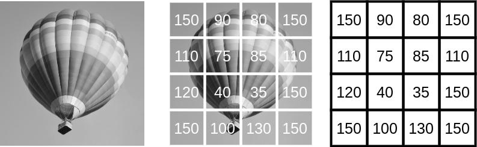
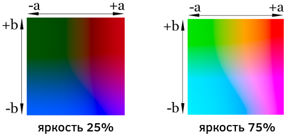
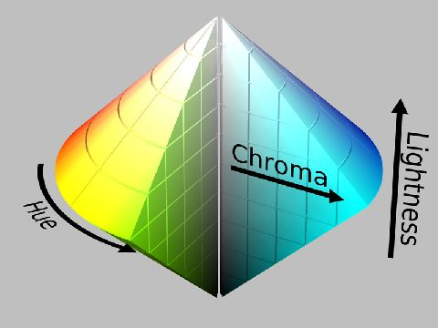

# Цифровое представление изображений

## Чёрно-белые изображения

Изображения бывают цветные и одноцветные. Одноцветное изображение содержит градации одного цвета (оттенки серого), в дальнейшем такие изображения будем называть чёрно-белыми. Такие изображения представляются в виде матрицы интенсивностей пикселей размера $H\times W$, где $H$ - высота, а $W$ - ширина изображения:

## Цветные изображения

### Представление в RGB

Для представления цветного изображения используется свойство, что любой цвет может быть представлен как сочетание базисных цветов: красного (red, R), зелёного (green, G) и синего (blue, B). Поэтому изображение разрешения $H\times W$ можно представить тензором размерности $3\times H\times W$, сочетающим интенсивности красного, зелёного и синего цвета для каждой позиции. Такое представление цвета называется **RGB**-представлением [[1]](https://en.wikipedia.org/wiki/RGB_color_model): 

> Если присмотреться вблизи к экрану старых телевизоров, то можно увидеть, что каждый пиксель состоит из трёх элементов, светящихся красным, зелёным и синим цветами.

Другие цветовые представления также кодируют изображение в виде тензора $3\times H\times W$, но используют другие три базисные компоненты, которыми кодируется каждый цвет.

### Представление в CIELab

В цветовом представлении **CIELab** (Lab, Luv [[2]](https://en.wikipedia.org/wiki/CIELAB_color_space)) цвет также представляется в виде сочетания трёх компонент:

- L-luminance (яркость),

- (a,b) - цвет.

Визуализация (a,b) пространства показана ниже для двух значений яркости L [[3]](https://ru.wikipedia.org/wiki/LAB):

Разделение на яркость и цвет позволяет легко варьировать яркость и контраст изображений, не изменяя цвета. Также это представление выбрано таким образом, чтобы величина Евклидового расстояния между двумя цветами $(L_1,a_1,b_1)$ и $(L_2,a_2,b_2)$ линейно соответствовала воспринимаемой человеческим глазом разнице в цветах (для RGB-представления это не так).

Представление изображения в CIELab-формате позволяет нейросетям работать инвариантно 

- к освещённости (если обрабатывать только компоненты a,b), 

- к цвету (если обрабатывать только компоненту L).

Например, классификация растений должна быть инвариантна к освещённости, если получаем кадры в разное время суток. А классификация марок машин не должна зависеть от цвета, который может быть любым, а должна определяться только контурами автомобиля в пространстве яркости L.

### Представление HCL

Цветовое представление **HCL** [[4]](https://en.wikipedia.org/wiki/HCL_color_space) кодирует каждый цвет тремя ещё более интерпретируемыми компонентами:

- цвет (hue),

- насыщенность цвета (chroma),

- яркость (lightness).

Пространство HCL визуализируется следующим образом [[5]](https://www.freepng.ru/download/цветовая-система-манселла.html):

Это пространство позволяет обучать модели, работающие инвариантно к цвету, яркости и насыщенности.

Существует также популярное цветовое представление **CYMK**, которое мы не будем рассматривать, т.к. оно используется в издательском деле.

## Литература

1. [Wikipedia: RGB color model.](https://en.wikipedia.org/wiki/RGB_color_model)

2. [Wikipedia: CIELAB color space.](https://en.wikipedia.org/wiki/CIELAB_color_space)

3. [Wikipedia: LAB.](https://ru.wikipedia.org/wiki/LAB)

4. [Wikipedia: HCL color space.](https://en.wikipedia.org/wiki/HCL_color_space)

5. https://www.freepng.ru/download/цветовая-система-манселла.html
