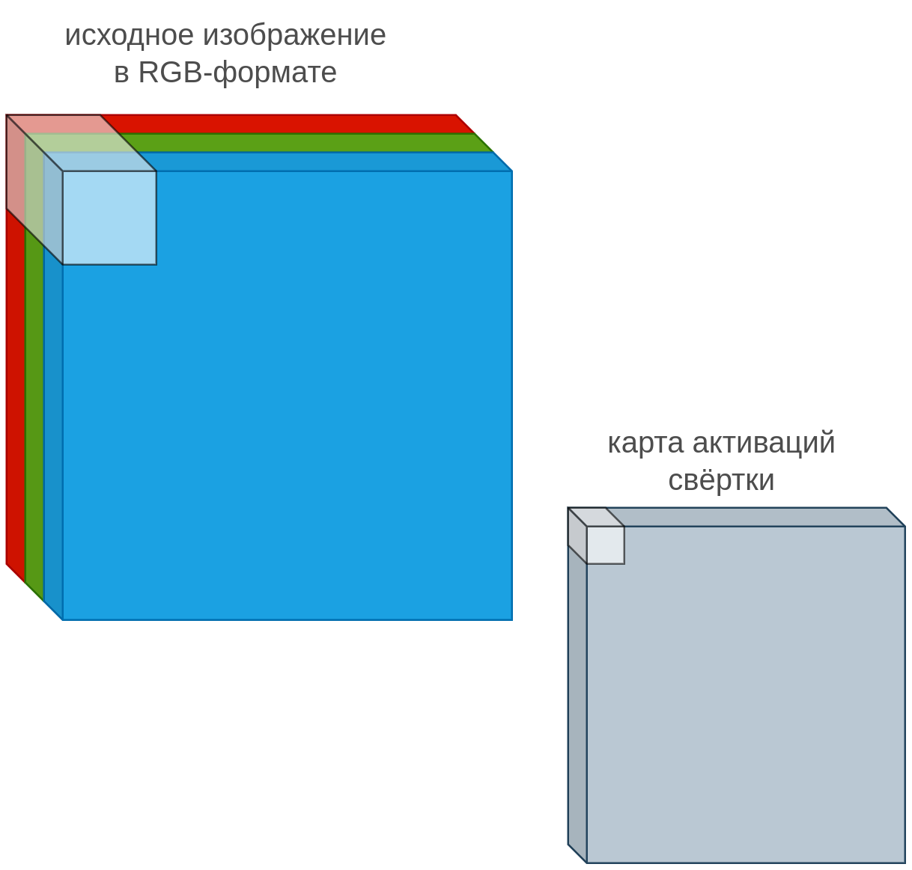
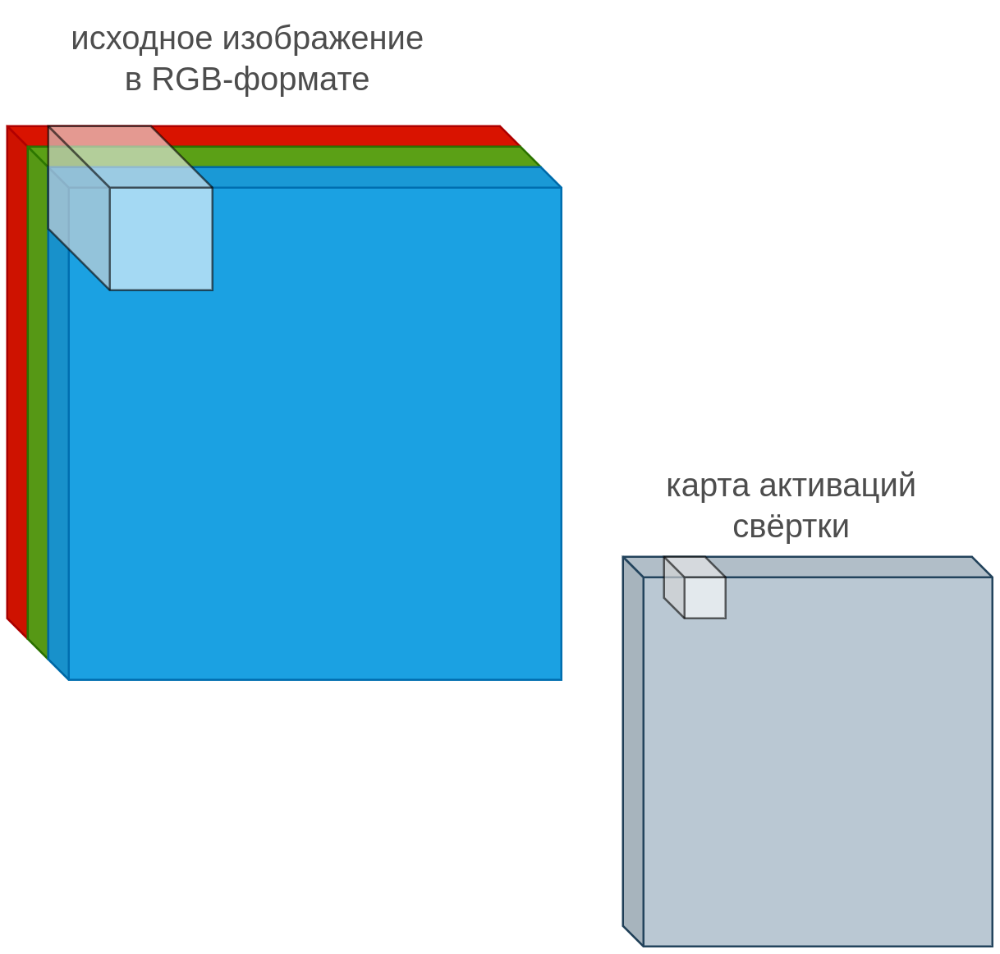
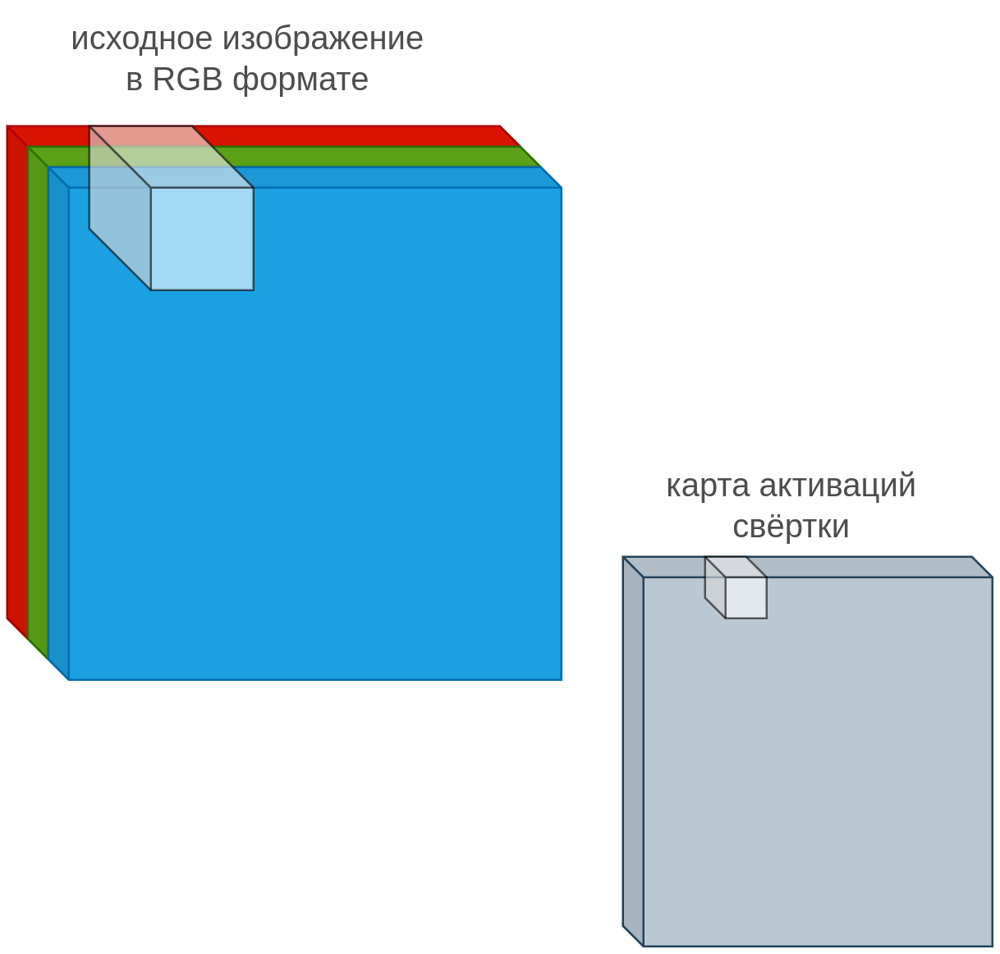
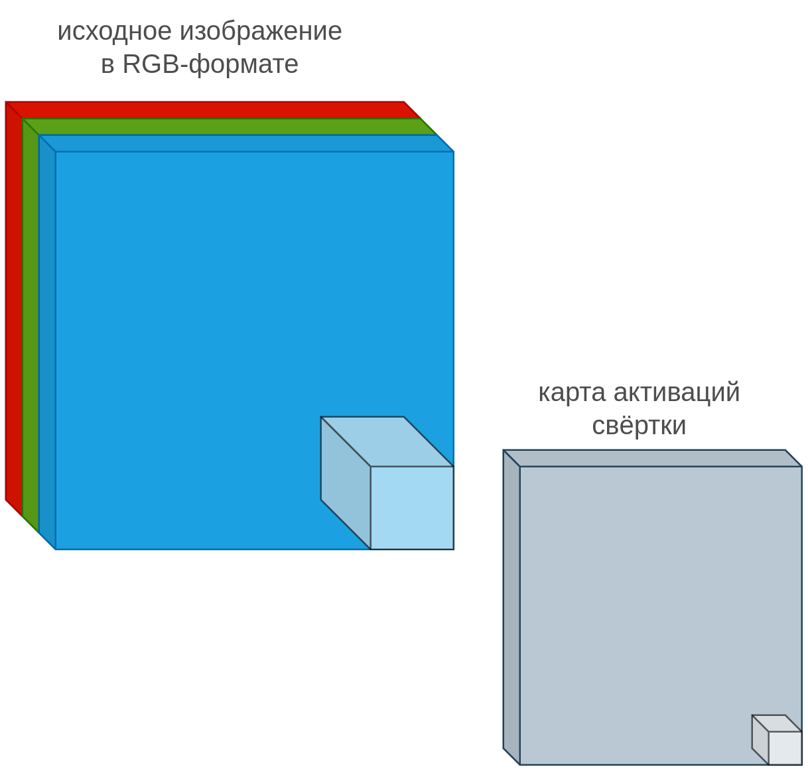
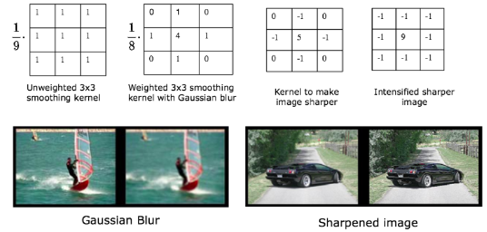
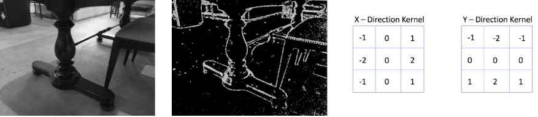
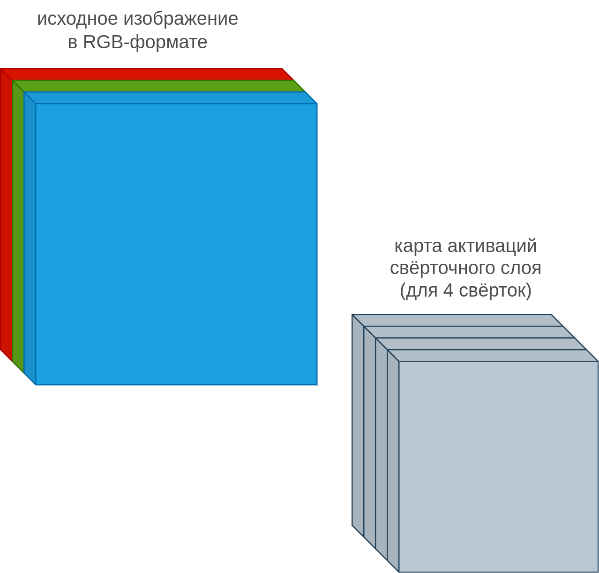
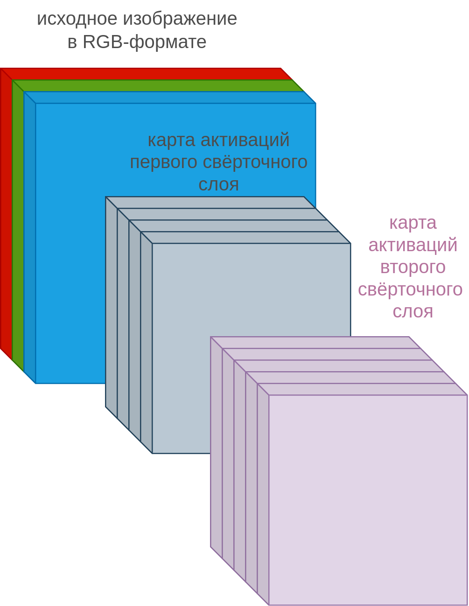
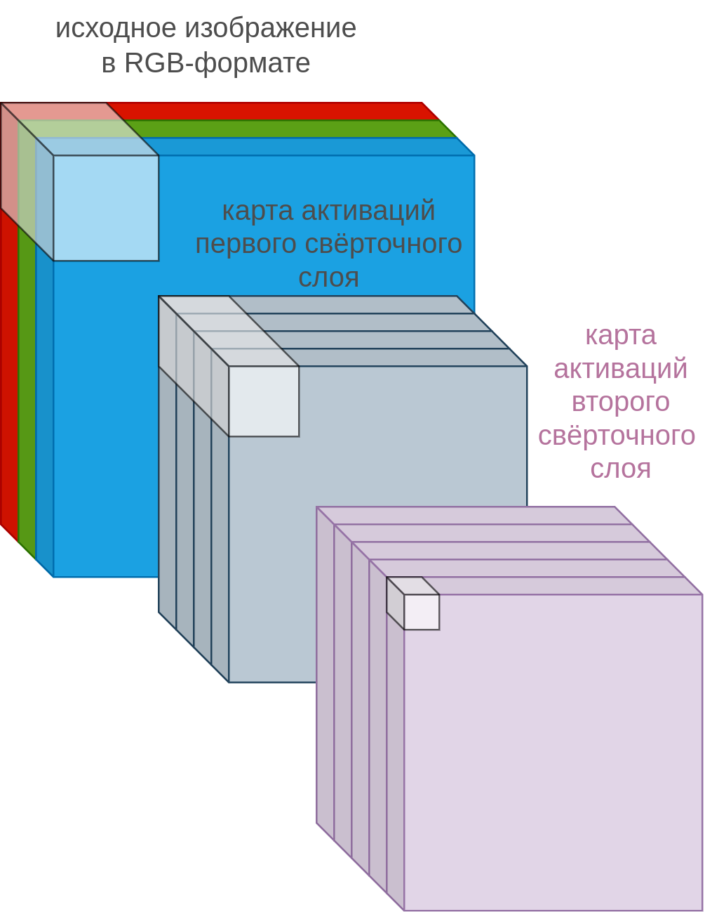

# Свёртка для изображений

## Одна свёртка

Для изображений $\mathbf{x}\in\mathbb{R}^{C\times H\times W}$, состоящих из $C$ каналов ($C=3$ для [RGB, Lab, HCL представлений](Image-representation)), **свёртка** (convolution), как и [в случае обработки последовательностей](../ConvPool-1D/Conv-1D), работает как линейная операция в некоторой ограниченной окрестности обрабатываемого пикселя, представляющей собой квадратную область (хотя можно использовать и прямоугольные).

У свёртки есть параметры:

- ядро свёртки $K\in \mathbb{R}^{C\times (2n+1)\times (2n+1)}$ (convolution kernel);

- смещение свёртки $b\in\mathbb{R}$ (convolution bias).

Результат действия свёртки (активация) в позиции $(u,v)$ вычисляется по формуле:

$$
y(u,v) = \sum_{c=1}^C \sum_{i=-n}^n \sum_{j=-n}^n K(c,i,j) \mathbf{x}(c,u+i,v+j)+b,
$$

при этом свёртка применяется ко всем позициям $(u,v)$, к которым мы можем приложить ядро свёртки, генерируя тем самым **двумерную карту активаций свёртки** или **карту признаков** (feature map), как показано на рисунках:

После прохода по ряду мы сдвигаемся на следующий ряд в начало и проходим по нему. Так проходим по всем рядам, пока не дойдём до финальной позиции:

Сколько всего параметров нужно настроить для свёртки?

Нужно подобрать $C(2n+1)^2$ параметров для ядра свёртки и один - для смещения.

## Примеры свёрток

Свёртка осуществляет локальное линейное преобразование и извлекает <u>локальный линейный признак</u>. Рассмотрим популярные свёртки, применяемые для изображений независимо для каждого цветового канала с нулевым смещением. Свёртки могут использоваться для сглаживания (слева) или, наоборот, для повышения резкости изображения (справа) [[1]](https://web.pdx.edu/~jduh/courses/Archive/geog481w07/Students/Ludwig_ImageConvolution.pdf):

Также свёртки можно применять для извлечения границ, например вертикальных (слева) и горизонтальных (справа) [[2]](https://www.projectrhea.org/rhea/index.php/An_Implementation_of_Sobel_Edge_Detection):

При обработке изображений нейросетями используются свёртки <u>с настраиваемыми параметрами</u> ядра $K$ и смещения $b$ - это позволяет извлекать более подходящие признаки для конечной задачи.

## Свёрточный слой

В нейросетях применяется не одна, а сразу несколько свёрток к изображению, извлекающих различные признаки. Совокупность одновременно применяемых свёрток образует **свёрточный слой** (convolutional layer). 

Например, при применении четырёх свёрток, получим четыре карты активации:

Свёрточные слои можно наслаивать друг на друга, применяя последующие свёртки к картам активаций предыдущих свёрток:

Сколько всего параметров нужно настроить для свёрточного слоя, ведущего отображение из $C_1$ в $C_2$ каналов?

Каждая свёртка требует $C_1(2n+1)^2+1$ параметров. Поскольку применяется $C_2$ свёрток, то нужно задать $C_2(C_1(2n+1)^2+1)$ параметров.

:::warning Добавление нелинейностей

При последовательном применении свёрточных слоёв после каждой свёртки должна применяться [функция нелинейности](../MLP/Activation-functions), например ReLU, иначе суперпозиция свёрток, как линейных операций, снова даст линейную операцию!

:::

 Как изменяется область видимости (т.е. область пикселей исходного изображения, от которых зависит результат) у более поздних свёрток по сравнению с более ранними? 

При последовательном применении свёрток **область видимости** (receptive field, область пикселей исходного изображения, от которых зависит результат) более поздних свёрток больше, чем у более ранних. Например, если последовательно применить две свёртки $3\times 3$, то у первой свёртки будет область видимости $3\times 3$, а у второй - уже $5\times 5$. Это проиллюстрировано на следующем рисунке:

    

## Литература

1. [Jamie Ludwig lectures: Image Convolution.](https://web.pdx.edu/~jduh/courses/Archive/geog481w07/Students/Ludwig_ImageConvolution.pdf) 

2. [projectrhea.org: An Implementation of Sobel Edge Detection.](https://www.projectrhea.org/rhea/index.php/An_Implementation_of_Sobel_Edge_Detection)
