# Параметры и гиперпараметры свёртки

Точно так же, как и при [обработке последовательностей](../ConvPool-1D/Conv-1D-params), у свёртки для изображений есть **параметры** (настраиваемые в процессе градиентной оптимизации):

- элементы ядра (convolution kernel),

- смещение (bias).

Также у свёртки есть **гиперпараметры** (задаваемые извне):

- размер ядра свёртки (convolution size),

- паддинг (padding),

- шаг (stride),

- сдвиг (dilation).

## Паддинг

**Паддинг свёртки** (padding) - предварительное расширение карты входных признаков с целью увеличения размера выходной карты активаций свёртки (feature map). Паддинг применяется к каждому входному каналу независимо. 

Примеры работы основных видов паддинга (valid, zero, same, mirror) приведены ниже:

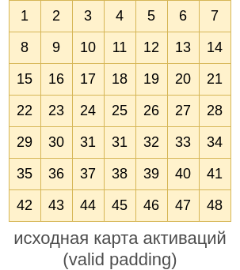

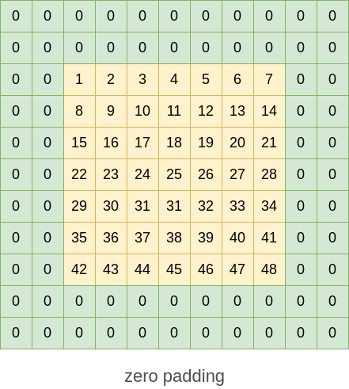

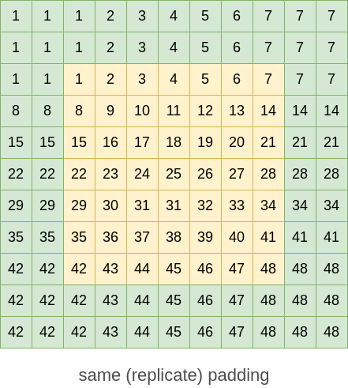

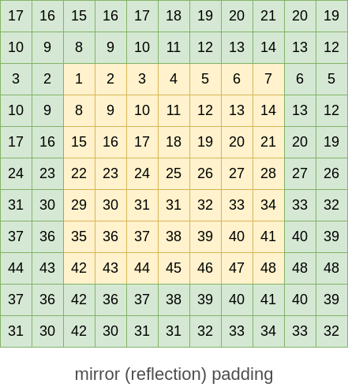

Отражающий (mirror) паддинг отражает значение активации относительно ближайшей граничной точки и хорошо подходит для реалистичной экстраполяции изображений и сложных карт признаков.

## Шаг (stride)

**Шаг свёртки** (stride) задаёт смещение, на которое сдвигается ядро свёртки, для получения следующего элемента выходной карты признаков. 

Ниже показаны позиции, к которым последовательно применяется **свёртка с шагом 1**:

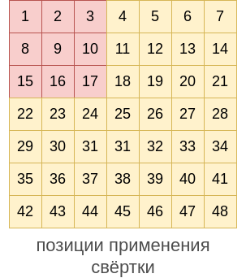

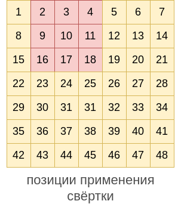

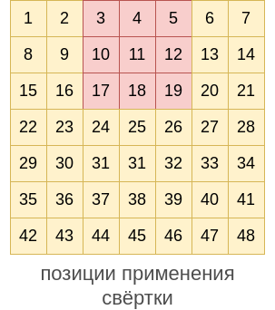

Так продолжается до финальной позиции справа-внизу:

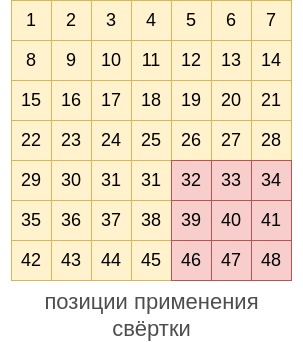

А теперь покажем последовательные позиции применений **свёртки с шагом 2**:

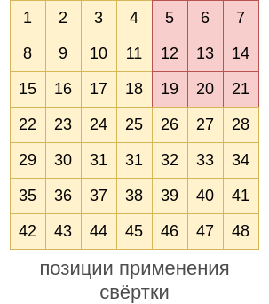

Так тоже продолжается до финальной позиции:

## Сдвиг (dilation)

**Сдвиг свёртки** (dilation) определяет, насколько сдвигается элемент входной карты активаций при переходе к следующему элементу ядра свёртки. Выше были показаны примеры свёртки с dilation=1. Покажем, от каких элементов будут зависеть последовательные применения свёртки с dilation=2:

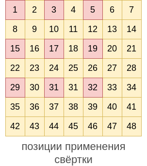

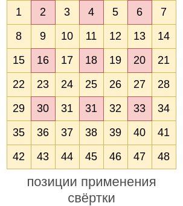

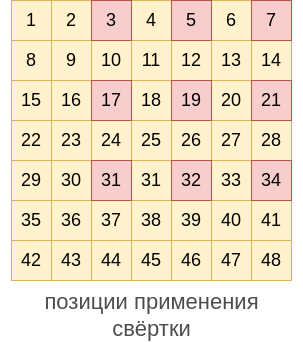

Процесс продолжается последовательно для каждой строки входа, пока не дойдём до последней позиции:

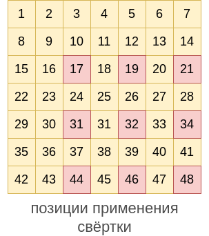

Сдвиг больше единицы повышает **область видимости свёртки** (receptive field), не увеличивая при этом число её параметров, и полезен для извлечения информативных признаков из изображений высокого разрешения, на которых интенсивности пикселей меняются плавно.
