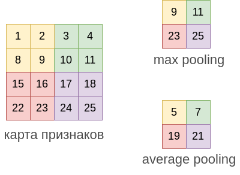
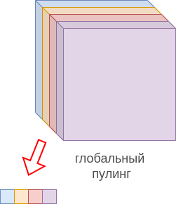
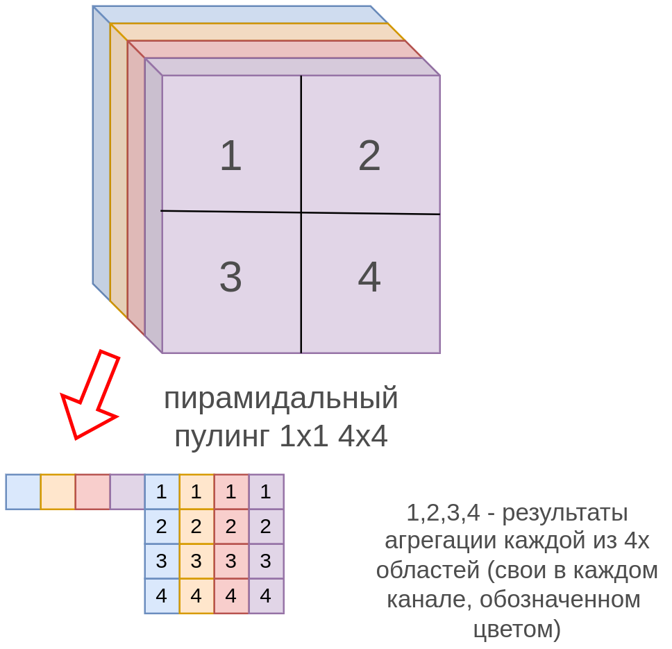

# Пулинг для изображений

## Локальный пулинг

**Операция пулинга** (pooling), как и для [случая последовательностей](../ConvPool-1D/Pooling-1D), призвана уменьшить пространственную размерность выхода за счёт разбиения **карты признаков** (feature map) на фрагменты и применения агрегирующей операции к каждому фрагменту.

Чаще всего используются:

- **максимизирующий пулинг** (max pooling, агрегирующая операция - взятие максимума);

- **усредняющий пулинг** (average pooling, агрегирующая операция - усреднение).

Пример применения этих видов пулинга 2x2 приведён ниже для одного канала:

Пулинг применяется **к каждому каналу независимо**. Например, при его применении к RGB-изображению, он применяется независимо к R-,G- и B-каналу. У стандартных пулингов, приведённых выше, нет настраиваемых параметров, а гиперпараметрами выступает **размер агрегируемой области** (kernel size) и **шаг** (stride), причём шаг обычно выбирается равным стороне квадрата, по которому производится агрегация, то есть каждый раз агрегация производится по непересекающимся фрагментам, как на рисунке выше.

> Как и в [случае последовательностей и временных рядов](../ConvPool-1D/Pooling-1D), пулинг обеспечивает приближённую инвариантность к небольшим сдвигам.

Максимизирующий пулинг извлекает характеристику того, что <u>исходный признак присутствует где-либо в области</u>, по которой производилась агрегация. А усредняющий пулинг извлекает <u>среднюю представленность признака в области</u>.

:::tip Комбинация пулингов

В [[1]](https://proceedings.mlr.press/v51/lee16a.html) предлагается возвращать в качестве результата взвешенное среднее от максимизирующего и усредняющего пулингов:

$$
\mathbf{y}=a\cdot max(\mathbf{x})+(1-a)\cdot avg(\mathbf{x})
$$

где $a$ - настраиваемый параметр либо функция, зависящая от обрабатываемого входа $\sigma(\mathbf{w}^T \mathbf{x})$.

:::

## Глобальный пулинг

Так же, как и для [случая временных рядов](../ConvPool-1D/Pooling-1D#глобальный-пулинг), можно применять **глобальную агрегацию** (global pooling [[2]](https://arxiv.org/abs/1312.4400)) по всем пространственным координатам. Если на входе было $C$ каналов, то на выходе получим $C$-мерный вектор, состоящий из агрегированных значений каналов по всем пространственным координатам, как показано ниже:

Это полезно, чтобы перевести изображение произвольного пространственного размера в <u>вектор фиксированной размерности</u> (эмбеддинг) перед его обработкой многослойным персептроном (например, для классификации изображений). 

:::tip Интерпретируемость

Если число каналов совпадает с числом классов, то результат глобального пулинга можно трактовать как рейтинги предсказываемых классов, [SoftMax-преобразование](../MLP/Outputs-loss-functions#softmax-преобразование) от которых приведёт к вероятностям классов. Этот подход обладает повышенной интерпретируемостью, поскольку, визуализируя канал, соответствующий каждому из классов, можно понять, <u>какие области изображения голосуют за тот или иной класс</u>, обладая максимальными значениями в областях карты признаков, к которой применяется глобальный пулинг.

:::

## Пирамидальный пулинг

Глобальный пулинг, агрегируя по всем пространственным координатам, теряет всю пространственную информацию. Если необходимо представить изображение в виде вектора фиксированного размера, сохранив хотя бы часть пространственной информации, то рекомендуется использовать **пирамидальный пулинг** (spatial pyramid pooling, [[3]](https://arxiv.org/abs/1406.4729)), как мы уже показывали при [обработке последовательностей](../ConvPool-1D/Pooling-1D#пирамидальный-пулинг).

В этом виде пулинга в качестве гиперпараметров задаётся набор сеток фиксированного размера, например, 1x1 и 4x4, затем карта признаков изображения разбивается этими сетками на области, после чего <u>к каждой области</u> применяется глобальный пулинг (усредняющий или максимизирующий), а результаты этих пулингов объединяются (конкатенируются), как показано на рисунке:

> Например, в пирамидальном максимизирующем пулинге для четырёхканального представления изображения его выходом будут максимальные значения для каждого канала целиком, а также максимальные значения в рамках каждой области 1,2,3,4 для каждого канала, то есть вектор из 4+4*4=20 значений.

Пирамидальный пулинг также переводит изображение произвольного размера в вектор фиксированной размерности, но теперь пространственная информация частично сохранена, поскольку теперь известно, в какой области был достигнут каждый из максимумов.

> В пирамидальный пулинг часто добавляют более мелкие сетки, такие как 8x8 и 16x16. 

## Литература

1. [Lee C. Y., Gallagher P. W., Tu Z. Generalizing pooling functions in convolutional neural networks: Mixed, gated, and tree //Artificial intelligence and statistics. – PMLR, 2016. – С. 464-472.](https://proceedings.mlr.press/v51/lee16a.html)
2. [Lin M., Chen Q., Yan S. Network in network //arXiv preprint arXiv:1312.4400. – 2013.](https://arxiv.org/abs/1312.4400)
3. [He K. et al. Spatial pyramid pooling in deep convolutional networks for visual recognition //IEEE transactions on pattern analysis and machine intelligence. – 2015. – Т. 37. – №. 9. – С. 1904-1916.](https://arxiv.org/abs/1406.4729)
