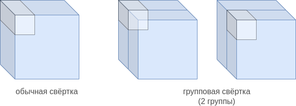

# Специальные виды свёрток

## Поточечная свёртка

**Поточечная свёртка** (pointwise convolution [[1]](https://arxiv.org/abs/1312.4400)) - это обычная [свёртка](Conv-images), но с размером ядра $K\in\mathbb{R}^{C\times 1\times 1}$, где $C$ - число входных каналов. Таким образом, в каждой точке поточечная свёртка генерирует признак, который **зависит лишь от входных признаков в той же самой пространственной позиции**. 

> Таким образом, выходной слой поточечной свёртки представляет собой <u>линейную комбинацию входных слоёв</u>. 

Применяя набор поточечных свёрток, можно управлять <u>числом выходных каналов</u>, то есть размерностью внутреннего представления изображения. Это полезно для того, чтобы понизить размерность каналов, сократив тем самым объём вычислений перед применением обычных свёрток большого размера, поскольку их сложность <u>линейно зависит от числа каналов</u>.

## Групповая свёртка

**Групповая свёртка** (grouped convolution [[2]](https://proceedings.neurips.cc/paper/2012/hash/c399862d3b9d6b76c8436e924a68c45b-Abstract.html)) призвана уменьшить как число вычислений, так и число настраиваемых параметров за счёт того, что набор свёрток применяется не ко всем входным каналам, а только к части (каждый блок свёрток применяется к своему подмножеству входных каналов).

Рассмотрим для примера свёрточный слой с двумя равными группами.

Стандартная свёртка зависит от всех каналов, что даёт сложность $O(C(2n+1)^2)$ для вычисления одной активации свёртки с ядром $K\in\mathbb{R}^{C\times(2n+1)\times(2n+1)}$. В групповой свёртке с двумя группами каналы разбиваются на две половины. Используя нотацию питона для индексирования массивов, можно записать, что к первой половине каналов применяется свёртка с ядром $K[:C/2,:,:]$, а ко второй группе каналов применяется свёртка с ядром $K[C/2:,:,:]$, при этом смещение у двух уполовиненных свёрток разное. Активациии первой и второй свёртки затем конкатенируются вдоль размерности каналов (channel dimension).

Область значений, от которых зависят стандартная свёртка и групповая с двумя группами, показаны ниже слева и справа соответственно:

В общем случае используется $S$ групп: входные каналы разбиваются на непересекающиеся группы  $G_1,...G_S$ примерно одинакового размера, а результаты действия свертки в каждой группе затем конкатенируются вдоль размерности выходных каналов.

Таким образом, расчёт свёрточного слоя групповых свёрток с группами $G_1,G_2,...G_S$ будет

$$
\begin{aligned}
y_{1m}(u,v) &= \sum_{c\in G_{1}}\sum_{i=-n}^{n}\sum_{j=-n}^{n}K_{1m}(c,i,j)\mathbf{x}(c,u+i,v+j)+b_{1m}, & m\in G_1 \\ 
y_{2m}(u,v) &= \sum_{c\in G_{2}}\sum_{i=-n}^{n}\sum_{j=-n}^{n}K_{2m}(c,i,j)\mathbf{x}(c,u+i,v+j)+b_{2m}, & m\in G_2 \\
\cdots & \quad \cdots \\
y_{Sm}(u,v) &= \sum_{c\in G_{S}}\sum_{i=-n}^{n}\sum_{j=-n}^{n}K_{Sm}(c,i,j)\mathbf{x}(c,u+i,v+j)+b_{Sm}, & m\in G_S \\
\end{aligned}
$$

Выходом будет конкатенация всех выходов вдоль размерности каналов:

$$
\mathbf{y}=[\mathbf{y}_{1m},\mathbf{y}_{2m},...\mathbf{y}_{Sm}]
$$

> В примере число входных и выходных каналов совпадает. Но так делать необязательно. Например, если к каждой группе применять в два раза меньшее число свёрток, чем число каналов в группе, то и итоговое выходное число каналов будет в два раза меньше.

Параметрами слоя будут ядра $\{K_{gm}\}_{g,m}$ и смещения $\{b_{gm}\}_{g,m}$ для каждого выходного канала в рамках каждой группы.

> Таким образом, групповая свёртка эквивалентна разбиению входа вдоль каналов на K групп, применению независимых свёрток к каждой группе, а потом объединению полученных результатов вдоль размерности выходных каналов.

:::tip Преимущество и ограничения

Групповая свёртка <u>сокращает число вычислений и параметров примерно в S раз ценой извлечения менее выразительных признаков</u>, поскольку признаки теперь зависят не от всех входных каналов, а лишь от каналов группы.

:::

## Поканальная свёртка

**Поканальная свёртка** (depthwise convolution [[3]](https://openaccess.thecvf.com/content_cvpr_2017/html/Chollet_Xception_Deep_Learning_CVPR_2017_paper.html)) - это частный случай групповой свёртки, когда <u>число групп совпадает с числом входных каналов</u>, то есть на каждый канал выделяется своя группа. Получается, что каждый канал $i$ обрабатывается независимо свёрткой с плоским ядром $K_i\in\mathbb{R}^{(2n+1)\times(2n+1)}$ и смещением $b_i$. Число применяемых свёрток при этом совпадает с числом входных каналов $C$.

> Объём вычислений сокращается максимально - в $C$ раз, где $C$ - число каналов, но каждый выходной признак будет зависеть только от одного своего канала.

Чтобы выходные каналы зависели не только от соответствующих входных каналов, а сразу от всех, после применения поканальной свёртки рекомендуется применить поточечную свёртку. Такая комбинация двух свёрток называется **поканальной сепарабельной свёрткой** (depthwise separable convolution [[3]](https://openaccess.thecvf.com/content_cvpr_2017/html/Chollet_Xception_Deep_Learning_CVPR_2017_paper.html)) и представляет собой частый приём при создании вычислительно эффективных свёрточных архитектур.

Сложность (в терминах операции умножения) однократного применения обычной свёртки из $C$ в $C$ каналов будет $C^2 (2n+1)^2$, а у поканальной сепарабельной будет лишь $C(2n+1)^2+C$.

:::note Задача

Будет ли поканальная сепарабельная свёртка эквивалентна обычной свёртке? Почему?

:::

Визуализацию работы представленных видов свёрток можно посмотреть в [[4]](https://youtu.be/vVaRhZXovbw).

## Динамическая свёртка

Параметры свёртки в свёрточных слоях можно изменять в зависимости от задачи. Для этого применяется **динамическая свёртка** (dynamic filter [[5]](https://proceedings.neurips.cc/paper/2016/hash/8bf1211fd4b7b94528899de0a43b9fb3-Abstract.html)), веса которой предсказываются другой нейросетью (filter generating network).

Схематично процесс генерации параметров свёртки показан на рисунке ниже, когда параметры свёртки постоянны (а), и когда они меняются в зависимости от позиции, к которой применяется свёртка (b) [[7]](https://proceedings.neurips.cc/paper/2016/hash/8bf1211fd4b7b94528899de0a43b9fb3-Abstract.html):

> По сути, это частный случай [гиперсети](../Special-architectures/HyperNet) (hypernetwork), когда предсказываются веса свёрточных слоёв.

Рассмотрим в качестве примера задачу стилизации изображений (neural style transfer [[6]](https://arxiv.org/abs/1705.04058)), в которой требуется перерисовать фотографию в стиле картины известного художника. Эту задачу можно решить, преобразуя входную фотографию набором свёрточных слоёв. Но как обеспечить применимость архитектуры к разным стилевым изображениям?

Можно подставлять в середине архитектуры различные свёртки в зависимости от того, какой именно стиль мы хотим воспроизвести, как сделано в [[7]](https://openaccess.thecvf.com/content_cvpr_2017/html/Chen_StyleBank_An_Explicit_CVPR_2017_paper.html). Тем самым, одна и та же нейросеть будет способна генерировать различные стили, нужно лишь изменить одно преобразование в её середине.

Но этот подход будет требовать обучения своего фильтра для каждого нового стиля. Вместо этого подхода можно воспользоваться отдельной сетью, которая по изображению стиля будет сразу генерировать параметры подходящего свёрточного слоя, как предложено в [[8]](https://openaccess.thecvf.com/content_cvpr_2018/html/Shen_Neural_Style_Transfer_CVPR_2018_paper.html). Тогда не потребуется донастройка свёрточного слоя, если пользователю понадобится осуществить стилизацию новым стилем (zero shot learning)!

## Литература

1. [Lin M., Chen Q., Yan S. Network in network //arXiv preprint arXiv:1312.4400. – 2013.](https://arxiv.org/abs/1312.4400)
2. [Krizhevsky A., Sutskever I., Hinton G. E. Imagenet classification with deep convolutional neural networks //Advances in neural information processing systems. – 2012. – Т. 25.](https://proceedings.neurips.cc/paper/2012/hash/c399862d3b9d6b76c8436e924a68c45b-Abstract.html)
3. [Chollet F. Xception: Deep learning with depthwise separable convolutions //Proceedings of the IEEE conference on computer vision and pattern recognition. – 2017. – С. 1251-1258.](https://openaccess.thecvf.com/content_cvpr_2017/html/Chollet_Xception_Deep_Learning_CVPR_2017_paper.html)
4. [youtube.com: Groups, Depthwise, and Depthwise-Separable Convolution.](https://youtu.be/vVaRhZXovbw)
5. [Jia X. et al. Dynamic filter networks //Advances in neural information processing systems. – 2016. – Т. 29.](https://proceedings.neurips.cc/paper/2016/hash/8bf1211fd4b7b94528899de0a43b9fb3-Abstract.html)
6. [Jing Y. et al. Neural style transfer: A review //IEEE transactions on visualization and computer graphics. – 2019. – Т. 26. – №. 11. – С. 3365-3385.](https://arxiv.org/abs/1705.04058)
7. [Chen D. et al. Stylebank: An explicit representation for neural image style transfer //Proceedings of the IEEE conference on computer vision and pattern recognition. – 2017. – С. 1897-1906.](https://openaccess.thecvf.com/content_cvpr_2017/html/Chen_StyleBank_An_Explicit_CVPR_2017_paper.html)
8. [Shen F., Yan S., Zeng G. Neural style transfer via meta networks //Proceedings of the IEEE Conference on Computer Vision and Pattern Recognition. – 2018. – С. 8061-8069.](https://openaccess.thecvf.com/content_cvpr_2018/html/Shen_Neural_Style_Transfer_CVPR_2018_paper.html)
   
   
