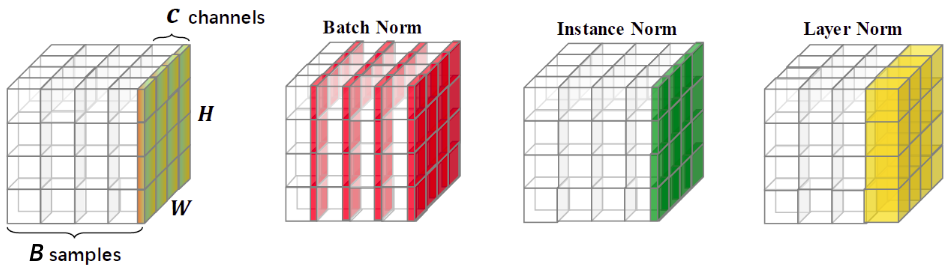

# Нормализация свёрточных слоёв

Для повышения устойчивости и скорости настройки свёрточной нейросети применяется  **нормализация свёрточных слоёв** (convolutional layer normalization).

> Эта нормализация несколько отличается от [батч-нормализации](../Training-simplification/BatchNorm) и [нормализации слоя](../Training-simplification/LayerNorm) в многослойном персептроне, учитывая <u>специфику обработки пространственных данных на изображениях</u>.

Особенностью свёрточного слоя является то, что свёртка извлекает один и тот же признак в разных локациях на изображении. Таким образом, применив свёртку, мы получаем карту пространственной размерности $H\times W$  значений <u>одного и того же признака</u>, где $H$ - высота, а $W$ - ширина карты признаков. Применив  $C$ свёрток, мы получим $H\cdot W$ реализаций каждого из $C$ признаков, извлекаемых каждой свёрткой.

Настройка параметров нейросети производится мини-батчами из $B$ изображений. 

Таким образом, внутреннее представление изображений мини-батча можно представить в виде тензора размера $(B\cdot C)\times H\times W$, как показано на рисунке слева, а основные виды нормализации свёрточных слоёв (batch norm, instance norm, layer norm) - справа [[1]](https://www.researchgate.net/profile/Dhiraj-Neupane/publication/367458109_Bearing_Fault_Detection_Using_Scalogram_and_Switchable_Normalization-Based_CNN/links/63f7e8c50d98a97717afbc51/Bearing-Fault-Detection-Using-Scalogram-and-Switchable-Normalization-Based-CNN.pdf):

Каждый тип нормализации задаётся одной и той же формулой, перевзвешивающей активации каналов $1,2,...C$:

$$
\begin{aligned}
& z_1^b(x,y) \;&\to\quad &\gamma_1\frac{z_1^b(x,y)-\mu_1^b}{\sqrt{(\sigma_1^b)^2+\delta}}+\beta_1, \\
& z_2^b(x,y) \;&\to\quad &\gamma_2\frac{z_2^b(x,y)-\mu_2^b}{\sqrt{(\sigma_2^b)^2+\delta}}+\beta_2, \\
& \cdots &  \cdots  \\
& z_C^b(x,y) \;&\to\quad &\gamma_C\frac{z_C^b(x,y)-\mu_C^b}{\sqrt{(\sigma_C^b)^2+\delta}}+\beta_C, \\
\end{aligned}
$$

где $z_i^b(x,y)$ - активация $i$-й свёртки в позиции $(x,y)$ для изображения $b$ в мини-батче. $\delta=0.001$ - малый параметр, чтобы избежать деления на ноль, а $\gamma_i,\beta_i, i=1,2,...C$ - настраиваемые параметры.

## Виды нормализации свёрточных слоёв

**Батч-нормализация** (batch-normalization [[2]](https://proceedings.mlr.press/v37/ioffe15.html)) усредняет активации *по различным изображениям мини-батча и по различным позициям на каждом изображении*:

$$
\begin{aligned}
\mu_i^b &= \mu_i = \frac{1}{B}\sum_{b=1}^B\frac{1}{HW}\sum_{x=1}^W \sum_{y=1}^H z^b_i(x,y) \\
(\sigma_i^b)^2 &= (\sigma_i)^2 = \frac{1}{B}\sum_{b=1}^B\frac{1}{HW}\sum_{x=1}^W \sum_{y=1}^H (z^b_i(x,y)-\mu_i)^2 \\
\end{aligned}
$$

> Расчет $\{\mu_i^b,\sigma_i^b\}_{i,b}$ меняется в режимах обучения и применения сети точно так же, как и в [обычной батч-нормализации](../Training-simplification/BatchNorm).

**Нормализация экземпляра** (instance normalization [[3]](https://arxiv.org/abs/1607.08022)) усредняет *независимо для каждого изображения только по его реализациям на различных позициях на изображении*:

$$
\begin{aligned}
\mu_i^b &= \frac{1}{HW}\sum_{x=1}^W \sum_{y=1}^H z^b_i(x,y) \\
(\sigma_i^b)^2 &= \frac{1}{HW}\sum_{x=1}^W \sum_{y=1}^H (z^b_i(x,y)-\mu_i)^2 \\
\end{aligned}
$$

> Расчет $\{\mu_i^b,\sigma_i^b\}_{i,b}$ не меняется в режимах обучения и применения сети.

**Нормализация слоя** (layer normalization [[4]](https://arxiv.org/abs/1607.06450)) усредняет независимо для каждого изображения *по всевозможным признакам на всевозможных позициях на изображении*:

$$
\begin{aligned}
\mu_i^b &= \mu^b = \frac{1}{C}\sum_{i=1}^C\frac{1}{HW}\sum_{x=1}^W \sum_{y=1}^H z^b_i(x,y) \\
(\sigma_i^b)^2 &= (\sigma^b)^2 = \frac{1}{C}\sum_{i=1}^C\frac{1}{HW}\sum_{x=1}^W \sum_{y=1}^H (z^b_i(x,y)-\mu_i)^2 \\
\end{aligned}
$$

> Расчет $\{\mu_i^b,\sigma_i^b\}_{i,b}$ не меняется в режимах обучения и применения сети.

## Литература

1. [Neupane D., Kim Y., Seok J. Bearing fault detection using scalogram and switchable normalization-based CNN (SN-CNN) //IEEE Access. – 2021. – Т. 9. – С. 88151-88166.](https://www.researchgate.net/profile/Dhiraj-Neupane/publication/367458109_Bearing_Fault_Detection_Using_Scalogram_and_Switchable_Normalization-Based_CNN/links/63f7e8c50d98a97717afbc51/Bearing-Fault-Detection-Using-Scalogram-and-Switchable-Normalization-Based-CNN.pdf)
2. [Ioffe S., Szegedy C. Batch normalization: Accelerating deep network training by reducing internal covariate shift //International conference on machine learning. – pmlr, 2015. – С. 448-456.](https://proceedings.mlr.press/v37/ioffe15.html)
3. [Ulyanov D., Vedaldi A., Lempitsky V. Instance normalization: The missing ingredient for fast stylization //arXiv preprint arXiv:1607.08022. – 2016.](https://arxiv.org/abs/1607.08022)
4. [Ba J. L., Kiros J. R., Hinton G. E. Layer normalization //arXiv preprint arXiv:1607.06450. – 2016.](https://arxiv.org/abs/1607.06450)
