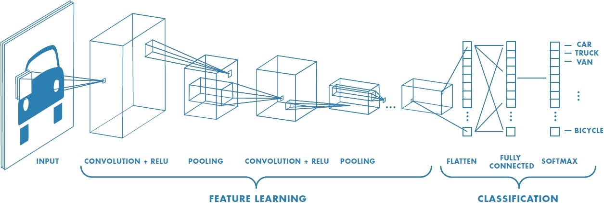

# Свёрточная сеть для изображений

**Свёрточная нейросеть** (convolutional neural network) - нейросетевая архитектура, использующая свёртки для генерации промежуточных признаков. 

Как мы видели, эта архитектура может применяться [для обработки последовательностей](../ConvPool-1D/Convolutional-nets-for-sequences), таких как текст на естественном языке. В этом разделе рассмотрим свёрточную нейросеть <u>для классификации изображений</u>. Типичная архитектура показана на рисунке [[1]](https://www.mdpi.com/1999-4893/15/2/71):

Вначале действуют [свёртки](Conv-images) (с [нелинейностями](../MLP/Activation-functions)) и [пулинги](Pooling), которые постепенно <u>снижают пространственное разрешение</u> промежуточного представления. Чтобы при этом частично компенсировать потерю информации, <u>число каналов на более глубоких слоях увеличивается</u>. Когда представление начинает содержать достаточно малое число элементов, его векторизуют (растягивают тензорное представление в вектор) и подают на вход [многослойному персептрону](../MLP/Multilayer-perceptron).

> Большая часть вычислений сосредоточена в свёрточных слоях. При этом большая часть настраиваемых параметров сосредоточена в многослойном персептроне, поэтому для снижения переобучения в нём часто используют отдельную [регуляризацию](../Regularization), такую как [дропаут](../Regularization/DropOut).

:::tip Обработка звуков

Свёрточная архитектура применяется и для обработки звуков, например, человеческой речи. В этом случае в качестве "изображения" обрабатывается спектрограмма (spectrogram [[2]](https://huggingface.co/learn/audio-course/chapter1/audio_data)) или мел-спектрограмма (mel spectrogram [[2]](https://huggingface.co/learn/audio-course/chapter1/audio_data)), в которой по оси X располагается время, а по оси Y - сила представленности частот. Таким образом, звук, как и изображение, имеет две размерности, и его тоже можно обрабатывать свёрточными сетями! 

> Размер ядра свёртки в этом случае представляет прямоугольник, который выбирается таким образом, чтобы свёртка видела <u>ограниченный промежуток во времени</u>, но анализировала при этом <u>все частоты</u> (или их существенную часть).

:::

## Литература

1. [Abdel-Jaber H. et al. A review of deep learning algorithms and their applications in healthcare //Algorithms. – 2022. – Т. 15. – №. 2. – С. 71.](https://www.mdpi.com/1999-4893/15/2/71)
2. [huggingface.co: Introduction to audio data.](https://huggingface.co/learn/audio-course/chapter1/audio_data)
