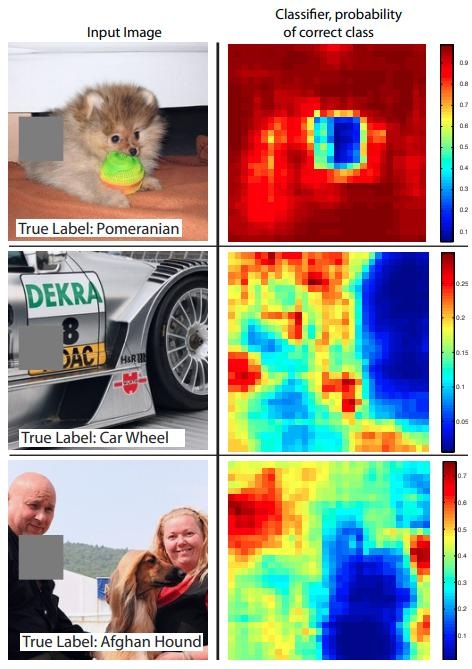
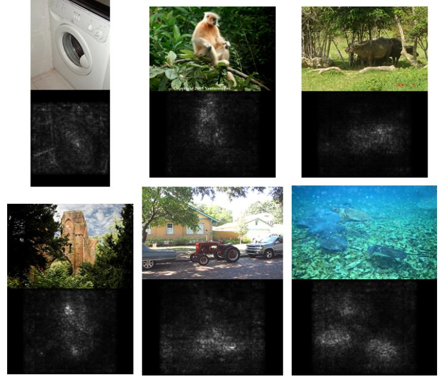
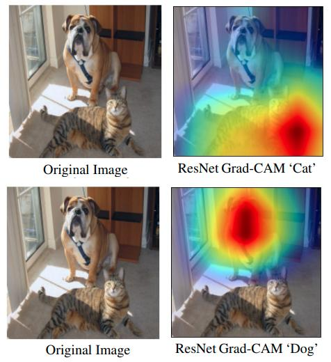
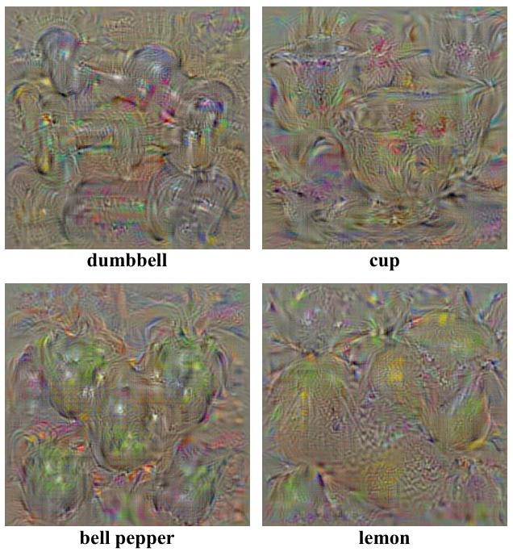
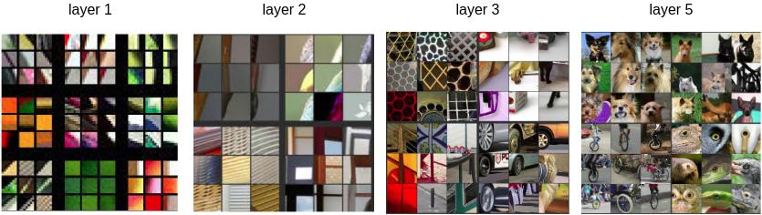

# Интерпретация прогнозов

### Выделение регионов, отвечающих за класс

Актуальной задачей для интерпретации работы [свёрточной сети, классифицирующей изображения](Conv-net), является выделение регионов на изображении, голосующих за тот или иной класс. 

> Такой анализ полезно проводить в процессе отладки модели, чтобы убедиться, что она корректно работает: объекту каждого класса должен соответствовать действительно тот регион изображения, на которых он представлен. Также этот анализ позволяет объяснить неожиданные контринтуитивные прогнозы модели, показывая части изображения, свидетельствующие в пользу выбранного прогноза.

Для работы метода нужно выбрать изображение $\mathbf{x}$ ([трёхмерный тензор интенсивностей каждого цвета](Image-representation)) и интересуемый класс $c$, после чего работать с его вероятностью $p_c(\mathbf{x})$ или ненормированным рейтингом класса $g_c(\mathbf{x})$ до [SoftMax -преобразования](../MLP/Outputs-loss-functions#многоклассовая-классификация).

### Анализ закрасок

В **анализе закрасок** (occlusion analysis) [[1]](https://link.springer.com/chapter/10.1007/978-3-319-10590-1_53) на классифицируемом изображении последовательно закрашиваются небольшие квадратные участки, после чего визуализируется карта предсказанной вероятности интересуемого класса для модифицированного изображения. Каждой позиции $(i,j)$ на этой карте соответствует вероятность $p_c(\mathbf{x}_{-ij})$, где $\mathbf{x}_{-ij}$ - изображение, на котором затёрта квадратная часть серым цветом с центром в позиции $(i,j)$. Примеры таких карт для верного класса (указанного внизу соответствующих изображений) показаны ниже [[1]](https://link.springer.com/chapter/10.1007/978-3-319-10590-1_53):

### Градиент по изображению

В работе [[2]](https://arxiv.org/abs/1312.6034) предлагается другой способ локализации регионов, отвечающих за тот или иной класс. Для этого строится **пространственная карта градиентов** (gradient map) по рейтингу интересующего класса $g_c(\mathbf{x})$ на входном изображении:

$$
W=\frac{\partial g_c(\mathbf{x})}{\partial \mathbf{x}}
$$

Данная карта вычисляется однократным **проходом назад** (backward pass) в методе [обратного распространения ошибки](../Training/Backpropagation#backward-mode-обратное-распространение-ошибки). Градиент вычисляется <u>не по весам модели, а по пикселям изображения</u>, поэтому карта градиентов будет иметь тот же размер, как и исходное изображение. 

Далее карта градиентов преобразуется в **карту выраженности** (saliency map) $S\in\mathbb{R}^{H\times W}$, где $H$ и $W$ - высота и ширина рассматриваемого изображения.

В случае чёрно-белого изображения размера $H\times W$ выраженность считается как модуль градиента

$$
S_{ij}=|W_{ij}|,
$$

а в случае цветного - как максимальный градиент вдоль цветовых каналов R,G,B:

$$
S_{ij}=\max_{k\in\{R,G,B\}} |W_{kij}|
$$

Ниже приведены примеры карт выраженности для нескольких изображений относительно предсказанного класса [[2]](https://arxiv.org/abs/1312.6034):

Как видим, предсказанный класс локализован верно, хоть и с сильным шумом. В последующих работах были предложены различные улучшения (Guided Backpropagation [[4]](https://arxiv.org/abs/1412.6806) и Deconvolution [[1]](https://link.springer.com/chapter/10.1007/978-3-319-10590-1_53)), позволяющие получить выделение класса более чётко.

### Градиент по слою

Одним из способов избежать шумных оценок по отдельным пикселям является выявление связи не между рейтингом класса и исходными пикселями, а между рейтингом класса и <u>картой активаций последнего свёрточного слоя</u>, что было реализовано в методе Grad-CAM [[3]](https://openaccess.thecvf.com/content_iccv_2017/html/Selvaraju_Grad-CAM_Visual_Explanations_ICCV_2017_paper.html).

Пусть $g_c(\mathbf{x})$ - рейтинг интересующего класса (перед SoftMax), а $A^k_{ij}$ - значение [карты активаций](Conv-images#одна-свёртка) (feature map) $k$-го канала последнего свёрточного слоя сети в позиции $(i,j)$. Сама карта представляет собой матрицу $A^k\in\mathbb{R}^{h\times w}$.

Вначале вычисляются важности каждой карты глобальным усредняющим пулингом:

$$
\alpha^c_k=\frac{1}{hw}\sum_{i=1}^h \sum_{j=1}^w \frac{\partial g_c(\mathbf{x})}{\partial  A^k_{ij}}
$$

Тогда карта выраженности для класса $c$ считается по правилу:

$$
S=\text{ReLU}\left( \sum_k \alpha^c_k A^k \right)
$$

Нелинейность [ReLU](../MLP/Activation-functions#rectified-linear-unit-relu) применяется, чтобы выделить только те области, которые  положительно влияют на класс (что, в частности, реализуется, и когда активации сильно отрицательные, но и градиент по ним отрицательный). 

> Полученная карта важности будет иметь размер последнего свёрточного слоя $h\times w$, поэтому её нужно увеличить <u>до размера исходного изображения</u> перед тем, как на него наложить.

## Характерные изображения класса

Рассмотрим свёрточную нейросеть для классификации изображений. Такая нейросеть выдаёт $C$ рейтингов классов $g_1(\mathbf{x}),...g_C(\mathbf{x})$, которые впоследствии проходят через [SoftMax-преобразование](../MLP/Outputs-loss-functions#многоклассовая-классификация), чтобы вычислить вероятности классов. 

В работе [[1]](https://arxiv.org/abs/1312.6034) предложен способ визуализации того, как нейросеть представляет тот или иной класс. Допустим, нас интересует класс $c$. Для определения того, как нейросеть его видит, решается следующая оптимизационная задача:

$$
\hat{\mathbf{x}}_c = \arg\max_\mathbf{x} \{ g_c(\mathbf{x})-\lambda \|\mathbf{x}\|^2_2\},
$$

то есть находится такое характерное изображение $\hat{\mathbf{x}}_c$, которое бы <u>максимизировало рейтинг соответствующего класса</u>. Чтобы избежать бесконтрольного изменения интенсивностей пикселей, изображение дополнительно регуляризуется по L2-норме (второе слагаемое в критерии оптимизации).

> Максимизируется именно **рейтинг класса, а не его вероятность**, поскольку максимизация вероятности могла бы вырождаться в то, чтобы уменьшать вероятности других классов, а не концентрироваться вероятности целевого класса. Именно такой способ обеспечивал более выразительные результаты визуализации. 

Примеры изображений, визуализирующих различные классы датасета ILSVRC-2013 на модели AlexNet, приведены ниже [[2]](https://arxiv.org/abs/1312.6034):

## Другие подходы к визуализации

Для интерпретации отдельных свёрточных фильтров можно перебирать на изображениях различные фрагменты, от которых зависит соответствующая свёртка (receptive field) и <u>визуализировать те фрагменты, которые приводят к максимальной активации выбранной свёртки</u>. Примеры такой визуализации отдельных свёрток на всё более глубоких слоях свёрточной сети приведены ниже [[1]](https://link.springer.com/chapter/10.1007/978-3-319-10590-1_53):

Как видим, более глубокие слои захватывают всё более обширную область изображения и выделяют семантически более сложные признаки, что согласуется с ранее описанными [свойствами суперпозиции свёрток](../ConvPool-1D/Conv-1D#извлечение-сложных-нелинейных-признаков).

:::tip Непосредственная визуализация свёрток первого слоя

Обратим внимание, что <u>на первом слое можно визуализировать свёрточные фильтры  непосредственно</u>, поскольку их ядра имеют размер $3\times (2n+1)\times (2n+1)$, поэтому сами ядра могут интерпретироваться как изображения. Свёртки максимально активируются, когда обрабатываемые фрагменты будут наиболее похожи на их ядра. Последующие свёртки не допускают подобной непосредственной визуализации, поскольку будут обрабатывать уже больше трёх слоёв.

:::

Также можно визуализировать изображения, приводящие к получаемым активациям заданных свёрток внутри свёрточной сети. 

Для этого фиксируется слой, на котором располагается интересующий свёрточный фильтр. Далее обучается [декодировщик](../Special-architectures/Autoencoders) (deconv net [[1]](https://link.springer.com/chapter/10.1007/978-3-319-10590-1_53)), восстанавливающий исходные изображения по внутреннему представлению изображений на выбранном слое.

Для интерпретации интересующей свёртки все активации выбранного слоя зануляются, кроме активаций канала анализируемой свёртки, и полученное внутреннее представление пропускается через обученный декодировщик для получения итоговой визуализации.

## Литература

1. [Zeiler M. D., Fergus R. Visualizing and understanding convolutional networks //Computer Vision–ECCV 2014: 13th European Conference, Zurich, Switzerland, September 6-12, 2014, Proceedings, Part I 13. – Springer International Publishing, 2014. – С. 818-833.](https://link.springer.com/chapter/10.1007/978-3-319-10590-1_53)

2. [Simonyan K. Deep inside convolutional networks: Visualising image classification models and saliency maps //arXiv preprint arXiv:1312.6034. – 2013.](https://arxiv.org/abs/1312.6034)

3. [Selvaraju R. R. et al. Grad-cam: Visual explanations from deep networks via gradient-based localization //Proceedings of the IEEE international conference on computer vision. – 2017. – С. 618-626.](https://openaccess.thecvf.com/content_iccv_2017/html/Selvaraju_Grad-CAM_Visual_Explanations_ICCV_2017_paper.html)

4. [Springenberg J. T. et al. Striving for simplicity: The all convolutional net //arXiv preprint arXiv:1412.6806. – 2014.](https://arxiv.org/abs/1412.6806)
