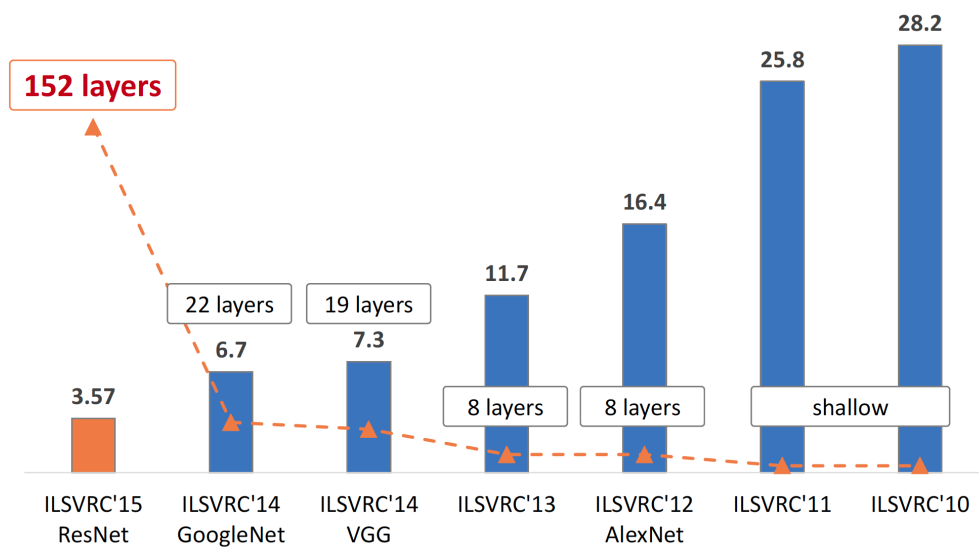

# Соревнование на ImageNet

## Выборка ImageNet

Датасет ImageNet [[1]](https://www.image-net.org/) - одна из самых больших размеченных баз данных для классификации и локализации изображений. Она содержит свыше 14 миллионов изображений, для каждого из которых поставлен в соответствие класс изображённого на нём объекта вместе с координатами выделяющего его прямоугольника.

Сами классы разбиты по категориям и подкатегориям аналогично семантической сети WordNet [[2]](https://ru.wikipedia.org/wiki/WordNet).

С 2010 по 2017 проводилось соревнование ILSVRC (ImageNet Large Scale Visual Recognition Challenge [[3]](https://www.image-net.org/challenges/LSVRC/), [[4]](https://arxiv.org/abs/1409.0575)), в котором различные исследовательские команды соревновались по построению наиболее точных классификаторов изображений, взятых из базы ImageNet. В ILSVRC рассматривается задача классификации на 1000 отобранных классов.

> Поскольку классов много, то методы оценивались по топ-5 точности. То есть предсказание считается успешным, если правильный класс встречается среди пяти наиболее вероятных классов по мнению модели.

Toп-5 точность для прогнозирующих алгоритмов, которые побеждали в соревновании ILSVRC в разные годы, приведена ниже [[5]](https://ieeexplore.ieee.org/abstract/document/8219390):

> При этом видно, что число используемых слоёв в сетях-победителях соревнования также росло.

Результаты соревнования ILSVRC породили массовый интерес к глубоким нейросетям, которые, начиная с 2012 года, стали показывать лучшие результаты по точности, а c 2015 - даже более высокую точность, чем человек, оцениваемую в 5.1% [[4]](https://arxiv.org/abs/1409.0575). 

Бурный рост развития глубоких нейросетей был обеспечен в первую очередь появлением мощных вычислителей (видеокарт), на которых эти сети можно было настраивать и применять. Также этому способствовало появление многих архитектурных инноваций и инженерных приёмов по регуляризации, позволивших настраивать эти нейросети так, чтобы они не переобучались.

---

Далее мы изучим архитектуры, показавшие лучшие результаты в соревнованиях: [AlexNet и ZFNet](AlexNet-ZFnet), [VGG](VGG), [GoogleNet](GoogLeNet), [ResNet](ResNet), а также их дальнейшие усовершенствования. В конце главы изучим, какие идеи используются, чтобы  [эффективно классифицировать изображения на простых вычислителях](Mobile-neural-networks), таких как процессор мобильного телефона.

## Литература

1. [ImageNet dataset.](https://www.image-net.org/)
2. [Wikipedia: WordNet.](https://ru.wikipedia.org/wiki/WordNet)
3. [ImageNet Large Scale Visual Recognition Challenge.](https://www.image-net.org/challenges/LSVRC/)
4. [Russakovsky O. et al. Imagenet large scale visual recognition challenge //International journal of computer vision. – 2015. – Т. 115. – С. 211-252.](https://arxiv.org/abs/1409.0575)
5. [Nguyen K. et al. Iris recognition with off-the-shelf CNN features: A deep learning perspective //Ieee Access. – 2017. – Т. 6. – С. 18848-18855.](https://ieeexplore.ieee.org/abstract/document/8219390)
   
   
