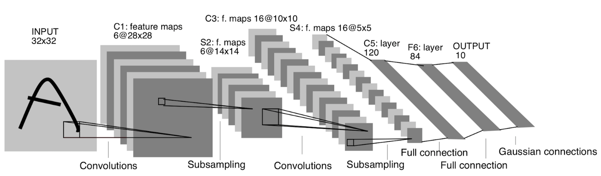

# Архитектура LeNet

LeNet [[1]](https://en.wikipedia.org/wiki/LeNet) - семейство первых широко известных нейросетевых архитектур LeNet-1 - LeNet-5, появившихся еще в 1989 (LeNet-1). Самой известной версией, которую называют просто LeNet, является LeNet-5 [[2]](https://www.researchgate.net/publication/2985446_Gradient-Based_Learning_Applied_to_Document_Recognition), структура которой приведена ниже [[2]](https://www.researchgate.net/publication/2985446_Gradient-Based_Learning_Applied_to_Document_Recognition):

LeNet нашла широкое применение в распознавании рукописных цифр и букв небольшого разрешения (32x32). Она представляет собой [классическую свёрточную архитектуру](../ConvPool-Images/Conv-net), в начале которой идут [свёртки](../ConvPool-Images/Conv-images) (convolutions) и [усредняющие пулинги](../ConvPool-Images/Pooling) (subsampling), постепенно снижающие размерность внутреннего представления, которое на пятом слое векторизуется, после чего к нему применяются [два полносвязных слоя](../MLP/Multilayer-perceptron).

> Эта архитектура содержит порядка 10.000 настраиваемых параметров.

Таким образом, уже в 1990-е годы несложные свёрточные сети были известны и применялись в промышленных приложениях. Но дальнейшее развитие глубоких нейросетей ограничивалось слабыми вычислительными возможностями и недостаточно развитыми инженерными приёмами для настройки сетей с большим числом параметров и слоёв.

В последующих главах мы рассмотрим, как можно улучшить эту архитектуру.

## Литература

1. [Wikipedia: LeNet.](https://en.wikipedia.org/wiki/LeNet) 

2. [LeCun Y. et al. Gradient-based learning applied to document recognition //Proceedings of the IEEE. – 1998. – Т. 86. – №. 11. – С. 2278-2324.](https://www.researchgate.net/publication/2985446_Gradient-Based_Learning_Applied_to_Document_Recognition)
