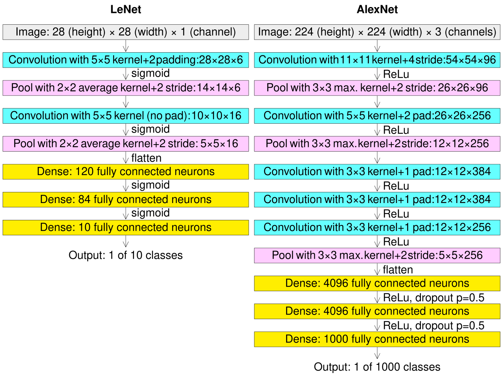
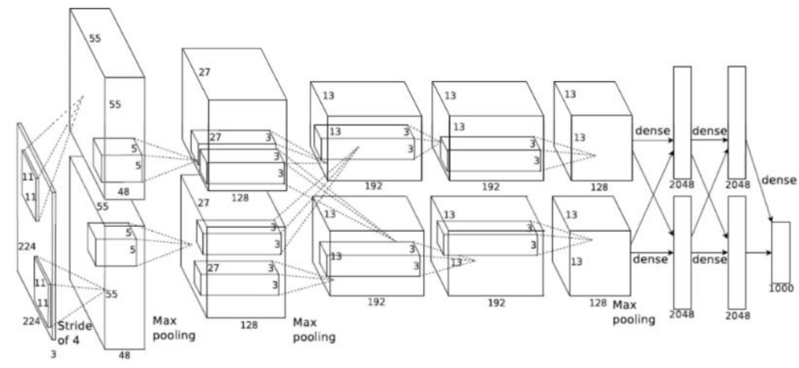
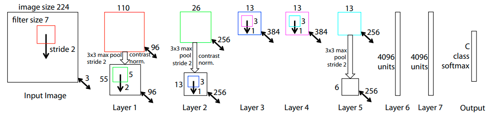

# Модели AlexNet и ZFNet

## AlexNet

Сеть **AlexNet** [[1]](https://proceedings.neurips.cc/paper_files/paper/2012/file/c399862d3b9d6b76c8436e924a68c45b-Paper.pdf) представляет собой первую широко известную глубокую (12 слоёв) [свёрточную нейросеть](../ConvPool-Images/Conv-net), ставшую победителем соревнований ILSVRC в 2012 году с большим отрывом. 

> Этот момент считается рождением глубокого обучения, поскольку победа AlexNet привлекла массовое внимание к глубоким нейросетям, и только глубокие нейросети стали побеждать в последующих соревнованиях ILSVRC.

### Архитектура

Архитектурно сеть представляет собой усложнённую версию [LeNet](LeNet) [[2]](https://en.wikipedia.org/wiki/AlexNet): 

В AlexNet больше [свёрточных слоёв](../ConvPool-Images/Conv-images#свёрточный-слой), [слоёв пулинга](../ConvPool-Images/Pooling), а [полносвязные слои](../MLP/Multilayer-perceptron) содержат больше нейронов. 

Настройка такой большой сети стала возможной <u>за счёт использования видеокарт</u> (graphics processing unit, GPU), позволивших производить векторные операции за один такт времени, используя параллельные вычисления на многих встроенных ядрах. Память видеокарт того времени (GTX 580 с 3 GB памя­ти) не позволила разместить нейросеть целиком, поэтому авторам пришлось использовать [групповые свёртки](../ConvPool-Images/Special-conv#групповая-свёртка), разбив число каналов пополам, причём каждая половина обрабатывалась на своей видеокарте. Схема архитектуры показана ниже [[3]](https://libeldoc.bsuir.by/bitstream/123456789/39033/1/Prokopenya_Svertochnyye.pdf):

### Инженерные улучшения

Помимо увеличения числа слоёв, в AlexNet (по сравнению с [LeNet](LeNet)) использовались следующие архитектурные улучшения:

- свёртки имели разный размер: 11x11, 5x5, 3x3; 

- нелинейности [tangh](../MLP/Activation-functions#гиперболический-тангенс-tangh) (в LeNet) были заменены на нелинейности [ReLU](../MLP/Activation-functions#rectified-linear-unit-relu);

- усредняющий пулинг был заменён на максимизирующий;

- на полносвязные слои действовала регуляризация [DropOut](../Regularization/DropOut) и [L2](../Regularization/Weights-regularization);

- во время обучения использовалась [аугментация данных](../Regularization/Augmentation);

- в конце действует [SoftMax-преобразование](../MLP/Outputs-loss-functions#многоклассовая-классификация) рейтингов классов.

## Модель ZFNet

В 2013 году на соревновании ILSVRC победила сеть **ZFNet** [[4]](https://arxiv.org/pdf/1311.2901v3), не сильно отличающаяся от AlexNet. В ней начальные фильтры были 7x7 (с [шагом](../ConvPool-Images/Conv-params#шаг-stride) 2), тогда как в AlexNet - 11x11 (с шагом 4). На втором свёрточном слое использовались фильтры 5x5 также с шагом 2. В промежуточных представлениях использовалось больше каналов и нейронов. Архитектура сети представлена ниже [[4]](https://arxiv.org/pdf/1311.2901v3):

## Литература

1. [Krizhevsky A., Sutskever I., Hinton G. E. Imagenet classification with deep convolutional neural networks //Advances in neural information processing systems. – 2012. – Т. 25.](https://proceedings.neurips.cc/paper_files/paper/2012/file/c399862d3b9d6b76c8436e924a68c45b-Paper.pdf)
2. https://en.wikipedia.org/wiki/AlexNet
3. [Прокопеня А. С., Азаров И. С. Сверточные нейронные сети для распознавания изображений. – 2020.](https://libeldoc.bsuir.by/bitstream/123456789/39033/1/Prokopenya_Svertochnyye.pdf)
4. [Zeiler M. D., Fergus R. Visualizing and understanding convolutional networks //Computer Vision–ECCV 2014: 13th European Conference, Zurich, Switzerland, September 6-12, 2014, Proceedings, Part I 13. – Springer International Publishing, 2014. – С. 818-833.](https://arxiv.org/pdf/1311.2901v3)
