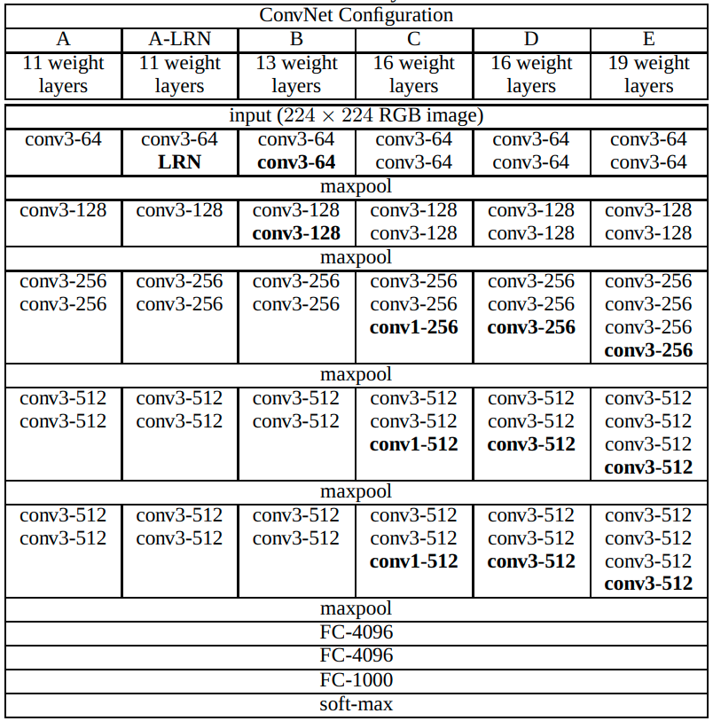
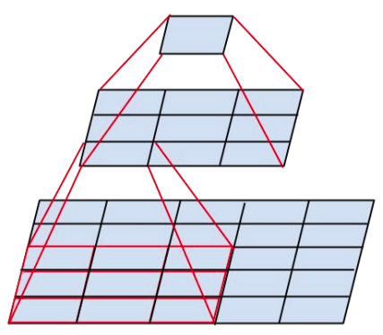

# Модель VGG

Модель **VGG** [[1]](https://arxiv.org/abs/1409.1556) была одной из лучших (но не победителем) в соревновании ISLVRC в 2014. Тем не менее, в ней были предложены инновационные принципы построения нейросетей, ставшие стандартными в последующих моделях. 

Тестировались разные варианты архитектур с разным числом слоёв, среди которых наилучшими по точности оказались **VGG-16** и **VGG-19**. Варианты архитектур сети VGG приведены ниже [[1]](https://arxiv.org/abs/1409.1556):

Как видим, VGG структурно повторяет AlexNet и ZFNet. Вначале идут [свёрточные слои](../ConvPool-Images/Conv-images) и слои максимизирующего [пулинга](../ConvPool-Images/Pooling). Когда размерность внутреннего представления уже достаточно снижена, это представление векторизуется и обрабатывается [полносвязными слоями](../MLP/Multilayer-perceptron). По сравнению с [AlexNet и ZFNet](AlexNet-ZFnet), VGG содержит большее число свёрточных слоёв.

Ключевой инновацией VGG явилась идея, что <u>пространственное разрешение нужно снижать постепенно</u>, поэтому везде использовался пулинг 2x2, а размер всех свёрток был 3x3. Это компенсировалось увеличением числа свёрточных слоёв.

По сути, в VGG <u>заменили свёртки с большими ядрами на имитирующую их суперпозицию из нескольких свёрток с малыми ядрами</u>.

Ниже приведён пример эмуляции свёртки 5x5 суперпозицией из двух свёрток 3x3:

Если не учитывать смещения, то одна одноканальная свёртка 5x5 имеет 25 параметров, а 2 свёртки 3x3 - лишь 18. Поэтому суперпозиция двух свёрток может моделировать не все линейные зависимости, моделируемые свёрткой 5x5. Зато она  способна лучше моделировать нелинейные зависимости, поскольку после каждой свёртки 3x3 в VGG применяется [функция нелинейности](../MLP/Activation-functions).

Каскад из трёх свёрток 3x3 эмулируют одну свёртку 7x7, а четыре - 9x9, при этом экономия на числе параметров (и количестве сопряжённых вычислений) получается ещё больше.

> В VGG используется идея, что число параметров и вычислений квадратично зависит от размера ядра свёрток, но лишь линейно от числа слоёв. Поэтому выгоднее <u>уменьшать размер свёрток, увеличивая глубину сети</u>.

В силу простоты архитектуры VGG, её предобученные слои до сих пор используются для извлечения признаков в других задачах обработки изображений, таких как стилизация изображений (neural style transfer [[2]](https://neerc.ifmo.ru/wiki/index.php?title=Neural_Style_Transfer)).

Поскольку VGG содержит много слоёв, то для её эффективного обучения вначале обучалась уменьшенная сеть, состоящая лишь из 11 слоёв, а затем предобученные слои использовались как <u>инициализация</u> более глубокой версии архитектуры.

> В модели VGG, как и в других стандартных свёрточных сетях, большая часть вычислений сосредоточена <u>в свёрточных слоях</u>, а большая часть параметров - <u>в полносвязных</u>.

## Литература

1. [Simonyan K., Zisserman A. Very deep convolutional networks for large-scale image recognition //arXiv preprint arXiv:1409.1556. – 2014.](https://arxiv.org/abs/1409.1556)
2. [Викиконспекты ИТМО: Neural Style Transfer.](https://neerc.ifmo.ru/wiki/index.php?title=Neural_Style_Transfer)
