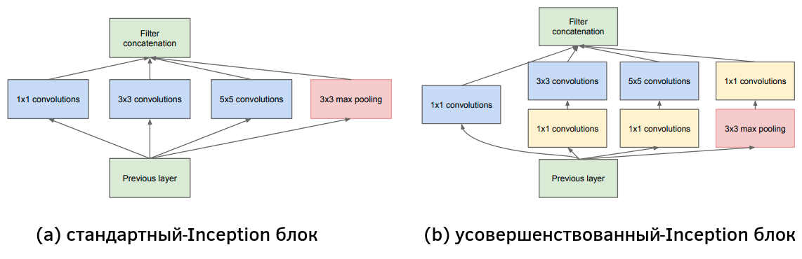
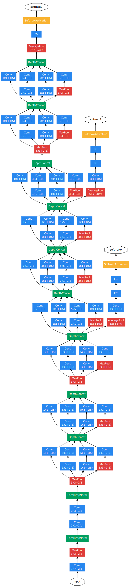
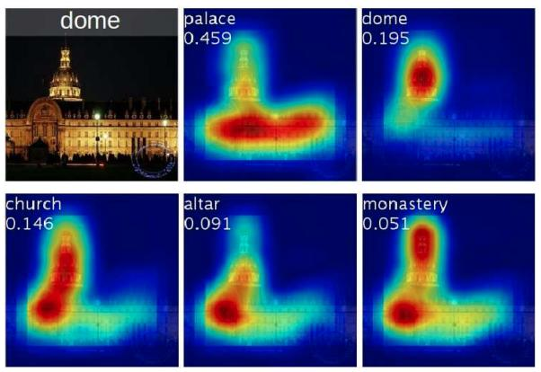

# Модель GoogLeNet

## Архитектура

Модель **GoogLeNet** [[1]](https://www.cv-foundation.org/openaccess/content_cvpr_2015/html/Szegedy_Going_Deeper_With_2015_CVPR_paper.html), известная также как **Inception-v1**, победила в соревновании ISLVRC в 2014. В основе архитектуры GoogLeNet лежит наблюдение, что <u>классифицируемый объект на изображении может иметь разный размер</u>. 

Допустим, мы классифицируем изображение машины. Эта машина может быть изображена крупным, средним и мелким планом. Свёртка, как известно, имеет ограниченную [область видимости](../ConvPool-1D/Conv-1D#извлечение-сложных-нелинейных-признаков) (receptive field), задаваемую ядром свёртки (convolution kernel). Поэтому для распознавания мелкой машины потребуются свёртки с ядром небольшого размера, а для распознавания крупной машины - свёртки с более крупным ядром.

Поскольку модель должна выдавать один и тот же прогноз для объектов разного размера, в GoogLeNet предлагается использовать **блок Inception**, показанный ниже [[1]](https://www.cv-foundation.org/openaccess/content_cvpr_2015/html/Szegedy_Going_Deeper_With_2015_CVPR_paper.html):

В стандартном Inception-блоке (a) свёртки разных размеров действуют параллельно, после чего их результаты объединяются конкатенацией результатов вдоль каналов. Такой блок приводит к сильному разрастанию числа выходных каналов, содержащих выходы всех свёрток. Также, если число входных каналов велико, то свёртки будут работать медленно. Поэтому в GoogLeNet использовались усовершенствованные Inception-блоки (b), в которых перед применением свёрток 3x3 и 5x5 предварительно уменьшается число каналов за счёт вычислительно эффективных [свёрток 1x1](../ConvPool-Images/Special-conv#поточечная-свёртка). Такое упрощение промежуточных представлений называется операцией "бутылочного горлышка" (bottleneck operation) и часто используется в сложных архитектурах.

Вся архитектура GoogLeNet состоит из предварительных свёрточных слоёв, за которыми применяется 9 Inception-блоков (с разными весами), как показано ниже [[1]](https://www.cv-foundation.org/openaccess/content_cvpr_2015/html/Szegedy_Going_Deeper_With_2015_CVPR_paper.html):

В блоках, отвечающих свёрткам и пулингам, используется обозначение $M\times M\; X(S)$, где $M$ - пространственный размер операции, задаваемый размером ядра свёртки (kernel size), а $X$ - шаг (stride).

Для уменьшения числа параметров, в GoogLeNet используется всего один [полносвязный слой](../MLP/Multilayer-perceptron) (fully-connected, FC)  перед выдачей итогового прогноза (softmax2). Вместо векторизации промежуточного представления, оно обрабатывается [глобальным усредняющим пулингом](../ConvPool-Images/Pooling#глобальный-пулинг), выдающим вектор из глобальных (по пространственным координатам) средних активаций вдоль каждого канала. 

## Сравнение GoogLeNet с VGG

За счёт сильного снижения числа каналов свёртками 1x1, а также использования единственного полносвязного слоя, применённого к результату глобального усредняющего пулинга, число параметров GoogLeNet оказалось <u>существенно ниже, чем в модели VGG</u>, несмотря на возросшую глубину. Но GoogLeNet работает медленнее из-за увеличенного числа слоёв.

## Возможность упрощённой обработки

Обратим внимание, что в Inception-блоке результаты действия свёрток объединяются с результатом максимизирующего пулинга 3x3. Это вызвано тем, что распознавать простые объекты оптимальнее меньшим количеством свёрток. Поэтому часть сигнала направляется через пулинг вместо его обработки последующими свёртками и  операциями нелинейности. Этот пулинг не приводит к уменьшению размерности, поскольку применяется с [шагом](../ConvPool-Images/Pooling#локальный-пулинг) 1 (единичным stride).

## Особенность обучения и применения

Обучение таких глубоких сетей, как GoogLeNet, сопряжено с практическими сложностями, вызванными нестабильным распространением градиента (vanishing gradient, exploding gradient) в [методе обратного распространения ошибки](../Training/Backpropagation), пока он доходит до более ранних слоёв. 

> По сути, это связано с тем, связь выхода сети с ранними слоями менее прямая и более опосредованная, чем с поздними, из-за чего ранние слои хуже настраиваются. 

Поэтому авторы архитектуры <u>во время обучения сети</u> добавляли два вспомогательных классификатора в середину сети с выходами softmax0 и softmax1. Итоговая модель настраивалась <u>на взвешенной сумме потерь всех трёх классификаторов softmax0, softmax1 и softmax2</u>. Более ранние классификаторы позволили лучше обучить начальные слои сети. Во время применения сети <u>вспомогательные классификаторы не использовались</u>, и прогноз строился только по выходу softmaх2.

## Доработки архитектуры

Сеть GoogLeNet показала топ-5 частоту ошибок порядка 7%, и впоследствии дорабатывалась, используя идеи других моделей. В частности, была предложена улучшенная архитектура модуля Inception-v4 [[2]](https://ojs.aaai.org/index.php/aaai/article/view/11231), позволившая достичь частоты ошибок уже порядка 3%.

## Объяснение прогнозов сети

Стоит отметить, что глобальный усредняющий пулинг с одним полносвязным слоем в конце архитектуры позволяет легко визуализировать область, голосующую за тот или иной класс, что реализовано в методе **Class Activation Mapping** (CAM) [[3]](https://openaccess.thecvf.com/content_cvpr_2016/html/Zhou_Learning_Deep_Features_CVPR_2016_paper.html). Результаты визуализации различных классов на изображении показаны ниже [[3]](https://openaccess.thecvf.com/content_cvpr_2016/html/Zhou_Learning_Deep_Features_CVPR_2016_paper.html): 

Если нас интересует карта важности пикселей для класса $c$, то её можно получить, используя 

$$
\sum_{k=1}^K w_k^c A_k,
$$

где $\{w_k^c\}$ - веса полносвязного слоя, отвечающие связям, определяющим рейтинг $c$-го класса, а $A_k$ - [карты активаций](../ConvPool-Images/Conv-images) (feature map) последнего свёрточного слоя, подвергающиеся агрегации [глобальным усредняющим пулингом](../ConvPool-Images/Pooling#глобальный-пулинг). 

Другие методы интерпретации прогнозов свёрточных нейросетей [разбирались ранее](../ConvPool-Images/Interpretation-of-conv-neural-nets).

## Литература

1. [Szegedy C. et al. Going deeper with convolutions //Proceedings of the IEEE conference on computer vision and pattern recognition. – 2015. – С. 1-9.](https://www.cv-foundation.org/openaccess/content_cvpr_2015/html/Szegedy_Going_Deeper_With_2015_CVPR_paper.html)
2. [Szegedy C. et al. Inception-v4, inception-resnet and the impact of residual connections on learning //Proceedings of the AAAI conference on artificial intelligence. – 2017. – Т. 31. – №. 1.](https://ojs.aaai.org/index.php/aaai/article/view/11231)
3. [Zhou B. et al. Learning deep features for discriminative localization //Proceedings of the IEEE conference on computer vision and pattern recognition. – 2016. – С. 2921-2929.](https://openaccess.thecvf.com/content_cvpr_2016/html/Zhou_Learning_Deep_Features_CVPR_2016_paper.html)
