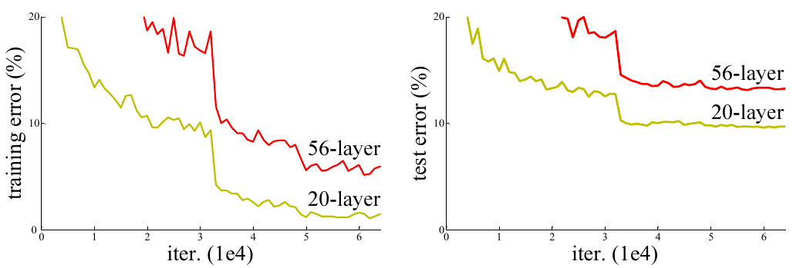
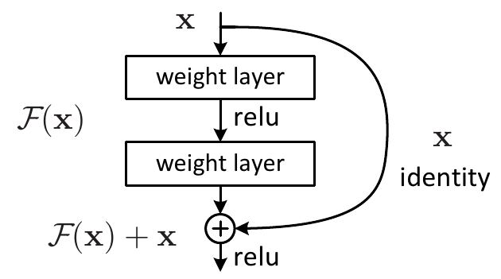
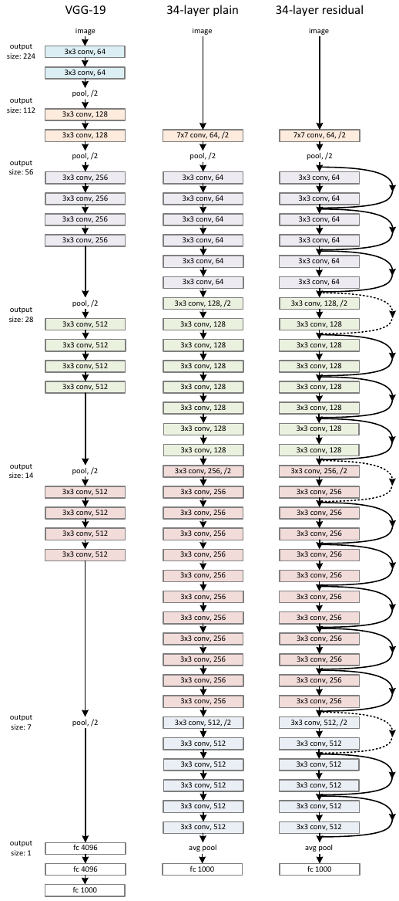
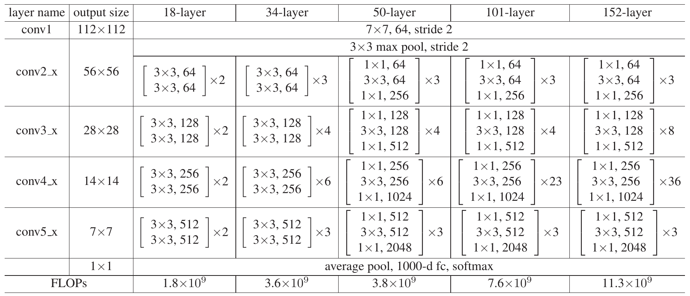
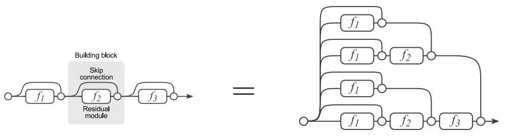

# Модель ResNet

Модель **ResNet** [[1]](https://openaccess.thecvf.com/content_cvpr_2016/html/He_Deep_Residual_Learning_CVPR_2016_paper.html) стала победителем соревнования [ILSVRC-2015](ImageNet), ансамбль из вариантов которой показал частоту ошибок 3.6%, что ниже, чем оцениваемая частота ошибок человека (5.1% из [[2]](https://arxiv.org/abs/1409.0575)). 

## Проблема глубоких сетей

Авторы модели проводили эксперименты по увеличению глубины свёрточной сети и обнаружили, что с некоторого момента добавление новых слоёв <u>приводит к ухудшению качества прогнозов модели не только на тестовой, но и на обучающей выборке</u>!

Это показано ниже для частоты ошибок на обучающей выборке (слева) и тестовой выборке (справа) датасета CIFAR-10 [[3]](https://www.cs.toronto.edu/~kriz/cifar.html) при увеличении глубины сети от 20 до 56 слоёв [[1]](https://openaccess.thecvf.com/content_cvpr_2016/html/He_Deep_Residual_Learning_CVPR_2016_paper.html):

> После каждой свёртки использовалась [батч-нормализация](../ConvPool-Images/Conv-layers-normalization), нормы градиентов не взрывались и не вырождались. Поэтому авторы пришли к выводу, что падение качества прогнозов вызвано <u>чрезмерным замедлением скорости настройки весов</u>.

## Остаточный блок

Как мы увидели, простое наращивание числа слоёв может ухудшить качество модели по сравнению с неглубокой. В то же время легко воспроизвести качество неглубокой сети с помощью глубокой, просто дополнив неглубокую сеть новыми тождественными преобразованиями, не изменяющими входы. Это дало понимание того, что <u>глубокой сети сложно воспроизвести тождественное преобразование</u>. Чтобы ей посодействовать в этом, было предложено использовать [остаточный блок](../Training-simplification/ResBlock) (residual block), представленный ниже [[1]](https://openaccess.thecvf.com/content_cvpr_2016/html/He_Deep_Residual_Learning_CVPR_2016_paper.html):

Результатом действия остаточного блока является сумма нелинейного преобразования и исходного входа $\mathcal{F}(\mathbf{x})+\mathbf{x}$. Такой конструкции гораздо проще воспроизвести тождественное преобразование, для чего достаточно задать нулями все веса преобразования $\mathcal{F}(\mathbf{x})$, превратив его в тождественный ноль. 

> Заключительный слой $\mathcal{F}(\mathbf{x})$ не содежит нелинейности [ReLU](../MLP/Activation-functions#rectified-linear-unit-relu). Вместо этого нелинейность ставится после выхода ResNet-блока. Это сделано для того, чтобы преобразование $\mathcal{F}(\mathbf{x})$ могло как повысить, так и <u>понизить</u> значение входа $\mathbf{x}$.

Эксперименты показали, что если наращивать сеть, добавляя в неё остаточные блоки, то точность прогнозов растёт, а не падает, как в обычной свёрточной архитектуре. Эта несложная идея сделало возможным применение <u>очень глубоких</u> сетей, содержащих 100 слоёв и более, а работа [[1]](https://openaccess.thecvf.com/content_cvpr_2016/html/He_Deep_Residual_Learning_CVPR_2016_paper.html) стала одной из самых цитируемых в области глубокого обучения!

## Архитектура ResNet

Для суммирования преобразования $\mathcal{F}(\mathbf{x})$ и входа $\mathbf{x}$ необходимо, чтобы число каналов и пространственные размеры в результате преобразования не изменялись. Поэтому в $\mathcal{F}(\mathbf{x})$ использовались [свёртки](../ConvPool-Images/Conv-images) 3x3 с [шагом](../ConvPool-Images/Conv-params#шаг-stride) 1 и [паддингом](../ConvPool-Images/Conv-params#паддинг), равным единице.

Периодически пространственное разрешение уменьшалось в два раза, что реализовывалось свёрткой с шагом 2 в преобразовании $\mathcal{F}(\mathbf{x})$, а в тождественной связи применялась свёртка 1x1 также с шагом 2.

Ниже приведена архитектура VGG-19 (слева), её расширенная версия с большим числом слоёв (в центре) и она же, но с добавлением тождественных связей (справа) [[1]](https://openaccess.thecvf.com/content_cvpr_2016/html/He_Deep_Residual_Learning_CVPR_2016_paper.html):

На рисунке обычные тождественные связи показаны сплошной линией, а тождественные связи, на которых пространственное разрешение уменьшается в 2 раза, - пунктиром.

После работы всех остаточных блоков их результат векторизуется [глобальным усредняющим пулингом](../ConvPool-Images/Pooling#глобальный-пулинг), к которому применяется всего один [полносвязный слой](../MLP/Multilayer-perceptron). 

> Такая архитектура, несмотря на большее число слоёв, имеет <u>гораздо меньше</u> настраиваемых параметров, чем относительно неглубокая сеть VGG, использующая <u>несколько</u> полносвязных слоёв.

## Варианты архитектуры

Тестировались архитектуры с разным числом слоёв - **ResNet-18, ResNet-34, ResNet-50, ResNet-101, ResNet-152**. Среди них самой точной оказалась архитектура с 152 слоями (частота ошибок 4.5% на датасете [ImageNet](ImageNet)):

Нелинейные преобразования $\mathcal{F}(\mathbf{x})$ различались для числа слоёв 34,50 и 101,152. В первом случае они реализовывались двумя свёртками с пространственными размерами ([размером ядра](../ConvPool-Images/Conv-images)) 3x3, а во втором - тремя свёртками 1x1, 3x3, 1x1. Первая 1x1 свёртка уменьшала число каналов, снижая число параметров и количество операций второй свёртки 3x3, а третья - восстанавливала исходное число каналов. За счёт этого приёма число операций (нижняя строка таблицы) и параметров оказалось сравнимым для более и менее глубоких вариантов ResNet. 

> Этот приём называется "бутылочным горлышком" (bottleneck), с которым мы уже сталкивались в модели [GoogLeNet](GoogLeNet).

:::tip Изменение размерности в нелинейном преобразовании $\mathcal{F}(\mathbf{x})$

Если в нелинейном преобразовании изменяется число каналов, то его можно синхронно изменить в тождественной ветке, добавив в неё свёрточный слой из [свёрток 1x1](../ConvPool-Images/Special-conv#поточечная-свёртка). Если же изменяется пространственная размерность, то в тождественную связь можно включить соответствующее перемасштабирование входа $\mathbf{x}$.

:::

## Преимущества ResNet

- <u>Тождественные связи позволяют градиенту лучше распространяться назад при обучении модели</u>, ускоряя настройку более ранних слоёв нейросети.

- <u>Тождественные связи упрощают начальную инициализацию глубокой сети</u>: веса нелинейных преобразований нужно инициализировать значениями, близкими к нулю, чтобы в начале оптимизации $\mathcal{F}(\mathbf{x})\approx 0$. Если оптимизатор сети сочтёт, что сети не хватает выразительной способности для обработки сложных объектов, он настроит $\mathcal{F}(\mathbf{x})$ нужным образом, причём только для тех блоков, которые действительно необходимы.

- <u>ResNet позволяет одновременно обрабатывать как сложные объекты, так и простые</u>. Для распознавания первых нужно много слоёв, а для вторых - мало. В последнем случае признаки извлекаются из сигнала, который прошёл через небольшое число нелинейных преобразований, а дальше распространялся в основном по тождественным связям.

- <u>ResNet действует как ансамбль</u>, поскольку каждый входной сигнал обрабатывается не по одной ветке обработки, а сразу по набору альтернативных веток, причем число альтернатив растёт экспоненциально с увеличением числа остаточных блоков. Это проиллюстрировано для трёх блоков в [[4]](https://arxiv.org/abs/1605.06431):

## Литература

1. [He K. et al. Deep residual learning for image recognition //Proceedings of the IEEE conference on computer vision and pattern recognition. – 2016. – С. 770-778.](https://openaccess.thecvf.com/content_cvpr_2016/html/He_Deep_Residual_Learning_CVPR_2016_paper.html)
2. [Russakovsky O. et al. Imagenet large scale visual recognition challenge //International journal of computer vision. – 2015. – Т. 115. – С. 211-252.](https://arxiv.org/abs/1409.0575)
3. [CIFAR-10 dataset.](https://www.cs.toronto.edu/~kriz/cifar.html)
4. [Veit A., Wilber M. J., Belongie S. Residual networks behave like ensembles of relatively shallow networks //Advances in neural information processing systems. – 2016. – Т. 29.](https://arxiv.org/abs/1605.06431)
