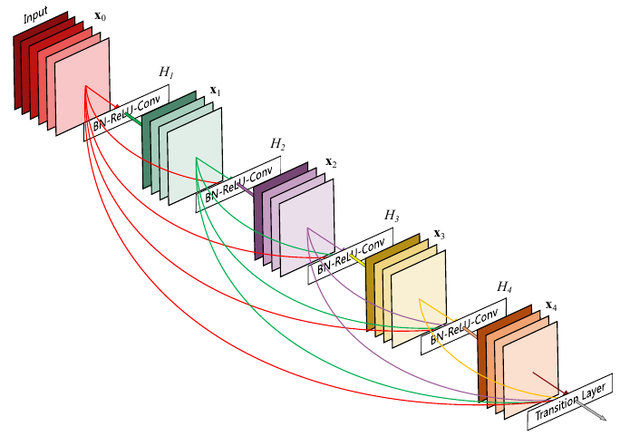
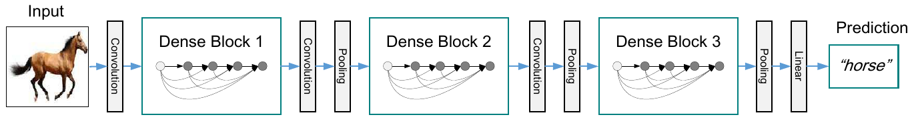

# Модель DenseNet

В архитектуре **DenseNet** [[1]](https://openaccess.thecvf.com/content_cvpr_2017/html/Huang_Densely_Connected_Convolutional_CVPR_2017_paper.html) используются два типа блоков - **плотные блоки** (dense blocks) и **переходные блоки** (transition blocks).

В плотном блоке каждый следующий слой использует информацию <u>со всех предшествующих слоёв плотного блока</u>, как показано на рисунке:

Математически выход каждого слоя $i$ зависит от выходов всех предшествующих слоёв:

$$
\mathbf{x}_i=H_i([\mathbf{x}_0,\mathbf{x}_1,...\mathbf{x}_{i-1}]),
$$

что реализуется тем, что входом для $i$-го слоя является <u>конкатенация выходов всех предыдущих слоёв</u>. 

> Такая архитектура позволяет улучить обработку объектов за счёт  переиспользования информации, полученной на предыдущих слоях.

Поскольку в плотном слое число каналов растёт линейно с ростом числа слоёв, в промежуточные узлы архитектуры вставляются переходные блоки (transition blocks), задача которых состоит в том, чтобы

- уменьшить число каналов, используя [поточечные свёртки](../ConvPool-Images/Special-conv#поточечная-свёртка) размера 1x1;

- уменьшить пространственное разрешение, используя [пулинг](../ConvPool-Images/Pooling).

Таким образом, обработка изображения состоит из последовательного применения плотных и переходных блоков, как показано ниже для случая трёх блоков каждого типа:

Архитектура DenseNet показала лучшее качество на датасетах CIFAR [[2]](https://www.cs.toronto.edu/~kriz/cifar.html) и SVHN [[3]](http://ufldl.stanford.edu/housenumbers/), чем ResNet, и сравнимое с ней качество на датасете ImageNet [[4]](https://www.image-net.org/) при меньшем числе параметров [[1]](https://openaccess.thecvf.com/content_cvpr_2017/html/Huang_Densely_Connected_Convolutional_CVPR_2017_paper.html).

## Литература

1. [Huang G. et al. Densely connected convolutional networks //Proceedings of the IEEE conference on computer vision and pattern recognition. – 2017. – С. 4700-4708.](https://openaccess.thecvf.com/content_cvpr_2017/html/Huang_Densely_Connected_Convolutional_CVPR_2017_paper.html)
2. [The CIFAR-10 dataset.](https://www.cs.toronto.edu/~kriz/cifar.html)
3. [The Street View House Numbers (SVHN) Dataset.](http://ufldl.stanford.edu/housenumbers/)
4. [The ImageNet dataset.](https://www.image-net.org/)
