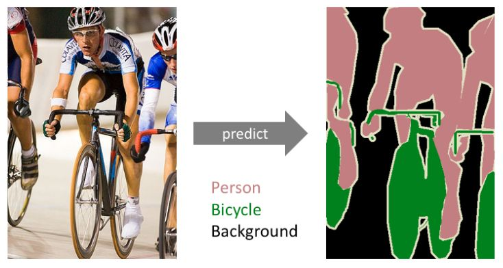
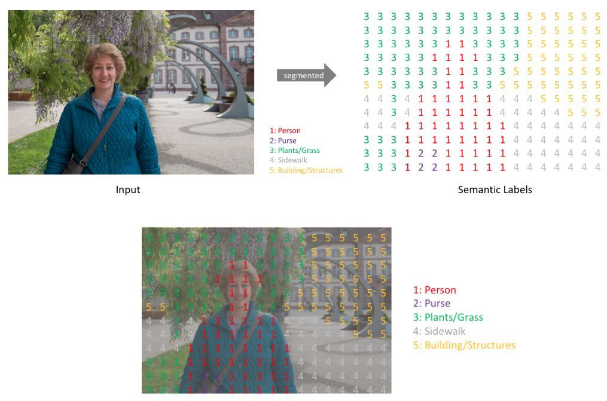
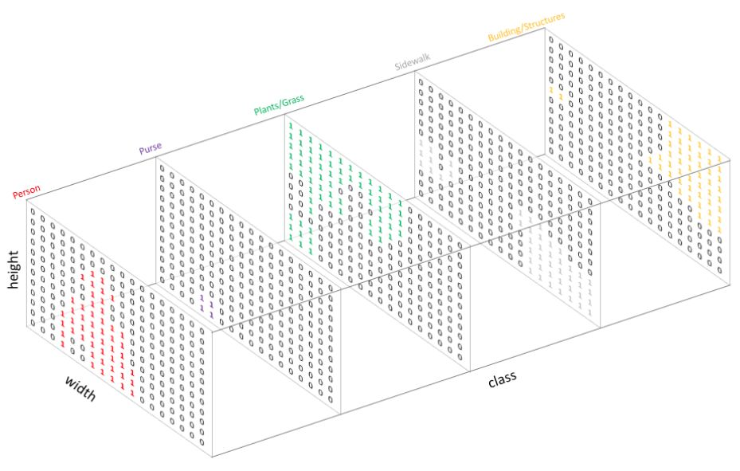

# Семантическая сегментация

Задача **семантической сегментации изображений** (semantic segmentation) заключается в классификации <u>каждого пикселя</u> в зависимости от того, какой объект на нём изображён. 

Пример семантической сегментации для случая трёх классов (человек, велосипед и фон) показан ниже [[1]](https://www.jeremyjordan.me/semantic-segmentation/):

> Обратим внимание, что в семантической сегментации разные представители класса <u>не различаются</u>. Поэтому в примере выше разные люди и велосипеды помечены одним классом. Это отличает семантическую сегментацию от [сегментации объектов](../Instance-segmentation/Problem-statement) (instance segmentation), описанную далее в отдельном разделе. 

Семантическая сегментация имеет многочисленные применения. Перечислим некоторые из них:

- выделение на аэрофотоснимках городских застроек, сельскохозяйственных угодий и необработанных человеком участков местности;

- сегментация болезненных участков на медицинских фотографиях и рентгеновских снимках;

- сегментация людей и автомобилей с камер видеонаблюдения;

- сегментация одежды на человеке для её замены в виртуальных примерочных (например, Amazon’s Virtual Mirror [[2]](https://www.geekwire.com/2018/amazon-patents-blended-reality-mirror-shows-wearing-virtual-clothes-virtual-locales/)).

Желаемым выходом в задаче семантической сегментации является матрица того же пространственного размера, что и входное изображение, содержащая метки класса для каждого пикселя [[1]](https://www.jeremyjordan.me/semantic-segmentation/):

Технически же сегментационная нейросетевая модель выдаёт <u>тензор вероятностей классов</u> размера $C\times H\times W$, где $C$ - число классов, а $H$ и $W$ - пространственные размеры сегментируемого изображения [[1]](https://www.jeremyjordan.me/semantic-segmentation/):

В примере этот тензор заполнен нулями и единицами, но в общем случае там будут стоять рейтинги классов, принимающие произвольные значения. К этим рейтингам **в каждой пространственной позиции** применяется [операция SoftMax](../MLP/Outputs-loss-functions#многоклассовая-классификация), чтобы перевести их в вероятности и настраивать нейросеть, максимизируя логарифмы правдоподобия для каждого изображения в каждом пикселе:

$$
\sum_{n=1}^{N}\sum_{x=1}^{W}\sum_{y=1}^{H}\sum_{c=1}^{C}\mathbb{I}[y_{n}(x,y)=c]\ln p_{\theta}(y(x,y)=c|x_{n})\to\max_{\theta},
$$

где

- $n$ - номер изображения в мини-батче, состоящем из $N$ изображений;

- $W,H$ - ширина и высота каждого изображения;

- $C$ - число классов;

- $\theta$ - параметры сети.

> Это эквивалентно минимизации попиксельных [кросс-энтропийных потерь](../MLP/Outputs-loss-functions#кросс-энтропийные-потери-многоклассовые).

## Литература

1. [jeremyjordan.me: An overview of semantic image segmentation.](https://www.jeremyjordan.me/semantic-segmentation/)

2. [geekwire.com: Amazon’s blended-reality mirror shows you wearing virtual clothes in virtual locales.](https://www.geekwire.com/2018/amazon-patents-blended-reality-mirror-shows-wearing-virtual-clothes-virtual-locales/)
