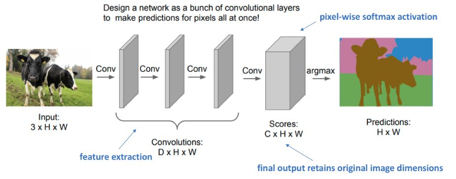

# Подходы к решению

Рассмотрим простые методы решения задачи [семантической сегментации изображений](Semantic-segmentation-task) и их ограничения.

## Скользящее окно

Поскольку мы уже умеем решать [задачу классификации изображений](../ConvPool-Images/Conv-net), то мы могли бы сопоставить каждому пикселю тот класс, который ему назначает классификационная сеть, если её применять к окрестности интересующего пикселя. Тогда для сегментации всего изображения пришлось бы просканировать изображение квадратной областью, вычисляя для каждого пикселя в центре области его класс.

> Это очень неэффективное решение, поскольку требует производить классификацию столько раз, сколько пикселей на изображении. При этом классификатору пришлось бы пересчитывать <u>одни и те же признаки для пересекающихся фрагментов</u>.

## Сеть из свёрток

Мы могли бы применить к изображению серию свёрток, как показано ниже [[1]](https://cs231n.stanford.edu/slides/2017/cs231n_2017_lecture11.pdf?ref=jeremyjordan.me):

Каждая свёртка должна иметь шаг (stride) 1 и использовать [паддинг](../ConvPool-Images/Conv-params#паддинг) вокруг границ (padding), чтобы размер выхода совпадал с размером входа. 

Такой подход эффективнее, чем первый, поскольку признаки, извлекаемые на пересекающихся частях изображения, <u>вычисляются однократно</u> и переиспользуются. 

> Тем не менее, этот подход очень затратен по памяти и вычислениям, поскольку предполагает <u>обработку тензоров высокого пространственного разрешения</u>.

## Кодировщик-декодировщик

Третий подход также использует свёрточную архитектуру, но предполагает постепенное уменьшение пространственного разрешения (spatial dimensionality reduction), а затем возврат к исходному разрешению, как показано ниже [[1]](https://cs231n.stanford.edu/slides/2017/cs231n_2017_lecture11.pdf?ref=jeremyjordan.me):

Благодаря тому, что пространственное разрешение снижается, у нас появляется возможность эффективно произвести вычисление сложных признаков.

> Свёрточные слои, на которых пространственное разрешение постепенно снижается, называются **кодировщиком** (encoder). 

Классификационные сети векторизовали выход кодировщика и применяли к нему [многослойный персептрон](../MLP/Multilayer-perceptron). Но в задаче семантической сегментации требуется выдать результат в виде тензора такого же пространственного размера, как входное изображение, поэтому далее к промежуточному представлению, полученному кодировщиком, применяется **декодировщик** (decoder), состоящий из специальных свёрточных блоков, [повышающих пространственное разрешение](Upsampling-operations) (upsampling blocks). 

Варианты реализации этих блоков будут рассмотрены в [следующей главе](Upsampling-operations).

### Ограничение архитектуры

Ограничение предложенной архитектуры заключается в том, что мы по промежуточному представлению <u>в низком разрешении</u> (выходу  кодировщика) пытаемся восстановить сегментационную карту <u>в высоком разрешении</u>. Это неизбежно будет приводить к потере пространственной информации и неточностям при восстановлении границ между классами! 

> Продвинутые методы сегментации, описанные далее, решают эту проблему, внося свои архитектурные дополнения в стандартную архитектуру кодировщика-декодировщика.

## Литература

1. [stanford.edu: Detection and Segmentation.](https://cs231n.stanford.edu/slides/2017/cs231n_2017_lecture11.pdf?ref=jeremyjordan.me)
