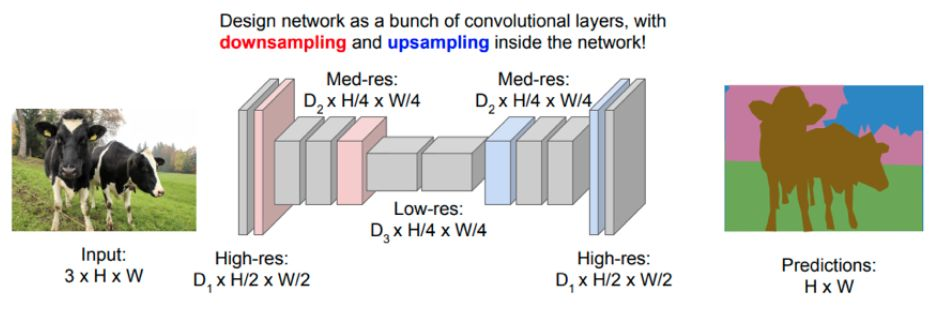
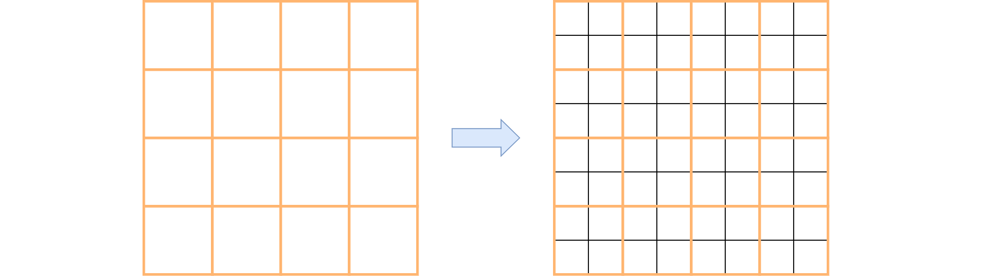
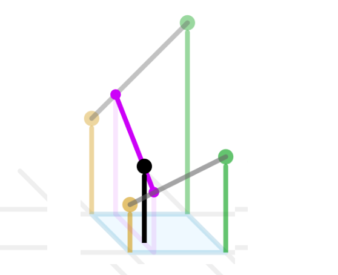
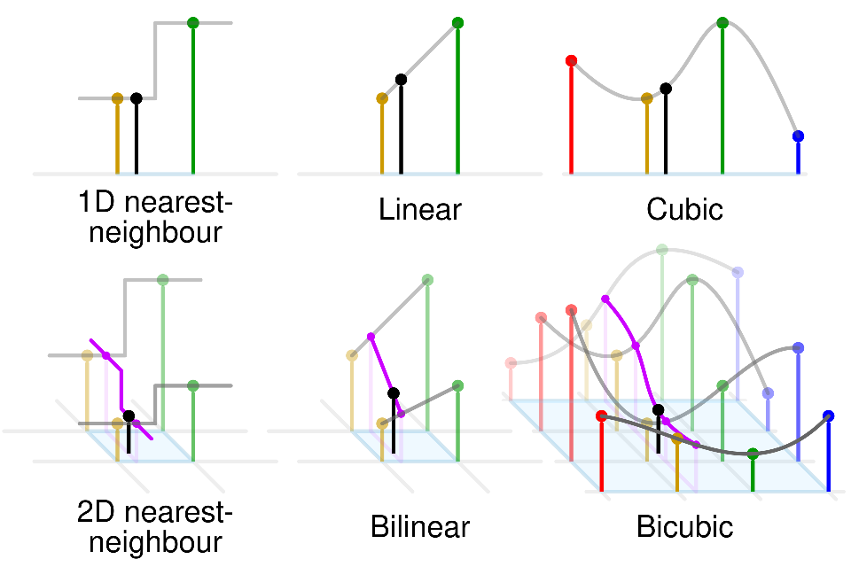
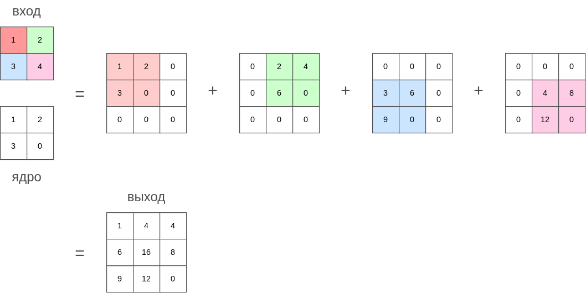
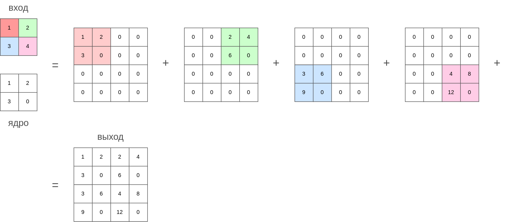
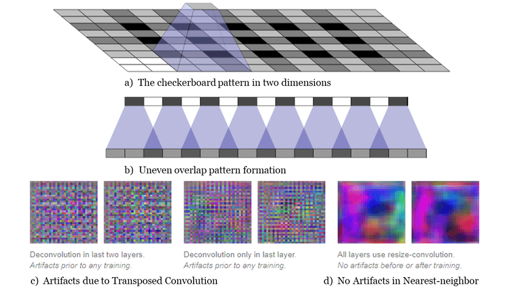

# Повышение разрешения

Как [мы видели](Semantic-segmentation-approaches#кодировщик-декодировщик), базовая архитектура сегментационной сети состоит из кодировщика, постепенно снижающего пространственное разрешение, после которого следует декодировщик, возвращающий разрешение к исходному [[1]](https://cs231n.stanford.edu/slides/2017/cs231n_2017_lecture11.pdf?ref=jeremyjordan.me): 

Для **уменьшения разрешения** (downsampling) в кодировщике можно использовать свёртки с [шагом](../ConvPool-Images/Conv-params#шаг-stride) (stride) больше единицы, а также операции [пулинга](../ConvPool-Images/Pooling).

Рассмотрим методы **повышения пространственного разрешения** (upsampling, unpooling, upscaling) в декодировщике.

Задачей повышения разрешения является перевод внутреннего представления изображения из низкого разрешения в высокое: зная значения активаций на грубой сетке значений, требуется восстановить недостающие значения на более мелкой сетке:

Для этого нам нужно воспользоваться тем или иным методом интерполяции промежуточных значений по опорным значениям грубой сетки (чаще всего выполняемой для каждого канала независимо). Поскольку интерполяция будет неточной, часто после интерполяции ставят обучаемую [свёртку](../ConvPool-Images/Conv-images), настраиваемой немного уточнять результаты интерполяции.

Далее будут описаны популярные методы повышения разрешения.

## Bed of nails

Метод **bed of nails** просто заполняет детальную сетку значений нулями, а потом подставляет значения грубой сетки в соответствующие пространственные позиции (после перемасштабирования). Вот как выглядит результат работы при переводе сетки 2x2 в сетку 5x5:

$$
\left(\begin{array}{cc}
\mathbf{a} & \mathbf{b}\\
\mathbf{c} & \mathbf{d}
\end{array}\right)\longrightarrow\left(\begin{array}{ccccc}
0 & 0 & 0 & 0 & 0\\
0 & \mathbf{a} & 0 & \mathbf{b} & 0\\
0 & 0 & 0 & 0 & 0\\
0 & \mathbf{c} & 0 & \mathbf{d} & 0\\
0 & 0 & 0 & 0 & 0
\end{array}\right)
$$

В случае, если после перемасштабирования обновлённые координаты элементов грубой сетки не идеально соответствуют координатам в мелкой сетке, применяется округление координат, чтобы они всегда были целыми числами.

## Max unpooling

Bed of nails - очень грубый метод интерполяции, поэтому в представленном виде он почти не используется. Вместо этого он применяется в декодировщике как симметричная операция к максимизирующему пулингу кодировщика. Позиции, на которых был достигнут максимум пулинга, сохраняются, а при повышении разрешения элементы помещаются в соответствующие позиции [[2]](https://arxiv.org/pdf/1511.00561). Этот метод называется **max unpooling**.

## Интерполяция ближайшим соседом

В **интерполяция ближайшим соседом** (nearest neighbor interpolation) координаты элементов грубой сетки перемасштабируются под размер мелкой сетки, а элементы мелкой сетки заполняются значениями ближайших к ним элементов грубой сетки, как показано в примере ниже:

$$
\left(\begin{array}{cc}
\mathbf{a} & \mathbf{b}\\
\mathbf{c} & \mathbf{d}
\end{array}\right)\longrightarrow\left(\begin{array}{cccc}
\mathbf{a} & \mathbf{a} & \mathbf{b} & \mathbf{b}\\
\mathbf{a} & \mathbf{a} & \mathbf{b} & \mathbf{b}\\
\mathbf{c} & \mathbf{c} & \mathbf{d} & \mathbf{d}\\
\mathbf{c} & \mathbf{c} & \mathbf{d} & \mathbf{d}
\end{array}\right)
$$

> Например, координаты элемента $a$ были (1,1), а стали (1.5,1.5). В результате четыре ближайших элемента в мелкой сетке оказались к этой позиции ближайшими и тоже заполнились значением $a$.

## Билинейная интерполяция

Интерполяция ближайшим соседом приводит к резким перепадам значений в областях, которые равноудалены от опорных элементов грубой сетки. **Билинейная интерполяция** (bilinear interpolation [[3]](https://en.wikipedia.org/wiki/Bilinear_interpolation)) делает изменения более плавными. Интенсивность изменяется по линейному закону при приближении к тому или иному опорному значению грубой сетки.

Для этого выполняются следующие шаги.

1. Целевая точка проецируется на грубую сетку вверх и вниз вдоль оси Y.

2. Линейной интерполяцией находится значение для обеих проекций.

3. Значение целевой точки находится линейной интерполяцией между значениями для проекций.

Этот процесс показан на рисунке [[3]](https://en.wikipedia.org/wiki/Bilinear_interpolation):

## Бикубическая интерполяция

В **бикубической интерполяции** (bicubic interpolation [[4]](https://en.wikipedia.org/wiki/Bicubic_interpolation)) промежуточные значения на мелкой сетке находятся с помощью локальной полиномиальной аппроксимации, полученной по опорным элементам грубой стеки, а также из условий, что соседние полиномы образуют непрерывную поверхность с непрерывными производными на краях.

Различные виды интерполяции проиллюстрированы ниже [[3]](https://en.wikipedia.org/wiki/Bilinear_interpolation):

## Транспонированная свёртка

### Базовый вариант

**Транспонированная свёртка** (transposed convolution, fractionally-strided convolution, deconvolution) - альтернативный вариант повышения пространственного разрешения. От ранее перечисленных методов его отличает то, что этот метод **имеет настраиваемые параметры** (смещение и ядро свёртки), а также традиционные гиперпараметры для свёртки (padding, stride, dilation).

Опишем интуицию работы транспонированной свёртки.

> Чтобы представить работу транспонированной свёртки, нужно представить распространение градиента обычной свёртки в режиме обратного прохода (backward pass) в методе [обратного распространения ошибки](../Training/Backpropagation#backward-mode-обратное-распространение-ошибки). В этом режиме входной слой свёртки является выходным для транспонированной свёртки, а выходной слой, наоборот, является входным.

Если представить ядро транспонированной свёртки как печать или штамп, в котором больше чернил в тех местах, где элементы ядра свёртки больше, то действие транспонированной свёртки можно представить как проставление этого штампа на выходной карте признаков с силой надавливания, равной соответствующим элементам входной карты признаков. 

Иными словами, ядро свёртки ставится на каждую позицию выходной карты признаков, домноженное на входную активацию в центре постановки ядра. В позициях, где ядра пересекаются, осуществляется суммирование результатов.

Это продемонстрировано на рисунке ниже:

:::tip Связь с обратной операцией к свёртке

По смыслу транспонированная свёртка представляет собой <u>нестрогий аналог</u> операции, обратной к свёртке.

Зададимся вопросом, как понять, насколько высока была входная активация в определённой позиции по выходным значениям свёртки? Эта активация принимает большое значение, если оказались большими выходные активации с поправкой на коэффициенты ядра свёртки в соответствующих позициях.

:::

### Многоканальный вариант

В случае нескольких выходных каналов транспонированная свёртка ставит уже трёхмерные "штампы" с силой нажатия, равной активации входного канала.

Если входных каналов несколько, то результаты применения этих "штампов" суммируются для каждого входного канала.

### Влияние смещения, шага и сдвига

Обучаемый **параметр смещения** (bias) оказывает то же влияние, что и в обычной свёртке: он увеличивает значения всех выходов на величину смещения.

**Гиперпараметр шага** (stide) управляет тем, с каким смещением ядро свёртки ставится на выходную карту признаков. Ниже показана работа транспонированной свёртки с шагом 2:

**Гиперпараметр сдвига** (dilation) будет распылять значения "печати" (ядра свёртки), заполняя пропуски нулями, делая её более рассредоточенной.

> Динамическую визуализацию работы обычной и транспонированной свёртки можно  посмотреть в [[5]](https://github.com/vdumoulin/conv_arithmetic/blob/master/README.md).

### Недостатки

При применении транспонированной свёртки на некоторые выходные позиции ядро ("штамп") ставится один раз, а на некоторые - несколько раз. На практике это приводит к тому, что выходные значения в каких-то местах в среднем больше, чем в других, что известно как **артефакты шахматной доски** (checkerboard artifacts), показанные ниже для случая 2D (а,c) и 1D (b) [[6]](https://distill.pub/2016/deconv-checkerboard/):

Во избежание подобных артефактов необходимо использовать другие методы повышения разрешения, такие как интерполяция ближайшим соседом (d на рисунке), билинейная и бикубическая интерполяция. Либо использовать транспонированную свёртку, но

- задавать stride=kernel size

- либо нормировать каждый элемент выхода на число раз, сколько ядро транспонированной свёртки было на него поставлено.

Также можно применять после транспонированной свёртки обычную. Она будет настраиваться частично разглаживать выходы транспонированной свёртки.

Более подробное описание и обоснование транспонированной свёртки доступно в [[7]](https://arxiv.org/abs/1603.07285), а в [[8]](https://d2l.ai/chapter_computer-vision/transposed-conv.html) приведён пример кода, который её использует.

## Литература

1. [stanford.edu: Detection and Segmentation.](https://cs231n.stanford.edu/slides/2017/cs231n_2017_lecture11.pdf?ref=jeremyjordan.me)
2. [Badrinarayanan V., Kendall A., Cipolla R. Segnet: A deep convolutional encoder-decoder architecture for image segmentation //IEEE transactions on pattern analysis and machine intelligence. – 2017. – Т. 39. – №. 12. – С. 2481-2495.](https://arxiv.org/pdf/1511.00561)
3. [Wikipedia: Bilinear interpolation.](https://en.wikipedia.org/wiki/Bilinear_interpolation)
4. [Wikipedia: Bicubic interpolation.](https://en.wikipedia.org/wiki/Bicubic_interpolation)
5. [github.com/vdumoulin: Convolution arithmetic.](https://github.com/vdumoulin/conv_arithmetic/blob/master/README.md)
6. [distill.pub: Deconvolution and Checkerboard Artifacts.](https://distill.pub/2016/deconv-checkerboard/)
7. [Dumoulin V., Visin F. A guide to convolution arithmetic for deep learning //arXiv preprint arXiv:1603.07285. – 2016.](https://arxiv.org/abs/1603.07285)
8. [Zhang A. et al. Dive into deep learning. – Cambridge University Press, 2023: Transposed Convolution.](https://d2l.ai/chapter_computer-vision/transposed-conv.html)
   
   
