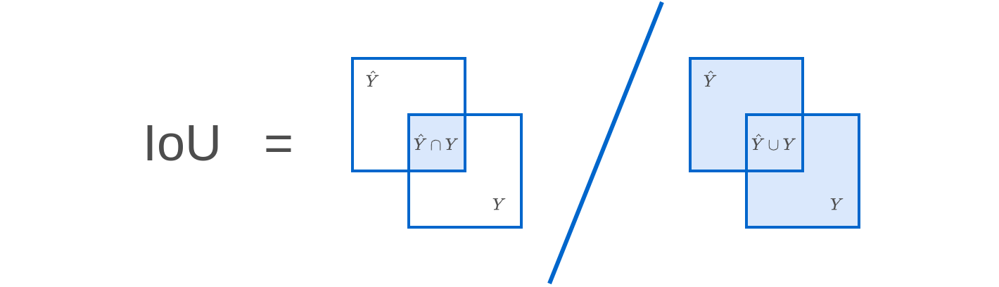
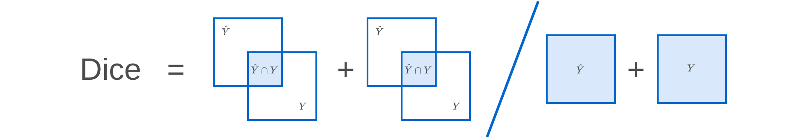
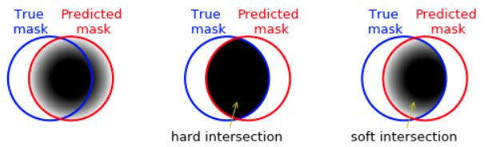
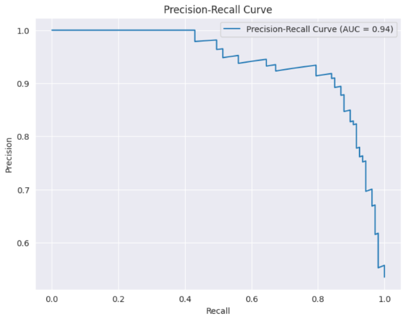

# Меры качества прогнозов

Изучим основные меры качества прогнозов [семантической сегментации](Semantic-segmentation-task).

Рассмотрим семантическую сегментацию на два класса - целевой объект и фон. 

> Целевым объектом может быть человек на фотографии, заболевание на рентгеновском снимке и т.д.

## Попиксельная точность

Самой простой мерой качества сегментации является **попиксельная точность** (pixel accuracy), т.е. доля верно классифицированных пикселей. Недостатком этой меры является завышенное качество, когда фон доминирует над целевым классом, что является типичной ситуацией. В этом случае модель будет показывать высокую точность, даже если модель не будет решать задачу, а все пиксели будет относить к фону!

## IoU и Dice

Нам нужна мера, которая бы вычисляла качество предсказания именно целевого класса. Самой популярной мерой является [мера Жаккара](../../Machine-learning/Metric-methods/Distance-functions#сравнение-множеств), в компьютерном зрении называемая **Intersection-over-Union** или **IoU**. 

Пусть 

- $Y$ - множество пикселей, реально принадлежащих целевому классу,

- $\hat{Y}$ - множество пикселей, отнесённых моделью к целевому классу.

Тогда качество выделения целевого класса считается как

$$
\text{IoU}=\frac{|\hat{Y} \cap Y|}{|\hat{Y} \cup Y|},
$$

что графически можно представить следующим образом:

Также популярна мера качества **Dice**:

$$
\text{Dice}=\frac{2|\widehat{Y}\cap Y|}{|\widehat{Y}|+|Y|}, 
$$

которая графически выглядит как

Из определения следует, что обе меры принимают значения из отрезка [0,1], причём 

- 1 соответствует наилучшей сегментации (множества совпали),

- 0 соответствует наихудшей сегментации (множества не имеют пересечения).

Если целевой класс обозначить положительным, а фон - отрицательным классом, то в терминах величин [TP, TN, FP, FN](../../Machine-learning/Classifier-evaluation/Special-binary-label-quality-estimation) эти меры запишутся как

$$
\text{IoU} = \frac{TP}{TP+FP+FN},
$$

$$
\text{Dice}=\frac{2TP}{2TP+FP+FN}=\frac{1}{\frac{1}{2}\frac{\widehat{P}}{TP}+\frac{1}{2}\frac{P}{TP}}=\text{F-мера},
$$

где 

- $\hat{P}=TP+FP$ - число предсказаний целевого класса,

- $P=TP+FN$ - число реальных пикселей целевого класса.

Поскольку в Dice, по сравнению с IoU, и в числителе, и в знаменателе прибавляется величина TP, то Dice будет выдавать более высокие значения для в целом верно распознанных регионов целевого класса:

$$
\text{Dice}=\frac{{\color{red}{\color{green}{\color{green}TP}+}TP}}{{\color{green}TP+}{\color{red}TP+FP+FN}}
$$

По смыслу меры IoU и Dice измеряют одно и то же (качество выделения целевого класса) и связаны монотонным соотношением (докажите!):

$$
Dice=\frac{2IoU}{IoU+1}
$$

## Сглаженные варианты IoU и Dice

Поскольку сегментационная модель выдаёт не сами классы, а [их вероятности](Semantic-segmentation-task), то имеет смысл обобщить меры IoU и Dice на оценку предсказываемых вероятностей, как показано на рисунке [[1]](https://ilmonteux.github.io/2019/05/10/segmentation-metrics.html):

Пусть теперь 

- $Y\in \mathbb{R}^{H,W}$ - матрица истинной разметки, в которой 1 стоит в пикселях целевого класса, а 0 обозначает фон;

- $P\in\mathbb{R}^{H\times W}$ - матрица, каждый элемент которой задаёт предсказанную вероятность целевого класса в каждом пикселе.

Тогда меру IoU можно применять как [[2]](https://proceedings.neurips.cc/paper_files/paper/2023/hash/ee208bfc04b1bf6125a6a34baa1c28d3-Abstract-Conference.html):

$$
\text{IoU}_{soft}^1 = \frac{\langle Y,P\rangle}{||Y||_1+||P||_1-\langle Y,P \rangle},
$$

$$
\text{IoU}_{soft}^2 = \frac{\langle Y,P\rangle}{||Y||_2^2+||P||_2^2-\langle Y,P \rangle},
$$

а меру Dice как

$$
\text{Dice}_{soft}^1 = \frac{2\langle Y,P\rangle}{||Y||_1+||P||_1},
$$

$$
\text{Dice}_{soft}^2 = \frac{2\langle Y,P\rangle}{||Y||_2^2+||P||_2^2}
$$

Преимуществом подобных мер является то, что они дифференцируемы по вероятностям, следовательно можно не только отслеживать по ним качество прогнозов, но и использовать их напрямую в настройке параметров модели как целевые критерии оптимизации.

> В работе [[2]](https://proceedings.neurips.cc/paper_files/paper/2023/hash/ee208bfc04b1bf6125a6a34baa1c28d3-Abstract-Conference.html) рассматриваются и другие меры обобщения IoU на случай вероятностных прогнозов.

## Пограничная IoU

Часто модель сегментации хорошо справляется с выделением объекта в целом, а большая часть ошибок концентрируется <u>на границах объектов</u>. Для детальной оценки качества сегментации именно на границах IoU применяется не по всему изображению, а только вдоль границ объектов.

Пусть 

- $B_{r}(Y)$ - полоса ширины $r$ вокруг границы реальной маски $Y$. 

- $B_{r}(\hat{Y})$ - полоса ширины $r$ вокруг границы предсказанной маски $\hat{Y}$.

Тогда качество вдоль границ объектов можно оценивать одним из следующих способов [[3]](https://openaccess.thecvf.com/content/CVPR2021/html/Cheng_Boundary_IoU_Improving_Object-Centric_Image_Segmentation_Evaluation_CVPR_2021_paper.html): 

$$
\text{Trimap IoU}=\frac{\left|{\color{red}B_{r}(Y)\cap}\widehat{Y}\cap Y\right|}{\left|\left({\color{red}B_{r}(Y)\cap}\widehat{Y}\right)\cup\left({\color{red}B_{r}(Y)\cap}Y\right)\right|}
$$

$$
\text{Boundary IoU}=\frac{\left|\left({\color{red}B_{r}(\widehat{Y})\cap}\widehat{Y}\right)\cap\left({\color{red}B_{r}(Y)\cap}Y\right)\right|}{\left|\left({\color{red}B_{r}(\widehat{Y})\cap}\widehat{Y}\right)\cup\left({\color{red}B_{r}(Y)\cap}Y\right)\right|}
$$

## Average Precision

Можно варьировать порог вероятности $\alpha$, начиная с которого пикселю будет назначаться целевой класс (а не фон):

$$
p(i,j)\ge \alpha \Longrightarrow \; \hat{y} \; (i,j)=1
$$

> При более низком пороге целевой класс будет назначаться более часто. 

При варьировании $\alpha$ будут изменяться меры [Precision и Recall](../../Machine-learning/Classifier-evaluation/Special-binary-label-quality-estimation#точность-и-полнота).

Агрегированной мерой качества сегментатора для различных порогов будет кривая зависимости Precision(Recall) при различных порогах $\alpha$, известная как **кривая точности-полноты** (precision-recall curve). 

Пример этой кривой показан ниже [[4]](https://www.geeksforgeeks.org/machine-learning/precision-recall-curve-ml/):

Агрегированной численной мерой качества для всевозможных порогов будет величина **Average precision** (AP), равная площади под графиком зависимости точности от полноты.

## Случай многих классов

Если производится сегментация на $C$ классов, то оценивают качества выделения каждого класса одной из вышеприведённых мер, а затем меры для каждого класса усредняют. Величина Average Precision, равномерно усреднённая по классам, называется **Mean Average Precision** (mAP).

## Литература

1. [ilmonteux.github.io: Metrics for semantic segmentation.](https://ilmonteux.github.io/2019/05/10/segmentation-metrics.html)
2. [Wang Z., Ning X., Blaschko M. Jaccard metric losses: Optimizing the jaccard index with soft labels //Advances in Neural Information Processing Systems. – 2024. – Т. 36.](https://proceedings.neurips.cc/paper_files/paper/2023/hash/ee208bfc04b1bf6125a6a34baa1c28d3-Abstract-Conference.html)
3. [Cheng B. et al. Boundary IoU: Improving object-centric image segmentation evaluation //Proceedings of the IEEE/CVF conference on computer vision and pattern recognition. – 2021. – С. 15334-15342.](https://openaccess.thecvf.com/content/CVPR2021/html/Cheng_Boundary_IoU_Improving_Object-Centric_Image_Segmentation_Evaluation_CVPR_2021_paper.html)
4. [geeksforgeeks.org: Precision-Recall Curve - ML.](https://www.geeksforgeeks.org/machine-learning/precision-recall-curve-ml/)
