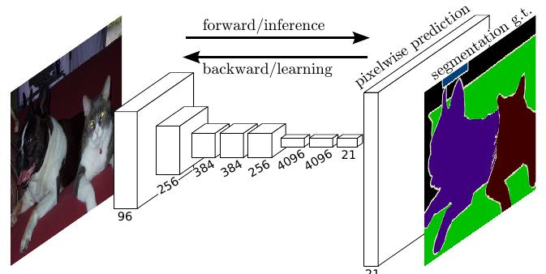
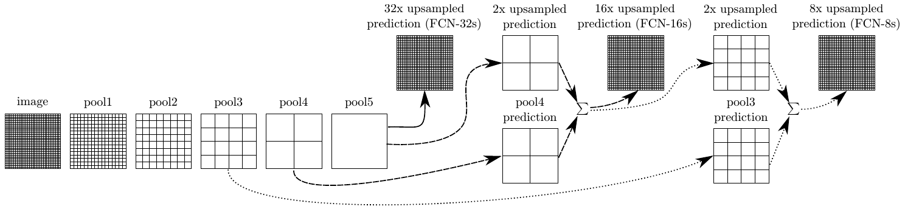
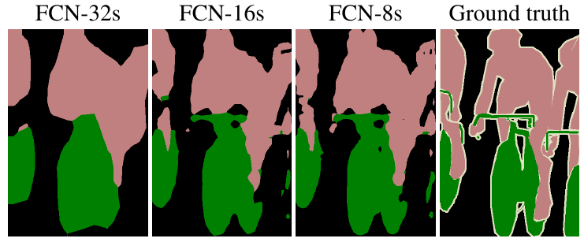

# Fully Convolutional Network

Одной из первых нейросетевых архитектур для решения задачи [семантической сегментации](Semantic-segmentation-task) была модель **Fully Convolutional Network** (**FCN**) [[1]](https://openaccess.thecvf.com/content_cvpr_2015/html/Long_Fully_Convolutional_Networks_2015_CVPR_paper.html), в которой использовалась полносвёрточная архитектура для семантической сегментации. 

> Эта архитектура состоит только из свёрток, пулингов, нелинейностей и операций [повышения разрешения](Upsampling-operations) (upsampling). 

Преимуществом архитектуры является то, что она может работать со входным изображением <u>произвольных размеров</u>: увеличение входа будет пропорционально увеличивать размер выхода. 

> Наилучшее качество работы будет достигаться при применении модели к изображениям того разрешения, которое было максимально представлено в обучающей выборке.

В простейшем случае архитектура могла бы выглядеть следующим образом [[1]](https://openaccess.thecvf.com/content_cvpr_2015/html/Long_Fully_Convolutional_Networks_2015_CVPR_paper.html):

Однако качество сегментации подобной архитектуры будет невысоким вследствие того, что <u>низкоразмерные</u> промежуточные представления после резкого повышения разрешения (последний слой) не способны качественно выделять границы объектов <u>в высоком разрешении</u>.

Хотелось бы как-то совместить высокоуровневые информативные представления низкого разрешения с более простыми промежуточными представлениями с ранних слоёв, имеющих более высокое пространственное разрешение, чтобы точно выделять границы объектов.

Для этого в FCN предлагается прогнозировать сегментационную карту, используя не только последнее промежуточное представление (FCN-32s), но и предпоследнее. Пространственные размеры обоих прогнозов приводятся в соответствие, используя билинейную интерполяцию и складываются (FCN-16s). Этот же трюк повторяется ещё раз, когда прогнозы строятся по ещё более раннему промежуточному представлению и складываются с прогнозом FCN-16s, что даёт архитектуру FCN-8s. 

Графически эта идея продемонстрирована ниже [[1]](https://openaccess.thecvf.com/content_cvpr_2015/html/Long_Fully_Convolutional_Networks_2015_CVPR_paper.html):

Чем сильнее используется комбинирование прогнозов более поздних и более ранних слоёв, тем точнее работает сегментация [[1]](https://openaccess.thecvf.com/content_cvpr_2015/html/Long_Fully_Convolutional_Networks_2015_CVPR_paper.html):

## Литература

1. [Long J., Shelhamer E., Darrell T. Fully convolutional networks for semantic segmentation //Proceedings of the IEEE conference on computer vision and pattern recognition. – 2015. – С. 3431-3440.](https://openaccess.thecvf.com/content_cvpr_2015/html/Long_Fully_Convolutional_Networks_2015_CVPR_paper.html)
