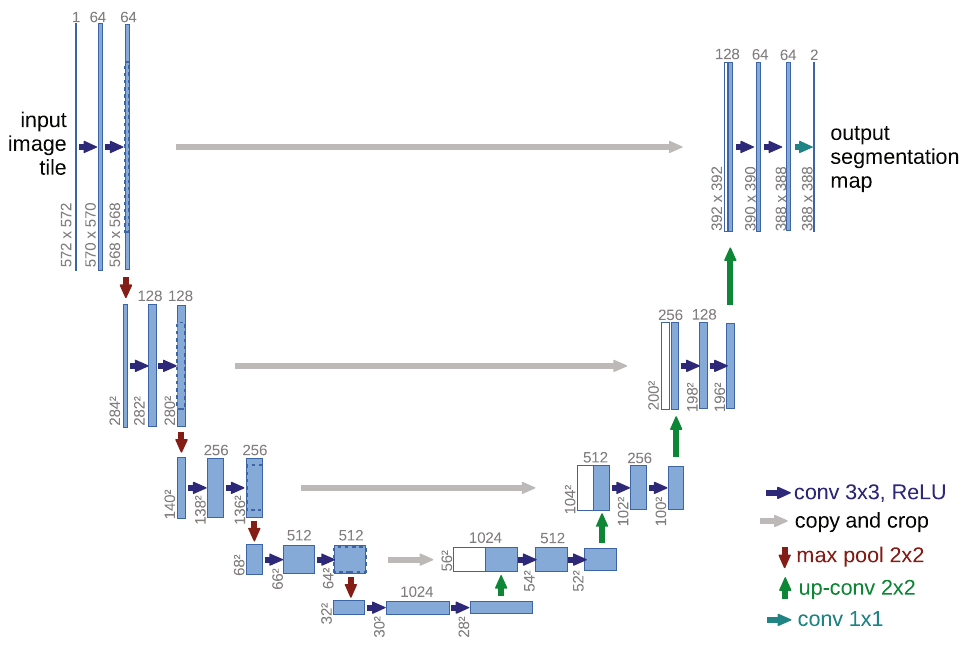
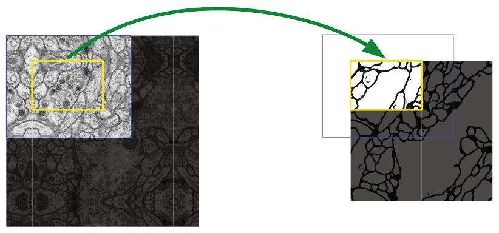
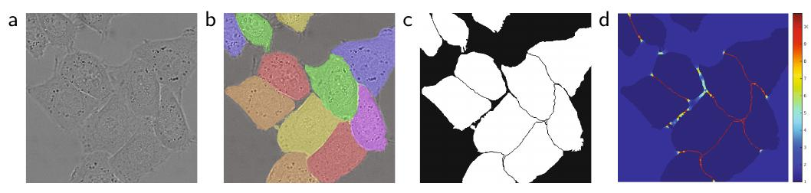
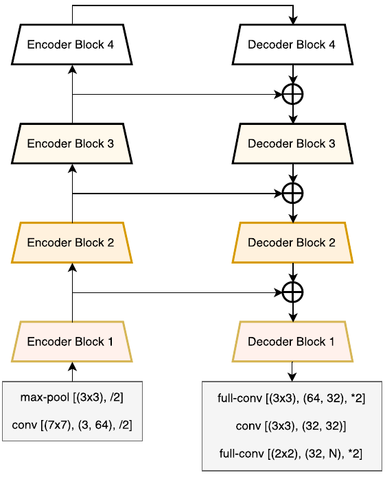
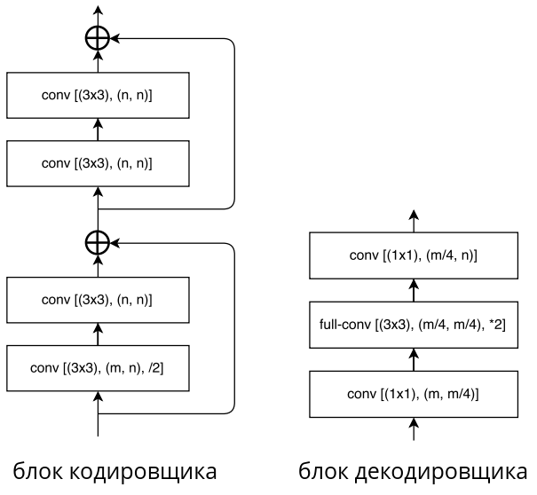
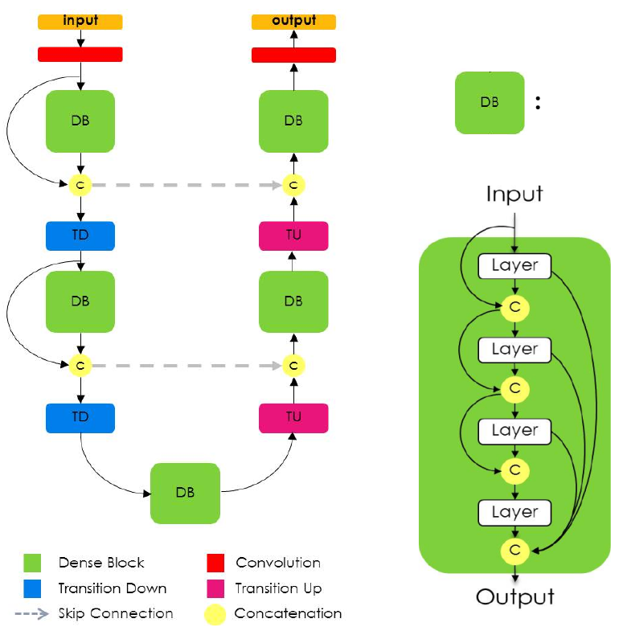
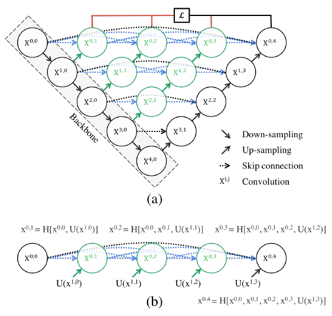
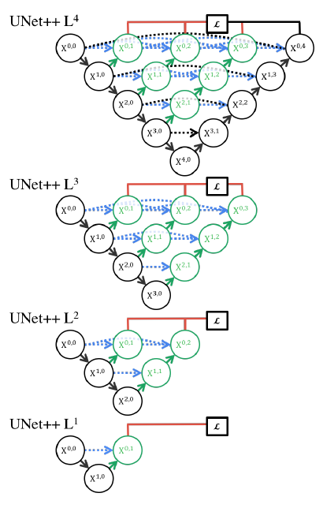

# Модель U-net и её варианты

## Базовая модель U-net

### Архитектура U-net

Модель **U-net** [[1]](https://link.springer.com/chapter/10.1007/978-3-319-24574-4_28) осуществляет [семантическую сегментацию](Semantic-segmentation-task), используя [свёрточный кодировщик и декодировщик](Semantic-segmentation-approaches#кодировщик-декодировщик). 

Кодировщик постепенно сжимает пространственное разрешение, применяя [свёртки](../ConvPool-Images/Conv-images) 3x3 без [паддинга](../ConvPool-Images/Conv-params#паддинг), а также используя [пулинги](../ConvPool-Images/Pooling) 2x2 с шагом 2. Уменьшение разрешения частично компенсируется увеличением числа слоёв после каждого пулинга.

Декодировщик же постепенно увеличивает пространственное разрешение, используя  [соответствующие операции](Upsampling-operations) (upsampling) с одновременным уменьшением числа каналов. В декодировщике дополнительно применяются свёртки 3x3.

Проблема [недостаточно точного восстановления границ](Semantic-segmentation-approaches#ограничение-архитектуры) из низкоразмерного промежуточного представления кодировщика решается тем, что внутренние представления кодировщика более высокого пространственного разрешения передаются на соответствующие слои декодировщика, как показано серыми линиями на схеме [[1]](https://link.springer.com/chapter/10.1007/978-3-319-24574-4_28):

Объединение информации из декодировщика и кодировщика происходит путём **конкатенации** внутренних представлений вдоль каналов.

Выходом U-net является тензор $\hat{Y}\in\mathbb{R}^{C\times H\times W}$, где

- $H,W$ - высота и ширина сегментируемого изображения;

- $C$ - число классов, включая фоновый (на схеме $C=2$).

К выходу для каждого пикселя применяется [SoftMax-преобразование](../MLP/Outputs-loss-functions#многоклассовая-классификация), чтобы получить вероятности классов. Модель настраивается, используя [кросс-энтропийную функцию ошибки](../MLP/Outputs-loss-functions#многоклассовая-классификация).

Поскольку в сети многократно применяются свёртки 3x3 без расширения, то пространственная размерность постепенно снижается на границах. Поэтому при переносе внутренних представлений с кодировщика они обрезаются по краям, чтобы конкатенировались тензоры одинакового пространственного размера.

Для того, чтобы после всех свёрток на выходе получить ту же пространственную размерность, которой обладало сегментируемое изображение, входное изображение перед обработкой [расширяется](../ConvPool-Images/Conv-params#паддинг) с помощью отражения пикселей по краям (mirror padding), как показано на рисунке [[1]](https://link.springer.com/chapter/10.1007/978-3-319-24574-4_28):

### Настройка сети U-net

Сеть настраивается, используя [принцип максимума правдоподобия](../../Machine-learning/Base-concepts/MaxLikelihood-Connection), максимизируя взвешенное правдоподобие отнесения каждого пикселя $x_{ij}$ к верному классу: 

$$
\sum_i\sum_j w_{ij}\log p(\hat{c}_{ij})\to \max_w,
$$

Вес учёта каждого пикселя $(i,j)$ считался по формуле

$$
w_{ij} = w(c_{ij})+\alpha e^{-\frac{d_1(i,j)+d_2(i,j)}{2\sigma^2}},
$$

где 

- $\alpha>0, \sigma>0$ - гиперпараметры,  

- $w(c_{ij})$ - вес класса (выше для более редких, чтобы классы вносили сопоставимый вклад в оптимизацию),

- $d_1(i,j),d_2(i,j)$ - минимальные расстояния до ближайших границ других двух классов.

Такое взвешивание позволило <u>сильнее учитывать редкие классы</u>, а также <u>точнее выделять границы между областями разных классов</u>, повышая значимость корректной классификации именно пограничных областей.

Ниже на графике (d) показана пространственная карта весов для сегментируемого изображения (a), корректной сегментации (b) сегментационной карты (с) и весов $w_{ij}$ (d) [[1]](https://link.springer.com/chapter/10.1007/978-3-319-24574-4_28):

> Архитектура U-net задала стандарт переноса промежуточных представлений кодировщика в декодировщик, и сейчас этот принцип используется во многих задачах, где по входному изображению нужно сгенерировать выходное (image-to-image tasks).

# Варианты архитектуры U-net

Рассмотрим варианты изменения архитектуры U-net для семантической сегментации.

## LinkNet

Модель **LinkNet** [[2]](https://arxiv.org/pdf/1707.03718) построена с целью <u>упрощения вычислений и настройки модели</u> по сравнению с U-net.

Архитектура LinkNet показана на рисунке [[2]](https://arxiv.org/pdf/1707.03718):

Она состоит из **кодировщика** (слева), на котором пространственное разрешение снижается на каждом блоке, и **декодировщика** (справа), каждый блок которого постепенно увеличивает разрешение, чтобы в конце вернуть его к разрешению исходного изображения.

Детализация каждого блока кодировщика и декодировщика приведена ниже [[2]](https://arxiv.org/pdf/1707.03718):

Здесь 

- conv [(AxA),(B,C)] обозначает свёрточный слой с ядром свёртки AxA, переводящий внутреннее представление из B в С каналов; 

- /2 означает уменьшение разрешения в 2 раза за счёт свёртки с шагом 2;

- *2 означает увеличение разрешения в 2 раза.

Вычислительная эффективность LinkNet обеспечивается тем, что

- промежуточные представления кодировщика <u>не конкатенируются, а суммируются</u> с промежуточными представлениями декодировщика;

- в блоке декодировщика перед применением свёртки 3x3 действует слой [свёрток 1x1](../ConvPool-Images/Special-conv#поточечная-свёртка), снижающий число каналов в 4 раза. После действия свёрток 3x3 число каналов возвращается к исходному также свёртками 1x1.

Для упрощения настройки сети в каждом блоке кодировщика используются [ResNet-блоки](../Convolutional-architectures/ResNet#остаточный-блок). Тождественные связи этих блоков (с понижением разрешения) упрощают 

- перетекание информации об исходном изображении через кодировщик;

- распространение градиента на ранние слои при настройке сети в методе [обратного распространения ошибки](../Training/Backpropagation).

## One Hundred Layers Tiramisu

**One Hundred Layers Tiramisu** [[3]](https://openaccess.thecvf.com/content_cvpr_2017_workshops/w13/html/Jegou_The_One_Hundred_CVPR_2017_paper.html) также основана на идее U-net, но использует [dense-блоки](../Convolutional-architectures/DenseNet) как базовые элементы. 

Её архитектура представлена ниже [[3]](https://openaccess.thecvf.com/content_cvpr_2017_workshops/w13/html/Jegou_The_One_Hundred_CVPR_2017_paper.html):

- Блок Transition Down снижает разрешение в 2 раза, используя максимизирующий пулинг.

- Блок Transition Up повышает разрешение в 2 раза, используя [транспонированную свёртку](Upsampling-operations#транспонированная-свёртка).

Серые связи обозначают перенос промежуточных представлений кодировщика (слева) в декодировщик (справа). Объединение представлений производится не суммированием, как в LinkNet, а конкатенацией вдоль каналов, как в U-net.

Dense-блоки лучше сохранить информацию с более ранних представлений, поскольку она напрямую наследуется с более ранних слоёв (посредством конкатенации вдоль каналов). Это позволяет лучше сохранить информацию о первоначальном изображении для более точной итоговой сегментации.

За счёт конкатенаций внутренних представлений в dense-блоках и при переносе информации из кодировщика в декодировщик сети приходится обрабатывать повышенное число каналов. Поэтому сеть One Hundred Layers Tiramisu более требовательна к вычислениям, чем LinkNet, зато может обеспечить более высокую точность сегментации при достаточно большой обучающей выборке.

## U-net++

Встроенная проблема методологии U-net заключается в том, что <u>более низкоуровневые и простые признаки напрямую объединяются с более высокоуровневыми и сложными</u>. 

Для решения этой проблемы в архитектуре **U-net++** [[4]](https://arxiv.org/pdf/1807.10165) предложено вместо непосредственной конкатенации внутренних представлений кодировщика и декодировщика конкатенировать <u>преобразованные</u> представления кодировщика через dense-блоки, как показано ниже [[4]](https://arxiv.org/pdf/1807.10165):

> Dense-блок призван приводить в семантическое соответствие более простые представления кодировщика с более сложными представлениями декодировщика. 

Разница в семантической сложности выше для более высоких ярусов сети, поэтому там dense-блоки глубже. В этих блоках действует свёртка с [нелинейностью](../MLP/Activation-functions), принимающая на вход конкатенацию всех предыдущих слоёв блока.

Архитектура U-net++ показала более высокое качество по сравнению с U-net [[1]](https://link.springer.com/chapter/10.1007/978-3-319-24574-4_28).

Настройка сети велась, минимизируя сумму [кросс-энтропийных потерь](../MLP/Outputs-loss-functions#многоклассовая-классификация) и коэффициента [dice](Semantic-segmentation-quality-metrics#iou-и-dice), причём потери считались по выходам всех верхних ярусов сети $X^{0,1},X^{0,2},X^{0,3},X^{0,4}$ (принцип **deep supervision**). На выходе это позволяет считать прогнозы не только по $X^{0,4}$, но и по урезанным версиям U-net++, выдающим прогнозы на слоях $X^{0,3},X^{0,2}$ и $X^{0,1}$. 

Урезанные (prunned) версии сети показаны ниже [[4]](https://arxiv.org/pdf/1807.10165):

Более короткие версии U-net++ позволяют производить семантическую сегментацию менее точно, зато более быстро.

## Литература

1. [Ronneberger O., Fischer P., Brox T. U-net: Convolutional networks for biomedical image segmentation //Medical image computing and computer-assisted intervention–MICCAI 2015: 18th international conference, Munich, Germany, October 5-9, 2015, proceedings, part III 18. – Springer International Publishing, 2015. – С. 234-241.](https://link.springer.com/chapter/10.1007/978-3-319-24574-4_28)
2. [Chaurasia A., Culurciello E. Linknet: Exploiting encoder representations for efficient semantic segmentation //2017 IEEE visual communications and image processing (VCIP). – IEEE, 2017. – С. 1-4.](https://arxiv.org/pdf/1707.03718)
3. [Jégou S. et al. The one hundred layers tiramisu: Fully convolutional densenets for semantic segmentation //Proceedings of the IEEE conference on computer vision and pattern recognition workshops. – 2017. – С. 11-19.](https://openaccess.thecvf.com/content_cvpr_2017_workshops/w13/html/Jegou_The_One_Hundred_CVPR_2017_paper.html)
4. [Zhou Z. et al. Unet++: A nested u-net architecture for medical image segmentation //Deep Learning in Medical Image Analysis and Multimodal Learning for Clinical Decision Support: 4th International Workshop, DLMIA 2018, and 8th International Workshop, ML-CDS 2018, Held in Conjunction with MICCAI 2018, Granada, Spain, September 20, 2018, Proceedings 4. – Springer International Publishing, 2018. – С. 3-11.](https://arxiv.org/pdf/1807.10165)
