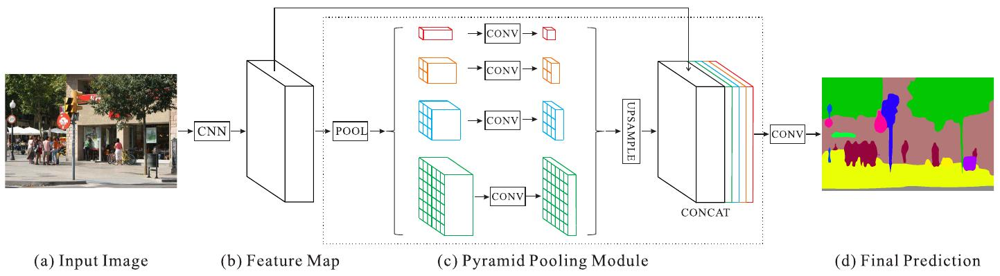
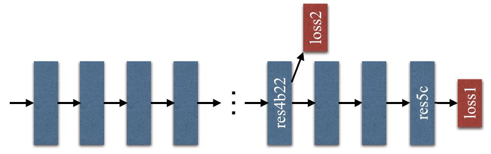
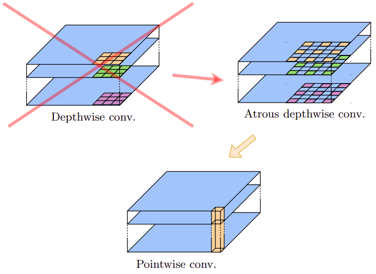
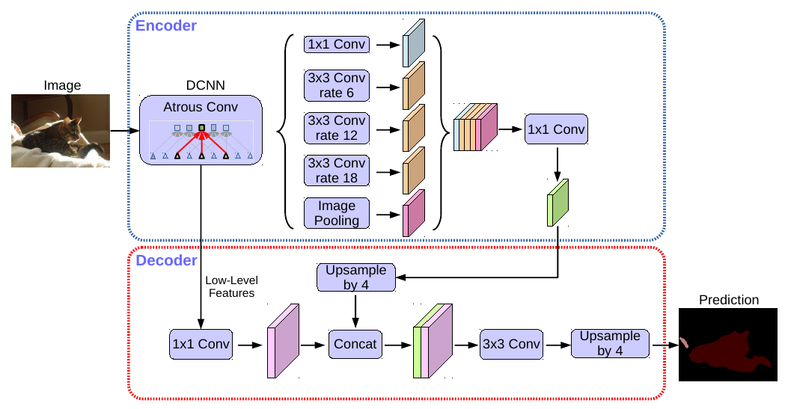
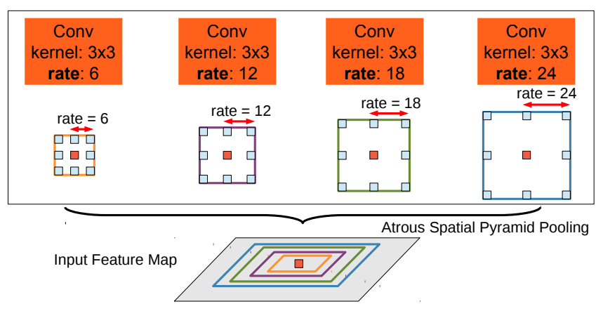

# Учёт контекста

Недостатком классических архитектур для задачи [семантической сегментации](Semantic-segmentation-task) является то, что они основаны на [свёртках](../ConvPool-Images/Conv-images), имеющих [ограниченную область видимости](../ConvPool-1D/Conv-1D#извлечение-сложных-нелинейных-признаков) (receptive field). Из-за этого сегментация производится <u>слишком локально, не учитывая более широкий контекст всего изображения</u>.

> Например, при сегментации изображения катера на реке, он может ошибочно относиться к классу "машина", потому что он имеет похожий капот и стёкла. Но если бы нейросеть могла видеть более широкий контекст (что вокруг изображена вода), то она не стала бы относить катер к классу "машина".

Учитывать более широкий контекст можно, увеличивая число свёрточных слоёв. Тогда более поздние свёртки будут иметь более широкую область видимости. Однако это приводит к большему числу вычислений и усложняет настройку сетей.

Для эффективного учёта контекста можно использовать свёртки со [сдвигом](../ConvPool-Images/Conv-params#сдвиг-dilation) (dilation) больше единицы либо учитывать результаты [пирамидального пулинга](../ConvPool-Images/Pooling#пирамидальный-пулинг), что реализуется в моделях, описанных далее.

## PSPNet

Модель **PSPNet** [[1]](https://openaccess.thecvf.com/content_cvpr_2017/html/Zhao_Pyramid_Scene_Parsing_CVPR_2017_paper.html) позволяет повысить точность семантической сегментации за счёт использования более глобального контекста, чем область видимости свёрток. Это достигается тем, что промежуточное представление, по которому производится сегментация, состоит из

- промежуточного представления классификатора [ResNet101](../Convolutional-architectures/ResNet#варианты-архитектуры) со свёртками со сдвигом (dilation) больше единицы;

- выходов пирамидального пулинга, растянутых до пространственных размеров промежуточного представления из ResNet101.

Графически схема PSPNet показана ниже [[1]](https://openaccess.thecvf.com/content_cvpr_2017/html/Zhao_Pyramid_Scene_Parsing_CVPR_2017_paper.html):

Использовалось 4 слоя пирамидального пулинга с сетками 1x1, 2x2, 3x3, 6x6. Для того, чтобы уменьшить число каналов, получаемых из пирамидального пулинга, признаки  пулинга пропускались через [свёртки 1x1](../ConvPool-Images/Special-conv#поточечная-свёртка), снижающие число каналов в 4 раза.

Кодировщик ResNet101 обучался на задачу классификации. Для более эффективной настройки во время его обучения использовались потери классификации как в конце сети, так и в середине (принцип **deep supervision**), что графически показано на рисунке:

Использование свёрток со сдвигом больше единицы (dilation>1) дополнительно повышало область видимости свёрток, заставляя их использовать более широкий контекст исходного изображения.

## DeepLab

**DeepLab** представляет собой серию моделей версии 1,2,3,3+ с постепенным улучшением качества. Рассмотрим **DeepLab v3+** [[2]](https://openaccess.thecvf.com/content_ECCV_2018/html/Liang-Chieh_Chen_Encoder-Decoder_with_Atrous_ECCV_2018_paper.html). Для извлечения промежуточного признакового описания использовались свёрточные слои архитектуры [Xception](../Convolutional-architectures/ResNet-improvements#xception-и-resnext), основанной на использовании [поканальных сепарабельных свёрток](../ConvPool-Images/Special-conv#поканальная-свёртка) (depthwise separable convolutions), состоящих из поканальных свёрток, поверх которых действовали свёртки 1x1. В DeepLab v3+ поканальные свёртки шли со сдвигом (dilation) больше единицы и назывались **Atrous convolutions**. 

Графически произведённая замена показана ниже [[2]](https://openaccess.thecvf.com/content_ECCV_2018/html/Liang-Chieh_Chen_Encoder-Decoder_with_Atrous_ECCV_2018_paper.html):

Также в DeepLab v3+ параллельно использовался набор свёрток с разным сдвигом: dilation=6,12,18, которые дополнялись признаками из [глобального пулинга](../ConvPool-Images/Pooling#глобальный-пулинг). Эта конструкция была названа Atrous Spatial Pyramid Pooling (ASPP).

Архитектура DeepLab v3+ целиком показана ниже [[2]](https://openaccess.thecvf.com/content_ECCV_2018/html/Liang-Chieh_Chen_Encoder-Decoder_with_Atrous_ECCV_2018_paper.html):

А еще ниже показан стэк из свёрток с разным сдвигом (для архитектуры DeepLab v2) [[3]](https://ieeexplore.ieee.org/abstract/document/7913730):

Результаты действия свёрток с разными сдвигами конкатенировались и дополнялись признаками, полученными с [глобального пулинга](../ConvPool-Images/Pooling#глобальный-пулинг). 

> Всё это позволило при сегментации пикселей учитывать как локальные контексты разного размера, так и глобальный контекст в целом. 

Далее в архитектуре число каналов снижалось свёртками 1x1. Для улучшенного сохранения информации о границах объектов, низкоуровневые признаки с промежуточного слоя кодировщика конкатенировались с промежуточным представлением декодировщика.

## Литература

1. [Zhao H. et al. Pyramid scene parsing network //Proceedings of the IEEE conference on computer vision and pattern recognition. – 2017. – С. 2881-2890.](https://openaccess.thecvf.com/content_cvpr_2017/html/Zhao_Pyramid_Scene_Parsing_CVPR_2017_paper.html)
2. [Chen L. C. et al. Encoder-decoder with atrous separable convolution for semantic image segmentation //Proceedings of the European conference on computer vision (ECCV). – 2018. – С. 801-818.](https://openaccess.thecvf.com/content_ECCV_2018/html/Liang-Chieh_Chen_Encoder-Decoder_with_Atrous_ECCV_2018_paper.html)
3. [Chen L. C. et al. Deeplab: Semantic image segmentation with deep convolutional nets, atrous convolution, and fully connected crfs //IEEE transactions on pattern analysis and machine intelligence. – 2017. – Т. 40. – №. 4. – С. 834-848.](https://ieeexplore.ieee.org/abstract/document/7913730)
