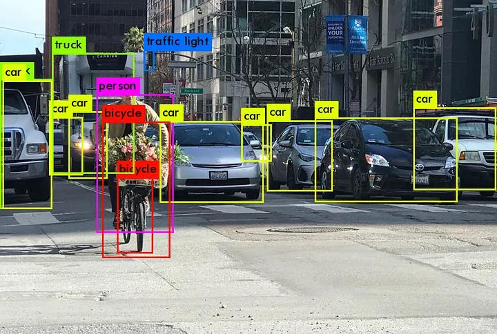
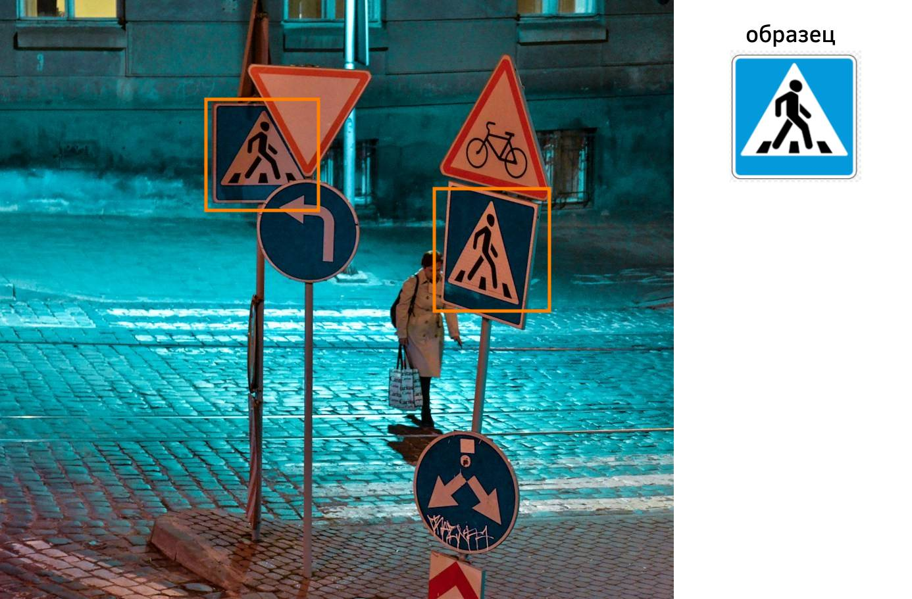

# Детекция объектов

В задаче **детекции объектов** (object detection) на входном изображении необходимо найти и выделить прямоугольной рамкой все объекты заданных классов, как показано ниже [[1]](https://medium.com/@henriquevedoveli/metrics-matter-a-deep-dive-into-object-detection-evaluation-ef01385ec62):

Задача детекции активно применяется в различных областях:

- подсчёт количества участников мероприятия;

- оценка пассажиропотока в общественном транспорте;

- детектирование людей в системах безопасности, детектирование запрещённых предметов;

- детектирование товаров на полках в магазине и на складах в целях оптимизации логистики;

- детектирование транспортных средств, пешеходов, светофоров и дорожных знаков в машинах с автоматическим управлением (self-driving cars).

## Простой подход к детекции

Для детектирования определённого объекта можно задать его изображение-образец и прикладывать этот образец ко всевозможным позициям на входном изображении, вычисляя корреляцию образца с каждым фрагментом входа. Высокая корреляция будет свидетельствовать о наличии интересующего объекта, который помечается рамкой, как показано на рисунке:

> Искомый объект может быть разного размера, поэтому нужно применить этот метод ко входному изображению в разных разрешениях. 

Указанный подход подходит для случаев, когда распознаваемый объект имеет примерно одинаковый вид - например, когда выделяем определённые буквы и цифры при распознавании печатного текста. 

В общем же случае он имеет ограниченную применимость:

- обрабатываемая фотография могла быть сделана в разное время суток, целевой  объект, освещённый по-другому, может уже не выделяться;

- объект может располагаться под углом, что также снизит корреляцию с образцом;

- если выделяем более сложный объект, например, машину, то она может быть разных цветов, моделей и форм.

Многообразие вариантов присутствия объекта на изображении не позволяет выделить его, сравнивая с одним или несколькими образцами.

Поэтому для детекции используют нейросети, способные выделять сложные объекты общего вида. Мы рассмотрим базовые методы детекции объектов, такие как [YOLO](YOLO), [SSD](SSD), [RetinaNet](RetinaNet), [CornerNet](CornerNet), [CenterNet](CenterNet) и другие.

## Литература

1. [medium.com/@henriquevedoveli: Metrics Matter: A Deep Dive into Object Detection Evaluation.](https://medium.com/@henriquevedoveli/metrics-matter-a-deep-dive-into-object-detection-evaluation-ef01385ec62)
