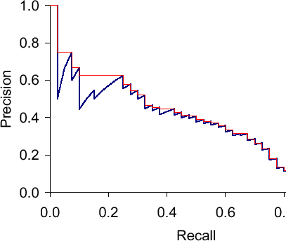

# Оценка качества детекции

При [детекции объектов](Object-detection-task) класс объекта может быть определён верно и неверно (ошибка классификации). Также выделяющая объект рамка может хорошо или плохо согласовываться с истинным выделением по мере [IoU](../Semantic-segmentation/Semantic-segmentation-quality-metrics#iou-и-dice) (ошибка локализации).

В зависимости от этих ошибок возможны следующие типы выделения объектов моделью:

- **верноположительные** (true positives): модель корректно распознала класс объекта и выделила его рамкой, сильно пересекающейся с истинной рамкой ($\text{IoU}\ge \alpha$);

- **ложноположительные** (false positives): модель выделила рамкой объект, которого на самом деле нет либо выделила присутствующий объект, но неточно ($\text{IoU}< \alpha$);

- **ложноотрицательные** (false negatives): модель не распознала реально присутствующий объект.

> Случаи **верноотрицательных детекций** (true negatives), как в бинарной классификации, в задаче детекции не рассматриваются, поскольку, строго говоря, им соответствуют все случаи, когда модель корректно не сработала на отсутствие объектов, а нас интересуют только корректные/некорректные выделения объектов <u>целевых классов</u>.

Далее для конкретного класса (например, "машина") считаются меры [Precision и Recall](../../Machine-learning/Classifier-evaluation/Special-binary-label-quality-estimation#точность-и-полнота), как в бинарной классификации:

$$
\text{Precision}=\frac{TP}{TP+FP}
$$

$$
\text{Recall}=\frac{TP}{TP+FN}
$$

Например, для класса "машина": 

- мера Precision показывает, как часто среди детекций машин действительно оказывались корректно выделенные машины;

- мера Recall показывает, какую долю машин среди реально присутствующих на изображении автомобилей детектор сумел корректно выделить.

Как и в бинарной классификации, можно вычислять [F-меру](../../Machine-learning/Classifier-evaluation/Special-binary-label-quality-estimation#f-мера), агрегирующую Precision и Recall через среднее гармоническое:

$$
\text{F-measure} = \frac{2\cdot\text{Precision}\cdot\text{Recall}}{\text{Precision}+\text{Recall}}
$$

Важно понимать, что меры Precision и Recall вычисляются для фиксированного значения порога $\alpha$. При изменении этого порога они будут другими. В общем случае это некоторые функции от порога:

$$
\begin{aligned}
\text{Precision} &= \text{Precision}(\alpha) \\
\text{Recall} &= \text{Recall}(\alpha)
\end{aligned}
$$

Как будут изменяться Precision и Recall при увеличении $\alpha$?

При увеличении $\alpha$ детектор будет осторожнее выделять объекты - только там, где он больше в них уверен. Соответственно, Precision будет увеличиваться ценой того, что Recall будет становиться ниже.  

Варьируя $\alpha$ от 0 до 1, можно построить график зависимости P(R)=Precision(Recall), который называется **графиком зависимости точности от полноты** (precision-recall curve), с которым мы уже сталкивались [при оценке качества семантической сегментации](../Semantic-segmentation/Semantic-segmentation-quality-metrics#average-precision). 

Пример этого графика показан синей кривой ниже [[1]](https://medium.com/@kemal.oksz/which-one-to-measure-the-performance-of-object-detectors-ap-or-olrp-936d072a6eb0):

Как видим, график имеет пилообразную форму, поэтому его сглаживают, заменяя значение precision для каждого значения recall на максимальное значение precision при всевозможных значениях recall выше порога:

$$
P(R)\longrightarrow \tilde{P}(R)=\max_{\tilde{R}\ge R} P(\tilde{R})
$$

Точность $\tilde{P}$ называют **интерполированной точностью** (interpolated precision), и её зависимость от Recall показана на графике выше красной кривой.

Для оценки качества детектора при всевозможных порогах $\alpha$ вычисляют меру **Average Precision** (AP) как площадь под графиком интерполированной точности:

$$
AP=\int_0^1 \tilde{P}(R)dR
$$

> На практике для этого часто разбивают значения Recall на равномерно распределённые значения $R_0,R_1,...R_K$ (обычно  $\{0,0.1,0.2,...0.9,1\}$) и вычисляют приближённую площадь:
> 
> $$
> AP = \sum_{k=1}^K\tilde{P}(R_k)(R_k-R_{k-1})
> $$

Если усреднять $AP_c$ по каждому из $C$ классов в многоклассовой классификации, то получим величину **Mean Average Precision** (mAP):

$$
mAP=\frac{1}{C}\sum_{c=1}^{C}AP_c
$$

## Литература

1. [medium.com/@kemal.oksz: Evaluating Object Detectors: Average Precision (AP), and Localization-Recall-Precision (LRP).](https://medium.com/@kemal.oksz/which-one-to-measure-the-performance-of-object-detectors-ap-or-olrp-936d072a6eb0)

