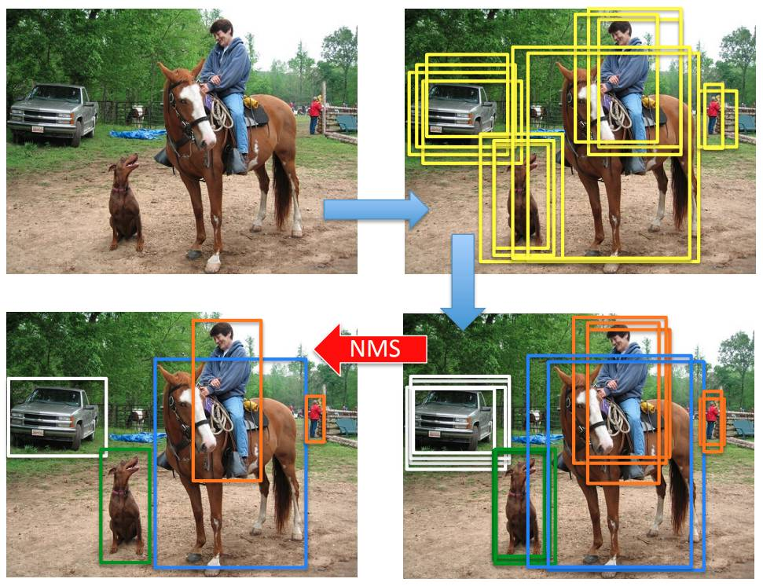
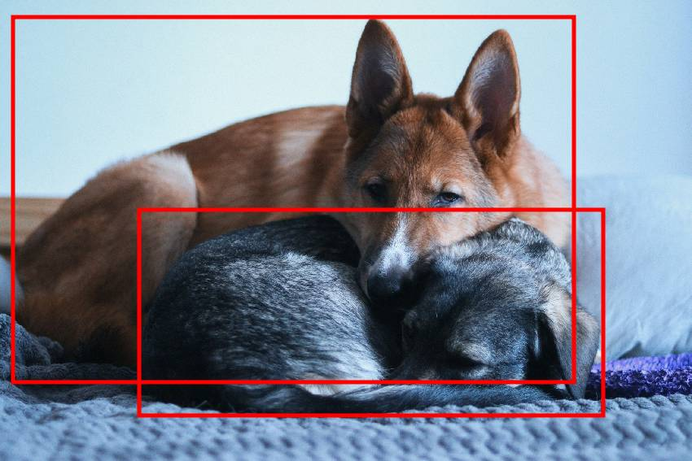

# Подавление немаксимумов

## Базовый алгоритм NMS

Алгоритмы [детекции объектов](Object-detection-task) генерируют избыточное количество выделений объектов интересующих классов, как показано на рисунке справа-вверху [[1]](https://www.cs.umd.edu/~bharat/snms.pdf):

Эти выделения соотносятся тому или иному классу классификатором, назначающим степень принадлежности рамки каждому классу (рейтинг класса). Расположение самого выделения немного уточняется регрессором, как показано справа внизу. 

Чтобы отобрать <u>минимально достаточный набор выделений</u>, используется **алгоритм подавления немаксимумов** (non-maximum supression, NMS), фильтрующий избыточные детекции, имеющие сильное пересечение по мере [IoU](../Semantic-segmentation/Semantic-segmentation-quality-metrics#iou-и-dice) с другими, обладающими более высоким рейтингом. Он применяется <u>для каждого класса в отдельности</u>. 

Алгоритм принимает на вход набор детекций (выделяющих рамок) $B$ и соответствующих рейтингов (вероятностей определённого класса) $S$, а на выходе выдаёт самые явные детекции без повторений $B'$ с соответствующими рейтингами $S$. Он работает следующим образом:

> ВХОД:
> 
> - $B=\{\mathbf{b}_1,...\mathbf{b}_N\}$ - первоначальные детекции
> 
> - $S=\{s_1,...s_N\}$ - их рейтинги
> 
> - $\alpha\in (0,1]$ - гиперпараметр NMS
> 
> АЛГОРИТМ:
> 
> - $B'=\{\}$ - инициализируем выходные детекции
> 
> - $S'=\{\}$ - инициализируем выходные рейтинги
> 
> - пока $B\ne \{\}$:
>   
>   - $m:=\arg\max S$
>   
>   - $B':=B'+ \{\mathbf{b}_m\}$
>   
>   - $B:=B-\{\mathbf{b}_m\}$
>   
>   - для $\mathbf{b}_i \in B$:
>     
>     - если $\text{IoU}(\mathbf{b}_m,\mathbf{b}_i)\ge \alpha$, то
>       
>       - $B:=B-\{\mathbf{b}_i\}$
>       
>       - $S:=S-\{s_i\}$
> 
> - вернуть $B',S$

где прибавление/вычитание элемента из набора означает добавление/исключение этого элемента из множества.

## Мягкий вариант алгоритма NMS

Базовый алгоритм подавления немаксимумов жёстко отбрасывает выделения, имеющие IoU$\ge\alpha$ с другим выделением, имеющим более высокий рейтинг. Это может негативно сказаться на количестве обнаруженных объектов ([recall](Quality-metrics)), которые сильно пересекаются, как на рисунке ниже:

Для того, чтобы этого не происходило, в работе [[1]](https://www.cs.umd.edu/~bharat/snms.pdf) предлагается оставлять все детекции, но для выделений, имеющих сильное пересечение с другими высокорейтинговыми выделениями, дополнительно снижать рейтинг. Итоговыми детекциями будут те, у которых рейтинг выше некоторого порога $\beta>0$, устанавливая который достаточно низким, можно извлечь большее число объектов (ценой более частых дублированных выделений одного и того же объекта). 

Этот алгоритм называется **мягким подавлением немаксимумов** (soft-NMS) и работает следующим образом:

> ВХОД:
> 
> - $B=\{\mathbf{b}_1,...\mathbf{b}_N\}$ - первоначальные детекции
> 
> - $S=\{s_1,...s_N\}$ - их рейтинги
> 
> - $\alpha\in (0,1]$ - гиперпараметр NMS
> 
> АЛГОРИТМ:
> 
> - $B'=\{\}$ - инициализируем выходные детекции
> 
> - пока $B\ne \{\}$:
>   
>   - $m:=\arg\max S$
>   
>   - $B':=B'+\{\mathbf{b}_m\}$
>   
>   - $B:=B-\{\mathbf{b}_m\}$
>   
>   - для $b_i \in B$:
>     
>     - $s_i:=s_i\cdot f(\text{IoU}(\mathbf{b}_m,\mathbf{b}_i))$
> 
> - вернуть $D,S$

Как видим, в качестве $\mathbf{b}_m$ в этот раз перебираются все детекции из $B$, в результате чего $B'=B$, т.е. выходные детекции совпадают со всеми входными, однако рейтинг детекций, имеющих сильное пересечение с другими высокорейтинговыми выделениями, оказывается сниженным за счёт домножения исходного рейтинга на $f(\text{IoU}(\mathbf{b}_m,\mathbf{b}_i))$ для некоторой убывающей функции $f(\cdot)$, принимающей значения на отрезке $[0,1]$. Предлагаются два варианта этой функции:

- линейное перевзвешивание:

$$
f(\text{IoU}(b_m,b_i))=
\begin{cases}
1, & \text{IoU}(\mathbf{b}_m,\mathbf{b}_i)<\alpha, \\
1-\text{IoU}(\mathbf{b}_m,\mathbf{b}_i), & \text{IoU}(\mathbf{b}_m,\mathbf{b}_i)\ge\alpha \\
\end{cases}
$$

- Гауссово перевзвешивание:
  
  $$
  f(\text{IoU}(\mathbf{b}_m,\mathbf{b}_i))=e^{-\frac{\text{IoU}(\mathbf{b}_m,\mathbf{b}_i)}{\sigma}},\quad \sigma>0 \text{ - гиперпараметр}
  $$

Линейное перевзвешивание приводит к разрывному масштабированию, в отличие от Гауссова. В экспериментах [[1]](https://www.cs.umd.edu/~bharat/snms.pdf) мягкое подавление немаксимумов оказалось лучше, чем жёсткое. При этом иногда доминировало линейное, а иногда - Гауссово перевзвешивание. 

## Литература

1. [Bodla N. et al. Soft-NMS--improving object detection with one line of code //Proceedings of the IEEE international conference on computer vision. – 2017. – С. 5561-5569.](https://www.cs.umd.edu/~bharat/snms.pdf)
