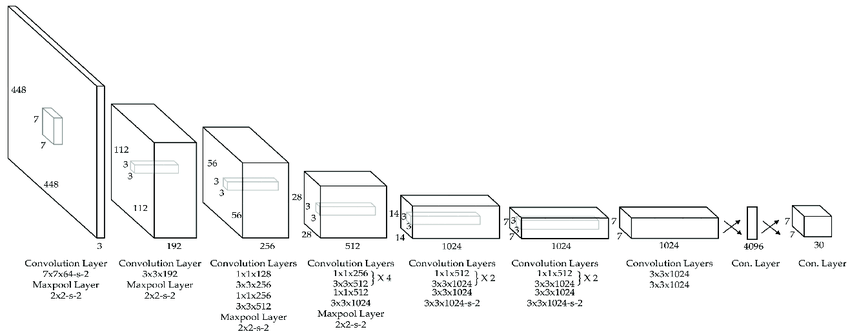
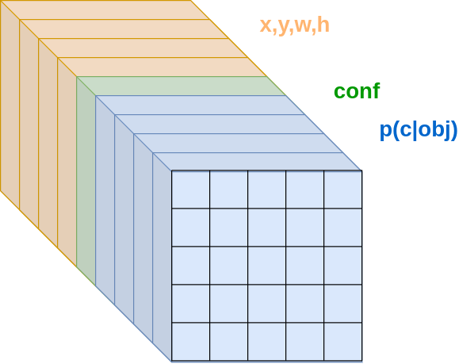

# Модель YOLO

Модель **YOLO** (You Only Look Once, [[1]](https://arxiv.org/abs/1506.02640)) - одна из простейших и самых быстрых нейросетевых моделей для [задачи детекции объектов](Object-detection-task). Её архитектура представлена ниже [[2]](https://www.mdpi.com/2220-9964/8/1/45):

Признаки из изображения извлекаются последовательными свёрточными слоями. Для уменьшения пространственного разрешения используется [шаг свёртки](../ConvPool-Images/Conv-params#шаг-stride) (stride), равный 2. Все пространственные свёртки, кроме первой, имеют размер 3x3, как в [VGG](../Convolutional-architectures/VGG). Для уменьшения числа вычислений перед применением этих свёрток число каналов уменьшается вдвое [свёртками 1x1](../ConvPool-Images/Special-conv#поточечная-свёртка). 

На первом слое, пока изображение представляет собой тензор со всего тремя каналами, применяется свёртка 7x7 и шагом 2, чтобы сразу его уменьшить и последующие вычисления вести более эффективно в уменьшенном разрешении. В конце идут два полносвязных слоя, чтобы итоговые детекции могли учитывать <u>контекст со всего изображения</u>. 

Выход 2-го полносвязного слоя преобразуется снова в пространственный тензор размера $S\times S\times (B*5+C)$, где

- $S$ - размер сетки (в статье $S=7$);

- $B$ - число предсказываемых рамок объектов в каждой ячейке сетки (в статье $B=2$);

- $C$ - число классов для извлекаемых объектов.

Выходной тензор YOLO (для $B=1$ и $S=5$) показан ниже:

В каждой ячейке сетки предсказывается **степень присутствия объекта** $conf\in[0,1]$ в соответствующей ячейке, $C$ вероятностей для каждого класса при условии присутствия объекта $p(1|obj),...p(C|obj)$, а также координаты левого верхнего угла рамки, выделяющей объект $(x,y)$, и её ширина и высота $(w,h)$.

**Степень присутствия объекта** вычисляется как произведение вероятности присутствия объекта (среди одного из $C$ распознаваемых классов), умноженную на степень согласованности между предсказанным и реальным выделением по мере [IoU](../Semantic-segmentation/Semantic-segmentation-quality-metrics#iou-и-dice):

$$
conf=p(obj)\cdot IoU_{true}^{pred}
$$

Когда модель обучена, 

- по величинам $conf$ мы можем понять, где именно объект присутствует;

- по условным вероятностям классов понять, какого он класса; 

- а по предсказанным $(x,y,w,h)$ - локализовать его.

Для повышения полноты поиска ([recall](Quality-metrics)) объект в каждой ячейке сетки локализовывался $B$ раз различными выделяющими рамками (но одним и тем же классом).

Технически на последнем слое для $w,h,conf$ применялась [сигмоидная функция активации](../MLP/Activation-functions#сигмоидная-функция-активации-sigmoid) (чтобы обеспечить неотрицательность), а к условным вероятностям классов применялось [SoftMax-преобразование](../MLP/Outputs-loss-functions#softmax-преобразование).

$w,h$ вычислялись как <u>доли</u> ширины и высоты всего изображения, а $x,y$ - как поправочные сдвиги относительно центра ячейки сетки, в которой детектировался объект. $x,y$ пропускались через нелинейность [tangh](../MLP/Activation-functions#гиперболический-тангенс-tangh).

## Настройка модели

Для настройки модели YOLO в функции потерь нужно сопоставить корректные выделения объектов с выходами сети. Объект сопоставлялся той ячейке сетки $S\times S$, в которую <u>попадал центр его реального выделения</u>. Только от этой ячейки требовалось корректно предсказать наличие объекта и его выделить. Поскольку каждая ячейка делала $B$ предсказаний расположения и степени присутствия объекта, реальное выделение объекта сопоставлялось <u>только одной лучшей попытке</u> его выделить, у которой оказывалось максимальное IoU между предсказанной и реальной рамкой.

Итоговые потери, по которым настраивалась модель, состояли из трёх компонент:

- точность определения, что объект присутствует;

- точность определения класса объекта;

- точность локализации объекта.

### Точность определения, что объект присутствует

Точность обнаружения объекта вычислялась как $(1-conf)^2$, если объект есть, и как $(0-conf)^2$, если объекта нет. 

Среди $B$ предсказаний присутствия объекта в каждой ячейке сетки объект считался присутствующим только для одного предсказания, обладающего максимальным IoU с истинным выделением. 

> Это заставляло различные предикторы расположений для одной ячейки специализироваться на своих масштабах и соотношениях сторон при локализации объектов.

Если объекта не было, то это учитывалось в функции потерь <u>с меньшим весом</u>, чем ситуация, когда объект был. Это было сделано, поскольку ситуаций отсутствия объекта  <u>гораздо больше</u>, чем ситуаций, что он присутствует. Но именно последний случай представляет основной интерес.

### Точность определения класса объекта

Неточности в определении того, какому классу принадлежит объект, вычисляются по квадрату $L_2$-нормы расхождений вектора истинных вероятностей и предсказанных. 

В последующих версиях YOLO классификационные потери считались уже по [кросс-энтропийной функции потерь](../MLP/Outputs-loss-functions#кросс-энтропийные-потери-многоклассовые).

### Точность локализации объекта

Неточность локализации объекта штрафуется как

$$
(\hat{x}-x)^2+(\hat{y}-y)^2+(\sqrt{\hat{w}}-\sqrt{w})^2+(\sqrt{\hat{h}}-\sqrt{h})^2
$$

Для $w,h$ штрафуются отклонения не самих величин, а корней из них, чтобы повысить внимание модели к <u>точности локализации малых объектов</u>, имеющих небольшую ширину и высоту.

## Анализ модели

Архитектура YOLO проста в реализации и работает быстро. Недостатками YOLO являются:

- невысокая точность локализации, связанная с тем, что определение координат происходит только на основе карт признаков, полученных с последнего свёрточного слоя, имеющего <u>низкое пространственное разрешение</u>;

- в архитектуру конструктивно заложено <u>ограничение на максимальное число детекций</u>: модель не может найти на изображении больше объектов, чем использованное число ячеек выходной сетки (7x7=49 в стандартной конфигурации).

> Существуют и более поздние версии YOLO (YOLO v2-v8), в которых эти недостатки во многом устранены.

## Литература

1. [Redmon J. You only look once: Unified, real-time object detection //Proceedings of the IEEE conference on computer vision and pattern recognition. – 2016.](https://arxiv.org/abs/1506.02640)
2. [Koylu C., Zhao C., Shao W. Deep neural networks and kernel density estimation for detecting human activity patterns from geo-tagged images: A case study of birdwatching on flickr //ISPRS international journal of geo-information. – 2019. – Т. 8. – №. 1. – С. 45.](https://www.mdpi.com/2220-9964/8/1/45)
