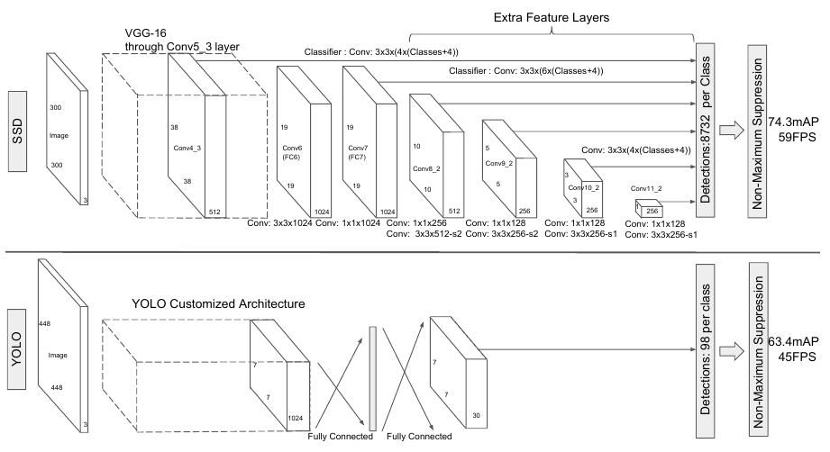
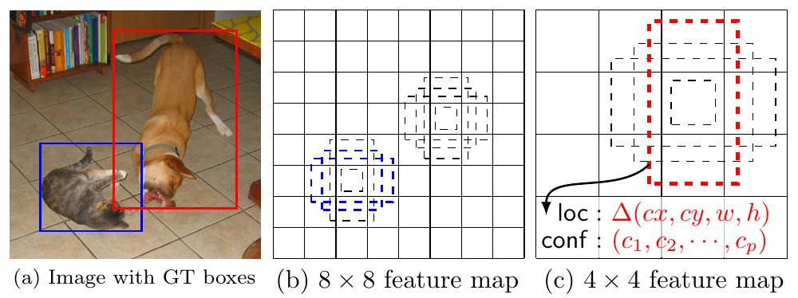

# Модель SSD

## Архитектура

Ранее описанная модель [YOLO](YOLO) для [детекции объектов на изображении](Object-detection-task) работает на признаках, полученных после двух полносвязных слоёв, применённых к активациям последнего свёрточного слоя. Поскольку этот слой даёт карту признаков <u>в низком пространственном разрешении</u>, то качество детекции малых объектов было невысоким. Также на эту карту признаков накладывалась сетка размера 7x7, извлекающая объекты, поэтому максимальное число потенциально детектируемых объектов не могло быть больше 49.

Модель **SSD** (Single Shot Detector [[1]](https://link.springer.com/chapter/10.1007/978-3-319-46448-0_2)) исправляет оба этих ограничения за счёт того, что детекция осуществляется с разных [свёрточных слоёв](../ConvPool-Images/Conv-images#свёрточный-слой). 

- Активации более глубоких слоёв имеют более обширную область видимости ([receptive field](../ConvPool-1D/Conv-1D#извлечение-сложных-нелинейных-признаков)), поэтому способны извлечь более крупные объекты. 

- А с помощью более ранних слоёв (более высокого пространственного разрешения) удаётся задетектировать более мелкие объекты. 

> Поскольку объекты детектируются на разных слоях, то максимальное число потенциально выделяемых детектором объектов методом SSD значительно больше, чем у YOLO.

Ниже приведено сравнение архитектуры SSD (сверху) и YOLO (снизу) [[1]](https://link.springer.com/chapter/10.1007/978-3-319-46448-0_2):

Последний слой SSD выделяет объекты, за которым обязательно следует [модуль подавления немаксимумов](Non-maximum-supression). 

> Это важно, так как количество детекций будет избыточным вследствие того, что каждый объект может быть неоднократно выделен с разных слоёв.

Детекция в SSD осуществлялась не сразу, а после некоторого количества свёрточных слоёв, извлекающих более информативные признаки. Первыми слоями брались слои сети [VGG-16](../Convolutional-architectures/VGG), предобученной для задачи классификации. 

## Прогнозирование

Начиная с определённого уровня, на каждом слое действовали свёртки 3x3, предсказывавшие $K(C+4)$ значения для каждой позиции на карте признаков. 

Для каждой позиции:

- рассматривались $K$ **шаблонных рамок** (шаблон, anchor box), в качестве которых рассматривались 9 вариантов: большая/малая/средняя по размеру и квадратная/вытянутая вбок/вытянутая вверх по форме;

- $C$ вероятностей классов для каждой шаблонной рамки;

- четыре смещения $(\Delta x,\Delta y,\Delta w,\Delta h)$ для позиции левого верхнего угла выделяющей рамки и смещений ширины и высоты относительно шаблонной рамки.

Примеры детекций кошки и собаки для трёх шаблонных рамок проиллюстрированы ниже [[1]](https://link.springer.com/chapter/10.1007/978-3-319-46448-0_2):

В примере кошка была извлечена с более раннего свёрточного слоя рамкой, вытянутой вбок, а собака - с более позднего слоя рамкой, вытянутой вниз.

## Настройка модели

Модель настраивалась, минимизируя взвешенную сумму функции потерь классификации (classification loss, точность определения класса рамки) и потерь локализации (localization loss, точность расположения самой рамки). 

Поскольку каждый объект может быть локализован многократно с разных слоёв и используя разные шаблонные рамки, правильные выделения объектов в функции потерь <u>соотносились лишь с одним выходом сети</u>, соответствующим шаблонной рамке, максимально похожей по мере [IoU](../Semantic-segmentation/Semantic-segmentation-quality-metrics#iou-и-dice) на правильную.

Ошибки локализации считались только для выходов сети, соотнесённых правильным рамкам. При локализации использовались сглаженные потери $L_1$ ([smooth L1 loss](../../Machine-learning/Base-concepts/Function-selection#основные-функции-потерь-в-задаче-регрессии)), а целевыми переменными выступали не абсолютные, как у YOLO, а <u>относительные ошибки</u> локализации рамки <u>по отношению к координатам и размеру шаблонной рамки</u>. 

> Этот приём позволил существенно повысить точность локализации и является стандартным в методах детекции, использующих шаблонные рамки (anchor based methods). Нейросети проще предсказать поправку относительно хорошей гипотезы, чем напрямую само значение координат.

Ошибки классификации вычислялись [кросс-энтропийной функцией потерь](../MLP/Outputs-loss-functions#кросс-энтропийные-потери-многоклассовые), причём они считались только для выходов сети, <u>соотнесённых правильным рамкам</u>, а также для ложных выделений несуществующих объектов (настраиваясь на фоновый класс). 

> В последнем случае брались не все такие случаи, а лишь те, в которых модель была <u>сильнее всего уверена, что объект там есть</u>. Этот подход называется **hard negative mining** и используется для того, чтобы выровнять количество корректных и некорректных выделений. Без этого приёма фоновых детекций было значительно больше, чем детекций реальных объектов! Это позволяет сосредоточить обучение модели на уточнении детекций объектов только целевых классов.

При настройке активно использовалась [аугментация данных](../Regularization/Augmentation) (data augmentation), существенно повысившая точность модели. В качестве аугментации использовались отражения изображения вдоль горизонтальной оси, выделение фрагмента на исходном изображении и на уменьшенной версии изображения, расширенного [паддингом](../ConvPool-Images/Conv-params#паддинг) (padding).

## Литература

1. [Liu W. et al. Ssd: Single shot multibox detector //Computer Vision–ECCV 2016: 14th European Conference, Amsterdam, The Netherlands, October 11–14, 2016, Proceedings, Part I 14. – Springer International Publishing, 2016. – С. 21-37.](https://link.springer.com/chapter/10.1007/978-3-319-46448-0_2)
