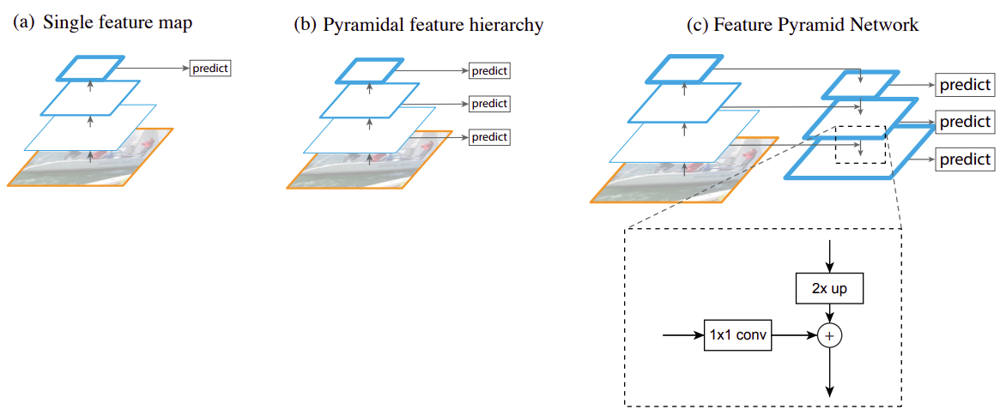

# Сеть пирамидальных признаков (FPN)

## Архитектура FPN

**Сеть пирамидальных признаков** (feature pyramid network, FPN, [[1]](https://openaccess.thecvf.com/content_cvpr_2017/html/Lin_Feature_Pyramid_Networks_CVPR_2017_paper.html)) - это не просто улучшенный метод [детекции объектов](Object-detection-task), а целая концепция более эффективного извлечения признаков из изображений, которая может применяться и в других задачах обработки изображений. В случае детекции она привела к улучшению качества модели [Faster R-CNN](Two-stage-detectors).

Ниже показано сравнение архитектур извлечения признаков в моделях [YOLO](YOLO) (a), [SSD](SSD) (b) и в предложенной модели FPN (c) [[1]](https://openaccess.thecvf.com/content_cvpr_2017/html/Lin_Feature_Pyramid_Networks_CVPR_2017_paper.html):

Левая часть во всех архитектурах использует свёрточные слои одной из успешных сетей для классификации изображений, таких как [VGG](../Convolutional-architectures/VGG) и [ResNet](../Convolutional-architectures/ResNet), которые можно дообучить для задачи детекции. Каждый вышестоящий слой извлекает всё более сложные признаки, при этом пространственное разрешение с каждым следующим слоем понижается. Серию преобразований с понижением пространственного разрешения будем называть **кодировочной частью** (кодировщик, encoder).

В архитектуре YOLO (a) детектор работает на последнем свёрточном слое, что позволяет точно определять тип объекта, но его координаты определяются неточно из-за <u>низкого пространственного разрешения</u> используемых [карт признаков](../ConvPool-Images/Conv-images#одна-свёртка) (feature maps). Также у YOLO возникают <u>проблемы с детекцией малых объектов</u>, различимых лишь в высоком разрешении.

Эти трудности были отчасти преодолены в архитектуре SSD (b), где детекция производилась на разных промежуточных представлениях изображения. Однако качество этой детекции на более ранних слоях было невысоким из-за того, что на этих слоях <u>извлекались несложные признаки</u>, такие как границы и другие простейшие паттерны.

В архитектуре FPN (c) предлагается дополнить левую кодировочную часть с понижением пространственного разрешения **декодировочной частью** (декодировщик, decoder) с  повышением разрешения, а детекцию производить <u>на разных слоях декодировочной части</u>. На схеме (c) выше она показана справа.

В сети FPN в декодировщике пространственное разрешение повышается на каждом слое одним из [методов повышения разрешения](../Semantic-segmentation/Upsampling-operations) (в оригинальной статье использовалась интерполяция ближайшим соседом). Для того, чтобы лучше сохранить информацию о расположениях объектов, соответствующее внутреннее представление из кодировочной части <u>прибавлялось</u> к внутреннему представлению декодировочной части, что на рисунке показано горизонтальными связями между слоями.

> Перед прибавлением внутреннее кодировочное представление обрабатывалось свёрткой 1x1, чтобы выходное число каналов совпало с числом каналов представления в декодировщике.

В декодировщике на каждом слое использовалось одно и то же число каналов (256), поскольку на каждом слое впоследствии применялась одна и та же модель детекции. Результат суммы представлений в кодировщике и декодировщике обрабатывался свёрткой 3x3, чтобы сгладить артефакты интерполяции при повышении разрешения, после чего результат передавался на следующий слой декодировщика.

## Преимущества архитектуры FPN

Использование внутренних представлений декодировщика FPN даёт следующие преимущества:

- Поскольку детекция производится на разных слоях декодировочной части <u>с разным пространственным разрешением</u>, то детектор сможет хорошо извлекать как большие объекты (с малых пространственных разрешений), так и малые (с больших пространственных разрешений). Мы это уже видели в методе SSD, но там детекция производилась по промежуточным представлениям кодировочной части.

- Независимо от используемого слоя декодировочной части, <u>признаки будут сложными и информативными</u>, поскольку они интегрируют в себе признаки, полученные с последнего слоя кодировочной части. Это позволит детектору извлекать сложные объекты независимо от слоя, на котором он работает.

В архитектуре FPN предлагалось производить детекцию серией одинаковых  свёрточных слоёв (независимо от слоя декодировщика), настроенных распознавать класс и уточнять координаты выделяющей рамки (bounding box) относительно таких же шаблонных рамок (anchor boxes), которые использовались в SSD.

## Литература

1. [Lin T. Y. et al. Feature pyramid networks for object detection //Proceedings of the IEEE conference on computer vision and pattern recognition. – 2017. – С. 2117-2125.](https://openaccess.thecvf.com/content_cvpr_2017/html/Lin_Feature_Pyramid_Networks_CVPR_2017_paper.html)
