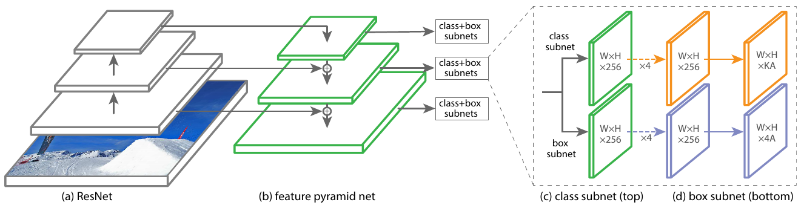
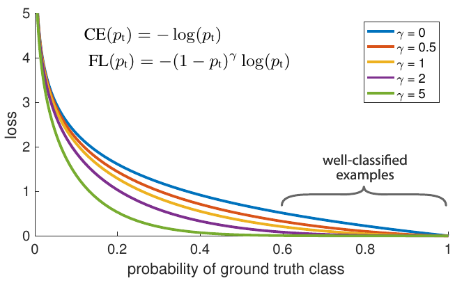

# Модель RetinaNet

Модель **RetinaNet** [[1]](https://openaccess.thecvf.com/content_ICCV_2017/papers/Lin_Focal_Loss_for_ICCV_2017_paper.pdf) - метод детекции объектов на изображениях, который существенно обогнал в качестве работы модели [YOLO v1](YOLO) и [SSD](SSD).

В этой модели использовалась [нейросеть FPN](Feature-Pyramid-Network) для генерации представлений изображения в разном разрешении. 

> Используя эти представления, удалось производить детекцию как в малых, так и в больших пространственных разрешениях, эффективно выделяя как большие, так и малые объекты соответственно. Причём детекторы на каждом слое работали над [сложными информативными признаками](Feature-Pyramid-Network#преимущества-архитектуры-fpn).

Схема модели RetinaNet [[1]](https://openaccess.thecvf.com/content_ICCV_2017/papers/Lin_Focal_Loss_for_ICCV_2017_paper.pdf):

К каждому слою декодера FPN-сети применялись две независимые сети: 

- детектор (классифицирующий рамки), 

- локализатор (корректирующий расположение рамок относительно шаблона, как в [SSD](SSD)). 

> Подсети детектора и локализатора работали со своими параметрами. Таким образом, локализация формально не зависела от детекции. 

При этом к каждому декодировочному слою FPN применялись детектор и локализатор с одними и теми же параметрами. 

Классификатор и локализатор представляли собой последовательное применение четырёх свёрток 3x3 с постобработкой функцией активации [ReLU](../MLP/Activation-functions#rectified-linear-unit-relu). 

Классификаторы и локализаторы для каждой позиции применялись $K$ раз для $K$ [шаблонных рамок](SSD#прогнозирование) (anchor boxes). Рассматривались рамки 

- малого, среднего и большого размера;

- вытянутые по горизонтали, квадратные и вытянутые по вертикали.

Это давало $K=9$ вариантов для каждой пространственной позиции.

## Выходы классификатора и локализатора

Последней нелинейностью в классификаторе была [сигмоидная активация](../MLP/Activation-functions#сигмоидная-функция-активации-sigmoid), чтобы выдавать вероятности каждого из детектируемых классов. Таким образом, классификатор выдавал $C\cdot K$ выходов. Если все активации были близки к нулю, то это трактовалось как <u>отсутствие объекта</u>.

Последней нелинейностью в локализаторе была тождественная функция, после которой локализатор выдавал $4\cdot K$ выходов: смещение по вертикали и горизонтали относительно центра шаблонной рамки, а также изменение её стандартной ширины и высоты.

## Функция потерь

### Сопоставление детекций

Поскольку в каждой пространственной позиции для $K$ шаблонных рамок предсказываются рамки и классы объектов, для расчёта функции потерь необходимо сопоставить предсказанные детекции с реальными.

Предсказанные детекции сопоставлялись реальным, если мера [IoU](../Semantic-segmentation/Semantic-segmentation-quality-metrics#iou-и-dice) их пересечения была выше 0.5. Если же она была ниже 0.4, то сопоставлялся фоновый класс (отсутствие объекта). Случаи IoU$\in [0.4,0.5)$ в функции потерь игнорировались.

### Типы потерь

В модели RetinaNet, как и во всех других методах детекции объектов, использовалась функция потерь, равная сумме двух компонент:

- <u>функции потерь локализации</u> (определение местоположения объектов)

- <u>функции потерь классификации</u> (корректность определения класса)

В качестве функции потерь локализации использовалась [функция потерь Хубера](../../Machine-learning/Base-concepts/Function-selection#основные-функции-потерь-в-задаче-регрессии), как дифференцируемая и устойчивая к выбросам.

Классификатор выдавал $C$ независимых вероятностей классов (рейтингов, пропущенных через сигмоиду). Фоновому классу отвечала ситуация, когда вероятности всех выделяемых классов близки к нулю. Каждый выход классификатора можно было бы настраивать [бинарной кросс-энтропийной функцией потерь](../MLP/Outputs-loss-functions#кросс-энтропийные-потери-бинарный-случай):

$$
CE(y,p) = -y\log(p)-(1-y)\log(1-p),
$$

где $y\in\{0,1\}$ - индикатор присутствия целевого класса. Однако в RetinaNet используются более эффективные **сфокусированные потери** (focal loss), описанные далее.

## Focal loss

Авторы модели RetinaNet обратили внимание, что на большинстве детекций присутствуют выделения отсутствующих объектов (рамки, выделяющие фоновый класс, то есть отсутствие каждого из целевых классов). При этом объектов целевых классов на каждом изображении сравнительно немного. 

Рамки, отвечающие отсутствующим объектам, классифицируются фоновым классом достаточно уверенно. Но за счёт того, что число рамок фонового класса существенно превосходит число рамок целевых классов, оптимизация нейросети сосредотачивается не на улучшении обнаружения целевых классов, а <u>на повышении уверенности распознавания отсутствующих объектов как фонового класса</u>! 

Для того, чтобы этого не происходило, в RetinaNet предлагается новый вид потерь классификации - **сфокусированные потери** (focal loss), ставшие впоследствии очень популярными:

$$
FL(y,p) = -y(1-p)^\gamma \log(p) - (1-y)p^\gamma \log(1-p),
$$

где 

- $p$ - вероятность реализации $y=1$ (одного из целевых классов);

- $1-p$ - вероятность отсутствия этого класса (если для всех классов $p\approx0$, то объект отсутствует и реализуется фоновый класс);

- $\gamma>0$ - гиперпараметр метода.

> Указанные потери суммируются для всех рамок и всех целевых классов.

По смыслу домножение на $(1-p)^\gamma$ снижает вклад в совокупные потери обнаружений с высоким уровнем уверенности в классе, а домножение на $p^\gamma$ снижает вклад обнаружений с высоким уровнем уверенности в присутствии фона. 

> За счёт такого перевзвешивания большое количество обнаружений фона перестаёт доминировать в общей сумме, что позволяет оптимизации сети лучше <u>сосредоточиться на повышении качества распознавания именно целевых классов</u>. Также акцент оптимизации смещается с дальнейшего повышения вероятностей уверенно классифицированных классов на те, <u>в которых модель недостаточно уверена</u>.

Ниже показан пример влияния дополнительного множителя на логарифм вероятности целевого класса $p$ [[1]](https://openaccess.thecvf.com/content_ICCV_2017/papers/Lin_Focal_Loss_for_ICCV_2017_paper.pdf):

Как видно из графика, потери уменьшаются при $p\to 1$ существенно быстрее, чем для стандартных кросс-энтропийных потерь. 

В работе предлагалось брать $\gamma=2$, а вес каждого слагаемого в focal loss дополнительно домножался на веса, понижающие вклад частотных целевых классов.

> Потери focal loss позволили существенно повысить качество распознавания объектов и стали использоваться во многих последующих алгоритмах детекции.

## Литература

- [Lin T. Focal Loss for Dense Object Detection //arXiv preprint arXiv:1708.02002. – 2017.](https://openaccess.thecvf.com/content_ICCV_2017/papers/Lin_Focal_Loss_for_ICCV_2017_paper.pdf)
