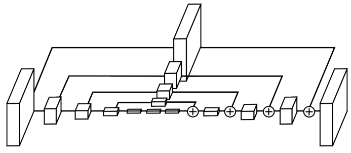
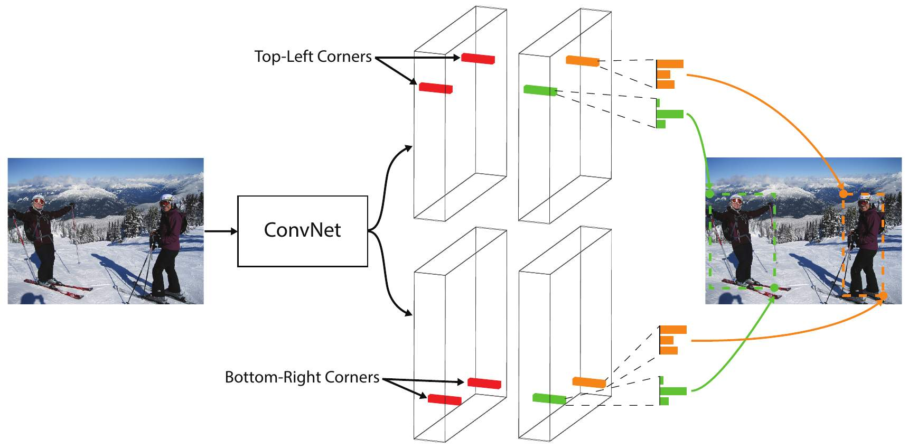
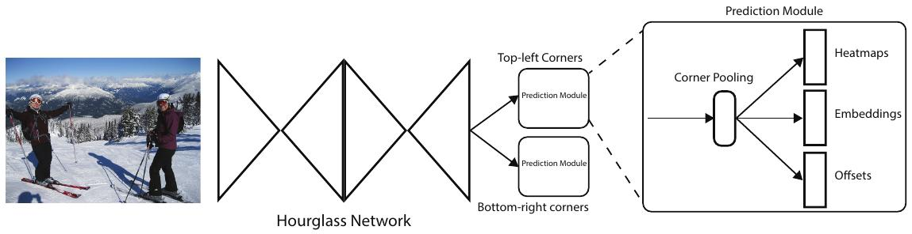
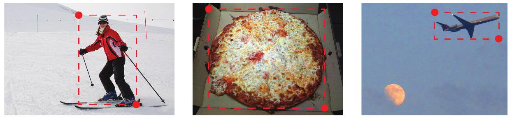
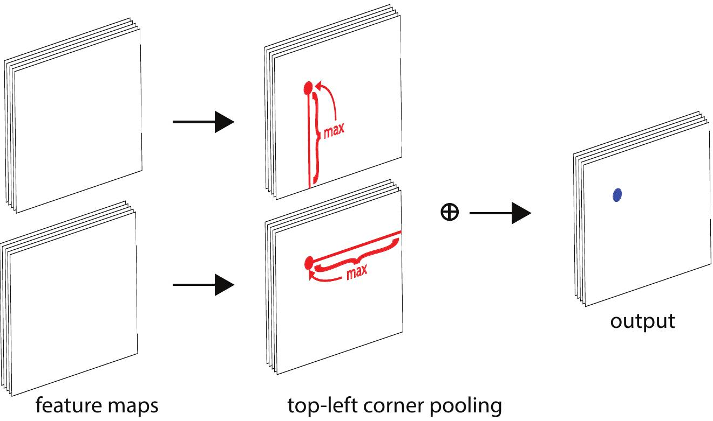
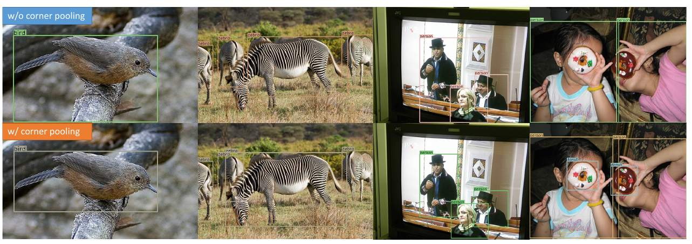

# Модель CornerNet

## Архитектура

Модель **CornerNet** [[1]](https://openaccess.thecvf.com/content_ECCV_2018/html/Hei_Law_CornerNet_Detecting_Objects_ECCV_2018_paper.html) использует принципиально другой подход к детекции объектов, чем методы, основанные на шаблонных рамках (anchor boxes), такие как [SSD](SSD) и [RetinaNet](RetinaNet), что существенно повышает качество детекций на датасете [MS COCO](https://cocodataset.org/#home) [[2]](https://link.springer.com/chapter/10.1007/978-3-319-10602-1_48).

Вначале изображение пропускается через два последовательных hourglass-блока [[3]](https://arxiv.org/pdf/1603.06937), в каждом из которых пространственное разрешение изображения сначала снижается (свёртками с [шагом](../ConvPool-Images/Conv-params#шаг-stride) 2), а затем повышается (свёртками и [интерполяцией ближайшим соседом](../Semantic-segmentation/Upsampling-operations#интерполяция-ближайшим-соседом)), при этом используется пробрасывание связей (skip-connections), как в [остаточных блоках ResNet](../Convolutional-architectures/ResNet#остаточный-блок), но с промежуточной трансформацией (см. [[3]](https://arxiv.org/pdf/1603.06937)). Проброс связей, как и в ResNet, используется, чтобы сохранить детальную информацию о границах объектов. 

Идейно структура одного hourglass-блока показана ниже [[3]](https://arxiv.org/pdf/1603.06937):

Дальнейшая обработка ведётся с выходов второго hourglass-блока, а не на разных пространственных разрешениях, как в [SSD](SSD) и [RetinaNet](RetinaNet). По полученному представлению прогнозируются **тепловые карты** (heatmaps) левых верхних и правых нижних углов рамок, выделяющих целевые объекты. В каждой позиции тепловой карты прогнозируется уверенность (score) в том, что именно в этой позиции находится левый верхний / правый нижний угол рамки, выделяющей какой-либо объект на изображении. 

Поскольку извлекаются одновременно все левые верхние и правые нижние углы, их нужно как-то сопоставить друг другу. Для этого сеть прогнозирует для каждого положения тепловой карты свой эмбеддинг (вектор фиксированного размера), получая карту эмбеддингов. Левый верхний угол сопоставляется правому нижнему <u>с наиболее похожим эмбеддингом</u>.

Эта методология проиллюстрирована ниже [[1]](https://openaccess.thecvf.com/content_ECCV_2018/html/Hei_Law_CornerNet_Detecting_Objects_ECCV_2018_paper.html):

Такой подход обладает следующими преимуществами:

- Пропадает необходимость спецификации [шаблонных рамок](SSD#прогнозирование) (anchor boxes), метод способен автоматически подстраиваться <u>под произвольные размеры объектов</u>. 

- Пропадает ограничение на максимально возможное число детектируемых объектов. Для спецификации всех возможных рамок на изображении $H\times W$ при прогнозе рамок потребовалось бы $O(H^2 W^2)$ выходов, в то время как при прогнозе левых верхних и правых нижних углов достаточно лишь $O(2HW)$ выходов!

Полная архитектура CornerNet показана на рисунке [[1]](https://openaccess.thecvf.com/content_ECCV_2018/html/Hei_Law_CornerNet_Detecting_Objects_ECCV_2018_paper.html):

> Для извлечения объектов нескольких классов сеть настраивается выдавать столько тепловых карт (heatmaps), сколько извлекается классов - по своему набору для каждого класса (кроме фонового).

Помимо тепловых карт и эмбеддингов углов сеть также предсказывает смещения (offsets) для углов в соответствующих позициях, чтобы внести окончательные коррективы в координаты итоговых рамок и сделать их точнее. Этот шаг необходим, поскольку hourglass-блоки выдают карту признаков более низкого пространственного разрешения, чем исходное изображение.

## Угловой пулинг

Часто целевой объект не содержится в левом верхнем и правом нижнем углу выделяющей его рамки, как показано ниже [[1]](https://openaccess.thecvf.com/content_ECCV_2018/html/Hei_Law_CornerNet_Detecting_Objects_ECCV_2018_paper.html):

Чтобы помочь свёрткам определять корректное расположение углов рамки, к выходу hourglass-блока применяется специальный вид **углового пулинга** (corner pooling).

Для излечения верхнего левого угла в каждой позиции: 

1. ищется максимальный элемент вниз от позиции;

2. ищется максимальный элемент вправо от позиции;

3. результаты двух найденных максимумов складываются.

Это проиллюстрировано на схеме ниже [[1]](https://openaccess.thecvf.com/content_ECCV_2018/html/Hei_Law_CornerNet_Detecting_Objects_ECCV_2018_paper.html):

Для излечения правого нижнего угла угловой пулинг действует наоборот:

1. ищется максимальный элемент вверх от позиции;

2. ищется максимальный элемент влево от позиции;

3. результаты двух найденных максимумов также складываются.

Угловой пулинг позволяет существенно повысить точность локализации, как показано ниже [[1]](https://openaccess.thecvf.com/content_ECCV_2018/html/Hei_Law_CornerNet_Detecting_Objects_ECCV_2018_paper.html), где сверху показаны результаты детекции без углового пулинга, а снизу - с его использованием:

## Настройка

Функция потерь состоит из следующих компонент:

- <u>Потери классификации/грубой локализации</u>: тепловые карты выступают бинарными классификаторами, детектирующими присутствие угла, поэтому настраиваются, используя [сфокусированные потери (focal loss)](RetinaNet), предложенные в модели RetinaNet. При этом учёт отсутствия целевого угла учитывается слабее (за счёт понижающего коэффициента), если реальный угол присутствует неподалёку.

- <u>Потери соответствия</u>: эмбеддинги углов одной целевой рамки поощряются быть более похожими, а разных рамок - непохожими.

- <u>Потери итоговой локализации</u>: штрафуют несоответствие извлечённых рамок и истинных рамок, используя [функцию Хубера](../../Machine-learning/Base-concepts/Function-selection#основные-функции-потерь-в-задаче-регрессии).

## Применение

При практическом использовании алгоритма детекции извлекались с исходного изображения и зеркально отражённого, после чего к результатам применялось [мягкое подавление немаксимумов](Non-maximum-supression#мягкий-вариант-алгоритма-nms) (soft NMS).

Модель CornerNet обогнала алгоритмы SSD и RetinaNet, показав на датасете MS COCO [[2]](https://link.springer.com/chapter/10.1007/978-3-319-10602-1_48) качество AP=42.2.

## Литература

1. [Law H., Deng J. Cornernet: Detecting objects as paired keypoints //Proceedings of the European conference on computer vision (ECCV). – 2018. – С. 734-750.](https://openaccess.thecvf.com/content_ECCV_2018/html/Hei_Law_CornerNet_Detecting_Objects_ECCV_2018_paper.html)

2. [Lin T. Y. et al. Microsoft coco: Common objects in context //Computer Vision–ECCV 2014: 13th European Conference, Zurich, Switzerland, September 6-12, 2014, Proceedings, Part V 13. – Springer International Publishing, 2014. – С. 740-755.](https://link.springer.com/chapter/10.1007/978-3-319-10602-1_48)

3. [Wang D. Stacked dense-hourglass networks for human pose estimation : дис. – University of Illinois at Urbana-Champaign, 2018.](https://arxiv.org/pdf/1603.06937)
