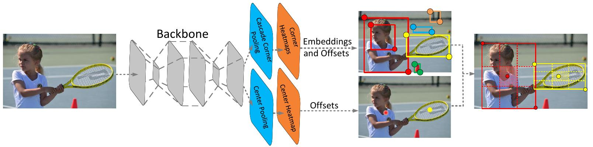
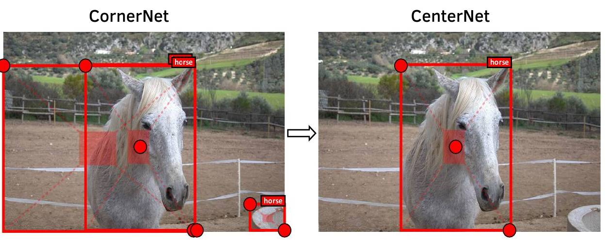
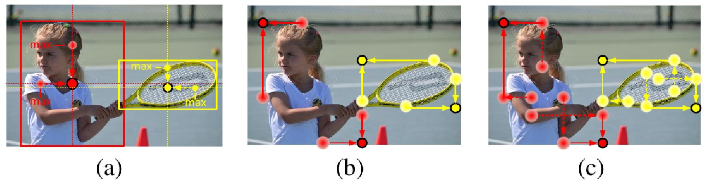

# Модель CenterNet

## Архитектура

Модель **CenterNet** [[1]](https://openaccess.thecvf.com/content_ICCV_2019/html/Duan_CenterNet_Keypoint_Triplets_for_Object_Detection_ICCV_2019_paper.html) строится на базе [CornerNet](CornerNet) и дополнительно увеличивает её точность за счёт реконструкции выделяющих рамок не только по их левому верхнему и правому нижнему углу, но и по <u>предсказываемому центру рамки</u>, как показано на рисунке [[1]](https://openaccess.thecvf.com/content_ICCV_2019/html/Duan_CenterNet_Keypoint_Triplets_for_Object_Detection_ICCV_2019_paper.html):

> Предсказание углов хорошо настраивается выделять границы объектов, однако для точности распознавания ему всё ещё недостаёт заглядывания внутрь содержимого извлекаемой рамки, чтобы убедиться в том, что целевой объект там действительно находится. 

В CenterNet по промежуточному представлению изображения предсказываются тепловые карты (heatmaps) рейтингов присутствия как левого верхнего и правого нижнего углов, так и центра. 

Также предсказывается карта смещений (offsets) для обнаруженных позиций углов и центра. 

Параллельно с этим предсказывается карта эмбеддингов (векторов фиксированного размера) для каждой позиции. Как и в CornerNet, считается, что углы соответствуют одной рамке, если их эмбеддинги близки. Но дополнительно к этому рамка детектируется, <u>если ей примерно соответствует обнаруженный центр рамки</u>, что уберегает метод от ложных срабатываний ([false positives](Quality-metrics)), которые часто встречаются в CornerNet, как показано ниже [[1]](https://openaccess.thecvf.com/content_ICCV_2019/html/Duan_CenterNet_Keypoint_Triplets_for_Object_Detection_ICCV_2019_paper.html):

Красный полупрозрачный регион определяет, куда должна попасть центральная точка,  чтобы в CenterNet детекция сработала. Для двух ложных срабатываний CornerNet слева центр в него не попадает, поэтому этих ложных срабатываний в CenterNet не будет!

## Специальные виды пулинга

Для точного детектирования центра рамки используется специальный вид пулинга - **CenterPooling**. Этот пулинг для каждой позиции на карте признаков

1. находит максимальное значение вдоль горизонтальной оси;

2. находит максимальное значение вдоль вертикальной оси;

3. суммирует два найденных максимума.

Для повышения точности детектирования углов рамок вместо [CornerPooling](CornerNet) используется **CascadeCornerPooling**. CornerPooling хорошо работает для детекции границ объекта, но <u>не способен заглядывать в его внутренние области</u>, что как раз и исправляется через CascadeCornerPooling, в котором для левого верхнего угла рамки для каждой позиции карты признаков

1. ищется максимальный элемент, если сдвигаться вниз до края изображения;

2. ищется максимальный элемент, если относительно позиции найденного максимума на шаге 1 сдвигаться вправо;

3. максимумы первого и второго шага суммируются, сумма записывается в текущую позицию.

Для правого нижнего угла операции в CascadeCornerPooling аналогичны, но инвертируются:

- сдвиг вправо заменяется на сдвиг влево;

- сдвиг вниз заменяется на сдвиг вверх.

Графически CenterPooling, CornerPooling и CascadeCornerPooling показаны ниже на рисунках (a), (b) и (c) [[1]](https://openaccess.thecvf.com/content_ICCV_2019/html/Duan_CenterNet_Keypoint_Triplets_for_Object_Detection_ICCV_2019_paper.html):

## Применение

Для повышения точности CenterNet применялся к исходному изображению и горизонтально отражённому, при этом одно и то же изображение бралось в разных разрешениях. К обнаруженным детекциям применялось [мягкое подавление немаксимумов](Non-maximum-supression#мягкий-вариант-алгоритма-nms) (soft NMS). 

В итоге на датасете [MS COCO](https://cocodataset.org/) [[2]](https://link.springer.com/chapter/10.1007/978-3-319-10602-1_48) предложенная модель показала значение AP=0.47.

## Литература

1. [Duan K. et al. Centernet: Keypoint triplets for object detection //Proceedings of the IEEE/CVF international conference on computer vision. – 2019. – С. 6569-6578.](https://openaccess.thecvf.com/content_ICCV_2019/html/Duan_CenterNet_Keypoint_Triplets_for_Object_Detection_ICCV_2019_paper.html)
2. [Lin T. Y. et al. Microsoft coco: Common objects in context //Computer Vision–ECCV 2014: 13th European Conference, Zurich, Switzerland, September 6-12, 2014, Proceedings, Part V 13. – Springer International Publishing, 2014. – С. 740-755.](https://link.springer.com/chapter/10.1007/978-3-319-10602-1_48)
