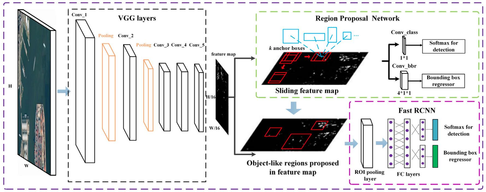
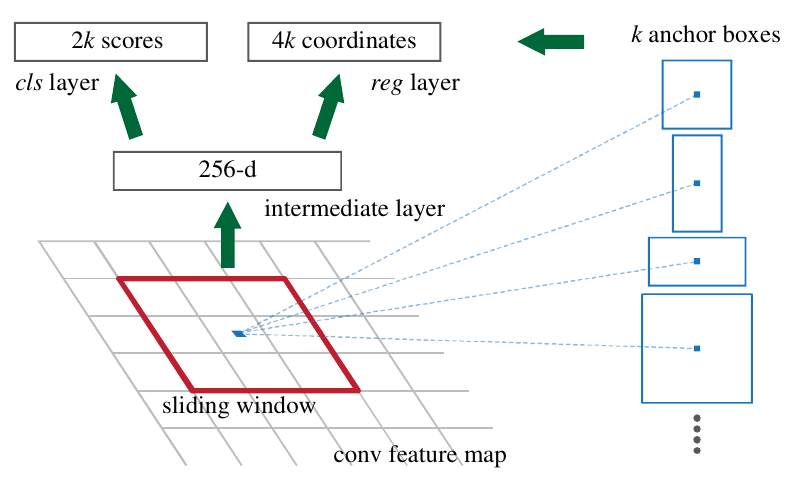
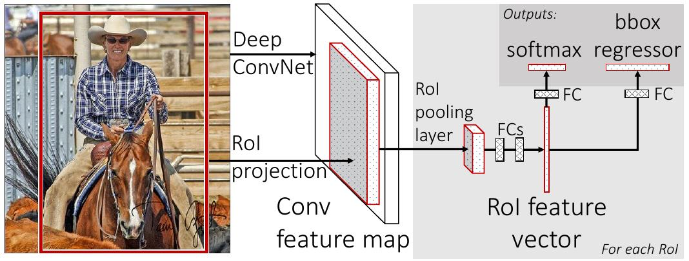

# Двухстадийные детекторы

Ранее рассмотренные в учебнике методы [детекции объектов](Object-detection-task) являются **одностадийными** (one-stage detectors), поскольку они на вход принимают изображение, а на выходе сразу выдают рамки с сопоставленными им классами обнаруженных объектов.

**Двухстадийные детекторы** (two-stage detectors) решают задачу детекции за два этапа:

- на первом шаге извлекаются **регионы-кандидаты** (region proposals, regions of interest, ROI);

- на втором шаге извлечённые регионы-кандидаты относятся к тому или иному классу и уточняется их расположение.

Из-за двух этапов генерации такие методы работают медленнее, чем одностадийные, но при тщательной настройке могут обеспечить более высокую точность.

Исторически первыми нейросетевыми детекторами были именно двухстадийные детекторы. Рассмотрим самую известную модель этого типа - детектор Faster R-CNN.

## Faster R-CNN

Детекция объектов на изображении моделью **Faster R-CNN** [[1]](https://papers.nips.cc/paper_files/paper/2015/hash/14bfa6bb14875e45bba028a21ed38046-Abstract.html) состоит из следующих шагов:

1. Генерация регионов-кандидатов (region proposals) с помощью специальной **RPN сети** (region proposal network).

2. [Подавление немаксимумов](Non-maximum-supression) для выделения минимально достаточного набора рамок-кандидатов, покрывающих все потенциальные объекты.

3. Отбор топ-K самых высокорейтинговых регионов-кандидатов.

4. Классификация и уточнение выделяющей рамки для каждого объекта.

5. Итоговое подавление немаксимумов.

> Последние два шага повторяют модель Fast R-CNN, описанную далее.

Схема Faster R-CNN представлена ниже [[2]](https://www.researchgate.net/publication/324903264_Multi-scale_object_detection_in_remote_sensing_imagery_with_convolutional_neural_networks):

Вначале изображение обрабатывается первыми слоями свёрточной сети, предобученной решать задачу классификации, для извлечения признакового описания изображения. Далее к нему применяется **RPN-сеть** (region proposal network), предсказывающая **регионы интереса** (regions of interest, ROI), представляющие собой рамки, в которых могут находиться все потенциально присутствующие на изображении объекты.

RPN-сеть работает следующим образом:

1. К полученному признаковому описанию скользящим окном 3x3 применяются свёртки, выдающие 256 признаков.

2. К 256-мерному вектору в каждой позиции применяется [полносвязный слой](../MLP/Multilayer-perceptron), предсказывающий для каждой из $k$ [шаблонных рамок](SSD#прогнозирование) (anchor box), центрированных в текущей позиции, следующие выходы:
   
   - 2 классификационных выхода (вероятность присутствия и отсутствия объекта);
   
   - 4 регрессионных выхода (изменение координат соответствующей шаблонной рамки по координатам центра, ширине и высоте).

Указанные шаги графически показаны ниже [[1]](https://papers.nips.cc/paper_files/paper/2015/hash/14bfa6bb14875e45bba028a21ed38046-Abstract.html):

> Технически шаг 1 - это один слой из 3x3 свёрток с 256 выходами, а шаг 2 - слой из свёрток 1x1. Таким образом, всю RPN-сеть можно описать двумя обычными свёрточными слоями.

К полученным регионам-кандидатам применяется [подавление немаксимумов](Non-maximum-supression) и отбор топ-K самых высокорейтинговых регионов (с максимальными вероятностями присутствия объекта), после чего на извлечённых регионах уже работает сеть Fast R-CNN, производящая окончательную детекцию.

:::tip Качество работы

Модель Faster R-CNN была предложена в 2015 году и впоследствии обгонялась и по скорости работы, и по точности более эффективными одностадийными детекторами. Однако точность Faster R-CNN можно повысить, используя более продвинутые сети

- для извлечения промежуточного представления, 

- генерации регионов-кандидатов, 

- классификатора и локализатора. 

Продвинутые версии этой модели продолжают составлять конкуренцию по точности одностадийным детекторам.

:::

## Fast R-CNN

Модель Fast R-CNN [[3]](https://openaccess.thecvf.com/content_iccv_2015/html/Girshick_Fast_R-CNN_ICCV_2015_paper.html) детектирует объекты по изображению, на котором уже выделены регионы-кандидаты. В оригинальной версии метода для этого используются регионы-кандидаты, выделяемые эвристическим методом **selective search** [[4]](http://www.huppelen.nl/publications/selectiveSearchDraft.pdf).

### Алгоритм selective search

Алгоритм selective search использует не нейросети, а алгоритм классического компьютерного зрения. Вначале он разбивает изображение на области, в качестве которых выступают [суперпиксели](../../Machine-learning/Complex-models-interpretation/Fragments-impact) (superpixels), то есть небольшие области соседних пикселей, примерно похожих по цвету. На основе первоначальных областей алгоритм начинает их итеративное объединение жадным способом, объединяя в первую очередь соседние и самые похожие области. Объединение происходит по следующим критериям сходства:

- **Текстура**: схожесть гистограмм градиентов цветов соседних областей.

- **Размер**: относительная площадь двух областей (предпочтение отдается объединению небольших областей).

- **Общность**: насколько области геометрически соответствуют друг другу.

Процесс объединения областей продолжается, пока не останется всего одна область. Регионами-кандидатами выступают прямоугольники, обведённые вокруг каждой области, полученной в процессе работы алгоритма.

:::tip Faster R-CNN и Fast R-CNN

Модель Faster R-CNN отличается от Fast R-CNN <u>только методом извлечения регионов-кандидатов</u>. В Fast R-CNN для этого используется selective search, а в Faster R-CNN - нейронная RPN-сеть генерации регионов-кандидатов. Первый метод итеративный и не поддаётся параллелизации, а RPN-сеть генерации регионов-кандидатов состоит из двух свёрточных слоёв, которые можно быстро вычислить на видеокарте. Поэтому Faster R-CNN работает <u>значительно быстрее</u>, чем Fast R-CNN!

Как только регионы-кандидаты извлечены, работа двух методов не различается.
:::

### Обработка регионов-кандидатов в Fast R-CNN

Схема работы Fast R-CNN показана на рисунке [[3]](https://openaccess.thecvf.com/content_iccv_2015/html/Girshick_Fast_R-CNN_ICCV_2015_paper.html):

Изображение пропускается через свёрточный кодировщик (первые свёрточные слои сети, обученной решать задачу классификации), чтобы получить её промежуточное представление с $S$ каналами.

> В Fast R-CNN извлечённые регионы-кандидаты перемасштабируются с размера исходного изображения под размер промежуточного представления (которое меньше). Модель же Faster R-CNN извлекает регионы-кандидаты с того же самого внутреннего представления, по которому производится итоговая детекция, поэтому ей перемасштабирование не требуется. 

Далее каждый регион-кандидат обрабатывается независимо. Осуществляется перевод внутреннего представления, выделенного регионом-кандидатом, в эмбеддинг (вектор фиксированного размера $P^2 S$) за счёт **пулинга региона интереса** (region-of-interest pooling, ROI pooling). Этот пулинг накладывает на регион интереса сетку $P\times P$, а далее возвращает максимальные элементы из всех активаций, покрытых каждой ячейкой сетки. Делается это независимо для каждого канала, потом результаты для всех каналов объединяются. 

> По сути, пулинг региона интереса производит [пирамидальный пулинг](../ConvPool-Images/Pooling#пирамидальный-пулинг), но только на <u>одном</u> слое пирамиды.

После представления региона интереса эмбеддингом, к нему применяются два полносвязных слоя. Первый переводит вход в вектор ещё более маленького размера, а второй, наоборот, расширяет - это позволяет сэкономить на числе связей. К результату применяется два независимых полносвязных слоя:

- первый выдаёт $C+1$ вероятностей, соответствующих каждому из классов и фоновому классу (отсутствию объекта);

- второй выдаёт $4$ выхода, трактуемые как уточнённые координаты $(x,y,w,h)$ первоначальной рамки региона-кандидата.

### Настройка Fast R-CNN

Fast R-CNN, как и все нейросети, настраивается [минибатчами](../Training/Opt-methods-fixed-lr#стохастический-градиентный-спуск-по-мини-батчам). Каждый минибатч состоит из набора регионов интереса. Для ускоренной настройки используется иерархическое сэмплирование регионов:

1. Сэмплируется набор изображений.

2. Для каждого изображения сэмплируется набор регионов интереса.

> Такая иерархическая генерация минибатча работает быстрее, чем случайный выбор изображения и региона, поскольку многие регионы будут оказываться на одном изображении, а следовательно для них промежуточное представление можно вычислить <u>только один раз</u>. 

Регионы интереса сэмплировались сбалансированно по фоновому и целевым классам, для этого вычислялась мера [IoU](../Semantic-segmentation/Semantic-segmentation-quality-metrics#iou-и-dice) между истинными и предсказанными выделениями: 

- половина регионов бралась с $\text{IoU}\ge 0.5$, и от классификатора требовалось распознать верный класс;

- другая половина бралась с $\text{IoU}<0.5$, и от классификатора требовалось распознать, что класс является фоном.

Настройка сети производилась минимизацией суммы потерь классификации и  локализации:

- **потери классификации** измеряют, насколько корректно предсказан класс объекта, а математически представляют собой [кросс-энтропийные потери](../MLP/Outputs-loss-functions#кросс-энтропийные-потери-многоклассовые);

- **потери локализации** измеряют, насколько пространственно сочетается предсказанная рамка и рамка истинного выделения, и вычисляются лишь для тех рамок, на которых классификатор обнаружил не фоновый класс, а рамка существенно пересекается с истинной рамкой объекта.

В качестве потерь локализации бралась [функция потерь Хубера](../../Machine-learning/Base-concepts/Function-selection#основные-функции-потерь-в-задаче-регрессии) (smooth L1 loss), как более устойчивая к выбросам. Если $\left(x,y,h,w\right)$ - истинная рамка, а $\left(\widehat{x},\widehat{y},\widehat{h},\widehat{w}\right)$ - предсказанная, то локализующая регрессия училась предсказывать величины

$$
\left(\frac{x-\widehat{x}}{w},\frac{y-\widehat{y}}{h},\ln\left(\frac{\widehat{w}}{w}\right),\ln\left(\frac{\widehat{h}}{h}\right)\right)
$$

Такие целевые переменные позволяют устойчивее предсказывать координаты угла рамки для рамок разных размеров и <u>сильнее штрафуют недостаточное выделение объекта, чем избыточное</u>.

:::tip Faster R-CNN

В RPN-сети, предсказывающей регионы-кандидаты для модели Faster R-CNN, использовались точно такие же потери локализации.

:::

Обучение Fast R-CNN велось для исходных изображений и их горизонтально отражённых версий, используя разный масштаб этих изображений, чтобы детектор учился выделять <u>как большие, так и малые по размеру объекты</u>.

:::tip Повышение полноты детекций

Для повышения [полноты](Quality-metrics) (recall) обнаруживаемых объектов в Mask R-CNN во время применения предлагалось запускать метод несколько раз на изображении разных масштабов (более крупных и более мелких).

Это замедляет построение прогнозов, зато улучшает качество детекций для слишком больших и малых объектов.

Заметим, что этот приём применим не только к Fast R-CNN, но вообще <u>к любым моделям детекции</u>.

:::

## Историческая справка

Одним из первых нейросетевых детекторов была модель **R-CNN** [[5]](https://openaccess.thecvf.com/content_cvpr_2014/html/Girshick_Rich_Feature_Hierarchies_2014_CVPR_paper.html). Она работала очень медленно, поскольку <u>каждый регион-кандидат обрабатывался отдельно и независимо свёрточным кодировщиком</u>, а для того, чтобы зафиксировать выходной эмбеддинг, каждый регион-кандидат <u>перемасштабировался к единому размеру</u>, что приводило к геометрическим искажениям и потере информации за счёт обрезки краёв.

Идея не пропускать каждый регион-кандидат через кодировщик, а пропустить через него <u>сразу всё изображение</u>, чтобы потом выделять нужные регионы-кандидаты на предпосчитанных картах признаков, была предложена в модели **SPP-net** [[6]](https://arxiv.org/abs/1406.4729). Это существенно ускорило скорость обработки, поскольку не приводило к повторным перевычислениям одних и тех же признаков на пересекающихся рамках.

Также в SPP-net была впервые предложена идея кодировать признаковое описание региона-кандидата, используя [пирамидальный пулинг](../ConvPool-Images/Pooling#пирамидальный-пулинг).

## Литература

1. [Ren, S., He, K., Girshick, R., Sun, J. Faster R-CNN: Towards Real-Time Object Detection with Region Proposal Networks // Advances in Neural Information Processing Systems (NIPS). – 2015. – Vol. 28. – P. 91–99. DOI: 10.5555/2969239.2969250.](https://papers.nips.cc/paper_files/paper/2015/hash/14bfa6bb14875e45bba028a21ed38046-Abstract.html)

2. [Deng Z. et al. Multi-scale object detection in remote sensing imagery with convolutional neural networks //ISPRS journal of photogrammetry and remote sensing. – 2018. – Т. 145. – С. 3-22.](https://www.researchgate.net/publication/324903264_Multi-scale_object_detection_in_remote_sensing_imagery_with_convolutional_neural_networks)

3. [Girshick, R. Fast R-CNN // Proceedings of the IEEE International Conference on Computer Vision (ICCV). – 2015. – P. 1440–1448. DOI: 10.1109/ICCV.2015.169.](https://openaccess.thecvf.com/content_iccv_2015/html/Girshick_Fast_R-CNN_ICCV_2015_paper.html)

4. [Uijlings J. R. R. et al. Selective search for object recognition //International journal of computer vision. – 2013. – Т. 104. – С. 154-171.](http://www.huppelen.nl/publications/selectiveSearchDraft.pdf)

5. [Girshick R. et al. Rich feature hierarchies for accurate object detection and semantic segmentation //Proceedings of the IEEE conference on computer vision and pattern recognition. – 2014. – С. 580-587.](https://openaccess.thecvf.com/content_cvpr_2014/html/Girshick_Rich_Feature_Hierarchies_2014_CVPR_paper.html)

6. [He K. et al. Spatial pyramid pooling in deep convolutional networks for visual recognition //IEEE transactions on pattern analysis and machine intelligence. – 2015. – Т. 37. – №. 9. – С. 1904-1916.](https://arxiv.org/abs/1406.4729)
