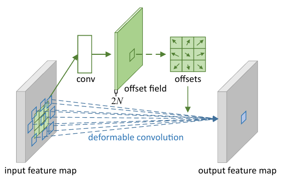
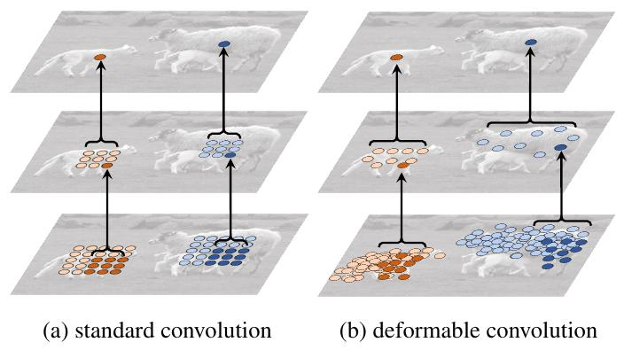
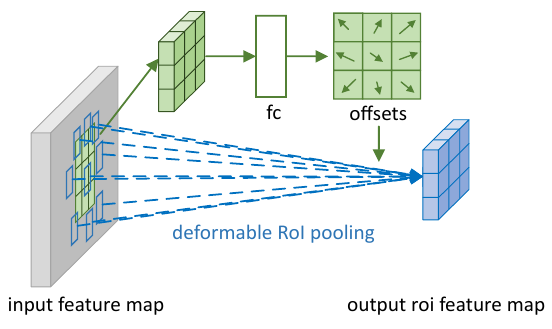
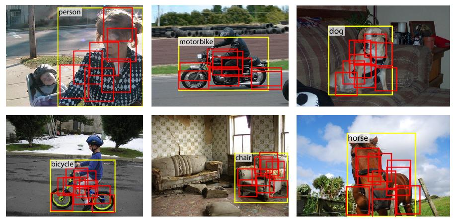

# Деформируемые архитектуры

Традиционные архитектуры по [семантической сегментации](../Semantic-segmentation/Semantic-segmentation-task) и [детекции объектов](Object-detection-task) оперируют [свёртками](../ConvPool-Images/Conv-images), имеющими <u>квадратную область видимости</u> (receptive field), где сторона квадрата - это размер ядра свёртки. Аналогично при построении эмбеддингов [регионов интереса](Two-stage-detectors#обработка-регионов-кандидатов-в-fast-r-cnn) используется [пирамидальный](../ConvPool-Images/Pooling#пирамидальный-пулинг) либо [ROI-пулинг](Two-stage-detectors#обработка-регионов-кандидатов-в-fast-r-cnn)), агрегирующий активации только по <u>прямоугольной окрестности</u>.

При этом реальный объект на изображении может быть <u>произвольной формы</u>, например, круглой или вытянутой. Вследствие этого сигнал, поступающий снаружи детектируемого объекта, зашумляет ответ, снижая точность распознавания.

Для более таргетного извлечения информации только с фактической области, на которой расположен объект, используется **деформируемая свёртка** и **деформируемый ROI-пулинг**.

## Деформируемая свёртка

В **деформирумой свёртке** (deformable convolution) [[1]](https://openaccess.thecvf.com/content_iccv_2017/html/Dai_Deformable_Convolutional_Networks_ICCV_2017_paper.html) используются адаптивные сдвиги, автоматически настраиваемые другим модулем сети, как показано на рисунке [[1]](https://openaccess.thecvf.com/content_iccv_2017/html/Dai_Deformable_Convolutional_Networks_ICCV_2017_paper.html):

Для прогнозирования сдвигов используется внешний свёрточный слой из свёртки того же размера, что и базовая свёртка, для которой сдвиги предсказываются. Для каждой позиции этот слой предсказывает сдвиги по оси X и по оси Y - ядро основной свёртки прикладывается при поэлементном перемножении на активации не равномерно, а с учётом предсказанных сдвигов. 

В результате свёртка извлекает признак присутствия объекта более точно за счёт улучшенной локализации на объекте [[1]](https://openaccess.thecvf.com/content_iccv_2017/html/Dai_Deformable_Convolutional_Networks_ICCV_2017_paper.html):

Использование деформируемой свёртки позволило повысить точность семантической сегментации.

## Деформируемый ROI pooling

В [двухстадийных детекторах](Two-stage-detectors), таких как [Faster R-CNN](Two-stage-detectors#faster-r-cnn), используется операция [ROI pooling](Two-stage-detectors#обработка-регионов-кандидатов-в-fast-r-cnn), в которой к региону интереса (region proposal) на карте признаков применяется один слой пирамидального пулинга, например, сеткой 3x3, а в каждой области сетки ищется максимальное либо среднее значение по каждому каналу. 

Регион интереса представляет собой прямоугольную область, что в общем случае не соответствует реальной форме детектируемого объекта. Поэтому в [[1]](https://openaccess.thecvf.com/content_iccv_2017/html/Dai_Deformable_Convolutional_Networks_ICCV_2017_paper.html) предлагается ввести дополнительный модуль, который по признакам, извлечённым традиционным ROI-пулингом, используя дополнительный полносвязный либо свёрточный слой, предсказывающий смещения областей агрегации, по которым будет работать основной блок ROI-пулинга. Эта схема названа **деформируемым ROI пулингом** (deformable ROI pooling) и проиллюстрирована ниже:

> Сдвиги предсказываются не абсолютные, а относительные (относительно ширины и высоты сдвигаемого региона), чтобы метод мог работать <u>инвариантно с регионами разного размера</u>.

Использование деформируемого ROI-пулинга позволило повысить точность детекции за счёт более таргетной настройки области видимости ROI-пулинга на расположение детектируемого объекта, как показано ниже [[1]](https://openaccess.thecvf.com/content_iccv_2017/html/Dai_Deformable_Convolutional_Networks_ICCV_2017_paper.html):

## Литература

1. [Dai J. et al. Deformable convolutional networks //Proceedings of the IEEE international conference on computer vision. – 2017. – С. 764-773.](https://openaccess.thecvf.com/content_iccv_2017/html/Dai_Deformable_Convolutional_Networks_ICCV_2017_paper.html)
