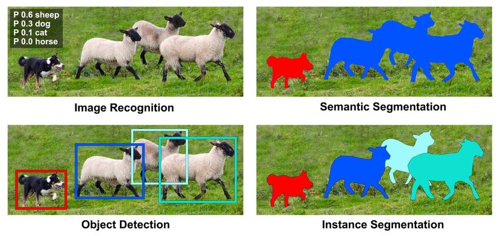

# Сегментация объектов

При распознавании объектов на изображениях можно решать четыре основных типа задач:

- [классификация](../Convolutional-architectures) (classification, recognition);

- [семантическая сегментация](../Semantic-segmentation) (semantic segmentation);

- [детекция объектов](../Object-detection) (object detection);

- **сегментация объектов** или **инстанс-сегментация** (instance segmentation).

Результат решения каждой задачи показан ниже [[1]](https://www.researchgate.net/publication/373293605_Indoor_Scene_Understanding_for_the_Visually_Impaired_Based_on_Semantic_Segmentation?_tp=eyJjb250ZXh0Ijp7ImZpcnN0UGFnZSI6Il9kaXJlY3QiLCJwYWdlIjoiX2RpcmVjdCJ9fQ):

При **классификации изображений** выходом являются вероятности присутствия объектов разных классов на изображении в целом. 

В **детекции объектов** каждый объект интересующих классов выделяется прямоугольной рамкой с меткой класса, которому объект принадлежит. 

В **семантической сегментации** каждый пиксель помечается тем или иным классом, в зависимости от того, объект какого типа он покрывает. При этом, если присутствует несколько представителей одного класса, то <u>метки пикселей их различать не будут</u>.

> Например, на иллюстрации выше присутствует несколько овец, но все содержащие их пиксели помечены <u>одним цветом</u>. 

В **сегментации объектов** (instance segmentation), как и в семантической сегментации, каждый пиксель изображения помечается своим классом, при этом <u>различаются выделения различных представителей одного класса</u>, как показано на иллюстрации, на которой каждая овца была помечена своим цветом. 

> Поэтому сегментация объектов представляет собой усложнённый вариант детекции объектов, когда каждый объект выделяется не рамкой, а маской произвольной формы.

Технически сегментация объектов решается надстройкой над архитектурой детекции объектов, в которой, помимо выделения рамки, присутствует блок, прогнозирующий маску, попиксельно выделяющую каждый объект в рамке.

Как и в случае [детекции объектов](../Object-detection/Two-stage-detectors), модели сегментации объектов бывают 

- **одностадийные** (one-stage instance segmentation), которые сразу предсказывают результат;

- **двухстадийные** (two-stage instance segmentation), в которых сначала предсказываются регионы интереса (region proposals, regions of interest, ROI), в которых могут потенциально находиться детектируемые объекты. Далее на втором шаге для каждого из региона производится классификация типа объекта, уточнение координат рамки и выделение маски объекта.

---

Далее будут разобраны популярная архитектура двухстадийной сегментации [Mask R-CNN](Mask-R-CNN) и архитектура одностадийной сегментации [YOLACT](YOLACT).

## Литература

1. [Liu H. Indoor Scene Understanding for the Visually Impaired Based on Semantic Segmentation. – 2022.](https://www.researchgate.net/publication/373293605_Indoor_Scene_Understanding_for_the_Visually_Impaired_Based_on_Semantic_Segmentation?_tp=eyJjb250ZXh0Ijp7ImZpcnN0UGFnZSI6Il9kaXJlY3QiLCJwYWdlIjoiX2RpcmVjdCJ9fQ)
