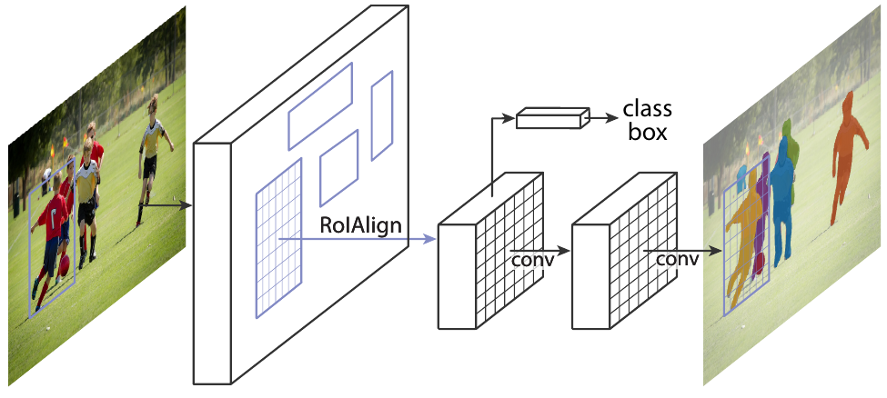
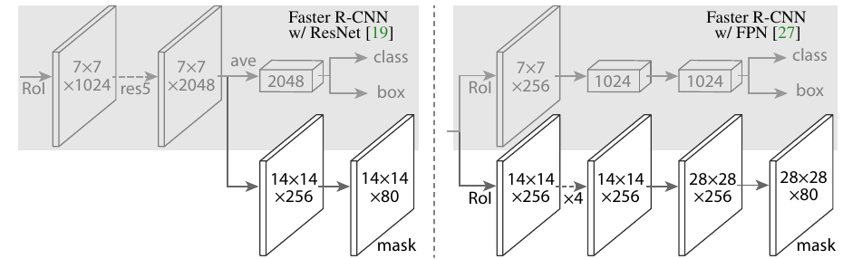
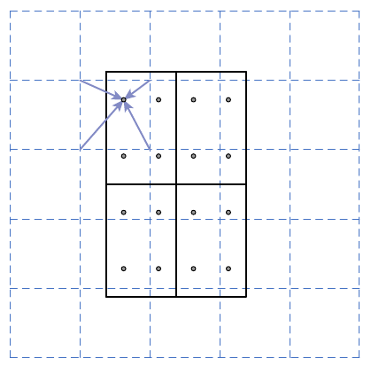
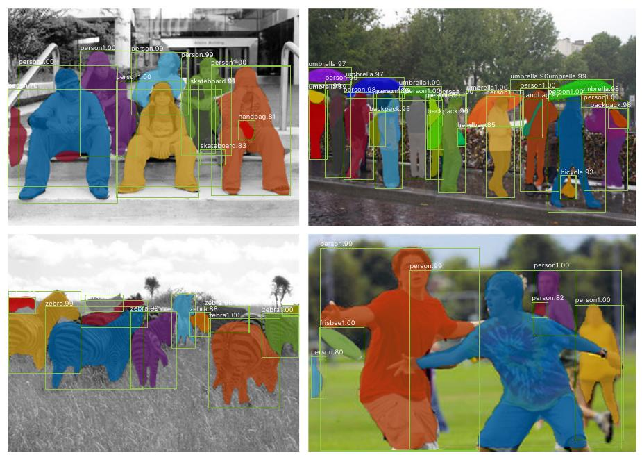
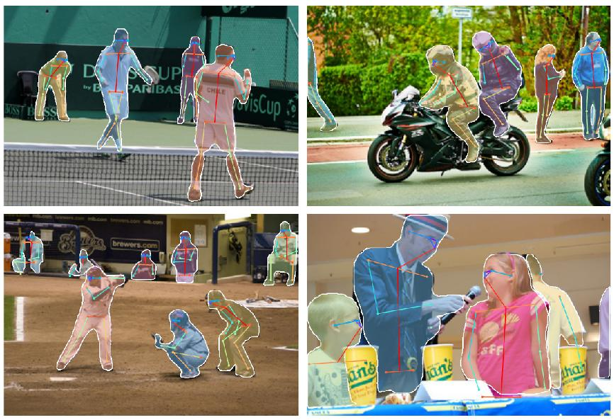

# Mask R-CNN

## Архитектура

Модель **Mask R-CNN** [[1]](https://openaccess.thecvf.com/content_iccv_2017/html/He_Mask_R-CNN_ICCV_2017_paper.html) - популярный двухстадийный метод [сегментации объектов](Problem-statement) (instance segmentation). Она строится на базе детектора [Faster R-CNN](../Object-detection/Two-stage-detectors#faster-r-cnn) [[2]](https://ieeexplore.ieee.org/abstract/document/7485869/), поэтому относится к классу двухстадийных методов:

- <u>на первом шаге</u> генерируются регионы-кандидаты (regions of interest, ROI) на изображении, в которых могут содержаться интересующие нас объекты;

- <u>на втором шаг</u>е каждый регион-кандидат 
  
  - относится к тому или иному классу
  
  - уточняется расположение содержащей его рамки 
  
  - <u>предсказывается маска, выделяющая объект</u>.

Общая схема метода показана ниже [[1]](https://openaccess.thecvf.com/content_iccv_2017/html/He_Mask_R-CNN_ICCV_2017_paper.html):

**Выделение маски** осуществляется отдельной веткой вычислений, не зависящих от классификации объекта и уточнения позиции рамки (class и box на схеме). Оно осуществляется серией [свёрток](../ConvPool-Images/Conv-images) и [транспонированных свёрток](../Semantic-segmentation/Upsampling-operations#транспонированная-свёртка). В конце выдаётся $C$ [карт признаков](../ConvPool-Images/Conv-images) (feature maps), отвечающих выделению каждого из классов. Функция потерь выделения маски штрафует несоответствие только той карты признаков, которая отвечает классу, предсказанному классификатором.

Функция потерь состоит из трёх компонент:

- точность классификации;

- точность выделения рамки;

- точность выделения маски в рамке.

Выделение регионов-кандидатов производится по карте признаков, извлекаемых свёрточным **кодировщиком** (backbone). 

Варианты ветви вычислений, выделяющей маску объектов, показаны ниже для случая, когда кодировщиком выступает [ResNet](../Convolutional-architectures/ResNet) и [FPN](../Object-detection/Feature-Pyramid-Network) [[1]](https://openaccess.thecvf.com/content_iccv_2017/html/He_Mask_R-CNN_ICCV_2017_paper.html):

Лучший результат был получен с использованием сети FPN.

## RoIAlign

Для повышения точности в Mask R-CNN вместо операции [RoIPool](../Object-detection/Two-stage-detectors#обработка-регионов-кандидатов-в-fast-r-cnn) из Faster R-CNN (использовавшего один слой [пирамидального пулинга](../ConvPool-Images/Pooling#пирамидальный-пулинг)) использовалась операция **RoIAlign**, делавшая то же самое, но не над исходными признаками, а над их [билинейно интерполированными значениями](../Semantic-segmentation/Upsampling-operations#билинейная-интерполяция) с учётом произвольного расположения рамки региона интереса относительно карты признаков, что проиллюстрировано ниже [[1]](https://openaccess.thecvf.com/content_iccv_2017/html/He_Mask_R-CNN_ICCV_2017_paper.html):

Примеры работы сети приведены ниже [[1]](https://openaccess.thecvf.com/content_iccv_2017/html/He_Mask_R-CNN_ICCV_2017_paper.html):

## Оценка позы

В работе также рассматривалось применение модели Mask R-CNN для **оценки поз** (pose estimation). 

Для этого вместо $C$ выделяющих масок для каждого класса предсказывалось $K$ пространственных карт рейтингов присутствия для каждого опорного узла тела, по которым восстанавливалась поза человека.

Примеры решения этой задачи показаны ниже [[1]](https://openaccess.thecvf.com/content_iccv_2017/html/He_Mask_R-CNN_ICCV_2017_paper.html):

## Литература

1. [He K. et al. Mask r-cnn //Proceedings of the IEEE international conference on computer vision. – 2017. – С. 2961-2969.](https://openaccess.thecvf.com/content_iccv_2017/html/He_Mask_R-CNN_ICCV_2017_paper.html)
2. [Ren S. et al. Faster R-CNN: Towards real-time object detection with region proposal networks //IEEE transactions on pattern analysis and machine intelligence. – 2016. – Т. 39. – №. 6. – С. 1137-1149.](https://ieeexplore.ieee.org/abstract/document/7485869/)
