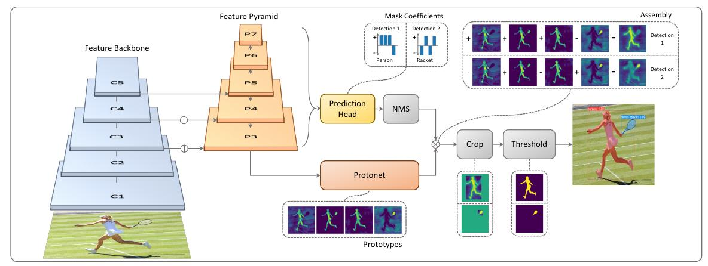
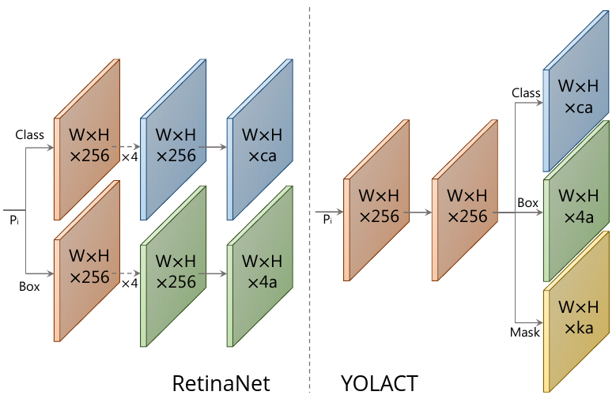
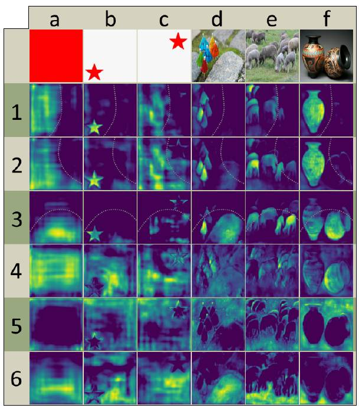
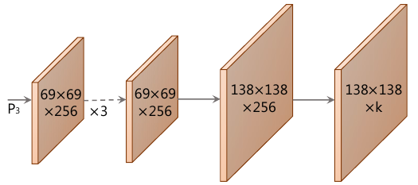
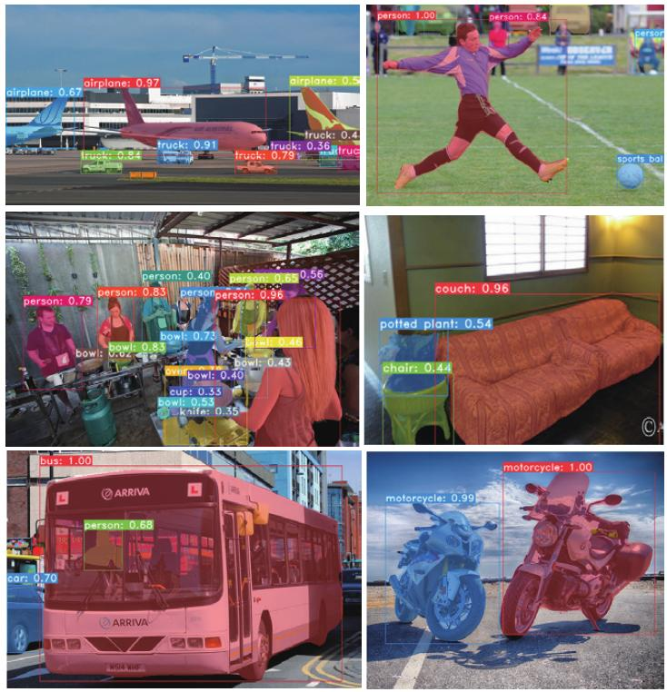

# YOLACT

Модель **YOLACT** - популярный <u>одностадийный</u> метод [сегментации объектов](Problem-statement) (instance segmentation). Он работает менее точно, чем Mask R-CNN, но зато существенно быстрее, поскольку в нём не производится предварительный этап генерации [регионов интереса](../Object-detection/Two-stage-detectors) (regions of interest, RoI).

Архитектура сети показана ниже [[1]](https://openaccess.thecvf.com/content_ICCV_2019/html/Bolya_YOLACT_Real-Time_Instance_Segmentation_ICCV_2019_paper.html):

Вначале из изображения извлекается промежуточное признаковое представление с использованием архитектуры [Feature Pyramid Network](../Object-detection/Feature-Pyramid-Network) (FPN), позволяющей получить  семантически сложные признаки в высоком разрешении. 

Аналогично модели [RetinaNet](../Object-detection/RetinaNet), на каждом уровне декодировщика FPN (и для каждой пространственной позиции) работает одинаковый детектор. Поскольку каждый уровень имеет своё разрешение, это позволяет детектировать как большие, так и малые объекты. Детектор, в свою очередь, выдаёт для каждой из [шаблонных выделяющих рамок](../Object-detection/SSD#прогнозирование) ($a$ штук): 

- 4 регрессионных ответа (коррекции координат выделяющей рамки);

- $C$ вероятностей классов.

Дополнительно детектор в YOLACT предсказывает $k$ **смешивающих коэффициентов** (mask coefficients), как показано на нужней схеме справа (слева для сравнения показан детектор в RetinaNet) [[1]](https://openaccess.thecvf.com/content_ICCV_2019/html/Bolya_YOLACT_Real-Time_Instance_Segmentation_ICCV_2019_paper.html):

Таким образом, для каждого уровня FPN-декодировщика и для каждой пространственной позиции предсказывается $a(4+C+k)$ значений.

Также к самому нижнему ярусу FPN-декодировщика (обладающего максимальным пространственным разрешением) применяется сеть, определяющая $k$ **масок-прототипов** (prototypes), из линейной комбинации которых будут составляться итоговые маски объектов. Примеры масок для шести прототипов приведены ниже [[1]](https://openaccess.thecvf.com/content_ICCV_2019/html/Bolya_YOLACT_Real-Time_Instance_Segmentation_ICCV_2019_paper.html):

Вычислительная ветка для их выделения состояла из операций [повышения разрешения](../Semantic-segmentation/Upsampling-operations) и [свёрток](../ConvPool-Images/Conv-images) [[1]](https://openaccess.thecvf.com/content_ICCV_2019/html/Bolya_YOLACT_Real-Time_Instance_Segmentation_ICCV_2019_paper.html):

Каждому прогнозу детектора на каждой пространственной позиции ставилась в соответствие маска, получаемая как <u>линейная комбинация масок-прототипов, взвешенных с полученными ранее смешивающими коэффициентами в соответствующей позиции</u> (шаг assembly на первом рисунке), после чего полученная маска обрезалась выделяющей рамкой, полученной из задачи регрессии детектора (шаг crop на первом рисунке).

> YOLACT расшифровывается как You Only Look At CoefficienTs, поскольку маска выделений строится как линейная комбинация масок-прототипов с предсказанными коэффициентами.

Примеры итоговых результатов работы YOLACT приведены ниже [[1]](https://openaccess.thecvf.com/content_ICCV_2019/html/Bolya_YOLACT_Real-Time_Instance_Segmentation_ICCV_2019_paper.html):

## Литература

1. [Bolya D. et al. Yolact: Real-time instance segmentation //Proceedings of the IEEE/CVF international conference on computer vision. – 2019. – С. 9157-9166.](https://openaccess.thecvf.com/content_ICCV_2019/html/Bolya_YOLACT_Real-Time_Instance_Segmentation_ICCV_2019_paper.html)
