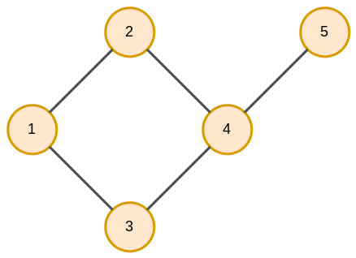
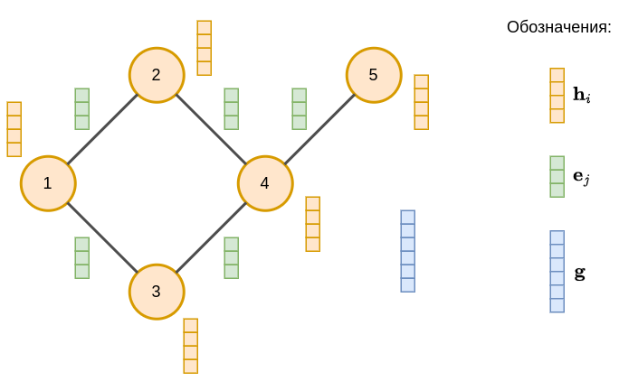
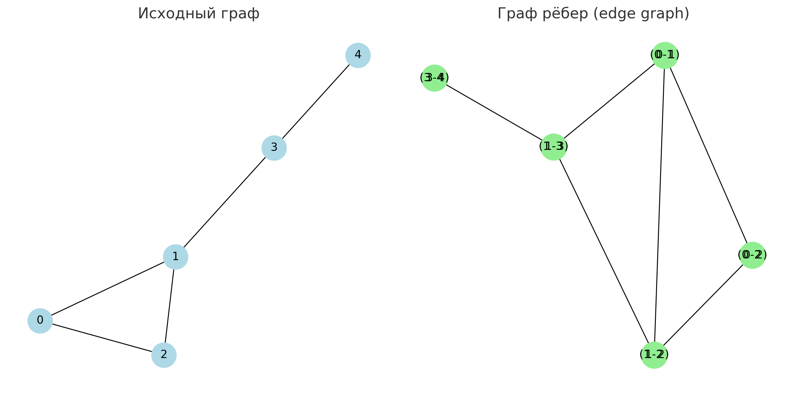
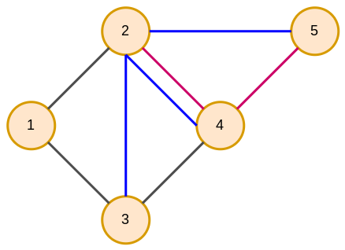
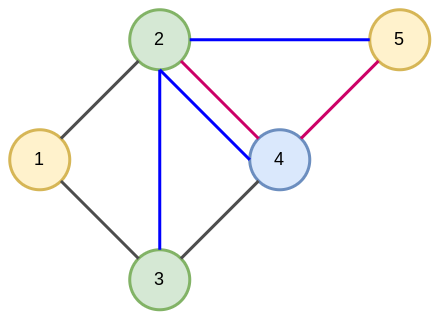

# Типы графов

**Граф** (graph) [[1]](https://ru.wikipedia.org/wiki/%D0%93%D1%80%D0%B0%D1%84_(%D0%BC%D0%B0%D1%82%D0%B5%D0%BC%D0%B0%D1%82%D0%B8%D0%BA%D0%B0)) представляет собой структуру данных, состоящую из **узлов** (называемых также вершинами графа, nodes, vertices) $V=\{v_1,v_2,...v_N\}$, некоторые из которых соединены **рёбрами** (связями, edges) $E=\{(v_i,v_j)\}_{i,j\text{ соединены}}$. 

Рассмотрим основные виды графов и их обобщения, а также описание геометрии графов в виде матриц смежности и матриц степеней.

## Ненаправленный граф

В **ненаправленном графе** (или неориентированном, undirected graph) рёбра не имеют направления: если вершина $v_i$ соединена с $v_j$, то $v_j$ симметрично соединена с $v_i$.

Пример ненаправленного графа:

В нём 5 вершин и 5 ребер $(v_1,v_2),(v_2,v_4),(v_4,v_3),(v_4,v_1)$ и $(v_4,v_5)$.

> Примеры данных, описываемых ненаправленным графом:
> 
> - молекула, в которой узлами являются атомы, а рёбрами - химические связи;
> 
> - электрические схемы, в которых узлами являются элементы схемы, а рёбрами - провода между ними;
> 
> - социальная сеть, где узлами выступают пользователи, а рёбрами - отношения взаимной дружбы между ними;
> 
> - туристическая карта, в которой узлами выступают локации, а рёбрами - пешеходные дороги между ними.

## Направленный граф

В **направленном графе** (или ориентированном, directed graph) рёбра имеют направления. Для каждого ребра известно, из какой вершины оно выходит и в какую приходит. 

Пример направленного графа приведён ниже:

> Примеры данных, описываемых направленным графом:
> 
> - социальная сеть, где узлами выступают пользователи, а рёбрами - их подписки на новости друг друга;
> 
> - система передачи данных, где узлами обозначаются элементы системы, а рёбрами - потоки данных между ними;
> 
> - автомобильная дорожная сеть, где узлами являются перекрёстки, а рёбрами - направления движения на дорогах.

## Смешанный граф

**Смешанный граф** (mixed graph) содержит как направленные, так и ненаправленные рёбра.

> Примеры данных, описываемых смешанным графом:
> 
> - транспортные сети, где узлами выступают перекрёстки, а рёбрами - связи односторонними и двусторонними дорогами;
> 
> - энергетические системы, где узлами выступают станции перераспределения, генераторы и потребители, а связями - линии передачи энергии.

Далее, для простоты, будут рассматриваться только ненаправленные графы, хотя приводимые выводы можно обобщить и для направленных и смешанных графов.

## Ассоциированные данные

Каждой вершине графа $v_i$ может быть сопоставлен свой $D$-мерный вектор признаков $\mathbf{h}_i$:

$$
v_i \to \mathbf{h}_i \in \mathbb{R}^D
$$

> Например, в социальной сети это могут быть характеристики пользователя.

Аналогично каждому ребру может сопоставляться свой вектор данных:

$$
c_j \to \mathbf{e}_j \in \mathbb{R}^{D_e}
$$

> В графе социальной сети связи могут дополняться информацией, которую пользователи пересылают друг другу.

Также всему графу целиком может сопоставляться вектор данных $\mathbf{g}\in\mathbb{R}^{D_g}$, описывающий весь граф.

> Графу, описывающему молекулярное соединение, может сопоставляться информация о физических и химических свойствах этого соединения.

Ниже приведён пример графа с визуализацией векторов данных, описывающих свойства вершин, рёбер и свойств всего графа целиком:

Чаще всего рассматриваются только данные, ассоциированные узлам, которые можно объединить в матрицу $H=[\mathbf{h}_1,...\mathbf{h}_N]\in\mathbb{R}^{D\times N}$, в которой $j$-му столбцу соответствует вектор $\mathbf{h}_j$, описывающий характеристики вершины $v_j$.

## Граф рёбер

По исходному графу можно построить сопряжённый **граф рёбер** (edge graph), в котором

- каждая связь исходного графа становится узлом;

- узлы сопряжённого графа соединяются, если соответствующие им рёбра имеют общий узел в исходном графе.

Пример (a) исходного графа  (b) выделения рёбер в узлы и (c) сопряжённого графа рёбер приведён ниже:

По сопряжённому графу рёбер можно обратно восстановить исходный граф.

## Мультиграфы

Существуют структуры данных, описываемые **мультиграфами** (multigraph), в которых узлы могут соединяться <u>рёбрами разных типов</u>, обозначенными в примере ниже цветом:

> Примеры данных, описываемых мультиграфом:
> 
> - социальная сеть, в которой узлы - пользователи, которые могут вступать в разные виды взаимодействия (ставить лайки, писать комментарии, подписываться друг на друга);
> 
> - логистическая сеть, где узлы - локации, по которым можно перемещаться, используя разный вид транспорта (на автобусе, метро или самолёте).

## Гетерогенные графы

**Гетерогенные графы** (heterogeneous graph) - это графы, состоящие из <u>узлов разных типов</u>. Ниже приведён пример гетерогенного мультиграфа, на котором узлы и рёбра разных типов обозначены различными цветами:

> Примеры данных, описываемых гетерогенным графом:
> 
> - торговая система, в которой узлами выступают пользователи, товары и продавцы, взаимодействующие друг с другом;
> 
> - граф знаний, в котором узлами являются персоны, компании, страны и события, связанные друг с другом.

## Матрица смежности

Рёбра графа из $N$ вершин описываются **матрицей смежности** (adjency matrix) $A\in\mathbb{R}^{N \times N}$.

### Ненаправленный граф

Для ненаправленного графа элементы матрицы смежности формируются по правилу:

$$
a_{ij}=
\begin{cases}
1, & \text{ если $v_i$ и $v_j$ соединены ребром,}
\\
0, & \text{ иначе.}
\end{cases}
$$

Рассмотрим граф: 

Для него матрица смежности будет

$$
A=\left(\begin{array}{ccccc}
0 & 1 & 1 & 0 & 0\\
1 & 0 & 0 & 1 & 0\\
1 & 0 & 0 & 1 & 0\\
0 & 1 & 1 & 0 & 1\\
0 & 0 & 0 & 1 & 0
\end{array}\right)
$$

Эта матрица будет симметричной ($A=A^T$), поскольку если $(v_i,v_j)$ соединены ребром, то в ненаправленном графе ребром также будут соединены и $(v_j,v_i)$. 

### Направленный граф

Для направленного графа элементы матрицы смежности формируются по правилу:

$$
a_{ij}=
\begin{cases}
1, & \text{ если ребро выходит из $v_j$ в $v_i$,}
\\
0, & \text{ иначе.}
\end{cases}
$$

Рассмотрим граф:

Для него матрица смежности будет

$$
A=\left(\begin{array}{ccccc}
0 & 0 & 1 & 0 & 0\\
1 & 0 & 0 & 1 & 0\\
0 & 0 & 0 & 0 & 0\\
0 & 0 & 1 & 0 & 0\\
0 & 0 & 0 & 1 & 0
\end{array}\right)
$$

Для направленного графа матрица смежности уже не обязательно будет симметричной.

### Свойство матрицы смежности

Если $\mathbf{o}_i$ - one-hot закодированная вершина $v_i$, то 

$$
\begin{aligned}
A \cdot \mathbf{o}_{i} & \text{ - число путей длины 1 до вершин из }v_{i}\\
A \cdot A\cdot\mathbf{o}_{i} & \text{ - число путей длины 2 до вершин из }v_{i}\\
A \cdot A\cdot A\cdot\mathbf{o}_{i} & \text{ - число путей длины 3 до вершин из }v_{i}\\
\cdots & \cdots
\end{aligned}

$$

В общем случае, $A^n\cdot\mathbf{o}_{i} \in\mathbb{R}^{N}$ - число путей длины $n$ из вершины $v_i$ до всех других вершин графа. При этом в расчёте числа путей допускается посещение каждой вершины и проход по одному и тому же ребру несколько раз. 

> Минимальное $n$, при котором $j$-й элемент $\{A^n\cdot\mathbf{o}_{i}\}_j>0$, будет длиной маршрута из $v_i$ в $v_j$.

## Матрица степеней

Также для графа рассматривают **матрицу степеней** (degree matrix) - диагональную матрицу $D\in\mathbb{R}^{N\times N}$, в которой $d_{ii}$ равно числу связей $i$-й вершины с другими вершинами. При этом для направленного графа различают матрицу степеней для входящих и исходящих рёбер. 

Рассмотрим граф:

Для него матрица степеней будет

$$
D=\left(\begin{array}{ccccc}
2 & 0 & 0 & 0 & 0\\
0 & 2 & 0 & 0 & 0\\
0 & 0 & 2 & 0 & 0\\
0 & 0 & 0 & 3 & 0\\
0 & 0 & 0 & 0 & 1
\end{array}\right)
$$

---

Важно понимать, что вершины в графе можно нумеровать <u>в произвольном порядке</u>: если их перенумеровать, то, по сути, это будет тот же самый граф, и модели, обрабатывающие графы, не должны зависеть от перенумерации вершин. Графы, эквивалентные с точностью до перенумерации вершин, называются **изоморфными**. Изоморфизму в графах посвящена [следующая глава](Graph-isomorphism).

Далее мы рассмотрим, какие [задачи можно решать на графах](Tasks-on-graphs), изучим [подходы к их решению](Graph-neural-networks), используя глубокое обучение, а потом разберём основной использующийся для этого нейросетевой метод - [свёрточные графовые сети](Graph-convolutional-networks).

## Литература

1. [Wikipedia: Граф (математика).](https://ru.wikipedia.org/wiki/Граф_(математика)) 
2. 
