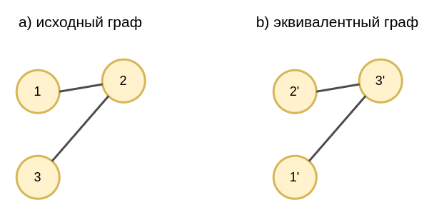

# Изоморфизм графов

Вершины [графа](Graphs-types) можно нумеровать <u>произвольным образом</u>, и это <u>не должно оказывать влияния на результат обработки графа</u>. Графы, идентичные друг другу с точностью до перенумерации вершин, называются **изоморфными**.

Рассмотрим для простоты [ненаправленный граф](Graphs-types#ненаправленный-граф). 

Ниже приведён пример исходного графа и его эквивалентной версии, используя следующую перенумерацию вершин:

$$
1\to 2',\quad 2\to 3', \quad 3 \to 1'
$$

> В общем случае для графа, состоящего из $N$ вершин, существует $N(N-1)\cdot...\cdot 1=N!$ перенумераций его вершин.

### Матрица перестановок

Перенумерацию вершин можно задать **матрицей перестановок** (permutation matrix) $P\in\mathbb{R}^{N\times N}$, формируемой по правилу:

$$
p_{ij}=
\begin{cases}
1, & \text{если $i$-й узел перенумеруется $j$-м узлом,} \\
0, & \text{иначе.}
\end{cases}
$$

Перестановочная матрица для перенумерации выше будет:

$$
P=\left(\begin{array}{ccc}
0 & 1 & 0\\
0 & 0 & 1\\
1 & 0 & 0
\end{array}\right)
$$

Заметим, что 

$$
P\cdot P^T=P^T\cdot P=I \quad \text{(единичная матрица)},
$$

поскольку

$$
\{P\cdot P^T\}_{ij} = \sum_{k=1}^N p_{ik}p_{jk}=
\begin{cases}
1, & i=j,
\\
0, & i\ne j.
\end{cases}
$$

Следовательно $P^T$ соответствует обратной перенумерации к $P$.

### Преобразование матрицы данных

Изучим, как при изоморфизме можно преобразовывать [матрицу данных](Graphs-types#ассоциированные-данные), содержащую по столбцам вектора признаков, ассоциированные с каждой вершиной графа.

Рассмотрим изоморфные графы:

Пусть в исходном графе узлам были сопоставлены данные:

$$
v_{1}\to\left(\begin{array}{c}
1\\
2\\
3\\
4
\end{array}\right),\quad v_{2}\to\left(\begin{array}{c}
10\\
20\\
30\\
40
\end{array}\right),\quad v_{3}\to\left(\begin{array}{c}
100\\
200\\
300\\
400
\end{array}\right)
$$

а исходная матрица данных имела вид:

$$
H=\left(\begin{array}{ccc}
1 & 10 & 100\\
2 & 20 & 200\\
3 & 30 & 300\\
4 & 40 & 400
\end{array}\right)
$$

После перенумерации соответствующую матрицу данных $X'$ можно получить по правилу:

$$
H' = H\cdot P=\left(\begin{array}{ccc}
1 & 10 & 100\\
2 & 20 & 200\\
3 & 30 & 300\\
4 & 40 & 400
\end{array}\right)\cdot\left(\begin{array}{ccc}
0 & 1 & 0\\
0 & 0 & 1\\
1 & 0 & 0
\end{array}\right)=\left(\begin{array}{ccc}
100 & 1 & 10\\
200 & 2 & 20\\
300 & 3 & 30\\
400 & 4 & 40
\end{array}\right)
$$

### Преобразование матрицы смежности

Рассмотрим, как преобразуется [матрица смежности](Graphs-types#матрица-смежности) для следующих изоморфных графов:

Матрица смежности исходного графа была:

$$
A=\left(\begin{array}{ccc}
0 & 1 & 0\\
1 & 0 & 1\\
0 & 1 & 0
\end{array}\right)
$$

После перенумерации узлов соответствующую матрицу смежности можно получить по правилу:

$$
\begin{aligned}
A'=&P^T\cdot A\cdot P
\\=&
\left(\begin{array}{ccc}
0 & 0 & 1\\
1 & 0 & 0\\
0 & 1 & 0
\end{array}\right)\cdot\left(\begin{array}{ccc}
0 & 1 & 0\\
1 & 0 & 1\\
0 & 1 & 0
\end{array}\right)\cdot\left(\begin{array}{ccc}
0 & 1 & 0\\
0 & 0 & 1\\
1 & 0 & 0
\end{array}\right)
\\
=&\left(\begin{array}{ccc}
0 & 0 & 1\\
0 & 0 & 1\\
1 & 1 & 0
\end{array}\right),
\end{aligned}
$$

откуда видно, что первая и вторая вершины должны быть соединены с третьей.

Обратное преобразование будет иметь вид:

$$
A=P A' P^T
$$

### Преобразование матрицы степеней

Рассмотрим, как преобразуется [матрица степеней](Graphs-types#матрица-степеней) для следующих изоморфных графов:

Матрица степеней исходного графа была:

$$
D=\left(\begin{array}{ccc}
1 & 0 & 0\\
0 & 2 & 0\\
0 & 0 & 1
\end{array}\right)
$$

Матрицу степеней после перенумерации можно получить по правилу

$$
\begin{aligned}
D'=&P^T\cdot D\cdot P
\\=&
\left(\begin{array}{ccc}
0 & 0 & 1\\
1 & 0 & 0\\
0 & 1 & 0
\end{array}\right)\cdot\left(\begin{array}{ccc}
1 & 0 & 0\\
0 & 2 & 0\\
0 & 0 & 1
\end{array}\right)\cdot\left(\begin{array}{ccc}
0 & 1 & 0\\
0 & 0 & 1\\
1 & 0 & 0
\end{array}\right)
\\
=&\left(\begin{array}{ccc}
1 & 0 & 0\\
0 & 1 & 0\\
0 & 0 & 2
\end{array}\right)
\end{aligned}
$$

> Аналогичное правило действует и для обратной матрицы $D^{-1}$.

## Литература

1. [Граф (wikipedia).](https://ru.wikipedia.org/wiki/%D0%93%D1%80%D0%B0%D1%84_(%D0%BC%D0%B0%D1%82%D0%B5%D0%BC%D0%B0%D1%82%D0%B8%D0%BA%D0%B0))
2. [Prince S. J. D. Understanding deep learning. – MIT press, 2023.](https://udlbook.github.io/udlbook/)
