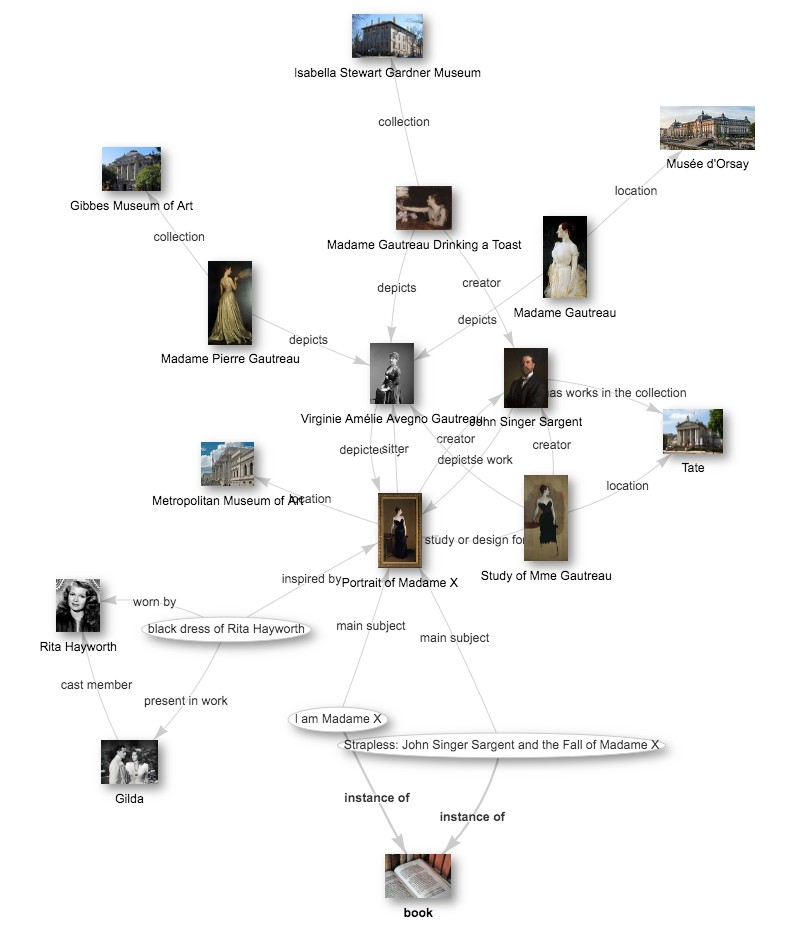
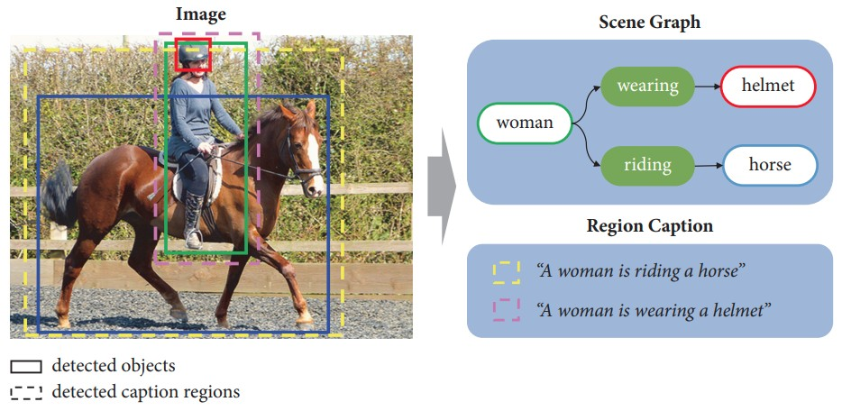

# Задачи на графах

## Типы задач на графах

Рассмотрим популярные задачи на [графах](Graphs-types), решаемых нейросетями:

1. Для части <u>узлов</u> графа известно некоторое свойство. Необходимо восстановить это свойство для остальных узлов (node classification/regression).

2. Для части <u>рёбер</u> которого известно некоторое свойство. Необходимо восстановить это свойство для других рёбер (edge classification/regression). 
   
   > Отметим, что эта задача сводится к предыдущей, если перейти от исходного графа к [графу рёбер](Graphs-types#граф-рёбер) (edge graph), заменив связи вершинами, а данные новых узлов задать как данные соответствующих им рёбер первоначального графа.

3. Дан граф, лишь часть рёбер которого известны. Необходимо <u>восстановить недостающие рёбра</u> (link prediction).

4. Дан набор графов, каждый из которых, как целое, обладает некоторым свойством. Необходимо <u>восстановить это свойство для других похожих графов</u> (graph classification/regression).

5. <u>Обнаружение сообществ в графе</u> (community detection) — задача выделения подмножеств узлов, внутри которых связи плотнее, чем с остальными частями графа. Примером сообщества могут быть группы людей с высокой степенью общения — такие как друзья, одноклассники или коллеги. Задача обычно решается вычислительными методами без использования нейросетей.

6. <u>Генерация графов</u>, обладающих требуемыми свойствами (graph generation). Данная задача решается генеративными методами глубокого обучения, такими как генеративно-состязательные сети.

## Примеры прикладных задач

### Социальная сеть

**Социальную сеть** (social network) можно рассматривать как граф, в котором узлами являются люди, а связи устанавливаются, если они: 

- добавили друг друга в друзья;

- подписаны друг на друга;

- писали друг другу сообщения.

Узлу соответствуют данные, которые пользователь о себе указал (пол, возраст, интересы), а также информация о поведении в сети (сколько раз заходил, просматривал новости, писал сообщения). Рёбрам можно поставить в соответствие интенсивность общения (сколько раз писали друг другу сообщения, заходили на страницы друг друга, ставили реакции на посты).

Примеры задачи для социальной сети:

- предсказание свойства узла: 
  
  - определение тем, которые человеку могли бы быть интересны;
  
  - оценка возраста (если не указан), материального статуса;
  
  - предсказание поведения (вероятность клика или покупки);
  
  - обнаружение аномалий (соответствующих тому, что аккаунт является ботом или мошенником).

- восстановление рёбер:
  
  - рекомендация друзей, постов, групп.

### Граф цитирований

**Граф цитирований** (citation graph) описывает научные работы, выступающие узлами этого графа. Узел соединяется с другим узлом, если научная работа ссылается на другую. Поскольку цитирование - несимметричная операция, то это всегда будет [направленный граф](Graphs-types#направленный-граф).

Примеры задач, решаемых на графе цитирований:

- предсказание свойств узла:
  
  - оценка тематики и научной ценности работы по её содержанию и ссылкам на неё из других работ;

- восстановление рёбер:
  
  - рекомендация новых релевантных ссылок для научной работы, определение связанных друг с другом исследований, даже если они явно не ссылаются друг на друга.

- обнаружение сообществ одноклассников, коллег по работе.

### Интернет

Интернет можно описать графом (network graph), в котором узлами являются веб-страницы, а ребро проводится, если одна веб-страница содержит гиперссылку на другую. Как и в случае графа цитирований, это будет направленный граф.

Задачи, которые можно решать:

- предсказание свойства узла:
  - оценка тематики веб-страницы;
  - оценка важности веб-страницы для оценки её позиции в поисковой выдаче;
- восстановление рёбер:
  - определение веб-страниц схожей тематики, даже если они не ссылаются друг на друга.
- обнаружение сообществ, отвечающих различным направлениям научных исследований.

### Химические соединения

Вещества можно описать химической формулой, а, следовательно, в виде графа, в котором узлами будут являться атомы, а рёбра будут описывать химические связи между ними.

Химические соединения описываются небольшими графами. Многие соединения уже хорошо исследованы, и их свойства известны. Возникает задача для новых гипотетических соединений предсказать их ожидаемые свойства, например,

- является ли вещество проводником или диэлектриком, какова его температура плавления и кипения, теплоёмкость и другие свойства;

- растворимость вещества в воде, способность вещества вступать в химические реакции.

Если изучаемое вещество планируется применять в качестве лекарства, то для него можно оценивать:

- лечебный эффект, способность связываться с определёнными патогенами в организме;

- токсичность для человека и возможные побочные эффекты;

- скорость распространения вещества в организме и выведения из него;

- степень взаимодействия с другими препаратами и риск аллергической реакции.

## Более сложные задачи

Используя признаки, предсказанные для графа целиком, а также для его отдельных  узлов и рёбер, можно решать и более продвинутые задачи, перечисленные ниже.

### Компьютерная сеть

Интернет или внутреннюю сеть (intranet) можно описать в виде графа, где узлами выступают сетевые устройства, а рёбра проводятся, если между устройствами  устанавливаются сетевые соединения.

Тогда можно решать следующие задачи:

- оценка пропускной способности определённых участков сети;

- оптимизация маршрутов передачи данных;

- обнаружение аномалий (взломов, атак, действий вредоносного ПО).

### Городское планирование и транспорт

Пассажиропоток можно описать в виде **транспортного графа** (transportation network), в котором узлами будут остановки, перекрёстки, станции, а рёбрами - маршруты между ними. Тогда можно решать следующие задачи:

- оптимизация транспортных потоков;

- прогнозирования пробок;

- планирования городских систем (размещение станций, прокладка новых маршрутов).

### Рынки и логистика

Взаимодействие экономических агентов можно описать в виде графа, в котором узлами выступают производители сырья, а также производители промежуточных и финальных продуктов, дистрибьюторы, продавцы и покупатели. Рёбрам будут соответствовать обмен товарами и финансовые расчёты. Используя этот граф, можно 

- оценивать кредитоспособность агента;

- управлять запасами на складе;

- прогнозировать логистические задержки поставок;

- оптимизировать цепочки поставок.

### Граф знаний

По размеченным текстам (например, из википедии) можно построить **граф знаний** (knowledge graph), где узлами выступают персоны, компании и события, а рёбрами - характер их взаимодействия. 

Ниже рассмотрен пример такого графа для музеев, картин и художников  [[1]](https://www.researchgate.net/publication/369199434_Investigating_the_potential_of_the_semantic_web_for_education_Exploring_Wikidata_as_a_learning_platform):

Примерами задач на подобном графе могут выступать:

- поиск опосредованных связей между персонами или событиями;

- оценка важности того или иного события в контексте поискового запроса;

- группировка людей, сообществ, событий по темам;

- объединение набора разрозненных фактов в целостные события.

Используя инструменты автоматического анализа, граф знаний можно составлять и из неструктурированного текста, а также из изображений, как показано ниже [[2]](https://www.researchgate.net/publication/329566093_Deep_Image_Understanding_Using_Multilayered_Contexts/figures?lo=1):

### Программный код

Можно представить программный код в виде графа (control flow graph, call graph), в котором узлами будут функции, между которыми проводится ребро, если одна функция вызывает внутри себя другую. Либо узлами могут выступать переменные, а рёбрами - участие одних переменных в формировании других переменных (вычислительный граф). На подобных графах можно решать следующие задачи:

- определение избыточного кода, выявление участков, выполняющих одинаковые действия;

- обнаружение ошибок и уязвимостей;

- объяснение и автоматическое комментирование кода;

- генерация кода, дополняющего уже имеющийся;

- семантический поиск по коду - обнаружение всех участков кода, выполняющих определённый характер действий;

- анализ полноты покрытия кода проверочными тестами, автоматическое создание новых тестов.

---

Далее мы рассмотрим, как можно [формализовать основные виды задач на графах](Graph-neural-networks), используя нейросети, а также изучим основной нейросетевой алгоритм - [свёрточные графовые сети](Graph-convolutional-networks).

## Литература

1. https://www.wikidata.org/wiki/User:Fuzheado/queries
2. [Shin D., Kim I. Deep image understanding using multilayered contexts //Mathematical Problems in Engineering. – 2018. – Т. 2018. – №. 1. – С. 5847460.](https://onlinelibrary.wiley.com/doi/full/10.1155/2018/5847460)
