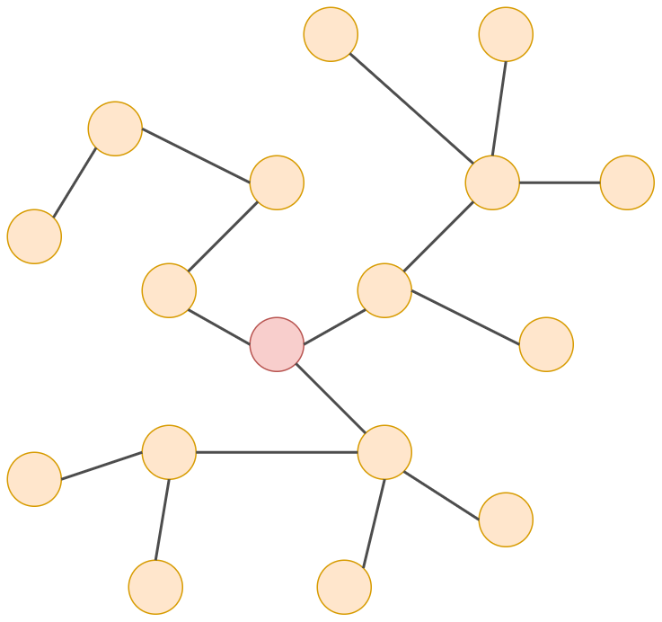
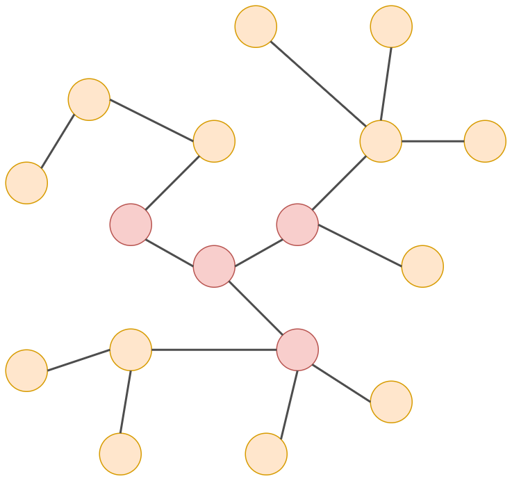
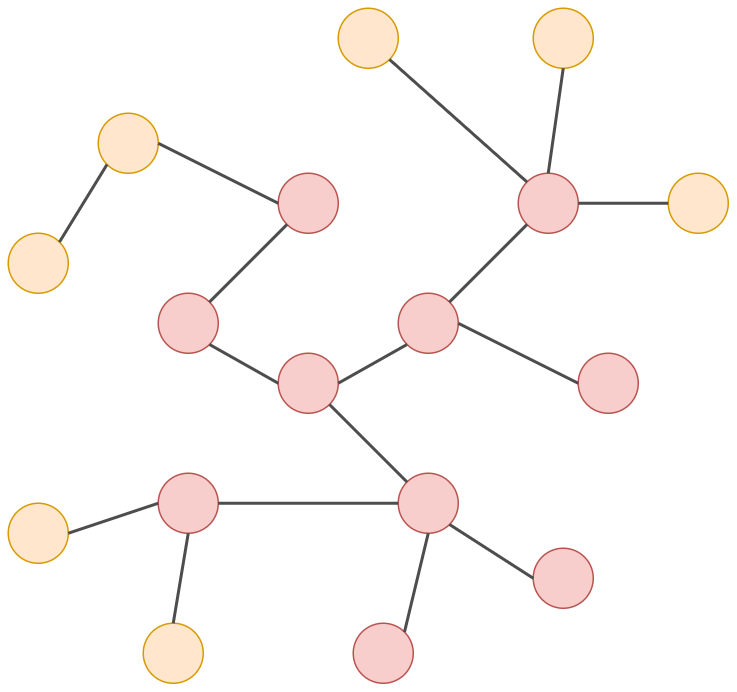
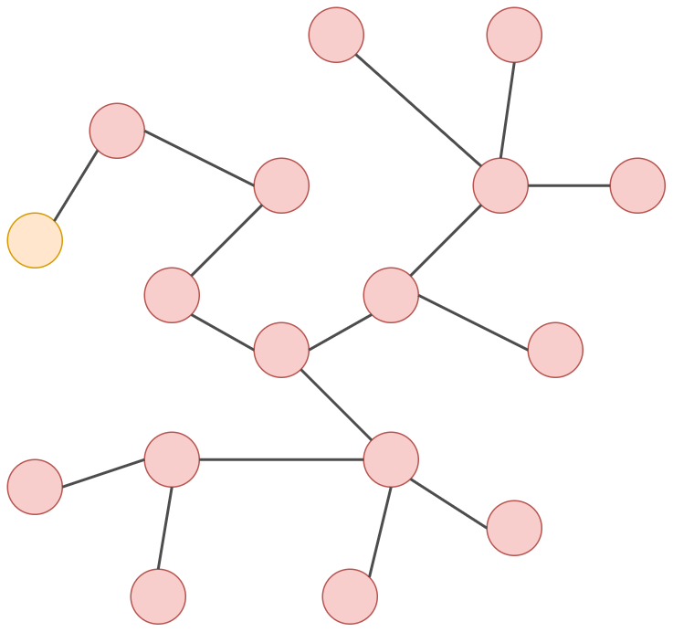

# Cвёрточные графовые сети

**Cвёрточные графовые сети** (graph convolutional networks) реализуют пересчёт исходных признаковых описаний $\mathbf{x}_i$ соответствующих вершин $v_i$, учитывая контекст, то есть признаковые описания соседних вершин. Пересчёт производится много раз, начиная с $\mathbf{h}^0_i=\mathbf{x}_i$ и получая $\mathbf{h}^1_i,\mathbf{h}^2_i,...\mathbf{h}^K_i$ для каждой вершины $v_i$.

Рассмотрим свёртку, действующую на однослойном (чёрно-белом) изображении:

$$
z_{i}^{k+1}=f\left(\sum_{j\in\text{patch}(i)}w_{j}z_{j}^{k}+b\right)\!,
$$

где $b$ - смещение, а $\{w_j\}_j$ - веса для соседних пикселей.

Специфика свёртки на графах: 

- используется информация только с непосредственных соседних вершин;

- нет понятий верхнего, нижнего, правого и левого соседей. 
  
  > Граф может быть повёрнут, но это будет тот же самый граф!

Пересчёт старых эмбеддингов вершин графа $\mathbf{h}^k_m$ в новые $\mathbf{h}^{k+1}_m$ производится по формулам:

$$
\begin{aligned}\mathbf{z}_{n}^{k} & =\text{Aggregate}\left(\left\{ \mathbf{h}_{m}^{k}\right\} _{m\in\mathcal{N}(n)}\right)\!,  \\
\mathbf{h}_{n}^{k+1} & =\text{Update}\left(\mathbf{h}_{n}^{k}, \mathbf{z}_{n}^{l}\right)\!,
\end{aligned}

$$

где 

- $\text{Aggregate}\left(\cdot\right)$ - функция, агрегирующая информацию с соседних вершин;

- $\text{Update}\left(\cdot\right)$ - функция, обновляющая информацию о текущей вершине, используя её информацию с предыдущей итерации и агрегированную информацию о её соседях.

Функция $\text{Aggregate}\left(\cdot\right)$ должна быть определена для любого числа соседей и не должна зависеть от порядка их обхода, чтобы обеспечить свойство инвариантности к перенумерации вершин. Применение операций Aggregate, а затем Update представляет собой одну итерацию **алгоритма обмена сообщениями** (message passing neural network [[1]](https://proceedings.mlr.press/v70/gilmer17a)), который использует несколько итераций, а начальные значения для вершин определяются их начальными эмбеддингами: $\mathbf{h}^0_n = \mathbf{x}_n, n=1,2,...N.$ Если $\mathbf{x}_n$ не заданы, то их можно инициализировать one-hot закодированным значением числа соседей узла или геометрическими характеристиками вершин (число соседей 1-го, 2-го порядка, меры центральности вершин на графе и т. д.)

Алгоритм передачи сообщений представлен ниже:

> ВХОД: 
> 
> - ненаправленный граф $G=(V,E)$
> 
> - начальные эмбеддинги вершин $\{\mathbf{h}^0_n\}$
> 
> - функции $\text{Aggregate}\left(\cdot\right)$ и $\text{Update}\left(\cdot\right)$
> 
> АЛГОРИТМ:
> 
> для $k=1,2,...K$:
> 
> - $\mathbf{z}_{n}^{k} =\text{Aggregate}\left(\left\{ \mathbf{h}_{m}^{k}\right\} _{m\in\mathcal{N}(n)}\right)$
> 
> - $\mathbf{h}_{n}^{k+1}  =\text{Update}\left(\mathbf{h}_{n}^{k}, \mathbf{z}_{n}^{k}\right)$
> 
> ВЫХОД: 
> 
> - итоговые эмбеддинги вершин $\mathbf{h}^K_n,\; n=1,2,...N$

Применение $K$ итераций алгоритма обмена сообщениями аналогично применению $K$ свёрточных слоёв при обработке изображений. Функции Aggregate и Update имеют свои настраиваемые параметры, причём в общем случае они <u>свои на каждой итерации алгоритма</u>. 

> Каждая итерация алгоритма передачи сообщений - это слой глубокой графовой сети.

Обратим внимание, что каждая итерация алгоритма повышает **область видимости** (receptive field) результирующего эмбеддинга на один переход по графу аналогично тому, как его повышает [последовательное применение свёрток](../ConvPool-1D/Conv-1D#извлечение-сложных-нелинейных-признаков). Это проиллюстрировано ниже для отдельной вершины.

Нулевая итерация (начальный эмбеддинг):

Первая итерация:

Вторая итерация:

Третья итерация:

Если граф имеет недостаточную связность, то сообщения между вершинами распространяются медленно. В этом случае связность можно искусственно повысить, добавив в граф дополнительную вершину, связанную со всеми остальными (super-node).

## Агрегирующая функция

Функцию Aggregate можно определять по-разному, лишь бы она была определена для любого числа соседей и не зависела от порядка их обхода. Самый простой вариант - сумма эмбеддингов:

$$
\text{Aggregate}\left(\cdot\right)=\sum_{m\in\mathcal{N}(n)}\mathbf{h}_{m}^{k},
$$

где $\mathcal{N}(n)$ - множество индексов вершин, соединённых ребром с вершиной $n$.

Также можно использовать усреднение:

$$
\text{Aggregate}\left(\cdot\right)=\frac{1}{\left|\mathcal{N}(n)\right|}\sum_{m\in\mathcal{N}(n)}\mathbf{h}_{m}^{k}
$$

> Усреднение по сравнению с суммой работает более устойчиво на вершинах, содержащих сильно различающееся число соседей. Но оно, в отличие от суммы, не способно учитывать зависимость от числа соседей, поскольку при усреднении эта информация теряется.

Также можно усреднять, учитывая различия в числе соседних узлов у каждого соседа [[2]](https://arxiv.org/abs/1609.02907):

$$
\text{Aggregate}\left(\cdot\right) = \sum_{m\in\mathcal{N}(n)}\frac{1}{\sqrt{\left|\mathcal{N}(n)\right|\cdot\left|\mathcal{N}(m)\right|}}\,\mathbf{h}_{m}^{k}
$$

Эмпирически при многократной агрегации на последних слоях алгоритма обмена сообщениями эмбеддинги получаются слишком сглаженными (over-smoothed) за счёт многократных усреднений.  Предотвратить этот эффект можно, используя в качестве агрегации поэлементный максимум:

$$
\text{Aggregate}\left(\cdot\right)=\text{maximum}\left(\left\{ \mathbf{h}_{m}^{k}\right\} _{m\in\mathcal{N}(n)}\right)
$$

Наиболее общим видом усреднения, способным моделировать любую дифференцируемую зависимость, инвариантную к перенумерации вершин, является использование двух [многослойных персептронов](../MLP/Multilayer-perceptron) (multi-layer perceptron, MLP) со своими настраиваемыми векторами параметров $\mathbf{w}$ и $\mathbf{v}$ [[3]](https://proceedings.neurips.cc/paper/2017/hash/f22e4747da1aa27e363d86d40ff442fe-Abstract.html):

$$
\text{Aggregate}\left(\cdot\right)=\text{MLP}_{\mathbf{w}}\left(\sum_{m\in\mathcal{N}(n)}\text{MLP}_{\mathbf{v}}\left(\mathbf{h}_{m}^{k}\right)\right)
$$

> В последней формуле вместо суммы можно использовать и другие перечисленные выше виды агрегации.

## Агрегация со вниманием

Можно использовать **механизм внимания** (attention mechanism) при агрегации узлов [[4]](https://arxiv.org/abs/1710.10903) аналогично тому, как он использовался в [рекуррентных сетях](../Recurrent-neural-nets/Attention-RNN). 

Для этого нужно произвести следующие действия:

1. Вычисляется внимание, с которым узел $v_n$ должен смотреть на каждого своего соседа $v_m$, используя некоторую функцию $g(\cdot)$: 
   
   $$
   s_{nm}=g(\mathbf{h}^k_n,\mathbf{h}^k_m)
   $$

2. Коэффициенты внимания пропускаются через [SoftMax-преобразование](../MLP/Outputs-loss-functions#softmax-преобразование):
   
   $$
   \left\{ a_{nm}\right\}_{m\in\mathcal{N}(n)}=\text{SoftMax}\left(\left\{ s_{nm}\right\}_{m\in\mathcal{N}(n)}\right)
   $$

3. Агрегация информации с узлов осуществляется пропорционально найденному вниманию:
   
   $$
   \mathbf{z}_{n}^{k}=\sum_{n\in\mathcal{N}(n)}a_{nm}\mathbf{h}_{m}^{k}
   $$

Например, внимание может вычисляться через билинейную форму с настраиваемой матрицей $W\in\mathbb{R}^{D\times D}$:

$$
a_{mn}=\frac{\text{exp}\left(\mathbf{h}_{n}^{T}W\mathbf{h}_{m}\right)}{\sum_{m'\in\mathcal{N}(n)}\text{exp}\left(\mathbf{h}_{n}^{T}W\mathbf{h}_{m'}\right)}
$$

В более общем случае внимание может вычисляться через многослойный персептрон:

$$
a_{mn}=\frac{\text{exp}\left(\text{MLP}\left(\mathbf{h}_{n},\mathbf{h}_{m}\right)\right)}{\sum_{m'\in\mathcal{N}(n)}\text{exp}\left(\text{MLP}\left(\mathbf{h}_{n},\mathbf{h}_{m'}\right)\right)}
$$

> Графовые сети с механизмом внимания называются graph attention networks (GAT).

Аналогично тому, как это сделано в [трансформере](../Transformer/Transformer), можно применять [несколько головок внимания](../Transformer/Encoder-self-attention#multi-head-self-attention) со своими весами, конкатенировать полученные результаты и приводить результат к исходному $D$-мерному пространству эмбеддингов, используя линейный слой.

## Обновляющая функция

Типичным способом определения функции Update является использование одного линейного слоя:

$$
\mathbf{h}^{k+1}_n=\text{Update}\left(\mathbf{h}_{n}^{k},\mathbf{z}_{n}^{k}\right)=f\left(W\mathbf{h}^{k}+V\mathbf{z}_{n}^{k}+\mathbf{b}\right)\!,
$$

где $f(\cdot)$ - [функция активации](../MLP/Activation-functions), применяемая поэлементно. Популярный способ передачи сообщений - агрегировать суммированием и использовать одну и ту же матрицу весов для целевого узла и его соседей:

$$
\mathbf{h}_{n}^{k+1}=f\left(W\!\!\!\!\sum_{m\in\mathcal{N}(n)\cup n}\mathbf{h}_{m}^{k}+\mathbf{b}\right)
$$

Чтобы облегчить настройку параметров сети, а также частично избавиться от сглаживания эмбеддингов (когда они становятся слишком похожими за счёт повторного усреднения по ним) можно использовать в качестве выхода сумму преобразования с исходным входом ([остаточный блок](../Training-simplification/ResBlock)), как было в модели [ResNet](../Convolutional-architectures/ResNet):

$$
\mathbf{h}_{n}^{k+1}=\text{Update}\left(\mathbf{h}_{n}^{k},\mathbf{z}_{n}^{k}\right)+\mathbf{h}_{n}^{k}
$$

Альтернативно в качестве итогового представления каждой вершины можно использовать конкатенацию её представлений на всех итерациях передачи сообщений:

$$
\mathbf{h}^{\text{final}}_n = [\mathbf{h}^1_n; \mathbf{h}^1_n; ... \mathbf{h}^K_n]
$$

Тогда даже при сглаживании на последних итерациях эмбеддинги вершин всё равно будут существенно различаться за счёт учёта эмбеддингов с более ранних итераций. 

> С учётом признаков с разных слоёв сети мы уже сталкивались в модели [DenseNet](../Convolutional-architectures/DenseNet).

## Инвариантность к перенумерациям

В матричном виде операции Aggregate и Update можно описать цепочкой преобразований

$$
\begin{aligned}H^{1} & =F\left(X,A,W^{1}\right)\!; \\
H^{2} & =F\left(H^{1},A,W^{2}\right)\!; \\
 & \cdots \\
H^{K} & =F\left(H^{K-1},A,W^{K}\right)\!;
\end{aligned}
$$

где 

- $A$ - [матрица смежности](../Graph-processing/Graphs-types#матрица-смежности) вершин, 

- $H^i=[\mathbf{h}^i_1,...\mathbf{h}^i_N]\in\mathbb{R}^{D\times N}$ - матрица, столбцы которой являются внутренними представлениями узлов на $i$-м шаге алгоритма обмена сообщениями; 

- $X\in\mathbb{R}^{D\times N}$ - матрица начальных эмбеддингов вершин; 

- $W^i$ - матрица настраиваемых весов на $i$-м шаге.

На каждом шаге алгоритма передачи сообщений преобразование $F(\cdot)$ должно обладать **эквивариантностью к перенумерации узлов** (equivariance) - если вершины перенумеровать, то и результат их обработки должен перенумероваться соответствующим образом.

$$
H^{k}P = F\left(H^{k}P,\;P^T\cdot A\cdot P,\;W^{k}\right)
$$

:::note Задача

Запишите в матричном виде описанные выше операции Aggregate и Update. Для операций усреднения вам понадобится [матрица степеней](Graphs-types#матрица-степеней). Для каждой записи в матричном виде докажите, что для неё выполнено свойство эквивариантности. Для этого вам пригодятся формулы пересчёта [матрицы данных](Graph-isomorphism#преобразование-матрицы-данных), [матрицы смежности](Graph-isomorphism#преобразование-матрицы-смежности) и матрицы, обратной к [матрице степеней](Graph-isomorphism#преобразование-матрицы-степеней) при перенумерации вершин графа.

:::

## Учёт эмбеддингов рёбер и всего графа

**Алгоритм передачи сообщений** в графе можно обобщить, чтобы он обновлял и учитывал в обновлении не только эмбеддинги вершин $\mathbf{h}_{n}^{k}$, но также эмбеддинги рёбер $\mathbf{e}_{nm}^{k}$ и всего графа целиком $\mathbf{g}^{k}$ (general message passing [[5]](https://arxiv.org/abs/1806.01261)). 

Обобщённый алгоритм передачи сообщений:

> ВХОД: 
> 
> - ненаправленный граф $G=(V,E)$
> 
> - начальные эмбеддинги вершин $\{\mathbf{h}^0_n\}$
> 
> - начальные эмбеддинги рёбер $\{\mathbf{e}^0_{nm}\}$
> 
> - начальный эмбеддинг графа $\mathbf{g}^0$
> 
> - функции $\text{Aggregate}\left(\cdot\right)$ и $\text{Update}\left(\cdot\right)$
> 
> АЛГОРИТМ:
> 
> для $k=1,2,...K$:
> 
> - $\mathbf{e}_{nm}^{k+1}=\text{Update}_{\text{edge}}\left(\mathbf{e}_{nm}^{k},\mathbf{h}_{n}^{k},\mathbf{h}_{m}^{k},\mathbf{g}^{k}\right)$
> 
> - $\mathbf{z}_{n}^{k+1}=\text{Aggregate}_{\text{node}}\left(\left\{ \mathbf{e}_{nm}^{k+1}\right\} _{m\in\mathcal{N}(n)}\right)$
> 
> - $\mathbf{h}_{n}^{k+1}=\text{Update}_{\text{node}}\left(\mathbf{h}_{n}^{k+1},\mathbf{z}_{n}^{k+1},\mathbf{g}^{k}\right)$
> 
> - $\mathbf{g}_{n}^{k+1}=\text{Update}_\text{graph}\left(\mathbf{g}^{k},\text{GlobalAggregate}_{\text{node}} \left(  \left\{ \mathbf{h}_{n}^{k+1}\right\}\right) ,\text{GlobalAggregate}_{\text{edge}} \left(\left\{ \mathbf{e}_{nm}^{k+1}\right\}\right) \right)$
> 
> ВЫХОД: 
> 
> - итоговые эмбеддинги $\left\{ \mathbf{h}_{n}^{K}\right\} ,\left\{ \mathbf{e}_{nm}^{K}\right\} ,\mathbf{g}^{K}$

Как видим, алгоритм состоит из следующих шагов: 

1. обновляются эмбеддинги каждого ребра по его старому эмбеддингу, эмбеддингам вершин ребра и графа целиком;

2. обновляется эмбеддинг контекста каждой вершины по эмбеддингам связанных с ним рёбер;

3. происходит обновление эмбеддинга вершины по её старому эмбеддингу, контексту и эмбеддингу всего графа;

4. обновляется эмбеддинг всего графа, используя его старый эмбеддинг и агрегацию по обновлённым эмбеддингам вершин и рёбер.

Учёт взаимных влияний признаков вершин, рёбер и графа целиком позволяет моделировать сложные взаимодействия, решая весь комплекс задач на графах:

- предсказание свойств узлов;

- предсказание свойств рёбер;

- предсказание свойств графа целиком.

---

Далее мы рассмотрим [особенности обучения графовых сетей](Training-graph-networks) и изучим [геометрические способы извлечения эмбеддингов вершин графа](Geometric-node-embeddings), не использующие никаких внешних признаков вершин, а учитывающие только их геометрическое расположение на графе.

## Литература

1. [Gilmer J. et al. Neural message passing for quantum chemistry //International conference on machine learning. – PMLR, 2017. – С. 1263-1272.](https://proceedings.mlr.press/v70/gilmer17a)
2. [Kipf T. N., Welling M. Semi-supervised classification with graph convolutional networks //arXiv preprint arXiv:1609.02907. – 2016.](https://arxiv.org/abs/1609.02907)
3. [Zaheer M. et al. Deep sets //Advances in neural information processing systems. – 2017. – Т. 30.](https://proceedings.neurips.cc/paper/2017/hash/f22e4747da1aa27e363d86d40ff442fe-Abstract.html)
4. [Veličković P. et al. Graph attention networks //arXiv preprint arXiv:1710.10903. – 2017.](https://arxiv.org/abs/1710.10903)
5. [Battaglia P. W. et al. Relational inductive biases, deep learning, and graph networks //arXiv preprint arXiv:1806.01261. – 2018.](https://arxiv.org/abs/1806.01261)
