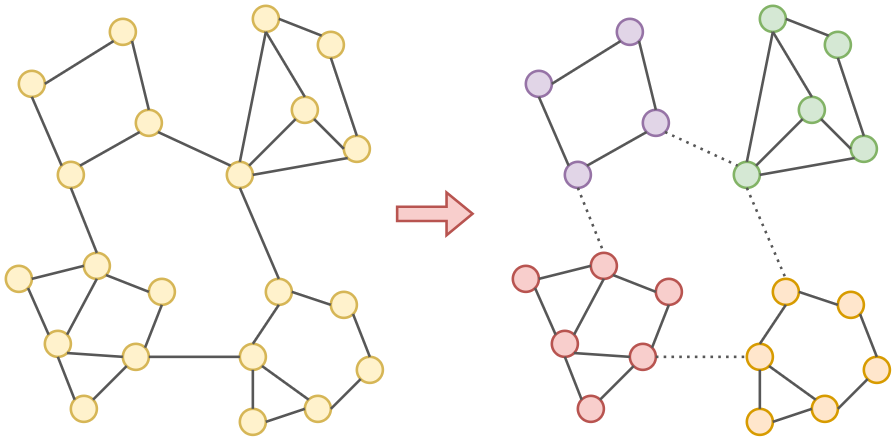
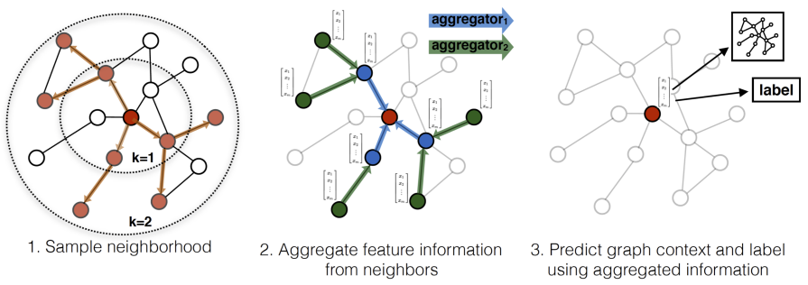

# Обучение графовых нейросетей

## Генерация минибатчей

[Графовые нейросети](Graph-convolutional-networks), как и другие другие виды нейросетей, обучаются на [минибатчах](../Training/Opt-methods-fixed-lr#стохастический-градиентный-спуск-по-мини-батчам) для ускорения обучения за счёт его параллелизации. 

### Классификация/регрессия графа целиком

Распараллелить вычисления на задачах классификации/регрессии графов напрямую не удаётся, поскольку каждый граф имеет собственную структуру с различным числом узлов и рёбер между ними. Для одновременной обработки нескольких графов их можно объединить в один мета-граф (состоящий из несвязанных друг с другом обучающих графов), применить к нему алгоритм обмена сообщениями, а регрессию/классификацию применить к каждому отдельному графу мета-графа.

### Классификация/регрессия отдельных узлов

При классификации/регрессии отдельных узлов графа перед стартом алгоритма передачи сообщений нужно <u>выбрать минибатч из случайных вершин графа</u>, для которых будет происходить обновление их эмбеддингов. Если алгоритм использует $K$ итераций, то выделение каждой вершины будет предполагать выделение подграфов, состоящих из всех вершин, имеющих расстояние, не превосходящее $K$ до заданной, поскольку каждая итерация расширяет область видимости (receptive field) вершины на один переход по графу. Остальные вершины можно игнорировать, поскольку они не будут оказывать влияние на формирование эмбеддингов выбранных вершин.

Если исходный граф обладает высокой связностью, а $K$ достаточно велико, то подграфы минибатча будут <u>слишком большими</u>, зачастую покрывая весь исходный граф целиком. Чтобы этого не происходило, можно использовать два подхода:

1) Вырезать минимальное число рёбер, чтобы разбить исходный граф на нужное число несвязанных подграфов (graph partitioning [[1]](https://en.wikipedia.org/wiki/Graph_partition)). Для этого есть стандартные алгоритмы из теории графов, такие как Metis [[2]](https://www.researchgate.net/publication/242479489_Kumar_V_A_Fast_and_High_Quality_Multilevel_Scheme_for_Partitioning_Irregular_Graphs_SIAM_Journal_on_Scientific_Computing_201_359-392) и Graclus [[3]](https://www.cs.utexas.edu/~inderjit/public_papers/multilevel_pami.pdf), вырезающие минимальное число рёбер графа, чтобы он разделился на несвязные компоненты. После такой минимально инвазивной процедуры вершины минибатчей будут разрастаться уже не до всего графа целиком, а максимум - только до соответствующей компоненты связности. Эта процедура была предложена для повышения эффективности обучения графовых сетей в [[4]](https://arxiv.org/pdf/1905.07953). Пример разбиения графа на несвязные компоненты показан ниже: 

2) Использовать $S$ случайных соседних вершин вместо всех, а $S$ выбрать достаточно малым, чтобы не выйти из ограничений по памяти. Этот подход называется сэмплированием окрестности (neighborhood sampling [[5]](https://proceedings.neurips.cc/paper/2017/hash/5dd9db5e033da9c6fb5ba83c7a7ebea9-Abstract.html)) и проиллюстрирован ниже [[5]](https://proceedings.neurips.cc/paper/2017/hash/5dd9db5e033da9c6fb5ba83c7a7ebea9-Abstract.html):

## Регуляризация

Для избежания переобучения в графовых сетях можно использовать [регуляризацию](../Regularization)  точно так же, как и в обычных, накладывая, $L_1$-/$L_2$-регуляризацию на веса модели и сокращая число нейронов и слоёв. Также можно делать параметры преобразований на каждой итерации [алгоритма передачи сообщений](Graph-convolutional-networks) одинаковыми (weight sharing) и использовать сэмплирование окрестности (neighborhood sampling [[5]](https://proceedings.neurips.cc/paper/2017/hash/5dd9db5e033da9c6fb5ba83c7a7ebea9-Abstract.html)).

## Литература

1. [Wikipedia: Graph partition.](https://en.wikipedia.org/wiki/Graph_partition)
2. [Karypis G., Kumar V. A fast and high quality multilevel scheme for partitioning irregular graphs //SIAM Journal on scientific Computing. – 1998. – Т. 20. – №. 1. – С. 359-392.](https://www.researchgate.net/publication/242479489_Kumar_V_A_Fast_and_High_Quality_Multilevel_Scheme_for_Partitioning_Irregular_Graphs_SIAM_Journal_on_Scientific_Computing_201_359-392)
3. [Dhillon I. S., Guan Y., Kulis B. Weighted graph cuts without eigenvectors a multilevel approach //IEEE transactions on pattern analysis and machine intelligence. – 2007. – Т. 29. – №. 11. – С. 1944-1957.](https://www.cs.utexas.edu/~inderjit/public_papers/multilevel_pami.pdf)
4. [Chiang W. L. et al. Cluster-gcn: An efficient algorithm for training deep and large graph convolutional networks //Proceedings of the 25th ACM SIGKDD international conference on knowledge discovery & data mining. – 2019. – С. 257-266.](https://arxiv.org/pdf/1905.07953)
5. [Hamilton W., Ying Z., Leskovec J. Inductive representation learning on large graphs //Advances in neural information processing systems. – 2017. – Т. 30.](https://proceedings.neurips.cc/paper/2017/hash/5dd9db5e033da9c6fb5ba83c7a7ebea9-Abstract.html)
