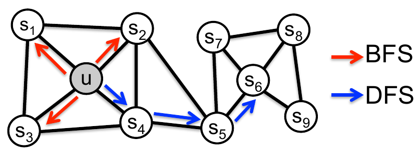
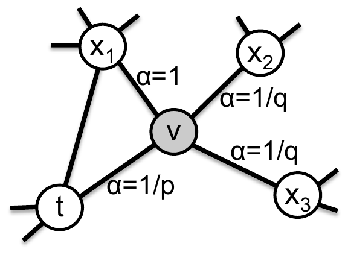
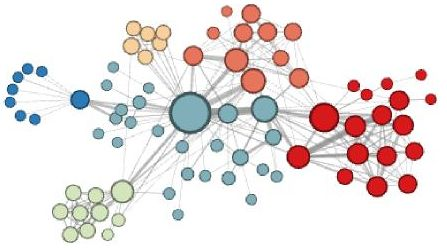
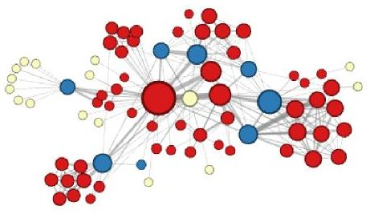

# Геометрические эмбеддинги вершин

[Алгоритм передачи сообщений](Graph-convolutional-networks) в свёрточных графовых сетях - это основной метод уточнения <u>уже имеющихся</u> признаковых описаний вершин графа по их соседям.

В этой главе мы изучим способы построения эмбеддингов вершин графа, которые <u>не используют их признаковое описание</u>, а строятся по геометрии самого графа, отражая его структуру.

Задачей, рассматриваемой в этой главе, будет построение $D$-мерных эмбеддингов для одного большого графа, состоящего из $N$ вершин без признаковых описаний.

Полученные эмбеддинги могут в дальнейшем использоваться самостоятельно для задач восстановления структуры графа, таких как 

- восстановление пропущенных связей (link prediction), 

- кластеризации вершин (node clustering). 

Также они могут использоваться как дополнительные признаки в [алгоритме передачи сообщений](Graph-convolutional-networks).

## Эмбеддинги на основе случайных блужданий

Рассмотрим методы построения эмбеддингов, основанные на **случайном блуждании** по графу (random walk), при котором генерируются пути обхода графа, стартуя из случайных вершин и перемещаясь по нему, выбирая случайных соседей.  Начальные эмбеддинги инициализируются случайно. В процессе генерации путей обхода эмбеддинги вершин, оказавшихся рядом друг с другом, сближаются, а оказавшиеся далеко друг от друга - отдаляются.

### DeepWalk

В методе **DeepWalk** [[1]](https://arxiv.org/pdf/1403.6652) из каждой вершины $K$ раз запускается процесс случайного блуждания длины $M$. 

> Если трактовать каждую вершину как слово, то в результате получается $K\cdot N$ предложений длины $M$ каждое. 

Для уточнения эмбеддингов по их расположениям на графе в DeepWalk предлагается использовать метод [SkipGram](../Embeddings/Word2vec#skip-gram) модели [Word2Vec](../Embeddings/Word2vec), в котором по каждому сгенерированному пути на графе скользит окно ширины $2W+1$, и настраивается модель, пытающаяся по эмбеддингу центральной вершины окна предсказать другие вершины в том же окне. 

> Это аналогично тому, как в оригинальной модели [SkipGram](../Embeddings/Word2vec#skip-gram) строилась языковая модель, предсказывавшая соседние слова окна по центральному слову. 

Параметрами настроенной модели будут эмбеддинги вершин графа с учётом его геометрии, поскольку близким вершинам будут соответствовать более похожие эмбеддинги (с более высоким попарным скалярным произведением), а далёким - более непохожие по скалярному произведению.

:::tip Идеи расширения метода

Обратим внимание, что, используя ту же методологию, можно строить эмбеддинги вершин графа, используя C-BOW версию модели Word2Vec или другую языковую модель, подбирающую эмбеддинги под слова. 

:::

:::tip Сравнение DeepWalk и алгоритма передачи сообщений

Метод DeepWalk <u>более экономичен по памяти</u>, чем [алгоритм передачи сообщений](Graph-convolutional-networks) (message passing algorithm) в классических графовых нейросетях, поскольку передача сообщений требует аккумуляции информации со всех соседей каждой вершины, в то время как настройка DeepWalk учитывает лишь одну случайно выбираемую вершину при каждом переходе по графу.

С другой стороны, методу DeepWalk потребуется <u>больше итераций до сходимости</u>, поскольку лишь многократные обходы вершин смогут собрать информацию о большинстве соседей.

:::

### Node2Vec

Модель **Node2Vec** [[2]](https://arxiv.org/pdf/1607.00653) также уточняет эмбеддинги вершин графа, учитывая его геометрию. Она использует тот же механизм построения эмбеддингов, что и DeepWalk:

- каждому узлу графа сопоставляется случайный начальный эмбеддинг;

- из каждого узла генерируются случайные блуждания (random walks) по соседним узлам;

- в сгенерированных блужданиях перебираются всевозможные последовательности узлов фиксированной длины (окна наблюдений);

- в каждом окне наблюдений модель по эмбеддингу центральной вершины в окне настраивается предсказывать другие вершины в том же окне.

Ключевой идеей Node2Vec является наблюдение, что обход вершин графа из заданной вершины может быть устроен по-разному:

- **поиск в ширину** (breadth-first search, BFS), при котором обход осуществляется в первую очередь <u>по вершинам в окрестности начальной вершины</u>;

- **поиск в глубину** (depth-first search, DFS), при котором обход осуществляется таким образом, чтобы <u>уходить максимально далеко от первоначальной вершины</u>.

Эти две стратегии проиллюстрированы ниже красным и синим цветом [[2]](https://arxiv.org/pdf/1607.00653): 

Метод Node2Vec использует <u>случайное блуждание 2-го порядка</u> (2-nd order random walk) с гиперпараметрами $p,q>0$, управляющими характером обхода вершин, больше склоняющимся к обходу в глубину или обходу в ширину.

А именно, если только что осуществился переход из вершины $t$ в вершину $v$, то  вероятность перехода из вершины $v$ в новую вершину $x$ считается по формуле:

$$
p(v\to x|v,t)=\begin{cases}
\gamma \cdot \frac{1}{p} & \text{если }x=t,\\
\gamma \cdot 1 & \text{если }d\left(t,x\right)=1,\\
\gamma \cdot \frac{1}{q} & \text{если }d\left(t,x\right)=2,
\end{cases}
$$

где $d(t,x)$ - длина минимального пути от вершины $t$ в вершину $x$, а $\gamma$ - нормировочный множитель, чтобы все вероятности суммировались в единицу. 

Пример ненормированных вероятностей перехода из вершины $v$ приведён ниже [[2]](https://arxiv.org/pdf/1607.00653):

> Если рёбра на графе являются взвешенными (ребрам сопоставлены числа, обозначающие силу связи), то вероятности переходов нужно ещё дополнительно домножать на веса соответствующих связей.

Как гиперпараметры $p,q$ влияют на характер обхода графа (в глубину/в ширину)?

При малых значениях $p$ обход будет вестись больше в ширину, стимулируя частые возвращения в исходную вершину. Малые значения $q$, наоборот, поощряют поиск в глубину, удаляясь от исходной вершины.

Обход в глубину выделяет <u>сообщества в графе</u> (то есть подмножества сильно связанных друг с другом вершин напрямую или опосредованно). У узлов одного сообщества будут будут получаться похожие эмбеддинги.

Обход в ширину определяет <u>структурные роли вершин</u> (structural roles of nodes), выявляя, является ли вершина:

- **хабом** (центральным узлом в сообществе, имеющим короткие пути до остальных вершин сообщества);

- **связующим узлом** (связывает несколько сообществ между собой);

- **периферийной вершиной** (находящейся на краю графа).

Рассмотрим граф, состоящий из персонажей романа Виктора Гюго "Отверженные". Узлы соединяются ребром, если персонажи взаимодействовали друг с другом в тексте. Если [кластеризовать](../../Machine-learning/Base-concepts/Unsupervised-learning#кластеризация) эмбеддинги вершин, полученные методом Node2Vec, а кластера обозначать цветом, то при обходе в глубину получим выделение сообществ персонажей, которые часто взаимодействовали друг с другом [[2]](https://arxiv.org/pdf/1607.00653):

При обходе в ширину извлечём  структурные роли каждого персонажа (центральные, связующие, периферийные) [[2]](https://arxiv.org/pdf/1607.00653):

## Использование автокодировщика

Каждую вершину графа можно охарактеризовать тем, с какими другими вершинами она связана, аналогично тому, как слова в тексте по смыслу характеризуются тем, с какими словами они [совстречались вместе](../Embeddings/Count-based-methods). Поэтому в качестве эмбеддинга вершины можно было бы задать соответствующую этой вершине строку [матрицы смежности](Graphs-types#матрица-смежности) (adjency matrix). Эта кодировка не требует обучения, но

- слишком длинна (её размерность равна числу вершин в графе);

- не имеет обобщаемой структурной информации о графе, поскольку содержит лишь информацию о непосредственных связях между вершинами.

По этим причинам она плохо подходит для задач восстановления геометрии графа, таких как восстановление рёбер (link prediction) и обнаружение сообществ (community prediction).

Поэтому в работе [[3]](https://www.kdd.org/kdd2016/papers/files/rfp0191-wangAemb.pdf) предлагается настраивать [автокодировщик](../Special-architectures/Autoencoders), восстанавливающий строки матрицы смежности, а в качестве эмбеддинга вершины брать <u>внутреннее представление автокодировщика</u> (результат применения кодировочной части) для строки матрицы смежности соответствующей вершины.

Для более точной настройки автокодировщика в целевом критерии предлагается не только восстанавливать строки матрицы смежности, но и штрафовать расхождения внутренних представлений для вершин, которые непосредственно связаны друг с другом ребром. Также в критерии присутствует регуляризатор, призванный избежать переобучения, вызванного тем, что число параметров автокодировщика растёт линейно с ростом размерности входных данных (числом вершин графа).

## Совмещение подходов

Представленные подходы выделяют эмбеддинги, описывающие геометрию графа (связи между вершинами). [Свёрточные графовые сети](Graph-convolutional-networks) (GCN) призваны уточнять признаковые описания вершин по их соседям. Эти подходы можно объединить одним из двух способов:

- Использовать геометрические эмбеддинги как инициализацию признаковых описаний вершин для GCN (если другие характеристики вершин неизвестны);

- Дополнить начальные признаковые описания вершин их геометрическими эмбеддингами перед применением GCN (если есть дополнительная информация о вершинах).

## Литература

1. [Perozzi B., Al-Rfou R., Skiena S. Deepwalk: Online learning of social representations //Proceedings of the 20th ACM SIGKDD international conference on Knowledge discovery and data mining. – 2014. – С. 701-710.](https://arxiv.org/pdf/1403.6652)
2. [Grover A., Leskovec J. node2vec: Scalable feature learning for networks //Proceedings of the 22nd ACM SIGKDD international conference on Knowledge discovery and data mining. – 2016. – С. 855-864.](https://arxiv.org/pdf/1607.00653)
3. [Wang D., Cui P., Zhu W. Structural deep network embedding //Proceedings of the 22nd ACM SIGKDD international conference on Knowledge discovery and data mining. – 2016. – С. 1225-1234.](https://www.kdd.org/kdd2016/papers/files/rfp0191-wangAemb.pdf)
