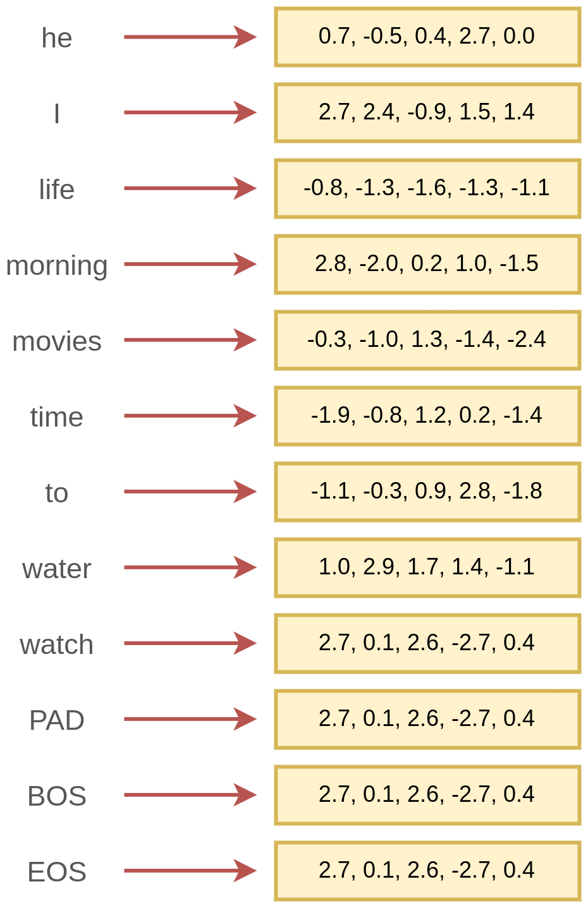

# Эмбеддинги слов

Рассмотрим задачу **автоматической обработки текста** (natural language processing, NLP) с помощью нейросетей. Текст представляет собой последовательность слов. Если человек читает и воспринимает текст напрямую, то компьютеру для обработки предварительно необходимо слова представить в виде векторов вещественных чисел фиксированного размера: 

$$
w\to \mathbf{v}_w \in \mathbb{R}^D
$$

:::tip Эмбеддинг

Вектор вещественных чисел фиксированного размера, представляющий дискретный объект (такой как слово), называется **эмбеддингом** этого объекта. 

:::

Пример сопоставления словам соответствующих им эмбеддингов приведён ниже:

Помимо самих слов, часто вводят служебные слова:

- PAD - обозначает отсутствие слова;

- BOS - обозначает начало последовательности (beginning of sequence);

- EOS - обозначает конец последовательности (end of sequence).

Также отдельными "словами" считаются знаки препинания, их учёт позволяет модели лучше понимать семантику (смысл) текста.

:::tip Токены, а не слова в общем случае

Текст может обрабатываться не только как последовательность слов, но и как <u>последовательность символов</u>. Либо как <u>последовательность понятий</u>, состоящих из одного и более слов. 

Пример: 

> He took part in collaboration with Microsoft corporation 

можно обрабатывать как последовательность символов либо следующую последовательность:

> [He] [took part] [in] [collaboration] [with] [Microsoft corporation]

поскольку [took part] - устойчивое выражение, а [Microsoft corporation] - единая сущность, соответствующая компании. 

Поэтому в общем случае текст представляет собой последовательность **токенов** (tokens), в качестве которых уже могут выступать слова, служебные слова, знаки препинания, символы и группы слов. 

Для выбранных токенов и будут строиться эмбеддинги.

:::

В общем случае <u>любой дискретный объект</u> представляется некоторым эмбеддингом перед его обработкой нейросетями. 

В рекомендательной системе строятся эмбеддинги пользователей и товаров, в поисковой системе - эмбеддинги документов, изображений и поисковых запросов. В графе социальной сети отдельные пользователи также представляются в виде эмбеддингов для нейросетевой обработки.

Далее будет рассматриваться классический случай обработки текста на уровне слов.

Как и для [векторов признаков](../../Machine-learning/Base-concepts/Supervised-learning#признаки-отклики-и-обучающая-выборка), будем обозначать нижним индексом номер эмбеддинга (отвечающего определённому токену), а верхним - индекс его отдельного элемента:

- $\mathbf{v}_w$ - эмбеддинг, отвечающий слову $w$, например 10001-му в словаре;

- $v^i$ - значение вектора эмбеддинга $\mathbf{v}$ на $i$-й позиции, $i=1,2,...D$.

## Построение вручную

Каждое слово можно представить вектором признаков, описывающих это слово, например:

- $v^{1}$: часть речи;

- $v^{2}$: род (мужской/женский/средний - для существительных и прилагательных);

- $v^{3}$: время (прошедшее/настоящее/будущее - для глаголов);

- $v^{4}$: индикатор, что слово начинается с заглавной буквы;

- $v^{5}$: число букв в слове;

- $v^{6}$: категория: машинное обучение, физика, биология, ...;

- $v^{7}$: подкатегория: обучение с учителем, без учителя, частичное обучение, ...;

- ...

Некоторые признаки, такие как число букв и индикатор заглавной буквы, можно  посчитать сразу. Другие же требуют словаря и отдельного классификатора, ставящего в соответствие каждой словоформе её часть речи, род, время и другие лингвистические признаки, а также семантические категории и подкатегории. Подобные словари есть, но они покрывают лишь наиболее общеупотребительные слова и не способны описать новые слова, которые постоянно возникают в языке. 

Представленное кодирование слов обладает интерпретируемостью, но на практике слишком ресурсоёмко и недостаточно информативно из-за появления новых слов. Поэтому используются <u>автоматические методы извлечения эмбеддингов</u>, базовые варианты которых будут рассмотрены далее.

## Кодирование категории

Поскольку слово представляет собой категориальный признак, принимающий одно из $S$ значений (где $S$ - общее число слов языка), то к нему можно было бы применить [one-hot кодирование](../../Machine-learning/Data-preprocessing/Categorical-preprocessing#one-hot-кодирование). 

Поскольку число уникальных слов языка велико, то это будет <u>очень длинный вектор</u>, с которым работать вычислительно сложно, а обрабатывающая его модель будет содержать много параметров и переобучаться. 

Но главный недостаток этого представления заключён в том, что оно содержит только информацию о том, что слова различны, но <u>не содержит никакой информации об их похожести/непохожести по смыслу</u> (семантической близости)!

Действительно, представим каждое слово фразы "место было уютным и комфортным" в виде one-hot кодирования:

| слово      | эмбеддинг   |
| ---------- | ----------- |
| место      | [1,0,0,0,0] |
| было       | [0,1,0,0,0] |
| уютным     | [0,0,1,0,0] |
| и          | [0,0,0,1,0] |
| комфортным | [0,0,0,0,1] |

Если сравнивать попарные расстояния между эмбеддингами, то из него следует, что слова "уютным" и "комфортным" (почти синонимы) настолько же непохожи, как и слова "место" и "было" (между которыми нет семантической связи). Поэтому такой способ кодирования не подходит.

Нам бы хотелось строить эмбеддинги слов

1. автоматически, исключая трудоёмкую разметку человеком с подключением внешних словарей;

2. так, чтобы более близким по смыслу словам соответствовали более похожие эмбеддинги.

Первое свойство позволит строить эмбеддинги быстро и оперативно вычислять эмбеддинги новых слов. 

Второе свойство существенно упростит настройку модели, поскольку замена слов в тексте на схожие по смыслу почти не будет влиять на результат.

> Например, при классификации отзывов на положительные и отрицательные фразу "номера оказались очень уютными" и "номера в отеле оказались очень комфортными" модель будет обрабатывать единообразно и выдавать похожий результат.

## Автоматическое построение эмбеддингов

В основе процедуры, автоматически извлекающей эмбеддинги слов так, чтобы похожим по смыслу словам соответствовали похожие эмбеддинги, лежит **дистрибутивная гипотеза** (distributional hypothesis), состоящая в том, что <u>слова, часто встречающиеся рядом друг с другом близки по смыслу</u>.

Действительно, человек, читающий текст с новыми для него терминами, восстанавливает их примерный смысл по контексту. Рассмотрим слово "гаплотип". Даже не зная его точного значения, но прочитав текст вида: 

> Современная генетика активно использует методы исследования гаплотипов для выяснения эволюционных связей между популяциями. Эти данные помогают ученым понять, как генетическое разнообразие передается через поколения.

можно догадаться, что слово гаплотип по смыслу связан с генетикой!

Методы автоматического построения эмбеддингов построены на вычислении эмбеддингов таким образом, чтобы <u>эмбеддинги слов, часто встречающихся рядом друг с другом в тексте, оказывались похожими</u>.

Далее мы изучим способы кодирования слов, используя их [совстречаемость](Count-based-methods) и разберём, как эту кодировку сделать более компактной, используя [латентный семантический анализ](Latent-semantic-analysis). Также изучим, как с помощью нейросетей строить эмбеддинги [слов](Word2vec) и [целых параграфов](Paragraph-embeddings).

:::tip Применимость

Все методы, рассматриваемые далее, применимы не только к текстам как последовательностям слов, но и к любым последовательностям дискретных объектов. 

Например, к поведению пользователя на сайте, состоящему из последовательности переходов по веб-страницам, к ДНК как цепочке нуклеотидов и т.д.

:::

## Неоднозначность кодирования

Задача сопоставления словам их эмбеддингов усложняется тем, что одно и то же слово может:

- соответствовать разным смыслам, например,
  
  - *замок* как крепость,
  
  - *замок* как запирающее устройство;

- соответствовать разным частям речи, например,
  
  - *watch* как существительное: I forgot my watch at home;
  
  - *watch* как глагол: I like to watch movies from time to time.

Неоднозначные слова чаще всего кодируются усреднённым эмбеддингом по всем смыслам слова, но можно использовать отдельный классификатор, подставляющий эмбеддинг нужного смысла по контексту.
